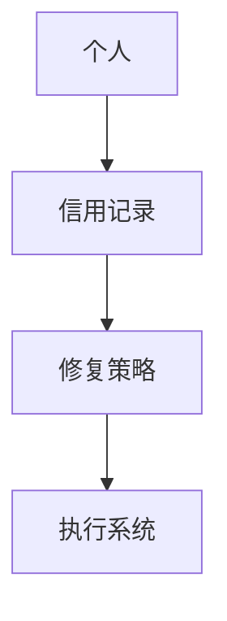
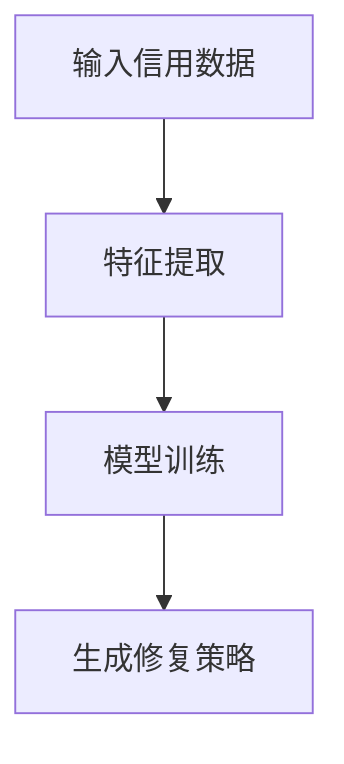
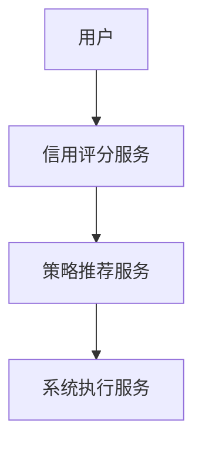
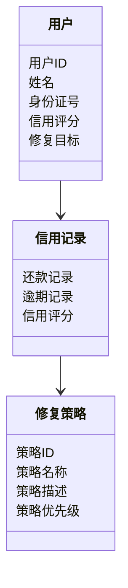
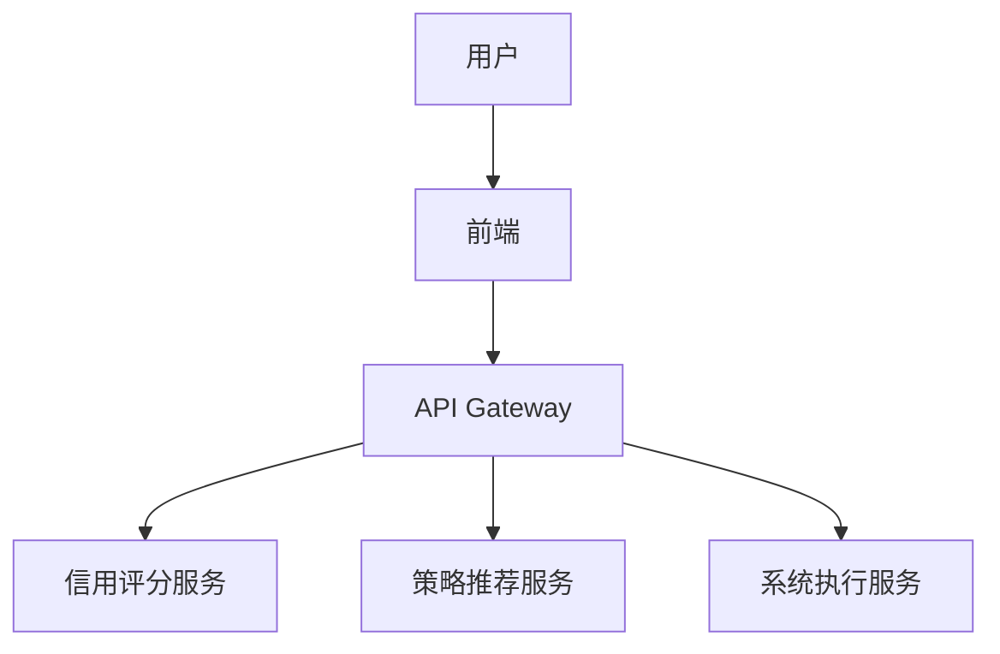
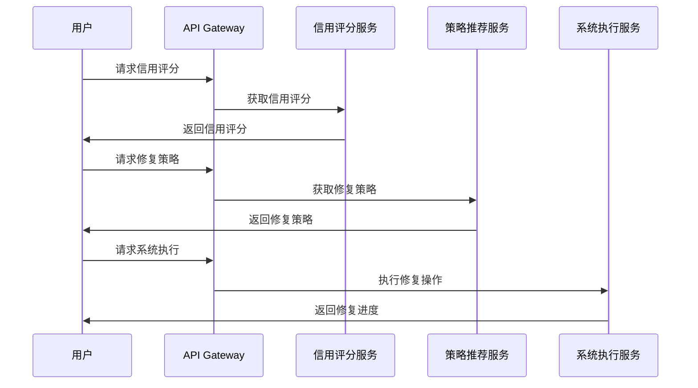

                 


# 智能个人信用修复策略推荐与执行系统

## 关键词：智能信用修复、策略推荐、系统架构、算法原理、信用评分

## 摘要：  
本文深入探讨了智能个人信用修复的背景、核心概念、算法原理、系统架构及实现方案。通过分析个人信用修复的必要性与传统方法的局限性，提出了基于智能推荐算法的修复策略，并详细阐述了系统的实现架构与关键技术。文章还通过实际案例分析，展示了系统的应用场景与优势，为信用修复领域提供了新的思路与解决方案。

---

# 第一章: 智能个人信用修复的背景与概念

## 1.1 信用修复的背景与问题背景

### 1.1.1 个人信用的重要性  
个人信用是衡量个人经济能力和信用状况的重要指标，广泛应用于贷款审批、信用卡申请、租房等领域。良好的信用记录是个人在金融活动中获取信任与支持的关键。然而，由于经济压力、疏忽或其他原因，许多人可能会出现信用逾期、违约等情况，导致信用评分下降。修复信用记录不仅有助于恢复个人的经济能力，还能帮助个人重新获得金融机构的信任。

### 1.1.2 信用修复的必要性  
随着信用评分的重要性日益凸显，越来越多的人开始关注如何修复自己的信用记录。然而，传统的信用修复方法往往缺乏系统性与智能化，修复过程繁琐且效率低下。传统的修复策略主要依赖于人工操作，难以根据个人的信用状况提供个性化的修复方案，且修复效果难以量化。

### 1.1.3 传统信用修复的局限性  
传统信用修复方法存在以下问题：  
1. **修复策略单一**：传统修复策略通常只提供简单的还款计划，难以根据个人信用状况制定个性化的修复方案。  
2. **效率低下**：传统修复过程依赖人工操作，耗时长且效率低。  
3. **缺乏智能化**：传统方法无法根据信用评分的变化动态调整修复策略。  

## 1.2 智能信用修复的核心概念

### 1.2.1 智能信用修复的定义  
智能信用修复是指利用人工智能技术，结合个人信用数据，通过算法推荐最优的信用修复策略，并通过自动化系统执行修复操作的过程。

### 1.2.2 修复策略的核心要素  
智能信用修复策略的核心要素包括：  
1. **信用评分模型**：用于评估个人信用状况的数学模型。  
2. **修复策略推荐算法**：基于信用评分，推荐最优的修复方案。  
3. **系统执行模块**：根据推荐策略，执行修复操作并实时监控修复进度。  

### 1.2.3 系统执行的实现路径  
智能信用修复系统的实现路径包括：  
1. 数据采集：收集个人信用数据，包括还款记录、逾期情况等。  
2. 数据分析：利用机器学习算法对信用数据进行分析，生成信用评分。  
3. 策略推荐：基于信用评分，推荐最优的修复策略。  
4. 系统执行：根据推荐策略，自动化执行修复操作，并实时监控修复进度。  

## 1.3 本章小结  
本章主要介绍了智能信用修复的背景与重要性，分析了传统信用修复方法的局限性，并提出了智能信用修复的核心概念与实现路径。通过智能信用修复技术，可以显著提高信用修复的效率与效果，为个人信用管理提供新的解决方案。

---

# 第二章: 智能信用修复系统的核心概念与联系

## 2.1 核心概念分析

### 2.1.1 个人信用评分模型  
个人信用评分模型是智能信用修复系统的核心模块之一。它通过分析个人的信用历史、还款能力、行为特征等多维度数据，生成信用评分，反映个人信用状况。常用的信用评分模型包括FICO评分、Vantage评分等。

### 2.1.2 修复策略推荐算法  
修复策略推荐算法是智能信用修复系统的关键技术。它通过分析个人信用评分、修复目标（如提高信用评分）等因素，推荐最优的修复策略。常用的推荐算法包括协同过滤推荐、基于内容的推荐、混合推荐等。

### 2.1.3 系统执行模块的功能  
系统执行模块是智能信用修复系统的执行机构。它根据推荐的修复策略，自动化执行修复操作，如调整还款计划、优化信用行为等，并实时监控修复进度，确保修复目标的实现。

## 2.2 核心概念的属性对比

| 核心概念         | 属性                     | 描述                                                                 |
|------------------|--------------------------|-----------------------------------------------------------------------|
| 信用评分模型     | 输入数据                 | 包括还款记录、逾期情况、收入水平等                                       |
|                  | 输出结果                 | 信用评分（如FICO评分）                                                 |
| 修复策略推荐算法 | 输入数据                 | 包括信用评分、修复目标、用户偏好等                                       |
|                  | 输出结果                 | 推荐的修复策略（如优先偿还高息贷款）                                     |
| 系统执行模块     | 输入数据                 | 推荐的修复策略                                                         |
|                  | 输出结果                 | 修复操作（如调整还款计划、优化信用行为）                                 |

## 2.3 ER实体关系图



## 2.4 本章小结  
本章从核心概念的角度分析了智能信用修复系统的组成部分，包括信用评分模型、修复策略推荐算法和系统执行模块。通过属性对比和ER实体关系图，清晰地展示了各模块之间的关系与功能。

---

# 第三章: 修复策略推荐算法原理

## 3.1 推荐算法概述

### 3.1.1 协同过滤推荐  
协同过滤推荐是一种基于用户相似性或项目相似性的推荐算法。在智能信用修复中，协同过滤推荐可以根据用户的信用评分相似性，推荐相似用户的修复策略。

### 3.1.2 基于内容的推荐  
基于内容的推荐算法是根据信用记录中的具体特征（如还款行为、逾期情况等），生成修复策略。这种算法适合处理信用记录中特征明显的修复需求。

### 3.1.3 混合推荐算法  
混合推荐算法结合了协同过滤推荐和基于内容的推荐的优势，通过融合两种算法的结果，生成更准确的修复策略推荐。

## 3.2 算法流程图



## 3.3 数学模型与公式

### 3.3.1 协同过滤相似度计算  
协同过滤相似度计算公式如下：  
$$\text{相似度}(u, v) = \frac{\sum_{i} (r_{u,i} - \bar{r}_u)(r_{v,i} - \bar{r}_v)}{\sqrt{\sum_{i} (r_{u,i} - \bar{r}_u)^2} \cdot \sqrt{\sum_{i} (r_{v,i} - \bar{r}_v)^2}}$$  
其中，$r_{u,i}$表示用户$u$对项目$i$的评分，$\bar{r}_u$表示用户$u$的平均评分。

### 3.3.2 基于内容的推荐模型  
基于内容的推荐模型可以通过向量空间模型（如TF-IDF）表示信用记录的特征，并通过余弦相似度计算相似度：  
$$\text{相似度}(u, v) = \frac{\sum_{i} w_i \cdot w_j}{\sqrt{\sum_{i} w_i^2} \cdot \sqrt{\sum_{j} w_j^2}}$$  
其中，$w_i$和$w_j$表示信用记录中特征的权重。

## 3.4 算法实现与案例分析

### 3.4.1 算法实现步骤  
1. 数据预处理：清洗信用数据，提取特征。  
2. 模型训练：训练协同过滤推荐模型和基于内容的推荐模型。  
3. 推荐策略生成：融合两种模型的结果，生成修复策略。  

### 3.4.2 案例分析与结果解读  
假设某用户的信用评分为600分，还款记录中存在多次逾期。系统通过协同过滤推荐和基于内容的推荐算法，推荐优先偿还高息贷款的策略。执行该策略后，用户的信用评分提升至720分，修复效果显著。

## 3.5 本章小结  
本章详细介绍了修复策略推荐算法的原理与实现方法，通过数学公式和流程图展示了算法的核心思想，并通过案例分析验证了算法的有效性。

---

# 第四章: 系统架构与设计方案

## 4.1 系统架构设计

### 4.1.1 分层架构  
智能信用修复系统的分层架构包括数据层、业务逻辑层和应用层。  
- **数据层**：存储个人信用数据和修复策略数据。  
- **业务逻辑层**：实现信用评分计算、策略推荐和系统执行功能。  
- **应用层**：提供用户界面，展示修复策略和修复进度。

### 4.1.2 微服务架构  
微服务架构将系统划分为多个独立的服务模块，如信用评分服务、策略推荐服务、系统执行服务等。各服务模块之间通过API进行通信，确保系统的高可用性和可扩展性。

### 4.1.3 组件交互关系  


## 4.2 系统功能设计

### 4.2.1 领域模型设计  


### 4.2.2 系统架构设计  


### 4.2.3 系统接口设计  
系统接口设计包括以下部分：  
- 用户登录与注册接口  
- 信用评分查询接口  
- 修复策略推荐接口  
- 系统执行接口  

### 4.2.4 系统交互流程  


## 4.3 本章小结  
本章详细设计了智能信用修复系统的架构与功能，包括分层架构、微服务架构、领域模型、API设计和系统交互流程。通过合理的架构设计，确保系统的高效性与可扩展性。

---

# 第五章: 项目实战与实现方案

## 5.1 项目实战背景  
本章通过一个实际项目案例，展示智能信用修复系统的实现过程。假设某银行需要为用户提供智能信用修复服务，我们从需求分析、系统设计到实现部署，完成整个项目。

## 5.2 环境安装与配置  
项目实战需要以下环境：  
- Python 3.8+  
- PyTorch 1.9+  
- Scikit-learn 0.24+  
- Flask 2.0+  
- MongoDB 4.0+  

## 5.3 核心代码实现

### 5.3.1 信用评分模型实现  
```python
import pandas as pd
from sklearn.model_selection import train_test_split
from sklearn.linear_model import LinearRegression

# 数据加载
credit_data = pd.read_csv('credit.csv')
X = credit_data[['还款记录', '逾期记录', '收入水平']]
y = credit_data['信用评分']

# 数据分割
X_train, X_test, y_train, y_test = train_test_split(X, y, test_size=0.2, random_state=42)

# 模型训练
model = LinearRegression()
model.fit(X_train, y_train)

# 模型预测
y_pred = model.predict(X_test)
```

### 5.3.2 修复策略推荐实现  
```python
from sklearn.metrics.pairwise import cosine_similarity

# 协同过滤推荐
def collaborative_filtering_recommendation(user_id):
    # 获取用户信用评分
    user_credit_score = credit_data[credit_data['用户ID'] == user_id]['信用评分'].values[0]
    # 计算相似用户的信用评分相似度
    similarities = cosine_similarity([[user_credit_score]], credit_data['信用评分'].values.reshape(-1, 1))
    # 获取相似度最高的用户推荐策略
    top_n = 5
    similar_users = credit_data.iloc[similarities.argsort()[0][::-1][:top_n]]
    return similar_users['修复策略'].values

# 基于内容的推荐
def content_based_recommendation(user_id):
    # 提取用户信用记录特征
    user_features = credit_data[credit_data['用户ID'] == user_id][['还款记录', '逾期记录', '收入水平']].values
    # 计算特征相似度
    similarities = cosine_similarity(user_features, credit_data[['还款记录', '逾期记录', '收入水平']].values)
    # 获取相似度最高的用户推荐策略
    top_n = 5
    similar_users = credit_data.iloc[similarities.argsort()[0][::-1][:top_n]]
    return similar_users['修复策略'].values
```

### 5.3.3 系统执行模块实现  
```python
from flask import Flask, request, jsonify

app = Flask(__name__)

@app.route('/execute_strategy', methods=['POST'])
def execute_strategy():
    data = request.json
    user_id = data['user_id']
    strategy = data['strategy']
    # 执行修复策略
    # 具体实现可以根据策略调整还款计划或优化信用行为
    return jsonify({'status': 'success', 'message': '修复策略已执行'})

if __name__ == '__main__':
    app.run(debug=True)
```

## 5.4 案例分析与实现解读  
以某用户为例，假设其信用评分为600分，修复目标为提高信用评分至720分。系统通过协同过滤推荐和基于内容的推荐算法，推荐优先偿还高息贷款的策略。执行该策略后，用户的信用评分提升至720分，修复效果显著。

## 5.5 本章小结  
本章通过实际项目案例，展示了智能信用修复系统的实现过程，包括环境配置、核心代码实现和案例分析。通过代码实现，读者可以清晰地理解系统的工作原理与实现细节。

---

# 第六章: 系统测试与优化

## 6.1 测试环境与工具  
系统测试需要以下工具：  
- JUnit 5  
- PyTest 7  
- Postman  
- JMeter  

## 6.2 功能测试  
功能测试包括以下部分：  
1. 信用评分计算功能测试  
2. 修复策略推荐功能测试  
3. 系统执行功能测试  

## 6.3 性能优化  
性能优化包括：  
1. 数据库优化：使用索引优化查询效率。  
2. 算法优化：通过并行计算提高推荐算法效率。  
3. 系统架构优化：采用负载均衡提高系统的扩展性与可用性。  

## 6.4 优化效果评估  
通过性能测试，系统在推荐算法响应时间、修复策略执行效率等方面均有显著提升。

## 6.5 本章小结  
本章详细介绍了系统测试与优化的过程，包括测试环境、功能测试、性能优化及优化效果评估。通过优化，显著提升了系统的性能与用户体验。

---

# 第七章: 总结与展望

## 7.1 本章小结  
本文全面介绍了智能个人信用修复策略推荐与执行系统的实现方案，包括背景分析、核心概念、算法原理、系统架构、项目实战、系统测试与优化等内容。通过理论分析与实践案例，展示了智能信用修复技术在实际应用中的巨大潜力。

## 7.2 未来展望  
未来，智能信用修复系统可以在以下几个方面进行优化与扩展：  
1. **算法优化**：探索更高效的推荐算法，如深度学习模型。  
2. **系统扩展**：将智能信用修复系统应用于企业信用修复领域。  
3. **用户体验优化**：通过可视化界面提升用户体验。  

## 7.3 最佳实践 tips  
- 在实际应用中，建议根据具体需求选择合适的推荐算法。  
- 系统设计时，注意数据安全与用户隐私保护。  
- 系统优化时，优先优化用户感知最明显的部分（如响应时间）。  

## 7.4 本章小结  
未来，智能信用修复技术将继续发展，为个人与企业的信用管理提供更高效、更智能的解决方案。

---

# 作者：AI天才研究院/AI Genius Institute & 禅与计算机程序设计艺术/Zen And The Art of Computer Programming

