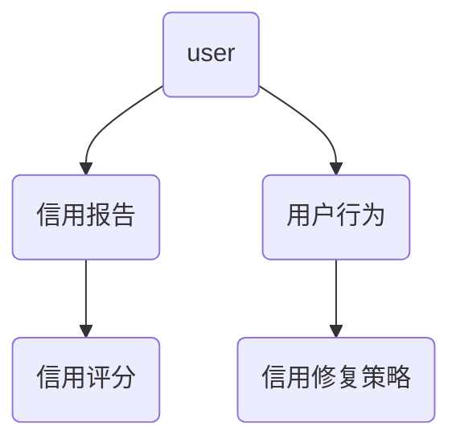

                 


# 智能个人信用修复策略推荐系统

## 关键词：
- 智能推荐系统
- 信用修复
- 算法原理
- 系统架构
- 项目实战

## 摘要：
智能个人信用修复策略推荐系统是一种结合人工智能技术的创新解决方案，旨在通过智能推荐算法为个人用户提供个性化的信用修复策略。本文详细探讨了该系统的背景、核心概念、算法原理、系统架构设计以及实际项目实现，为读者提供全面的技术指导和实践参考。

---

## 第一部分: 智能个人信用修复策略推荐系统的背景与核心概念

### 第1章: 信用修复与智能推荐概述

#### 1.1 信用修复的定义与问题背景
- 1.1.1 信用修复的定义：信用修复是指通过合法途径改善个人或企业的信用记录，提升信用评分的过程。
- 1.1.2 个人信用修复的必要性：随着信用评分在金融、就业等领域的广泛应用，修复信用记录成为个人提升生活质量的重要手段。
- 1.1.3 智能推荐在信用修复中的作用：通过智能推荐算法，为用户提供个性化的信用修复策略，提高修复效率。

#### 1.2 智能推荐系统的核心概念
- 1.2.1 推荐系统的定义与分类：推荐系统是一种根据用户行为和偏好，提供个性化推荐的技术，主要分为协同过滤、基于内容的推荐和混合推荐三种类型。
- 1.2.2 智能推荐系统的算法特点：推荐系统通过分析用户数据，利用数学模型和机器学习算法生成推荐结果。
- 1.2.3 信用修复策略推荐的特殊性：信用修复推荐需要考虑用户的信用历史、还款能力、信用评分等多个因素，推荐策略需符合金融法规和用户实际需求。

#### 1.3 信用修复与推荐系统的结合
- 1.3.1 信用修复场景中的推荐问题：如何根据用户的信用记录和行为推荐最优的信用修复策略。
- 1.3.2 智能推荐在信用修复中的应用价值：通过智能推荐算法，帮助用户选择最优的信用修复方案，降低信用风险。
- 1.3.3 系统设计的边界与外延：信用修复推荐系统需考虑数据隐私、推荐实时性、用户体验等多个方面。

#### 1.4 核心概念与联系
- 1.4.1 核心概念的原理分析：信用修复推荐系统的核心是通过分析用户的信用数据和行为数据，生成个性化的推荐策略。
- 1.4.2 核心概念的属性特征对比表格：以下是推荐算法的核心概念对比表：
  | 对比项 | 协同过滤推荐 | 基于内容的推荐 |
  |--------|--------------|----------------|
  | 基础   | 用户行为数据  | 物品属性数据    |
  | 优点   | 高准确性      | 高可解释性      |
  | 缺点   | 对冷启动用户  | 对数据稀疏性    |
- 1.4.3 ER实体关系图架构（使用 Mermaid 流程图展示）


### 第2章: 智能推荐系统的核心算法原理

#### 2.1 协同过滤推荐算法
- 2.1.1 基于用户的协同过滤算法：通过计算用户之间的相似度，向相似用户推荐物品。
- 2.1.2 基于物品的协同过滤算法：通过计算物品之间的相似度，向用户推荐相似物品。
- 2.1.3 混合推荐算法：结合基于用户和基于物品的推荐方法，提高推荐准确性和多样性。

#### 2.2 基于机器学习的推荐算法
- 2.2.1 基于内容的推荐算法：通过分析物品的属性特征，生成推荐结果。
- 2.2.2 基于深度学习的推荐算法：利用神经网络模型，学习用户和物品的隐含特征。
- 2.2.3 混合推荐算法：结合多种推荐方法，提高推荐效果。

#### 2.3 算法原理的数学模型与公式
- 协同过滤的数学模型：
  $$相似度计算公式：sim(i,j) = \frac{\sum_{k} r_{ik} r_{jk}}{\sqrt{\sum_{k} r_{ik}^2} \sqrt{\sum_{k} r_{jk}^2}}$$
- 基于机器学习的推荐模型：
  $$损失函数：L = \sum_{i=1}^{n} (y_i - \hat{y}_i)^2$$

### 第3章: 信用修复策略推荐系统的算法实现

#### 3.1 数据预处理与特征提取
- 3.1.1 数据清洗与标准化：处理缺失值、异常值，标准化数据格式。
- 3.1.2 特征工程与选择：提取用户信用记录、还款能力、信用评分等特征，选择关键特征。

#### 3.2 模型训练与评估
- 3.2.1 模型选择与调优：选择适合的推荐算法，调整模型参数，优化推荐效果。
- 3.2.2 模型评估指标：准确率、召回率、F1值等指标用于评估模型性能。

#### 3.3 算法实现的代码示例
- 协同过滤算法的Python实现：
  ```python
  def collaborative_filtering(user_matrix):
      # 计算用户相似度矩阵
      similarity_matrix = user_matrix.T.dot(user_matrix)
      return similarity_matrix
  ```
- 基于机器学习的推荐算法实现：
  ```python
  def machine_learning_recommender(train_data, test_data):
      # 训练模型
      model = SomeModel()
      model.fit(train_data)
      # 预测推荐结果
      predictions = model.predict(test_data)
      return predictions
  ```

---

## 第二部分: 系统架构设计与实现

### 第4章: 系统架构与设计

#### 4.1 系统功能设计
- 用户模块：用户注册、登录、查看信用报告。
- 信用评估模块：评估用户的信用评分，生成修复建议。
- 推荐策略模块：根据用户需求，推荐最优的信用修复策略。

#### 4.2 系统架构设计
- 分层架构：包括数据层、业务逻辑层和表示层。
- 模块化设计：各个功能模块相对独立，便于维护和扩展。

#### 4.3 系统接口设计
- RESTful API：提供标准接口，便于与其他系统集成。
- 数据接口：与信用评估机构、金融机构等外部系统对接。

#### 4.4 系统交互设计
- 用户与系统的交互流程：用户登录、查看信用报告、选择修复策略、执行修复。
- 使用 Mermaid 序列图展示交互流程：
  ```mermaid
  sequenceDiagram
      用户 ->> 系统: 登录请求
      系统 ->> 用户: 登录成功
      用户 ->> 系统: 查询信用报告
      系统 ->> 信用评估机构: 获取信用报告
      信用评估机构 ->> 系统: 返回信用报告
      用户 ->> 系统: 请求修复策略
      系统 ->> 推荐算法: 生成修复策略
      推荐算法 ->> 用户: 返回修复策略
  ```

### 第5章: 项目实战

#### 5.1 环境安装与配置
- 安装Python、Jupyter Notebook、Pandas、Scikit-learn等工具。
- 配置开发环境，确保所有依赖库已安装。

#### 5.2 系统核心实现
- 数据处理：加载和预处理信用数据。
- 模型训练：训练推荐算法模型。
- 接口开发：开发RESTful API，提供信用修复策略推荐服务。

#### 5.3 代码实现与解读
- 数据加载与预处理：
  ```python
  import pandas as pd
  data = pd.read_csv('credit_data.csv')
  data = data.dropna()
  ```

- 模型训练：
  ```python
  from sklearn.model_selection import train_test_split
  from sklearn.metrics import accuracy_score
  X_train, X_test, y_train, y_test = train_test_split(data, target, test_size=0.2)
  model = SomeModel().fit(X_train, y_train)
  ```

- 接口开发：
  ```python
  from flask import Flask, request, jsonify
  app = Flask(__name__)
  @app.route('/recommend', methods=['POST'])
  def recommend():
      data = request.json
      result = model.predict(data)
      return jsonify(result)
  ```

#### 5.4 实际案例分析
- 案例背景：用户信用评分较低，需修复信用记录。
- 推荐策略：推荐最优的还款计划和信用修复步骤。
- 实施效果：信用评分逐步提升，修复成功。

#### 5.5 项目小结
- 项目实现的关键点：数据预处理、模型选择、接口设计。
- 项目的价值：为用户提供高效的信用修复方案，提升信用评分。

---

## 第三部分: 总结与展望

### 第6章: 总结与展望

#### 6.1 系统总结
- 系统功能：用户信用评估、修复策略推荐、修复效果跟踪。
- 系统优势：个性化推荐、高效修复、符合法规。

#### 6.2 未来展望
- 技术改进：引入更先进的机器学习算法，如深度学习模型。
- 应用扩展：拓展到更多信用修复场景，如企业信用修复、信用评分预测。

### 第7章: 附录

#### 7.1 参考文献
- [1] 《推荐系统算法与实现》
- [2] 《信用评分与修复策略》
- [3] 《人工智能在金融领域的应用》

#### 7.2 代码与数据
- 代码仓库：GitHub链接
- 数据来源：公开数据集或合作机构数据

---

## 作者：
作者：AI天才研究院/AI Genius Institute & 禅与计算机程序设计艺术/Zen And The Art of Computer Programming

---

**本文为AI天才研究院原创文章，转载请注明出处。**

