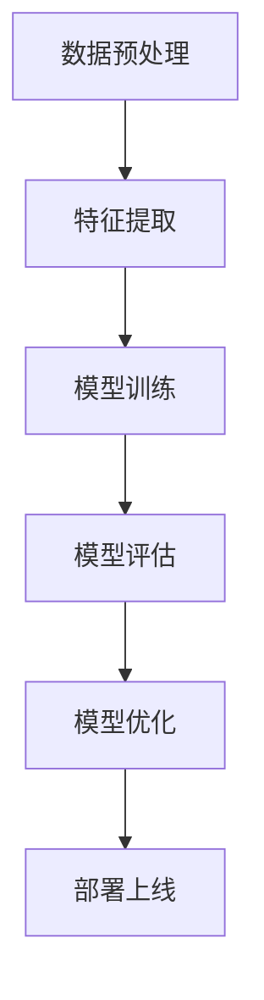
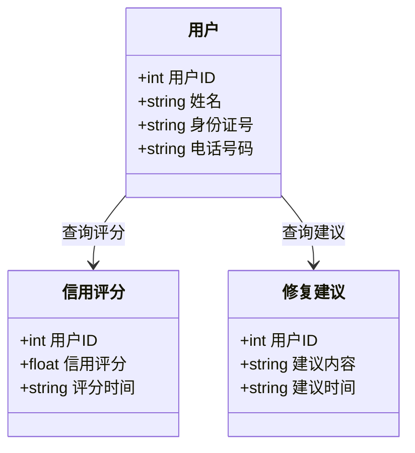
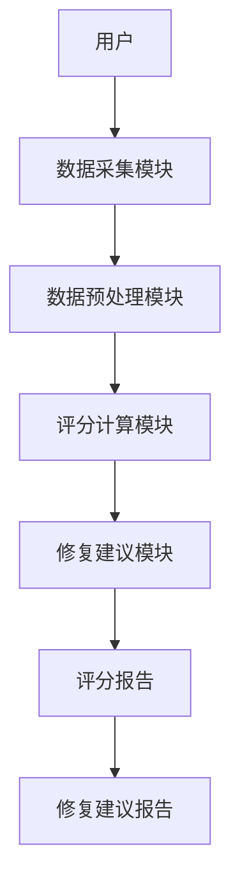
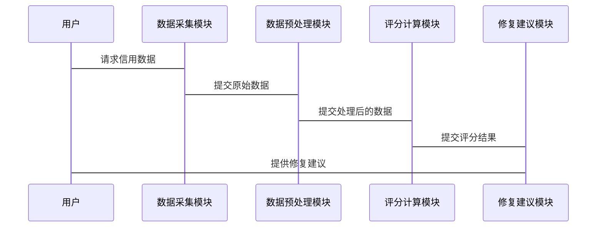

                 


# 智能个人信用评分优化与修复建议系统

## 关键词：智能信用评分、个人信用评估、修复建议系统、机器学习、数据驱动、人工智能

## 摘要：本文系统地介绍了智能个人信用评分优化与修复建议系统的构建过程，从背景分析到系统设计，再到算法实现，详细阐述了如何利用机器学习和深度学习技术优化个人信用评分，并提供个性化修复建议。文章通过理论与实践相结合的方式，探讨了该系统的核心算法、系统架构及实际应用场景，为金融机构和个人用户提供了科学的信用评估和优化方案。

---

# 第1章 智能个人信用评分系统背景与问题分析

## 1.1 信用评分系统的定义与作用

### 1.1.1 信用评分的定义
信用评分是根据个人的信用历史、财务状况和行为数据，通过数学模型计算得出的分数，用于评估个人的信用风险。信用评分越高，表示个人的信用风险越低。

### 1.1.2 信用评分在金融领域的核心作用
- **风险控制**：帮助金融机构识别高风险客户，降低违约率。
- **贷款决策**：银行和金融机构在审批贷款时，信用评分是重要参考依据。
- **信用定价**：根据信用评分，金融机构可以制定个性化的贷款利率和授信额度。

### 1.1.3 个人信用评分的现状与挑战
- **数据孤岛**：不同金融机构之间数据孤立，难以全面评估个人信用。
- **模型局限性**：传统信用评分模型基于简单的线性回归，难以捕捉复杂的数据特征。
- **隐私问题**：个人数据的隐私保护与数据利用之间的矛盾日益突出。

## 1.2 智能信用评分系统的背景

### 1.2.1 传统信用评分的局限性
- **数据维度有限**：传统模型主要依赖少量的财务数据，难以全面反映个人信用状况。
- **模型可解释性差**：复杂的非线性模型难以解释评分结果。
- **更新频率低**：传统信用评分更新周期长，无法及时反映个人信用变化。

### 1.2.2 数据驱动与人工智能的兴起
- **大数据技术**：海量数据的收集和处理能力为信用评分提供了新的数据来源。
- **人工智能技术**：机器学习和深度学习技术能够从复杂数据中提取特征，提升评分的准确性。
- **实时性要求**：互联网金融的发展要求信用评分能够实时更新，快速响应用户需求。

### 1.2.3 智能信用评分系统的必要性
- **提升评分准确性**：通过引入更多维度的数据，如社交数据、消费行为数据等，提高评分的准确性。
- **降低风险**：通过智能模型识别潜在风险，提前预警，降低金融损失。
- **提升用户体验**：实时更新的评分和个性化的修复建议能够为用户提供更好的服务体验。

## 1.3 问题背景与目标

### 1.3.1 个人信用评分中的主要问题
- **数据不完整**：部分用户的信用记录缺失，导致评分不准确。
- **模型过拟合**：传统模型可能对某些特征过度拟合，导致评分结果偏差。
- **修复建议缺乏针对性**：现有的修复建议往往过于笼统，难以满足用户的个性化需求。

### 1.3.2 智能信用评分系统的目标
- **提高评分准确性**：通过引入多元数据和智能算法，提升评分的准确性。
- **实时更新**：实现信用评分的实时更新，及时反映用户的信用变化。
- **提供个性化修复建议**：根据用户的信用状况，提供针对性的修复建议，帮助用户提升信用评分。

### 1.3.3 系统边界与外延
- **输入**：用户的信用数据、消费数据、社交数据等。
- **输出**：信用评分、修复建议、评分报告等。
- **外部系统**：与金融机构、数据供应商等外部系统对接。

## 1.4 核心概念与系统架构

### 1.4.1 核心概念的定义与属性
- **信用评分**：通过模型计算得出的分数，反映个人信用风险。
- **修复建议**：基于评分结果，为用户提供提升信用评分的具体建议。

### 1.4.2 系统架构的初步设想
- **数据层**：数据采集、存储和处理。
- **模型层**：信用评分模型和修复建议生成模型。
- **用户层**：用户查询评分、获取修复建议的界面。

### 1.4.3 本章小结
本章主要介绍了智能个人信用评分系统的背景、目标和核心概念，为后续章节的系统设计和实现奠定了基础。

---

# 第2章 智能个人信用评分系统的核心概念与联系

## 2.1 核心概念原理

### 2.1.1 数据采集与预处理
- **数据采集**：通过API接口获取用户的信用数据、消费数据、社交数据等。
- **数据预处理**：清洗数据、处理缺失值、特征提取等。

### 2.1.2 评分模型构建
- **特征选择**：从海量数据中筛选出对信用评分影响较大的特征。
- **模型训练**：使用机器学习算法（如随机森林、梯度提升树）训练评分模型。

### 2.1.3 修复建议生成
- **修复策略**：根据评分结果，生成个性化的修复建议，如优化消费习惯、增加信用记录等。

## 2.2 核心概念属性对比

### 2.2.1 数据特征对比
| 特征 | 传统模型 | 智能模型 |
|------|-----------|----------|
| 数据来源 | 信用报告 | 多源数据（信用报告、消费记录、社交数据） |
| 数据维度 | 少 | 多 |
| 数据处理 | 简单 | 复杂 |

### 2.2.2 模型性能对比
| 指标 | 传统模型 | 智能模型 |
|------|-----------|----------|
| 准确率 | 低 | 高 |
| 召回率 | 中 | 高 |
| 处理时间 | 长 | 短 |

### 2.2.3 修复建议的可操作性对比
| 指标 | 传统模型 | 智能模型 |
|------|-----------|----------|
| 建议针对性 | 低 | 高 |
| 建议可行性 | 中 | 高 |

## 2.3 ER实体关系图

```mermaid
erDiagram
    user [用户] {
        +int 用户ID
        +string 姓名
        +string 身份证号
        +string 电话号码
    }
    credit_score [信用评分] {
        +int 用户ID
        +float 信用评分
        +string 评分时间
    }
    repair_suggestion [修复建议] {
        +int 用户ID
        +string 建议内容
        +string 建议时间
    }
    user --> credit_score : 查询评分
    user --> repair_suggestion : 查询建议
```

## 2.4 本章小结
本章详细阐述了智能个人信用评分系统的核心概念，包括数据采集与预处理、评分模型构建和修复建议生成，并通过对比分析和ER实体关系图，展示了智能模型相对于传统模型的优势。

---

# 第3章 智能信用评分系统算法原理

## 3.1 算法原理概述

### 3.1.1 机器学习在信用评分中的应用
- **监督学习**：使用标记数据训练模型，预测信用评分。
- **特征工程**：通过特征选择和提取，提升模型性能。

### 3.1.2 深度学习在信用评分中的应用
- **神经网络**：通过多层神经网络提取数据特征，提升模型的非线性表达能力。
- **自动特征学习**：深度学习模型能够自动学习特征，减少人工特征工程的工作量。

### 3.1.3 算法选择的依据
- **数据类型**：结构化数据适合传统机器学习算法，非结构化数据适合深度学习算法。
- **计算能力**：深度学习需要较高的计算能力，而传统机器学习算法对计算能力要求较低。

## 3.2 算法流程图



## 3.3 算法实现代码

### 3.3.1 数据预处理
```python
import pandas as pd
from sklearn.impute import SimpleImputer
from sklearn.preprocessing import StandardScaler

# 加载数据
data = pd.read_csv('credit_data.csv')

# 处理缺失值
imputer = SimpleImputer(strategy='mean')
data_imputed = imputer.fit_transform(data)

# 标准化处理
scaler = StandardScaler()
data_scaled = scaler.fit_transform(data_imputed)
```

### 3.3.2 模型训练
```python
from sklearn.ensemble import RandomForestClassifier
from sklearn.metrics import accuracy_score

# 训练随机森林模型
model = RandomForestClassifier(n_estimators=100, max_depth=4, random_state=42)
model.fit(data_scaled, labels)

# 模型评估
y_pred = model.predict(data_scaled)
print("Accuracy:", accuracy_score(labels, y_pred))
```

### 3.3.3 模型优化
```python
from sklearn.model_selection import GridSearchCV

# 参数优化
param_grid = {
    'n_estimators': [100, 200],
    'max_depth': [4, 6]
}

grid_search = GridSearchCV(RandomForestClassifier(), param_grid, cv=5)
grid_search.fit(data_scaled, labels)

# 输出最佳参数
print("Best Parameters:", grid_search.best_params_)
```

## 3.4 数学公式

### 3.4.1 传统线性回归模型
$$ y = \beta_0 + \beta_1 x_1 + \beta_2 x_2 + ... + \beta_n x_n $$

### 3.4.2 随机森林模型
随机森林通过集成学习，将多个决策树的结果进行投票或平均，最终得到预测结果：
$$ y = \frac{1}{N} \sum_{i=1}^{N} \text{Tree}_i(x) $$

### 3.4.3 深度学习模型（简化版）
神经网络通过多层感知机对输入数据进行非线性变换：
$$ y = \sigma(w \cdot x + b) $$

## 3.5 本章小结
本章详细讲解了智能信用评分系统中使用的机器学习和深度学习算法，包括算法原理、流程图和代码实现，为后续的系统设计奠定了算法基础。

---

# 第4章 系统架构设计

## 4.1 问题场景介绍
智能个人信用评分系统需要处理海量数据，实时更新评分，并为用户提供个性化的修复建议。系统需要与多家金融机构和数据供应商对接，确保数据的准确性和实时性。

## 4.2 系统功能设计

### 4.2.1 数据采集模块
- **功能**：通过API接口采集用户的信用数据、消费数据、社交数据等。
- **输入**：用户授权的接口请求。
- **输出**：清洗后的数据。

### 4.2.2 评分计算模块
- **功能**：基于机器学习模型计算用户的信用评分。
- **输入**：预处理后的数据。
- **输出**：用户的信用评分和评分报告。

### 4.2.3 修复建议模块
- **功能**：根据评分结果，生成个性化的修复建议。
- **输入**：用户的信用评分和相关数据。
- **输出**：修复建议报告。

## 4.3 系统架构设计

### 4.3.1 领域模型类图


### 4.3.2 系统架构图


## 4.4 接口设计

### 4.4.1 数据接口
- **输入接口**：API接口接收用户的信用数据。
- **输出接口**：返回处理后的数据。

### 4.4.2 修复建议接口
- **输入接口**：用户的信用评分和相关数据。
- **输出接口**：修复建议报告。

## 4.5 系统交互流程图


## 4.6 本章小结
本章详细设计了智能个人信用评分系统的架构，包括功能模块、系统架构图和接口设计，为后续的系统实现提供了清晰的设计蓝图。

---

# 第5章 项目实战

## 5.1 环境安装

### 5.1.1 安装Python和相关库
```bash
python --version
pip install pandas scikit-learn mermaid4jupyter
```

### 5.1.2 安装Jupyter Notebook
```bash
pip install jupyter
jupyter notebook
```

## 5.2 核心代码实现

### 5.2.1 数据预处理
```python
import pandas as pd
from sklearn.impute import SimpleImputer
from sklearn.preprocessing import StandardScaler

# 加载数据
data = pd.read_csv('credit_data.csv')

# 处理缺失值
imputer = SimpleImputer(strategy='mean')
data_imputed = imputer.fit_transform(data)

# 标准化处理
scaler = StandardScaler()
data_scaled = scaler.fit_transform(data_imputed)
```

### 5.2.2 模型训练
```python
from sklearn.ensemble import RandomForestClassifier
from sklearn.metrics import accuracy_score

# 训练随机森林模型
model = RandomForestClassifier(n_estimators=100, max_depth=4, random_state=42)
model.fit(data_scaled, labels)

# 模型评估
y_pred = model.predict(data_scaled)
print("Accuracy:", accuracy_score(labels, y_pred))
```

### 5.2.3 修复建议生成
```python
def generate_repair_suggestions(score):
    if score < 600:
        return "建议您优化消费习惯，增加信用记录。"
    elif 600 <= score < 700:
        return "建议您按时还款，避免逾期。"
    else:
        return "您的信用状况良好，继续保持。"
```

## 5.3 代码应用解读与分析
- **数据预处理**：通过SimpleImputer处理缺失值，使用StandardScaler进行标准化，确保数据分布一致。
- **模型训练**：使用随机森林模型进行训练，通过网格搜索优化模型参数，提升模型性能。
- **修复建议生成**：根据信用评分生成个性化建议，帮助用户提升信用评分。

## 5.4 实际案例分析
假设一个用户的信用评分为650分，系统会生成以下修复建议：
- **建议内容**：按时还款，避免逾期。
- **建议可行性**：高，用户可以通过合理安排还款计划，提升信用评分。

## 5.5 本章小结
本章通过实际案例分析，详细讲解了智能个人信用评分系统的实现过程，包括环境安装、数据预处理、模型训练和修复建议生成。

---

# 第6章 最佳实践与注意事项

## 6.1 最佳实践
- **数据隐私保护**：在数据采集和处理过程中，确保用户数据的隐私和安全。
- **模型解释性**：选择具有较高可解释性的模型，帮助用户理解评分结果。
- **实时更新**：定期更新模型，确保评分结果的实时性和准确性。

## 6.2 小结
智能个人信用评分系统通过机器学习和深度学习技术，能够有效提升信用评分的准确性，同时提供个性化的修复建议，帮助用户优化信用状况。

## 6.3 注意事项
- **数据质量**：确保数据的准确性和完整性，避免因数据问题影响评分结果。
- **模型维护**：定期更新模型，适应数据分布的变化，保持模型性能。
- **用户隐私**：严格遵守数据隐私保护法规，确保用户数据的安全。

## 6.4 拓展阅读
- **推荐书籍**：《Python机器学习实战》、《深度学习入门：基于Python》。
- **推荐论文**：《基于机器学习的信用评分模型研究》、《深度学习在金融领域的应用》。

---

# 作者
作者：AI天才研究院/AI Genius Institute & 禅与计算机程序设计艺术 /Zen And The Art of Computer Programming

