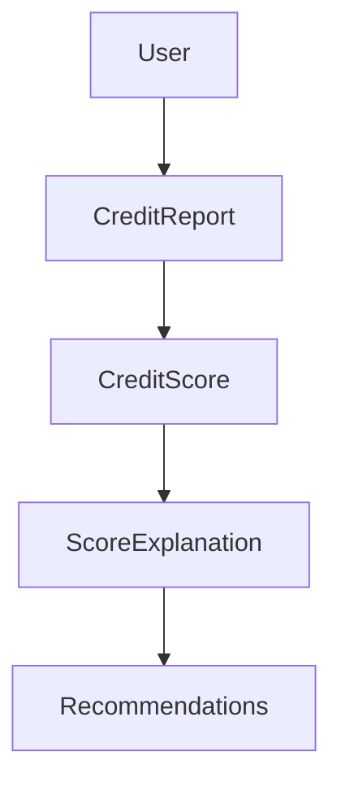
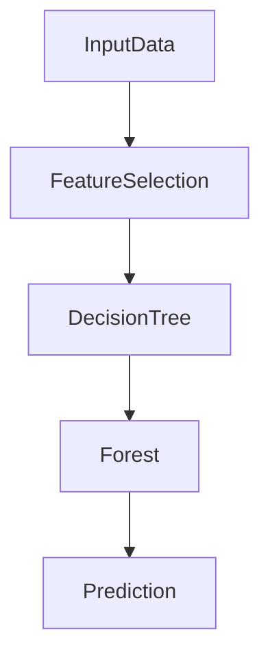
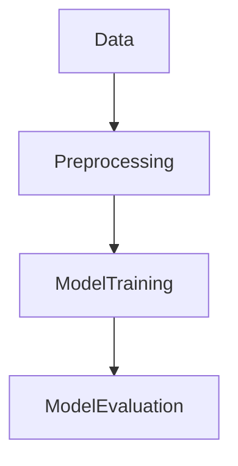
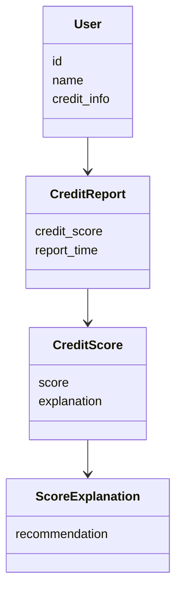
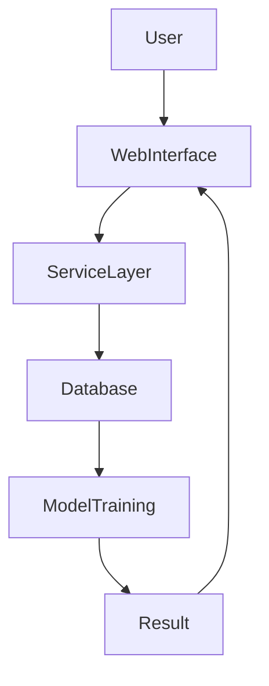

                 


# 智能个人信用评分优化建议系统

## 关键词：智能评分系统, 信用评分, 机器学习, 系统架构, 优化建议

## 摘要：  
智能个人信用评分优化建议系统是一种基于人工智能和大数据分析的创新解决方案，旨在通过智能化算法优化个人信用评分，并为用户提供个性化的信用管理建议。本文从系统背景、核心概念、算法原理、系统架构、项目实战到最佳实践等方面，全面解析智能个人信用评分优化建议系统的实现与应用。

---

## 第一部分: 智能个人信用评分优化建议系统概述

### 1.1 智能个人信用评分系统概述

#### 1.1.1 传统信用评分的局限性
传统信用评分主要依赖于人工审核和简单的规则引擎，存在以下问题：
- **效率低**：人工审核耗时长，难以满足海量用户的需求。
- **准确性不足**：规则引擎难以捕捉复杂的信用行为，导致评分不准确。
- **缺乏个性化**：传统评分模型难以根据用户行为动态调整评分策略。

#### 1.1.2 智能信用评分的核心优势
智能信用评分系统通过引入机器学习和大数据分析技术，具有以下优势：
- **高效性**：利用自动化算法快速计算信用评分。
- **准确性**：通过深度学习模型捕捉复杂信用行为，提高评分准确性。
- **个性化**：根据用户行为动态调整评分策略，提供个性化建议。

#### 1.1.3 智能评分系统在金融领域的实际应用
智能信用评分系统已在以下场景中得到广泛应用：
- **银行贷款审批**：快速评估用户的信用风险。
- **信用卡额度调整**：根据用户信用行为动态调整额度。
- **金融产品推荐**：基于信用评分推荐个性化金融产品。

---

### 1.2 核心概念与联系

#### 1.2.1 信用评分的定义与属性特征对比
| 概念 | 定义 | 特性 |
|------|------|------|
| 信用评分 | 衡量个人信用风险的指标 | 客观性、实时性、可解释性 |
| 智能评分系统 | 基于AI的信用评分工具 | 高效性、准确性、适应性 |

#### 1.2.2 实体关系图


---

## 第二部分: 智能信用评分算法原理

### 2.1 机器学习模型

#### 2.1.1 线性回归模型
线性回归是一种简单的回归算法，适用于线性关系的预测。公式如下：
$$ y = \beta_0 + \beta_1 x + \epsilon $$
其中：
- $y$ 是目标变量（信用评分）。
- $x$ 是自变量（用户特征）。
- $\beta_0$ 是截距。
- $\beta_1$ 是回归系数。
- $\epsilon$ 是误差项。

#### 2.1.2 随机森林模型
随机森林是一种基于决策树的集成算法，具有高准确性和鲁棒性。以下是随机森林的训练流程：


---

### 2.2 信用评分模型的构建与优化

#### 2.2.1 数据预处理
数据预处理是模型构建的关键步骤，包括：
1. **数据清洗**：处理缺失值和异常值。
2. **特征选择**：选择对信用评分影响较大的特征。
3. **数据标准化**：将数据归一化到统一范围。

#### 2.2.2 模型训练与评估
训练流程如下：

评估指标包括准确率、召回率和F1分数。

---

## 第三部分: 智能信用评分系统架构设计

### 3.1 系统需求分析

#### 3.1.1 功能需求
系统需要实现以下功能：
1. 用户信息输入与采集。
2. 信用评分计算。
3. 评分结果解释与建议。

#### 3.1.2 性能需求
系统需满足以下性能指标：
- 响应时间：≤1秒/请求。
- 处理能力：支持每天10万次请求。

---

### 3.2 系统功能设计

#### 3.2.1 系统模块划分


#### 3.2.2 系统架构设计


---

## 第四部分: 智能信用评分系统实现

### 4.1 环境安装与配置

#### 4.1.1 Python环境安装
安装所需的库：
```bash
pip install numpy pandas scikit-learn
```

---

### 4.2 系统核心代码实现

#### 4.2.1 数据加载与预处理
```python
import pandas as pd
data = pd.read_csv('credit_data.csv')
data.dropna(inplace=True)
```

#### 4.2.2 特征选择与模型训练
```python
from sklearn.ensemble import RandomForestClassifier
model = RandomForestClassifier()
model.fit(X_train, y_train)
```

---

## 第五部分: 智能信用评分系统优化与展望

### 5.1 系统优化建议

#### 5.1.1 模型优化
- 使用超参数调优提升模型性能。
- 引入实时数据流处理技术，提高评分的实时性。

#### 5.1.2 系统安全与合规性
- 数据加密与访问控制。
- 符合金融行业数据保护法规。

---

## 第六部分: 项目总结与展望

### 6.1 项目总结
智能个人信用评分优化建议系统通过引入机器学习技术，显著提高了信用评分的准确性和效率，为用户提供个性化的信用管理服务。

### 6.2 未来发展
未来，随着人工智能技术的进步，智能信用评分系统将更加智能化和个性化，为金融行业带来更多创新应用。

---

## 作者：AI天才研究院/AI Genius Institute & 禅与计算机程序设计艺术 /Zen And The Art of Computer Programming

