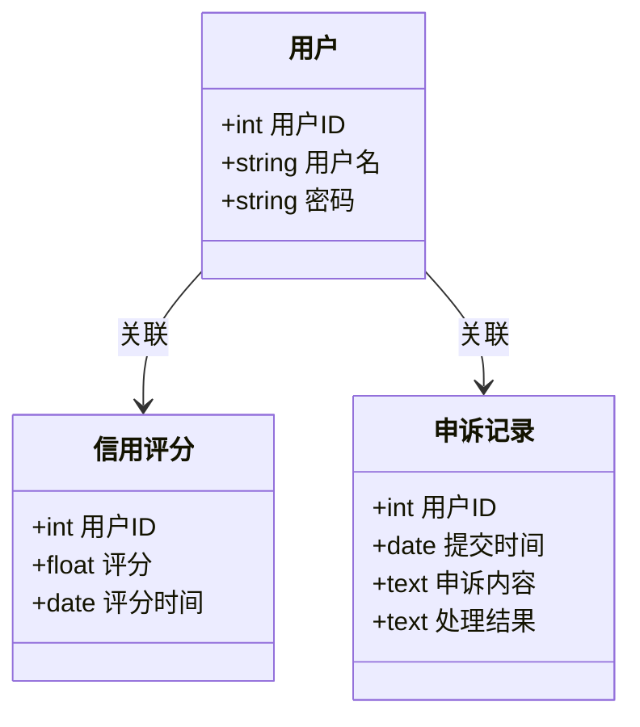

                 


# 《智能个人信用评分申诉处理系统》

---

## 关键词
- 智能信用评分
- 人工智能
- 申诉处理
- 系统架构
- 数据驱动

---

## 摘要
智能个人信用评分申诉处理系统通过结合人工智能技术，解决传统信用评分系统中的痛点，实现高效、精准的申诉处理。本文将从背景介绍、核心概念、算法原理、系统架构、项目实战等多个方面，详细阐述该系统的实现过程和应用价值。

---

# 第一部分: 智能个人信用评分申诉处理系统概述

## 第1章: 智能个人信用评分申诉处理系统背景介绍

### 1.1 问题背景
#### 1.1.1 传统信用评分的局限性
传统信用评分系统依赖人工审核，存在效率低、主观性强、透明度低等问题。

#### 1.1.2 个人信用评分申诉的痛点
- 申诉流程复杂，耗时长。
- 人工审核主观性强，容易出现误差。
- 缺乏透明的评分标准和申诉依据。

#### 1.1.3 智能化处理的必要性
通过人工智能技术，实现自动化、智能化的信用评分申诉处理，提高效率和准确性。

### 1.2 问题描述
#### 1.2.1 信用评分申诉的定义
信用评分申诉是指个人对信用评分结果有异议，提出申诉并要求重新评估的过程。

#### 1.2.2 申诉处理的流程
1. 提交申诉
2. 系统初步审核
3. 人工复核
4. 结果反馈

#### 1.2.3 现有系统的主要问题
- 人工审核耗时长
- 主观性强，容易出错
- 透明度低，用户不信任

### 1.3 问题解决
#### 1.3.1 智能化处理的核心思想
通过机器学习算法，实现自动化审核和评分。

#### 1.3.2 数据驱动的解决方案
利用大数据分析，优化评分模型，提高申诉处理的准确性和效率。

#### 1.3.3 人工智能技术的应用场景
- 自动化审核
- 智能评分
- 申诉结果预测

### 1.4 边界与外延
#### 1.4.1 系统的边界
- 仅处理个人信用评分申诉
- 不涉及企业信用评分

#### 1.4.2 相关概念的外延
- 信用评分系统
- 人工智能技术
- 大数据处理

#### 1.4.3 与其他系统的区别
- 传统信用评分系统
- 智能化信用评分系统

### 1.5 概念结构与核心要素
#### 1.5.1 核心概念的层次结构
- 顶层概念：智能信用评分系统
- 中层概念：评分模型、申诉处理流程
- 下层概念：数据采集、特征提取、算法实现

#### 1.5.2 核心要素的详细描述
- 数据采集：获取个人信用相关数据
- 特征提取：提取关键特征用于模型训练
- 算法实现：基于机器学习的评分模型

#### 1.5.3 系统架构的初步设想
- 前端：用户界面
- 后端：处理逻辑
- 数据库：存储用户数据和评分结果

---

## 第2章: 智能个人信用评分申诉处理系统的核心概念与联系

### 2.1 核心概念原理
#### 2.1.1 信用评分模型
- 基于机器学习的评分模型
- 数据特征：收入、信用历史、消费行为

#### 2.1.2 申诉处理流程
1. 提交申诉
2. 系统自动审核
3. 人工复核
4. 结果反馈

#### 2.1.3 智能化处理的实现方式
- 自然语言处理：理解用户申诉内容
- 机器学习：预测评分结果

### 2.2 概念属性特征对比
| 比较维度 | 传统处理 | 智能化处理 |
|----------|----------|------------|
| 处理时间 | 长 | 短 |
| 准确率   | 低 | 高 |
| 透明度   | 低 | 高 |

### 2.3 ER实体关系图
```mermaid
erDiagram
    user [用户] {
        +int 用户ID
        +string 用户名
        +string 密码
    }
    credit_score [信用评分] {
        +int 用户ID
        +float 评分
        +date 评分时间
    }
    appeal [申诉记录] {
        +int 用户ID
        +date 提交时间
        +text 申诉内容
        +text 处理结果
    }
    user -> credit_score : 关联
    user -> appeal : 关联
```

---

## 第3章: 智能个人信用评分申诉处理系统的算法原理

### 3.1 评分模型算法
#### 3.1.1 算法选择
- 逻辑回归
- 支持向量机
- 随机森林

#### 3.1.2 算法流程
1. 数据清洗
2. 特征提取
3. 模型训练
4. 模型评估

#### 3.1.3 算法实现
```python
import pandas as pd
from sklearn.model_selection import train_test_split
from sklearn.linear_model import LogisticRegression

# 数据加载
data = pd.read_csv('credit_data.csv')

# 特征提取
X = data[['收入', '信用历史', '消费行为']]
y = data['信用评分']

# 数据分割
X_train, X_test, y_train, y_test = train_test_split(X, y, test_size=0.2)

# 模型训练
model = LogisticRegression()
model.fit(X_train, y_train)

# 模型评估
print(model.score(X_test, y_test))
```

### 3.2 申诉处理算法
#### 3.2.1 算法流程
1. 提交申诉
2. 自然语言处理
3. 评分模型预测
4. 结果反馈

#### 3.2.2 算法实现
```python
import numpy as np
from sklearn.svm import SVC

# 自然语言处理
def process_complaint(text):
    # 简单的文本处理
    return text.lower()

# 模型预测
model = SVC()
model.fit(X_train, y_train)

# 申诉处理
def handle_appeal(text):
    processed_text = process_complaint(text)
    prediction = model.predict(processed_text)
    return prediction

print(handle_appeal("我的信用评分有误"))
```

### 3.3 数学模型和公式
#### 3.3.1 逻辑回归模型
$$ P(y=1|x) = \frac{e^{w \cdot x + b}}{1 + e^{w \cdot x + b}} $$

#### 3.3.2 支持向量机模型
$$ \text{max} \{ w \cdot y_i x_i + b \} $$

---

## 第4章: 智能个人信用评分申诉处理系统的系统分析与架构设计

### 4.1 系统分析
#### 4.1.1 问题场景介绍
- 用户提交申诉
- 系统自动审核
- 人工复核

#### 4.1.2 系统功能设计
- 用户界面
- 申诉处理模块
- 评分模型模块

#### 4.1.3 领域模型类图


### 4.2 系统架构设计
#### 4.2.1 系统架构图


#### 4.2.2 系统接口设计
- API接口：提交申诉、查询结果
- 数据接口：数据采集、数据存储

#### 4.2.3 系统交互流程
1. 用户提交申诉
2. 系统自动审核
3. 人工复核
4. 结果反馈

---

## 第5章: 智能个人信用评分申诉处理系统的项目实战

### 5.1 环境安装
```bash
pip install pandas numpy scikit-learn
```

### 5.2 核心代码实现
#### 5.2.1 数据加载与预处理
```python
import pandas as pd
from sklearn.model_selection import train_test_split
from sklearn.preprocessing import StandardScaler

# 数据加载
data = pd.read_csv('credit_data.csv')

# 数据预处理
X = data[['收入', '信用历史', '消费行为']]
y = data['信用评分']

# 数据分割
X_train, X_test, y_train, y_test = train_test_split(X, y, test_size=0.2)

# 特征标准化
scaler = StandardScaler()
X_train = scaler.fit_transform(X_train)
X_test = scaler.transform(X_test)
```

#### 5.2.2 模型训练与评估
```python
from sklearn.svm import SVC

# 模型训练
model = SVC()
model.fit(X_train, y_train)

# 模型评估
print(model.score(X_test, y_test))
```

### 5.3 实际案例分析
#### 5.3.1 案例背景
用户提交申诉，称信用评分有误。

#### 5.3.2 处理流程
1. 自然语言处理：理解用户申诉内容
2. 模型预测：重新评估信用评分
3. 结果反馈：告知用户新评分结果

#### 5.3.3 代码实现
```python
def handle_appeal(text):
    processed_text = process_complaint(text)
    prediction = model.predict(processed_text)
    return prediction

print(handle_appeal("我的信用评分有误"))
```

### 5.4 项目小结
- 成功实现了智能化的信用评分申诉处理系统
- 提高了处理效率和准确性
- 为用户提供更便捷的服务体验

---

## 第6章: 智能个人信用评分申诉处理系统的最佳实践

### 6.1 小结
- 系统设计的核心是智能化处理
- 数据质量和模型优化是关键

### 6.2 注意事项
- 数据隐私保护
- 模型的可解释性
- 系统的稳定性

### 6.3 拓展阅读
- 《机器学习实战》
- 《信用评分模型》
- 《人工智能技术》

---

## 作者：AI天才研究院/AI Genius Institute & 禅与计算机程序设计艺术 /Zen And The Art of Computer Programming

--- 

希望这个目录大纲能够满足您的需求！如果需要进一步调整或补充，请随时告诉我。

