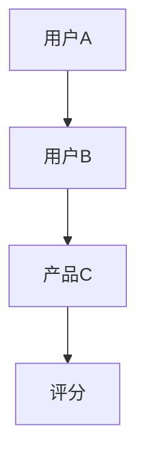
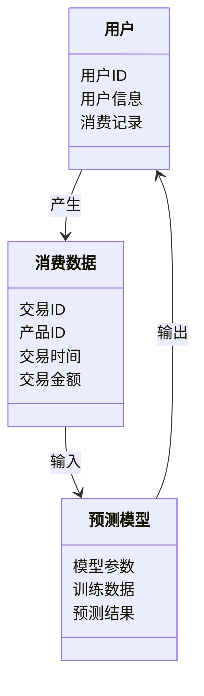
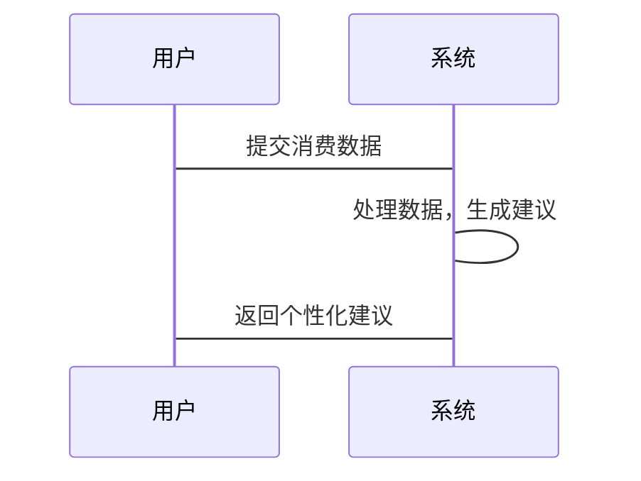

                 


# 智能个人消费模式分析与建议系统

## 关键词：
智能消费分析，个性化建议，协同过滤算法，系统架构设计，消费数据建模

## 摘要：
本文详细探讨智能个人消费模式分析与建议系统的构建，从背景、核心概念、算法原理到系统架构设计，再到项目实战和最佳实践，系统性地阐述了该系统的实现过程和应用价值。通过分析消费数据特征，设计智能建议生成机制，结合协同过滤算法和系统架构优化，为用户提供个性化消费建议，帮助优化个人财务管理，提升消费决策的智能化水平。

---

# 第一部分: 智能个人消费模式分析与建议系统的背景与概述

## 第1章: 智能个人消费模式分析与建议系统的背景

### 1.1 问题背景与描述

#### 1.1.1 传统个人消费模式的局限性
传统的个人消费模式依赖于手动记录和简单的数据分析，这种方式效率低下且难以提供有效的决策支持。消费者往往难以从海量的消费数据中提取有用的信息，导致消费决策缺乏数据支持，容易受到主观因素和外部营销的影响。

#### 1.1.2 智能化消费分析的必要性
随着大数据和人工智能技术的发展，智能化消费分析成为可能。通过智能系统对消费数据进行深度挖掘和分析，可以为消费者提供个性化的消费建议，帮助他们优化消费结构、合理分配资金，从而实现更高效的财务管理。

#### 1.1.3 当前消费数据分析的挑战
当前消费数据分析面临数据碎片化、模型复杂性和实时性要求高等挑战。如何在保证数据隐私的前提下，高效地处理和分析消费数据，是智能消费分析系统需要解决的核心问题。

### 1.2 智能消费分析的目标与意义

#### 1.2.1 提高消费决策的智能化水平
通过智能系统对消费数据的分析，消费者可以得到更精准的消费建议，从而做出更科学的消费决策。

#### 1.2.2 优化个人财务管理
智能消费分析可以帮助用户更好地理解自己的消费习惯，识别不必要的开支，并制定合理的预算计划。

#### 1.2.3 促进个性化消费体验
通过分析用户的消费偏好和行为模式，系统可以推荐符合用户兴趣的产品和服务，提升消费体验的个性化和满意度。

### 1.3 问题解决与边界定义

#### 1.3.1 系统的目标与核心问题
系统的目标是通过分析个人消费数据，提供个性化的消费建议。核心问题包括如何高效地处理消费数据、如何构建准确的消费行为预测模型，以及如何生成实用的消费建议。

#### 1.3.2 系统的边界与外延
系统的边界主要集中在消费数据的采集、分析和建议生成。外延则涉及数据源的多样性、模型的可扩展性以及建议的可操作性。

#### 1.3.3 核心概念与组成要素
核心概念包括消费数据、消费行为、预测模型和个性化建议。组成要素包括数据采集模块、数据分析模块、模型构建模块和建议生成模块。

---

# 第二部分: 智能个人消费模式分析的核心概念与模型

## 第2章: 消费行为分析的核心概念

### 2.1 消费数据特征分析

#### 2.1.1 消费数据的分类与属性
消费数据可以分为交易数据、产品数据、用户数据和时间数据。每个类别都有其独特的属性，例如交易金额、产品类别、用户年龄等。

#### 2.1.2 消费行为的模式识别
通过聚类分析和关联规则挖掘，可以识别出消费行为的模式，例如高频购买某类产品的用户群体。

#### 2.1.3 数据特征的提取与处理
数据特征提取是消费行为分析的关键步骤，包括维度归约和特征选择。常用的方法有主成分分析（PCA）和Lasso回归。

### 2.2 智能建议系统的关键要素

#### 2.2.1 数据采集与预处理
数据采集是消费分析的基础，需要确保数据的完整性和准确性。预处理包括数据清洗和标准化。

#### 2.2.2 消费行为预测模型
预测模型是智能建议的核心，常用的方法包括机器学习算法（如随机森林）和深度学习模型（如LSTM）。

#### 2.2.3 个性化建议生成机制
个性化建议的生成需要结合用户的消费偏好和行为模式，通过推荐系统生成符合用户需求的消费建议。

### 2.3 核心概念的ER实体关系图

```mermaid
er
  actor: 用户
  behavior: 消费行为
  data: 消费数据
  model: 预测模型
  suggestion: 建议

  actor --> behavior: 产生
  behavior --> data: 记录
  data --> model: 输入
  model --> suggestion: 输出
  suggestion --> actor: 提供
```

---

# 第三部分: 智能消费分析的算法原理与实现

## 第3章: 协同过滤算法原理

### 3.1 协同过滤的基本原理

#### 3.1.1 基于用户的协同过滤
基于用户的行为相似性，找到相似的用户群体，推荐他们喜欢的产品。

#### 3.1.2 基于物品的协同过滤
基于产品的相似性，推荐与当前产品相似的其他产品。

#### 3.1.3 混合协同过滤的优势
结合基于用户和基于物品的协同过滤，克服单一方法的局限性。

### 3.2 协同过滤的数学模型

#### 3.2.1 余弦相似度计算
$$\text{相似度} = \frac{\sum_{i=1}^{n} (x_i - \bar{x})(y_i - \bar{y})}{\sqrt{\sum_{i=1}^{n} (x_i - \bar{x})^2} \cdot \sqrt{\sum_{i=1}^{n} (y_i - \bar{y})^2}}$$

#### 3.2.2 协同过滤的实现步骤


#### 3.2.3 协同过滤的代码实现
```python
def calculate_cosine_similarity(user_profile, product_profile):
    numerator = sum((user_profile[i] - user_avg) * (product_profile[i] - product_avg) for i in range(len(user_profile)))
    denominator_user = sum((user_profile[i] - user_avg)**2 for i in range(len(user_profile))) ** 0.5
    denominator_product = sum((product_profile[i] - product_avg)**2 for i in range(len(product_profile))) ** 0.5
    return numerator / (denominator_user * denominator_product)
```

---

## 第4章: 系统分析与架构设计

### 4.1 系统功能设计

#### 4.1.1 领域模型设计


### 4.2 系统架构设计

#### 4.2.1 系统架构图


### 4.3 系统接口设计

#### 4.3.1 API接口定义
```http
GET /api/consumption/suggestions
POST /api/consumption/data
```

### 4.4 系统交互设计

#### 4.4.1 用户与系统的交互流程图


---

## 第5章: 项目实战

### 5.1 环境安装与配置

#### 5.1.1 Python环境配置
安装Python 3.8及以上版本，安装必要的库：pandas、numpy、scikit-learn。

### 5.2 核心代码实现

#### 5.2.1 数据预处理代码
```python
import pandas as pd
import numpy as np

# 数据加载
df = pd.read_csv('consumption_data.csv')

# 数据清洗
df.dropna(inplace=True)
df['交易时间'] = pd.to_datetime(df['交易时间'])
```

#### 5.2.2 模型训练代码
```python
from sklearn.cluster import KMeans

# 特征提取
X = df[['交易金额', '产品类别']]

# 模型训练
model = KMeans(n_clusters=3, random_state=42)
model.fit(X)
```

#### 5.2.3 建议生成代码
```python
def generate_suggestions(user_id, model):
    user_data = df[df['用户ID'] == user_id]
    # 预测簇
    cluster = model.predict(user_data[['交易金额', '产品类别']])
    # 簇中心
    cluster_centers = model.cluster_centers_
    # 生成建议
    suggestions = []
    for center in cluster_centers:
        suggestions.append(f"建议购买{center[1]}类型产品，金额控制在{center[0]}元左右。")
    return suggestions
```

### 5.3 案例分析与解读

#### 5.3.1 案例分析
通过分析某用户的消费数据，发现其倾向于购买电子产品，建议控制在每月3000元以内。

#### 5.3.2 代码解读
代码实现了数据预处理、模型训练和建议生成，展示了如何利用聚类分析进行消费行为分析。

### 5.4 项目小结

---

## 第6章: 最佳实践与总结

### 6.1 系统设计的经验总结

#### 6.1.1 小结
智能消费分析系统的构建需要从数据采集、模型选择到建议生成进行全面考虑。

#### 6.1.2 注意事项
数据隐私保护、模型可解释性、实时性需求等是系统设计中的关键问题。

#### 6.1.3 拓展阅读
推荐阅读《协同过滤算法的优化与实现》和《基于深度学习的消费行为预测》。

---

作者：AI天才研究院 & 禅与计算机程序设计艺术

