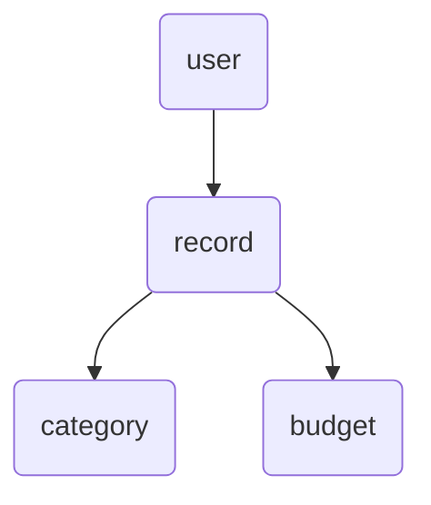
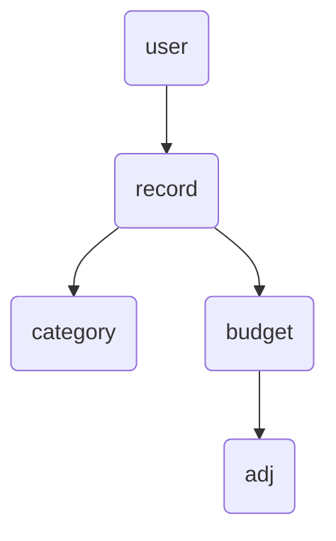
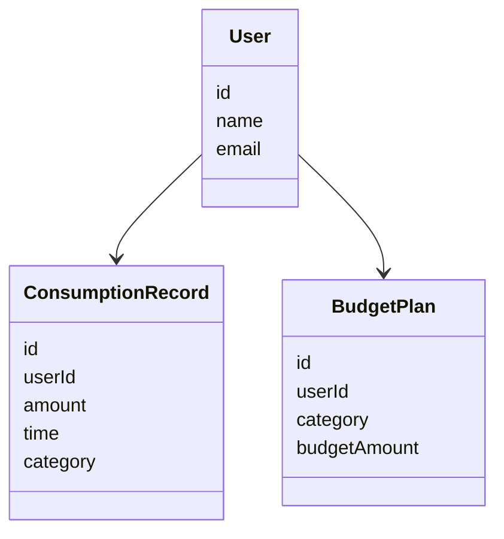
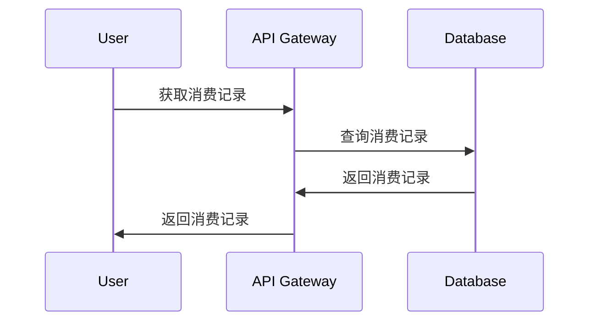

                 


# 智能个人消费模式分析与预算管理系统

## 关键词：智能消费分析、预算管理、机器学习、数据分析、系统架构

## 摘要：  
本文将探讨智能个人消费模式分析与预算管理系统的构建与实现。通过分析个人消费数据，利用机器学习和数据分析技术，实现消费行为的智能化分析和预算管理。文章详细阐述了系统的背景、核心概念、算法原理、系统架构设计以及项目实战，并提供了丰富的图表和代码示例，帮助读者全面理解系统的构建过程。

---

## 第1章: 智能个人消费模式分析与预算管理系统的背景介绍

### 1.1 问题背景与问题描述

#### 1.1.1 当前个人消费模式的现状与挑战  
随着经济的发展和生活水平的提高，个人消费模式日益复杂。传统的财务管理方式难以满足人们对消费行为的深度分析和精准预算管理的需求。消费者往往面临以下问题：  
- 消费记录分散，难以系统化管理。  
- 消费行为缺乏深度分析，难以识别消费习惯和潜在风险。  
- 预算制定与执行脱节，难以实时监控和调整。  

#### 1.1.2 智能化消费分析的必要性  
智能消费分析通过采集、处理和分析消费数据，能够帮助个人识别消费模式、预测未来消费趋势，并提供个性化的预算管理建议。这种智能化的消费管理方式可以显著提升财务管理效率，降低超支风险，帮助用户实现财务自由。

#### 1.1.3 预算管理在个人财务管理中的重要性  
预算管理是个人财务管理的核心环节。通过科学的预算制定与执行，个人可以更好地控制支出，优化资金分配，实现长期财务目标。然而，传统预算管理方式往往缺乏动态调整能力，难以应对实际消费中的各种不确定性。

### 1.2 问题解决与边界定义

#### 1.2.1 智能消费分析与预算管理的核心目标  
- 提供个性化的消费行为分析，帮助用户了解消费习惯。  
- 自动生成合理的预算方案，并实时监控预算执行情况。  
- 提供消费建议，优化用户的财务结构。  

#### 1.2.2 系统的边界与外延  
- **边界**：系统仅关注个人消费数据的分析与预算管理，不涉及收入管理或其他财务行为。  
- **外延**：系统可以与银行、支付平台等外部系统集成，获取实时消费数据。  

#### 1.2.3 核心要素与组成结构  
系统的核心要素包括：  
1. **消费数据采集**：通过API接口获取消费记录。  
2. **消费行为分析**：基于机器学习算法分析消费模式。  
3. **预算制定与执行**：根据分析结果生成预算方案，并实时监控执行情况。  
4. **用户界面**：提供直观的可视化界面，方便用户查看分析结果和管理预算。  

### 1.3 核心概念与联系

#### 1.3.1 智能消费分析的原理  
智能消费分析通过采集用户的消费数据，利用机器学习算法进行分析，识别消费模式和趋势。  
- 数据采集：通过API接口获取用户的消费记录，包括时间、金额、消费类别等信息。  
- 数据预处理：清洗数据，去除异常值，提取关键特征。  
- 模型训练：基于历史数据训练机器学习模型，预测未来的消费行为。  

#### 1.3.2 预算管理的实现机制  
预算管理通过制定预算方案、监控消费行为，确保用户的支出在预算范围内。  
- 预算制定：根据用户的收入和消费习惯，生成合理的预算方案。  
- 预算执行：实时跟踪消费记录，监控预算执行情况。  
- 预算调整：根据实际消费情况，动态调整预算方案。  

#### 1.3.3 实体关系图（ER图）  
以下是系统的实体关系图（ER图）：  


---

## 第2章: 核心概念与联系

### 2.1 智能消费分析的原理

#### 2.1.1 数据采集与处理流程  
1. **数据采集**：通过API接口获取用户的消费记录。  
2. **数据清洗**：去除无效数据，处理异常值。  
3. **特征提取**：提取消费金额、时间、类别等特征。  

#### 2.1.2 消费行为分析模型  
- **聚类分析**：将消费记录按类别聚类，识别用户的消费习惯。  
- **时间序列分析**：分析消费行为的时间分布，预测未来的消费趋势。  

#### 2.1.3 智能推荐算法  
- **协同过滤**：基于用户的消费行为，推荐相似用户的消费模式。  
- **基于规则的推荐**：根据消费数据中的关联规则，推荐合理的消费建议。  

### 2.2 预算管理的实现机制

#### 2.2.1 预算制定与调整  
- **动态规划**：根据消费数据，动态调整预算方案。  
- **预算分配**：将收入分配到不同的消费类别中。  

#### 2.2.2 消费支出分析  
- **支出统计**：按类别统计消费金额，识别主要支出项。  
- **偏差分析**：分析实际支出与预算的偏差，找出超支或节约的类别。  

#### 2.2.3 预算执行监控  
- **实时监控**：通过API接口实时获取消费记录，监控预算执行情况。  
- **预警机制**：当某类消费接近或超出预算时，触发预警通知。  

### 2.3 实体关系图（ER图）  
以下是系统的实体关系图（ER图）：  


---

## 第3章: 算法原理与数学模型

### 3.1 数据预处理与特征提取

#### 3.1.1 数据清洗与标准化  
- **数据清洗**：去除无效数据，处理缺失值。  
- **标准化**：将数据归一化，便于模型训练。  

#### 3.1.2 消费行为特征提取  
- **时间特征**：消费时间、消费频率等。  
- **金额特征**：消费金额、平均消费金额等。  
- **类别特征**：消费类别分布、主要消费类别等。  

### 3.2 智能消费分析模型

#### 3.2.1 基于机器学习的消费预测  
- **线性回归**：预测未来的消费金额。  
- **随机森林**：预测消费类别。  

#### 3.2.2 聚类分析与消费行为分类  
- **K-means聚类**：将消费记录按类别聚类。  
- **层次聚类**：分析消费行为的层次结构。  

#### 3.2.3 关联规则挖掘  
- **Apriori算法**：挖掘消费数据中的关联规则。  

### 3.3 预算管理算法

#### 3.3.1 基于动态规划的预算分配  
- **动态规划模型**：根据消费数据，动态调整预算方案。  

#### 3.3.2 预算执行偏差分析  
- **偏差计算**：计算实际支出与预算的偏差。  
- **偏差分析**：分析偏差的原因，优化预算方案。  

---

## 第4章: 系统分析与架构设计

### 4.1 系统功能设计

#### 4.1.1 领域模型设计  
以下是系统的领域模型：  


#### 4.1.2 系统架构设计  
以下是系统的架构图：  
```mermaid
graph TD
    Client --> API Gateway
    API Gateway --> Database
    Database --> User
    Database --> ConsumptionRecord
    Database --> BudgetPlan
```

### 4.2 接口设计与交互流程

#### 4.2.1 API接口设计  
- **获取消费记录**：`GET /consumption/records`  
- **提交消费记录**：`POST /consumption/records`  
- **获取预算方案**：`GET /budget/plans`  

#### 4.2.2 系统交互流程  
以下是系统的交互流程图：  


---

## 第5章: 项目实战

### 5.1 环境安装与配置

#### 5.1.1 环境要求  
- Python 3.8 或更高版本  
- 安装 `pandas`, `numpy`, `scikit-learn` 等库  

#### 5.1.2 代码实现  
以下是核心代码示例：  
```python
import pandas as pd
from sklearn.cluster import KMeans

# 数据加载
data = pd.read_csv('consumption.csv')

# 数据预处理
data.dropna(inplace=True)
data['amount'] = data['amount'].astype(float)

# 聚类分析
model = KMeans(n_clusters=3, random_state=42)
model.fit(data[['amount', 'time']])
```

---

## 第6章: 最佳实践与总结

### 6.1 最佳实践 tips  
- 定期备份数据，确保数据安全。  
- 根据实际需求，动态调整预算方案。  

### 6.2 小结  
本文详细介绍了智能个人消费模式分析与预算管理系统的构建与实现。通过机器学习和数据分析技术，系统能够帮助用户更好地管理消费行为，实现精准的预算管理。

### 6.3 注意事项  
- 数据隐私保护：确保用户的消费数据不被滥用。  
- 系统性能优化：提升数据处理效率，确保系统实时响应。  

### 6.4 拓展阅读  
- 《数据挖掘导论》  
- 《机器学习实战》  

---

## 作者：AI天才研究院 & 禅与计算机程序设计艺术

