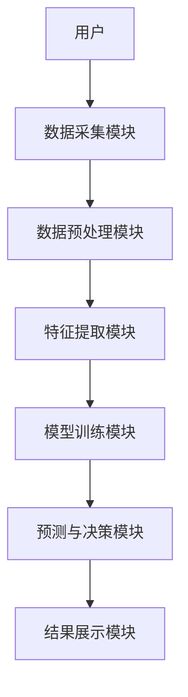
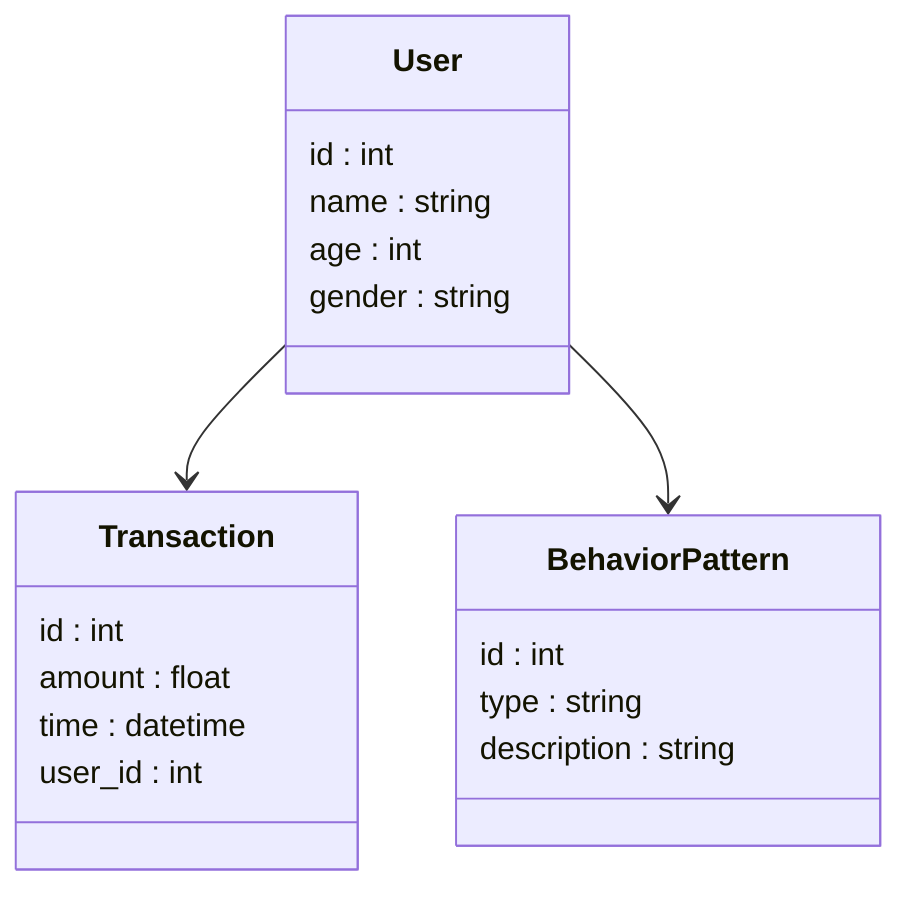
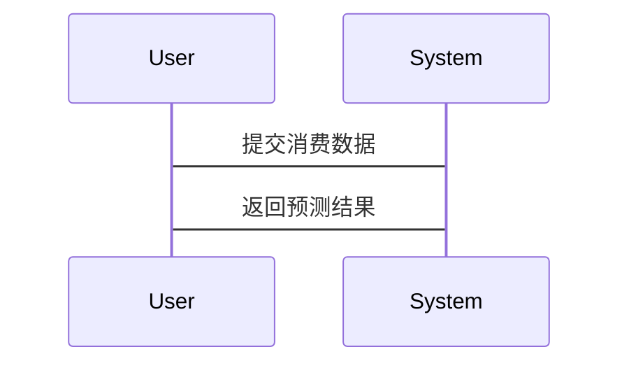

                 


# 智能个人消费行为分析系统

## 关键词：
- 智能消费分析
- 数据挖掘
- 机器学习
- 系统架构
- 人工智能

## 摘要：
智能个人消费行为分析系统通过整合多源数据，利用先进的数据挖掘和机器学习技术，实现对个人消费行为的精准分析和预测。本文系统地探讨了该系统的背景、核心概念、算法原理、系统架构，并通过实际案例展示了系统的实现过程和应用场景。文章还详细分析了系统的优化方法和未来发展方向。

---

# 第一部分：背景与问题描述

## 第1章：背景与问题描述

### 1.1 个人消费行为分析的背景

#### 1.1.1 数字化消费时代的到来
随着互联网和移动支付的普及，消费行为变得越来越数字化。消费者的行为数据（如购买频率、偏好、消费金额等）可以通过多种渠道被记录和分析。这种数据的积累为智能分析系统的开发提供了丰富的数据源。

#### 1.1.2 消费行为分析的重要性
消费行为分析是帮助企业优化营销策略、提升客户满意度和忠诚度的重要手段。通过分析用户的消费行为，企业可以更好地了解用户需求，制定个性化的服务策略。

#### 1.1.3 智能分析系统的必要性
传统的消费分析方法依赖于人工统计和经验判断，效率低且精度有限。随着数据量的爆炸式增长，传统的分析方法已经难以满足需求。智能分析系统通过自动化数据处理和机器学习算法，能够快速、准确地分析海量数据，为企业提供实时的决策支持。

### 1.2 问题背景与目标

#### 1.2.1 传统消费分析的局限性
- 数据量大，人工分析效率低。
- 数据分散，难以整合。
- 分析结果缺乏实时性和准确性。

#### 1.2.2 智能分析的目标与意义
智能个人消费行为分析系统的开发目标是通过自动化技术，实现对个人消费行为的实时监测、分析和预测。系统的核心目标包括：
- 提供精准的用户画像。
- 预测用户的消费倾向。
- 提供个性化的服务推荐。

#### 1.2.3 系统的边界与外延
系统的边界是指其处理的范围和限制。例如，系统仅分析单个用户的消费行为，而不涉及社交网络或其他外部数据。系统的外延则是指其潜在的扩展方向，例如结合地理位置数据（GIS）进行更精准的分析。

### 1.3 核心概念与系统组成

#### 1.3.1 系统的核心概念
- **数据采集**：从多种数据源获取消费数据，如交易记录、用户行为日志等。
- **特征提取**：从原始数据中提取具有代表性的特征，如消费频率、金额分布等。
- **模型训练**：基于特征数据，训练机器学习模型以预测消费行为。
- **结果展示**：将分析结果以可视化的方式呈现给用户。

#### 1.3.2 系统组成模块
- **数据采集模块**：负责数据的获取和初步清洗。
- **数据预处理模块**：对数据进行标准化和特征工程。
- **模型训练模块**：基于机器学习算法训练消费行为预测模型。
- **结果展示模块**：将分析结果以图表等形式展示给用户。

#### 1.3.3 系统功能与流程
系统的整体流程包括数据采集、预处理、特征提取、模型训练和结果展示五个阶段。每个阶段都有明确的目标和输入输出。

---

# 第二部分：核心概念与系统架构

## 第2章：核心概念与系统架构

### 2.1 智能个人消费行为分析的核心概念

#### 2.1.1 数据采集与处理
- **数据采集**：从数据库、日志文件、API等来源获取消费数据。
- **数据清洗**：去除无效数据，填补缺失值，处理异常值。
- **数据转换**：将数据转换为适合建模的格式。

#### 2.1.2 特征提取与建模
- **特征提取**：从原始数据中提取有意义的特征，如时间序列特征、金额分布特征等。
- **特征选择**：通过统计方法或机器学习方法选择最具代表性的特征。
- **模型训练**：使用机器学习算法（如决策树、随机森林、神经网络等）训练消费行为预测模型。

#### 2.1.3 预测与决策
- **预测模型**：基于训练好的模型，预测用户的未来消费行为。
- **决策支持**：根据预测结果，为企业提供优化的营销策略建议。

### 2.2 系统核心概念的ER实体关系图
以下是系统核心概念的ER图，展示了用户、交易和行为模式之间的关系：

```mermaid
erDiagram
    user {
        User
        id : int
        name : string
        age : int
        gender : string
    }
    transaction {
        Transaction
        id : int
        amount : float
        time : datetime
        user_id : int
    }
    behavior_pattern {
        BehaviorPattern
        id : int
        type : string
        description : string
    }
    user -->
    transaction
    user -->
    behavior_pattern
```

### 2.3 系统架构与模块关系
以下是系统的架构图，展示了各模块之间的关系：



---

# 第三部分：算法原理讲解

## 第3章：算法原理与实现

### 3.1 算法原理

#### 3.1.1 时间序列分析
时间序列分析是一种常用的预测方法，适用于分析用户的消费行为随时间的变化趋势。常见的算法包括ARIMA和LSTM。

#### 3.1.2 机器学习算法
机器学习算法（如随机森林、支持向量机、神经网络）可以用于分类和回归任务。例如，可以使用随机森林算法对用户进行消费行为分类。

#### 3.1.3 算法选择与比较
选择合适的算法需要考虑数据的特性和任务的要求。例如，时间序列分析适用于预测未来消费金额，而分类算法适用于预测用户是否会进行某种消费行为。

### 3.2 算法实现

#### 3.2.1 时间序列分析的实现
以下是基于ARIMA模型的时间序列分析代码示例：

```python
from statsmodels.tsa.arima.model import ARIMA
import pandas as pd

# 加载数据
data = pd.read_csv('consumption.csv')
data.index = pd.to_datetime(data['time'])

# 拟合ARIMA模型
model = ARIMA(data['amount'], order=(5, 1, 0))
model_fit = model.fit()

# 预测未来值
forecast = model_fit.forecast(steps=5)
print(forecast)
```

#### 3.2.2 机器学习算法的实现
以下是基于随机森林的消费行为分类代码示例：

```python
from sklearn.ensemble import RandomForestClassifier
from sklearn.model_selection import train_test_split
import pandas as pd

# 加载数据
data = pd.read_csv('consumption.csv')
X = data.drop('label', axis=1)
y = data['label']

# 划分训练集和测试集
X_train, X_test, y_train, y_test = train_test_split(X, y, test_size=0.2, random_state=42)

# 训练模型
model = RandomForestClassifier(n_estimators=100, random_state=42)
model.fit(X_train, y_train)

# 预测结果
y_pred = model.predict(X_test)
print(y_pred)
```

### 3.3 算法优化与调优
- **超参数调优**：使用网格搜索或随机搜索优化模型的超参数。
- **特征工程**：通过PCA等方法降维，提高模型的训练效率和准确性。
- **模型融合**：将多个模型的结果进行融合，提高预测的准确率。

---

# 第四部分：系统分析与架构设计方案

## 第4章：系统分析与架构设计

### 4.1 问题场景介绍
消费行为分析系统需要处理大量的异构数据，包括结构化数据和非结构化数据。系统需要具备高可用性和可扩展性，以应对数据量的增长和用户需求的变化。

### 4.2 项目介绍
智能个人消费行为分析系统旨在通过自动化技术，帮助企业更好地理解和预测用户的消费行为，从而优化营销策略和服务流程。

### 4.3 系统功能设计

#### 4.3.1 领域模型
以下是系统的领域模型图：



#### 4.3.2 系统架构设计
以下是系统的架构图：


### 4.4 系统接口设计
系统需要提供以下接口：
- 数据采集接口：用于从数据库或其他数据源获取消费数据。
- 模型训练接口：用于训练和更新消费行为预测模型。
- 结果展示接口：用于将分析结果以可视化的方式呈现给用户。

### 4.5 系统交互设计

#### 4.5.1 系统交互流程
以下是系统的交互流程图：



---

# 第五部分：项目实战

## 第5章：项目实战与实现

### 5.1 环境安装

#### 5.1.1 安装Python环境
需要安装Python 3.8或更高版本，并安装以下库：
- `pandas`
- `numpy`
- `scikit-learn`
- `statsmodels`

### 5.2 核心代码实现

#### 5.2.1 数据采集与处理
以下是数据采集模块的代码示例：

```python
import pandas as pd
import requests

# 数据采集
def fetch_data(url):
    response = requests.get(url)
    data = response.json()
    df = pd.DataFrame(data)
    return df

# 数据清洗
def clean_data(df):
    df.dropna(inplace=True)
    df['time'] = pd.to_datetime(df['time'])
    return df

# 数据存储
def save_data(df, filename):
    df.to_csv(filename, index=False)
```

#### 5.2.2 特征提取与建模
以下是特征提取和建模的代码示例：

```python
from sklearn.ensemble import RandomForestClassifier
from sklearn.model_selection import train_test_split
import pandas as pd

# 加载数据
data = pd.read_csv('consumption.csv')
X = data.drop('label', axis=1)
y = data['label']

# 划分训练集和测试集
X_train, X_test, y_train, y_test = train_test_split(X, y, test_size=0.2, random_state=42)

# 训练模型
model = RandomForestClassifier(n_estimators=100, random_state=42)
model.fit(X_train, y_train)

# 预测结果
y_pred = model.predict(X_test)
print(y_pred)
```

### 5.3 案例分析与结果展示

#### 5.3.1 案例分析
通过分析实际案例，展示系统的预测能力和实际效果。

#### 5.3.2 结果展示
通过可视化工具（如Matplotlib、Seaborn）展示分析结果，如消费趋势图、用户画像等。

---

# 第六部分：总结与展望

## 第6章：总结与展望

### 6.1 最佳实践
- 数据预处理是关键，需要仔细清洗和特征工程。
- 选择合适的算法和模型，进行充分的调优。
- 结果展示要直观，便于用户理解和应用。

### 6.2 章节小结
本文系统地介绍了智能个人消费行为分析系统的背景、核心概念、算法原理、系统架构，并通过实际案例展示了系统的实现过程和应用场景。

### 6.3 注意事项
- 数据隐私和安全问题需要高度重视。
- 系统的可扩展性和可维护性需要在设计阶段充分考虑。

### 6.4 拓展阅读
建议读者进一步学习以下内容：
- 时间序列分析的高级方法（如Prophet、VAR模型）。
- 机器学习的高级算法（如深度学习、集成学习）。
- 系统架构设计的优化方法（如微服务架构、分布式系统）。

---

# 作者

**作者：AI天才研究院/AI Genius Institute & 禅与计算机程序设计艺术 /Zen And The Art of Computer Programming**

---

以上是《智能个人消费行为分析系统》的技术博客文章，涵盖了系统的各个方面，从背景到实现，从算法到架构，从案例到总结，全面而详细地展示了系统的开发和应用过程。

