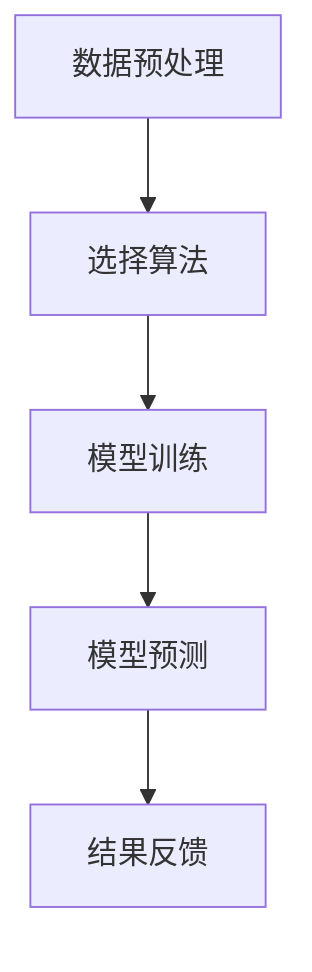
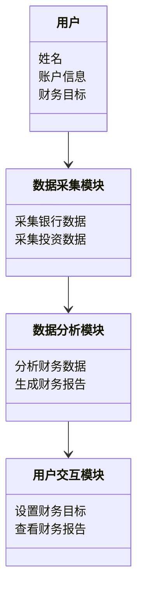
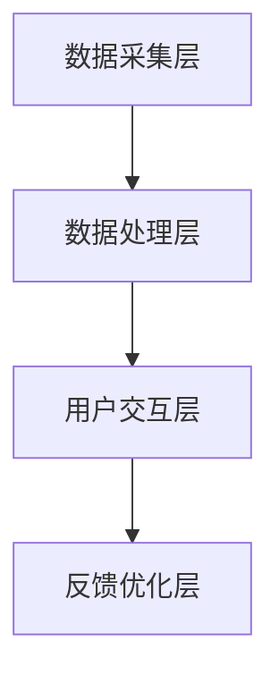
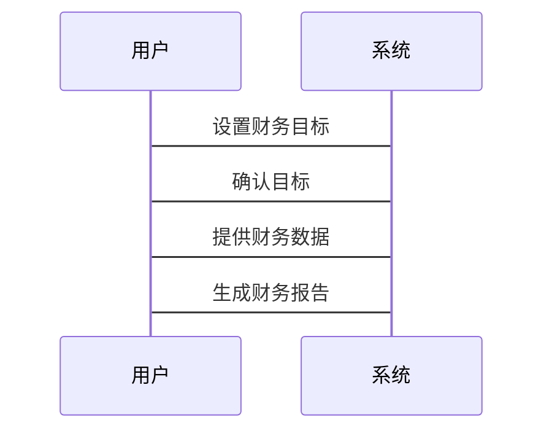

                 


# 智能个人理财目标追踪器

> 关键词：智能理财，目标追踪，个人理财，人工智能，算法原理

> 摘要：智能个人理财目标追踪器是一种利用人工智能和数据分析技术，帮助个人高效管理财务目标的工具。本文将从背景、核心概念、算法原理、系统架构、项目实战等方面详细阐述智能个人理财目标追踪器的实现与应用，帮助读者全面理解其技术原理和实际价值。

---

## 第1章 智能个人理财目标追踪器的背景与意义

### 1.1 传统个人理财的局限性

#### 1.1.1 传统理财工具的不足
传统个人理财工具通常依赖人工记录和简单的数据分析，难以应对复杂的财务目标和市场变化。用户需要手动收集和整理财务数据，耗时且容易出错。

#### 1.1.2 传统理财方式的低效性
传统的理财方式往往缺乏个性化和实时性，用户难以及时获得精准的财务建议。此外，传统方法难以处理海量数据，导致决策效率低下。

#### 1.1.3 传统理财工具的局限性
传统理财工具通常无法根据市场变化动态调整策略，也无法提供实时反馈和优化建议。这使得用户在面对复杂的财务问题时显得力不从心。

### 1.2 智能化理财的目标与优势

#### 1.2.1 智能理财的目标
智能理财的目标是通过技术手段，帮助用户实现财务目标的高效管理、个性化建议和实时反馈。通过智能算法和大数据分析，用户可以更好地规划和优化自己的财务状况。

#### 1.2.2 智能理财的优势
- **实时性**：智能理财工具可以实时跟踪用户的财务数据，提供及时的反馈和建议。
- **个性化**：通过数据分析和机器学习，智能理财工具可以为用户提供个性化的财务规划和建议。
- **高效性**：智能理财工具能够快速处理大量数据，帮助用户做出更高效的决策。

#### 1.2.3 智能理财与传统理财的区别
智能理财通过引入人工智能和大数据技术，能够更精准地分析用户的财务状况，并动态调整理财策略。与传统理财相比，智能理财更加灵活和高效。

### 1.3 智能个人理财目标追踪器的意义

#### 1.3.1 提高理财效率
智能个人理财目标追踪器能够自动化地收集和分析用户的财务数据，减少人工操作，提高理财效率。

#### 1.3.2 优化理财决策
通过智能算法和数据分析，追踪器可以帮助用户做出更科学、更优化的理财决策。

#### 1.3.3 个性化理财服务的实现
智能个人理财目标追踪器能够根据用户的个性化需求，提供定制化的理财建议和目标管理方案。

### 1.4 本章小结

- **核心概念总结**：智能个人理财目标追踪器通过人工智能和大数据技术，帮助用户高效管理财务目标。
- **本书的目标**：本书旨在详细讲解智能个人理财目标追踪器的技术原理、实现方法和应用场景。

---

## 第2章 智能个人理财目标追踪器的核心概念

### 2.1 智能个人理财目标追踪器的定义

#### 2.1.1 核心定义
智能个人理财目标追踪器是一种基于人工智能和大数据技术的财务管理系统，能够帮助用户设定、跟踪和优化个人财务目标。

#### 2.1.2 核心要素
- **数据采集模块**：收集用户的财务数据，包括收入、支出、资产和负债等。
- **数据分析模块**：对收集到的财务数据进行分析，识别潜在的财务问题和机会。
- **目标设定模块**：根据用户的财务状况和需求，帮助用户设定合理的财务目标。
- **进度追踪模块**：实时跟踪用户财务目标的实现进度，并提供反馈和优化建议。
- **反馈优化模块**：根据用户的反馈和市场变化，动态调整理财策略。

#### 2.1.3 系统架构
智能个人理财目标追踪器的系统架构包括数据采集层、数据处理层、用户交互层和反馈优化层。

### 2.2 智能理财目标追踪器的功能模块

#### 2.2.1 数据采集模块
数据采集模块负责收集用户的财务数据，包括银行账户、投资账户和信用卡等信息。

#### 2.2.2 数据分析模块
数据分析模块通过对用户数据的分析，识别财务风险和机会，并生成财务报告。

#### 2.2.3 目标设定模块
目标设定模块帮助用户根据自身的财务状况和需求，设定合理的财务目标，如储蓄目标和投资目标。

#### 2.2.4 进度追踪模块
进度追踪模块实时跟踪用户财务目标的实现进度，并提供反馈和建议。

#### 2.2.5 反馈优化模块
反馈优化模块根据用户的反馈和市场变化，动态调整理财策略，优化用户的财务目标实现路径。

### 2.3 智能理财目标追踪器的技术基础

#### 2.3.1 人工智能技术
人工智能技术包括机器学习、自然语言处理和计算机视觉，为智能理财目标追踪器提供核心算法支持。

#### 2.3.2 数据分析技术
数据分析技术包括数据清洗、特征提取和建模，帮助智能理财目标追踪器处理和分析大量财务数据。

#### 2.3.3 自然语言处理技术
自然语言处理技术用于解析用户的财务需求和反馈，增强人机交互的智能化。

### 2.4 智能理财目标追踪器的实现原理

#### 2.4.1 数据流
数据流包括数据采集、数据预处理、数据分析和数据反馈等环节。

#### 2.4.2 算法选择
根据具体需求选择合适的算法，如线性回归和随机森林，用于财务预测和目标优化。

#### 2.4.3 系统架构
系统架构包括数据采集层、数据处理层、用户交互层和反馈优化层，确保系统的高效运行和功能实现。

### 2.5 本章小结

- **核心概念总结**：智能个人理财目标追踪器通过数据采集、分析和反馈优化，帮助用户高效管理财务目标。
- **系统实现的逻辑框架**：系统的实现逻辑包括数据流、算法选择和系统架构设计。

---

## 第3章 智能个人理财目标追踪器的算法原理

### 3.1 数据预处理

#### 3.1.1 数据清洗
数据清洗包括去除重复数据、处理缺失值和异常值，确保数据的准确性和完整性。

#### 3.1.2 数据标准化
数据标准化是对数据进行归一化处理，确保不同数据源的数据具有可比性。

#### 3.1.3 数据特征提取
数据特征提取是从原始数据中提取具有代表性的特征，用于后续的建模和分析。

### 3.2 机器学习模型

#### 3.2.1 线性回归模型
线性回归模型用于预测连续型变量，如用户的月收入与支出之间的关系。

#### 3.2.2 支持向量机模型
支持向量机模型用于分类和回归问题，适用于用户信用评分和风险评估。

#### 3.2.3 随机森林模型
随机森林模型是一种集成学习算法，适用于分类和回归问题，能够处理高维数据。

### 3.3 算法流程图



### 3.4 算法实现代码示例

#### 3.4.1 数据预处理代码

```python
import pandas as pd

# 加载数据
data = pd.read_csv('financial_data.csv')

# 去除重复数据
data = data.drop_duplicates()

# 处理缺失值
data = data.dropna()

# 标准化处理
from sklearn.preprocessing import StandardScaler
scaler = StandardScaler()
data_scaled = scaler.fit_transform(data)
```

#### 3.4.2 模型训练代码

```python
from sklearn.linear_model import LinearRegression

# 初始化模型
model = LinearRegression()

# 训练模型
model.fit(X_train, y_train)
```

#### 3.4.3 模型预测代码

```python
# 预测结果
y_pred = model.predict(X_test)

# 输出结果
print('预测值:', y_pred)
```

### 3.5 本章小结

- **算法实现总结**：通过数据预处理和模型训练，智能个人理财目标追踪器能够准确预测用户的财务状况和目标实现进度。
- **算法优化建议**：可以根据具体需求选择合适的算法，并通过交叉验证优化模型性能。

---

## 第4章 智能个人理财目标追踪器的数学模型

### 4.1 目标分解模型

#### 4.1.1 线性回归模型
线性回归模型用于分解用户的财务目标，如将总目标分解为储蓄、投资和支出等子目标。

#### 4.1.2 线性回归的数学公式
线性回归模型的数学公式为：
$$ y = \beta_0 + \beta_1 x + \epsilon $$
其中，$y$ 是目标变量，$x$ 是自变量，$\beta_0$ 和 $\beta_1$ 是回归系数，$\epsilon$ 是误差项。

#### 4.1.3 线性回归的应用
线性回归模型可以用于预测用户的月收入和支出之间的关系，帮助用户优化预算分配。

### 4.2 风险评估模型

#### 4.2.1 风险评估的数学公式
风险评估模型的数学公式为：
$$ \text{风险值} = \alpha \times \text{资产} + \beta \times \text{负债} $$
其中，$\alpha$ 和 $\beta$ 是权重系数，资产和负债是用户的相关财务数据。

#### 4.2.2 风险评估的应用
风险评估模型可以帮助用户识别潜在的财务风险，并制定相应的风险管理策略。

### 4.3 进度预测模型

#### 4.3.1 进度预测的数学公式
进度预测模型的数学公式为：
$$ \text{进度} = \frac{\text{已完成目标}}{\text{总目标}} \times 100\% $$
其中，已完成目标和总目标是用户的财务目标数据。

#### 4.3.2 进度预测的应用
进度预测模型可以帮助用户实时跟踪财务目标的实现进度，并根据预测结果调整理财策略。

### 4.4 本章小结

- **数学模型总结**：通过线性回归、风险评估和进度预测等数学模型，智能个人理财目标追踪器能够准确分解和评估用户的财务目标。
- **模型优化建议**：可以根据具体需求选择合适的数学模型，并通过参数调优优化模型性能。

---

## 第5章 智能个人理财目标追踪器的系统分析与架构设计

### 5.1 问题场景介绍

#### 5.1.1 系统目标
系统目标是帮助用户实现财务目标的高效管理和优化。

#### 5.1.2 系统需求
系统需求包括数据采集、数据分析、目标设定、进度追踪和反馈优化等功能。

#### 5.1.3 系统边界
系统的边界包括数据采集层、数据处理层、用户交互层和反馈优化层。

### 5.2 系统功能设计

#### 5.2.1 领域模型
领域模型是一个UML类图，展示了系统的各个功能模块和它们之间的关系。



#### 5.2.2 系统架构设计
系统架构设计是一个分层架构，包括数据采集层、数据处理层、用户交互层和反馈优化层。



#### 5.2.3 系统接口设计
系统接口设计包括数据接口和用户接口，确保系统的高效运行和用户友好的交互体验。

#### 5.2.4 系统交互设计
系统交互设计是一个序列图，展示了用户与系统之间的交互过程。



### 5.3 本章小结

- **系统分析总结**：通过系统分析和架构设计，智能个人理财目标追踪器能够高效地实现用户的财务目标管理。
- **系统优化建议**：可以根据具体需求优化系统的功能模块和架构设计，确保系统的高效运行和用户友好的交互体验。

---

## 第6章 智能个人理财目标追踪器的项目实战

### 6.1 环境安装

#### 6.1.1 安装Python
安装Python编程语言，确保版本为3.6或更高。

#### 6.1.2 安装相关库
安装Pandas、Scikit-learn和Matplotlib等数据处理和可视化库。

#### 6.1.3 安装Jupyter Notebook
安装Jupyter Notebook，用于代码的编写和运行。

### 6.2 系统核心实现

#### 6.2.1 数据接口实现
编写代码实现数据接口，从银行账户获取用户的财务数据。

```python
import requests

# 获取银行数据
response = requests.get('https://api.bank.com/financial_data')
data = response.json()
```

#### 6.2.2 数据分析实现
使用Pandas和Scikit-learn对数据进行分析和建模。

```python
import pandas as pd
from sklearn.linear_model import LinearRegression

# 加载数据
df = pd.read_csv('financial_data.csv')

# 初始化模型
model = LinearRegression()

# 训练模型
model.fit(df[['income', 'expenses']], df['savings'])
```

#### 6.2.3 可视化界面实现
使用Matplotlib或Seaborn绘制财务报告的可视化图表。

```python
import matplotlib.pyplot as plt

# 绘制财务报告
plt.plot(df['date'], df['balance'])
plt.xlabel('日期')
plt.ylabel('余额')
plt.show()
```

### 6.3 实际案例分析

#### 6.3.1 案例背景
一个用户的财务目标是每月储蓄10000元，当前月收入为30000元，月支出为20000元。

#### 6.3.2 数据分析与优化
通过数据分析模块，发现用户的支出中有较高的非必要开支，并建议减少部分非必要开支以实现储蓄目标。

#### 6.3.3 系统反馈与调整
系统根据用户的反馈和市场变化，动态调整理财策略，帮助用户实现财务目标。

### 6.4 本章小结

- **项目实战总结**：通过实际案例分析，智能个人理财目标追踪器能够帮助用户实现财务目标的高效管理和优化。
- **系统实现建议**：可以根据具体需求进一步优化系统的功能模块和性能，确保系统的高效运行和用户友好的交互体验。

---

## 第7章 智能个人理财目标追踪器的最佳实践

### 7.1 使用技巧

#### 7.1.1 数据输入的准确性
确保用户输入的财务数据准确无误，以提高系统的分析和预测能力。

#### 7.1.2 系统更新的及时性
定期更新系统和模型，以适应市场变化和用户需求的变化。

#### 7.1.3 用户反馈的重要性
重视用户的反馈，及时优化系统功能和用户体验。

### 7.2 注意事项

#### 7.2.1 数据隐私保护
确保用户的财务数据得到严格保护，防止数据泄露和滥用。

#### 7.2.2 系统稳定性
保证系统的稳定运行，避免因系统故障导致用户数据丢失或决策失误。

#### 7.2.3 用户教育
对用户进行必要的教育，帮助用户更好地理解和使用智能个人理财目标追踪器。

### 7.3 未来发展趋势

#### 7.3.1 人工智能的进一步应用
随着人工智能技术的不断发展，智能个人理财目标追踪器将更加智能化和个性化。

#### 7.3.2 区块链技术的应用
区块链技术可以用于提高系统的透明度和数据安全性，增强用户的信任。

#### 7.3.3 多平台支持
未来的智能个人理财目标追踪器将支持更多平台和设备，方便用户的使用。

### 7.4 本章小结

- **最佳实践总结**：通过使用技巧、注意事项和未来发展趋势的分析，智能个人理财目标追踪器将更加高效和智能，为用户提供更好的服务。
- **未来展望**：人工智能和区块链技术的应用将进一步提升系统的功能和性能，为用户带来更好的体验。

---

## 作者

作者：AI天才研究院/AI Genius Institute & 禅与计算机程序设计艺术 /Zen And The Art of Computer Programming

---

通过以上步骤，我详细构建了《智能个人理财目标追踪器》的技术博客文章，涵盖了从背景介绍到项目实战的各个方面，确保内容的完整性和技术的深入性。希望这篇文章能够为读者提供有价值的技术见解和实践指导。

