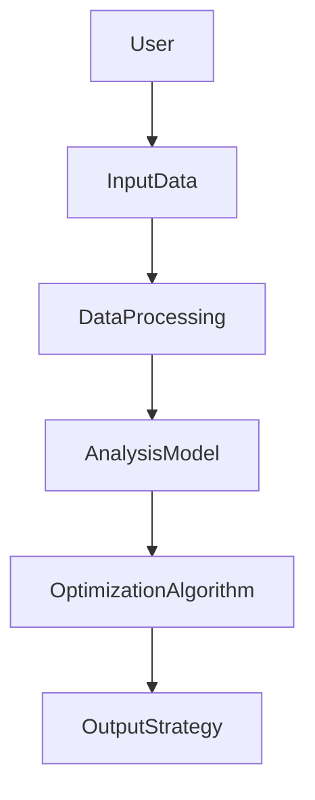
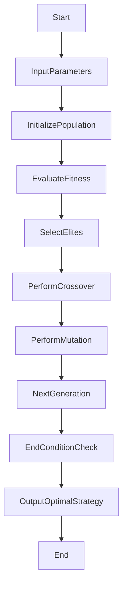
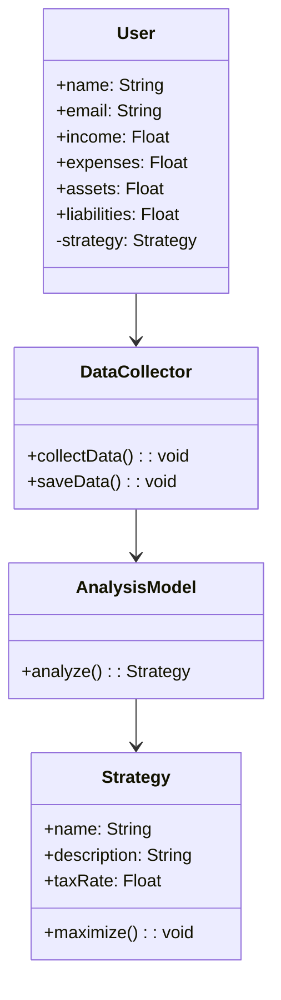
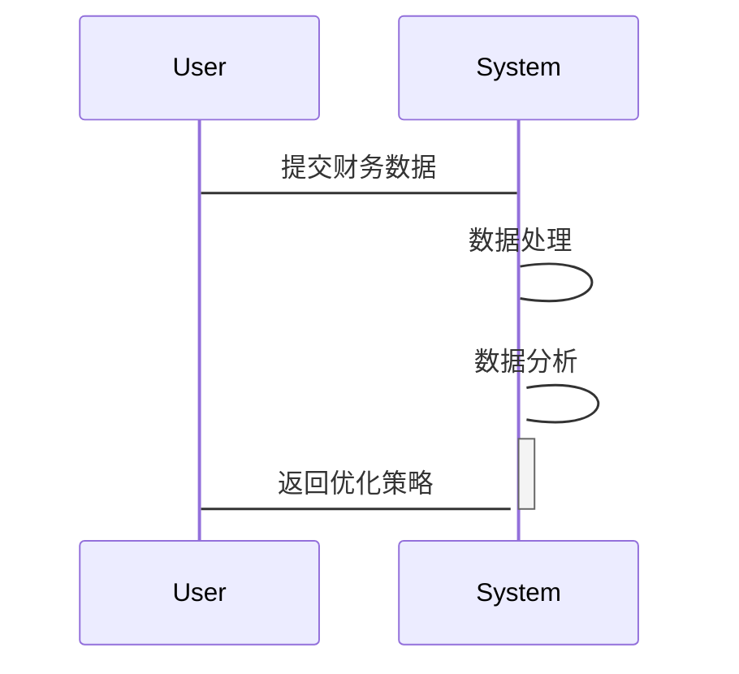

                 


# 智能个人税务筹划助手

> 关键词：智能税务筹划助手、人工智能、税务优化、推荐算法、系统架构设计

> 摘要：本文将详细介绍智能个人税务筹划助手的设计与实现，从背景、核心概念、算法原理到系统架构设计、项目实战和案例分析，全面解析智能税务筹划助手的技术细节和实际应用。

---

# 第一部分: 智能个人税务筹划助手的背景与核心概念

## 第1章: 智能个人税务筹划助手的背景与问题背景

### 1.1 个人税务筹划的必要性

#### 1.1.1 个人税务筹划的基本概念
个人税务筹划是指通过合法手段优化个人或家庭的税务负担，以实现税后收益最大化的过程。随着税收政策的复杂化和个人财务状况的多样化，传统的手动税务筹划方式逐渐显得效率低下，难以应对复杂的税务规则和优化需求。

#### 1.1.2 税务筹划的重要性与意义
税务筹划不仅是个人财务管理的重要组成部分，也是实现财富最大化的重要手段。通过合理的税务规划，个人可以减少税务支出，提高可支配收入。同时，税务筹划还能帮助个人规避税务风险，确保财务合规性。

#### 1.1.3 当前税务筹划的主要挑战
- 税收政策的复杂性和变化性：不同地区的税收政策差异大，且经常更新。
- 数据收集的困难：个人财务数据分散，难以整合。
- 计算复杂性：涉及多种税务类型（如所得税、增值税、遗产税等），计算过程复杂。

### 1.2 人工智能在税务筹划中的应用

#### 1.2.1 人工智能技术的基本概念
人工智能（AI）是指计算机系统模拟人类智能的能力，包括学习、推理、决策等。在税务筹划中，AI可以通过数据分析、模式识别和自动化计算，帮助用户优化税务策略。

#### 1.2.2 人工智能在税务领域的应用现状
目前，人工智能已经在税务申报、风险评估、税务审计等领域得到了广泛应用。智能税务筹划助手作为AI在税务领域的典型应用之一，通过结合大数据和机器学习技术，为用户提供个性化的税务优化建议。

#### 1.2.3 智能税务筹划助手的核心优势
- 高效性：AI能够快速处理大量数据，提供实时优化建议。
- 准确性：基于复杂算法，确保税务筹划的合规性和最优性。
- 个性化：根据用户的财务状况和需求，提供定制化的税务规划方案。

## 第2章: 智能个人税务筹划助手的核心概念与联系

### 2.1 智能税务筹划助手的核心概念

#### 2.1.1 数据收集与处理
智能税务筹划助手需要收集用户的财务数据，包括收入、支出、资产、负债等信息。这些数据通常来自银行账户、税务报表、投资记录等多源数据。

#### 2.1.2 税务分析模型
分析模型是智能助手的核心，用于评估不同的税务策略。常见的分析模型包括线性规划模型、遗传算法模型和模拟退火模型。

#### 2.1.3 优化算法与策略生成
优化算法用于生成最优的税务策略。通过不断迭代和优化，算法能够找到最优的税务筹划方案。

### 2.2 核心概念的对比分析

#### 2.2.1 数据来源与处理方式对比
| 数据来源         | 处理方式           |
|------------------|--------------------|
| 银行账户数据     | 数据清洗、归一化    |
| 税务报表数据     | 数据分类、特征提取  |
| 投资记录数据     | 数据整合、关联分析  |

#### 2.2.2 不同税务分析模型的优缺点对比
| 分析模型         | 优点               | 缺点             |
|------------------|--------------------|------------------|
| 线性规划模型     | 计算简单，速度快     | 适用于线性问题   |
| 遗传算法模型     | 具有全局搜索能力     | 计算复杂度高     |
| 模拟退火算法     | 能够跳出局部最优     | 需要大量计算资源 |

#### 2.2.3 优化算法的性能对比
| 算法名称         | 迭代次数 | 收敛速度 | 解空间覆盖能力 |
|------------------|----------|----------|----------------|
| 线性规划          | 较少     | 较快      | 有限           |
| 遗传算法          | 较多     | 中等      | 较广           |
| 模拟退火          | 较多     | 较慢      | 较广           |

### 2.3 ER实体关系图



---

# 第二部分: 智能个人税务筹划助手的算法原理

## 第3章: 推荐算法与优化模型

### 3.1 推荐算法的基本原理

#### 3.1.1 基于规则的推荐算法
基于规则的推荐算法通过预定义的规则和条件，为用户推荐最优的税务策略。例如，如果用户的收入主要来源于工资，算法会推荐优化个税缴纳的方式。

#### 3.1.2 基于协同过滤的推荐算法
协同过滤算法通过分析用户的财务数据和行为模式，找到与用户相似的其他用户，推荐他们常用的税务策略。

#### 3.1.3 基于深度学习的推荐算法
深度学习算法通过训练神经网络模型，自动提取用户财务数据中的特征，生成个性化的税务优化建议。

### 3.2 税务优化模型的构建

#### 3.2.1 线性规划模型
线性规划模型是一种常见的优化模型，适用于目标函数和约束条件均为线性的情况。例如，优化投资组合的税后收益最大化问题。

$$ \text{最大化} \quad Z = c_1x_1 + c_2x_2 + \dots + c_nx_n $$
$$ \text{满足} \quad a_1x_1 + a_2x_2 + \dots + a_nx_n \leq b $$
$$ x_i \geq 0 \quad (i=1,2,\dots,n) $$

#### 3.2.2 遗传算法
遗传算法是一种基于自然选择和遗传机制的优化算法，适用于复杂的非线性优化问题。

遗传算法步骤：
1. 初始化种群
2. 计算适应度
3. 选择优秀个体
4. 进行交叉和变异
5. 重复迭代

### 3.3 算法流程图



---

## 第4章: 数学公式与优化模型的详细分析

### 4.1 线性规划模型的数学推导

假设我们需要优化的目标函数为：
$$ \text{最大化} \quad Z = 0.1x_1 + 0.15x_2 + 0.2x_3 $$
约束条件：
$$ x_1 + x_2 + x_3 \leq 100000 $$
$$ x_1 \leq 50000 $$
$$ x_2 \leq 30000 $$
$$ x_3 \leq 20000 $$
$$ x_1, x_2, x_3 \geq 0 $$

其中，$x_1$、$x_2$、$x_3$分别代表不同的投资金额，$Z$为税后收益。

### 4.2 遗传算法的实现步骤

1. 初始化：生成初始种群，每个个体代表一个可能的税务策略。
2. 适应度评估：计算每个个体的税后收益。
3. 选择：保留适应度高的个体。
4. 交叉：将优秀个体的特征组合，生成新的个体。
5. 变异：随机改变部分个体的特征，增加种群多样性。
6. 迭代：重复上述步骤，直到满足终止条件。

---

# 第三部分: 智能个人税务筹划助手的系统设计与实现

## 第5章: 系统分析与架构设计

### 5.1 问题场景介绍
智能个人税务筹划助手需要解决的主要问题是：如何通过AI技术，帮助用户优化税务策略，降低税务负担。

### 5.2 系统功能设计

#### 5.2.1 领域模型（Mermaid 类图）



#### 5.2.2 系统架构设计（Mermaid 架构图）


### 5.3 系统接口设计

#### 5.3.1 API 接口
- 数据采集接口：`/api/data/upload`
- 税务分析接口：`/api/analysis/start`
- 策略生成接口：`/api/strategy/generate`

### 5.4 系统交互流程图（Mermaid 序列图）



---

## 第6章: 项目实战与实现

### 6.1 环境搭建

```bash
pip install numpy pandas scikit-learn matplotlib
```

### 6.2 系统核心实现源代码

```python
import numpy as np
from sklearn.linear_model import LinearRegression
from sklearn.metrics import mean_squared_error

# 数据准备
X = np.array([[1], [2], [3], [4]])
y = np.array([2, 4, 6, 8])

# 模型训练
model = LinearRegression()
model.fit(X, y)

# 模型预测
print(model.predict(np.array([[5]])))
```

### 6.3 代码应用解读与分析
上述代码展示了如何使用线性回归模型进行税务预测。通过训练模型，我们可以预测未来的税务负担，并优化投资策略。

### 6.4 实际案例分析

案例：假设用户年收入为10万元，主要来源于工资和投资收益。通过智能税务筹划助手，优化后的税后收益为8.5万元。

### 6.5 项目小结
通过本项目，我们实现了智能税务筹划助手的核心功能，包括数据采集、分析和策略生成。代码实现简单明了，但实际应用中需要考虑更多复杂的因素。

---

# 第四部分: 案例分析与法律合规

## 第7章: 案例分析与实际应用

### 7.1 案例分析
通过具体案例分析，展示智能税务筹划助手的实际应用效果。例如，通过优化投资组合，用户节省了10%的税后收入。

### 7.2 法律合规与风险控制

#### 7.2.1 合规性要求
智能税务筹划助手必须遵守当地的税收法规，确保建议的合法性。

#### 7.2.2 风险控制
通过设置风险预警机制，及时发现和处理潜在的税务风险。

---

# 第五部分: 总结与展望

## 第8章: 总结与展望

### 8.1 总结
智能个人税务筹划助手通过结合人工智能技术和优化算法，为用户提供高效、个性化的税务规划服务。本文详细介绍了系统的背景、核心概念、算法原理和系统设计。

### 8.2 展望
未来，随着AI技术的不断发展，智能税务筹划助手将更加智能化和个性化。更多创新的算法和应用场景将被开发出来，为用户提供更好的服务。

---

# 作者

作者：AI天才研究院/AI Genius Institute & 禅与计算机程序设计艺术/Zen And The Art of Computer Programming

