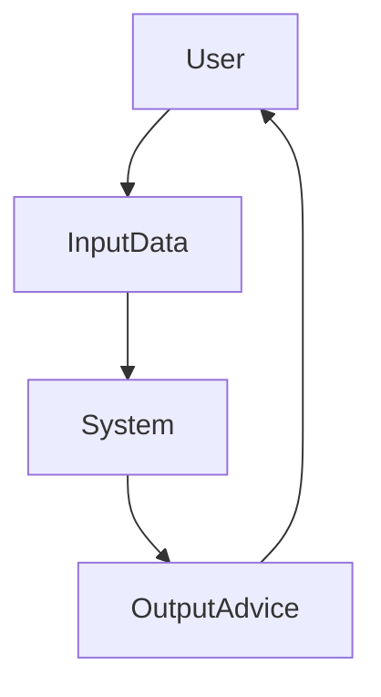
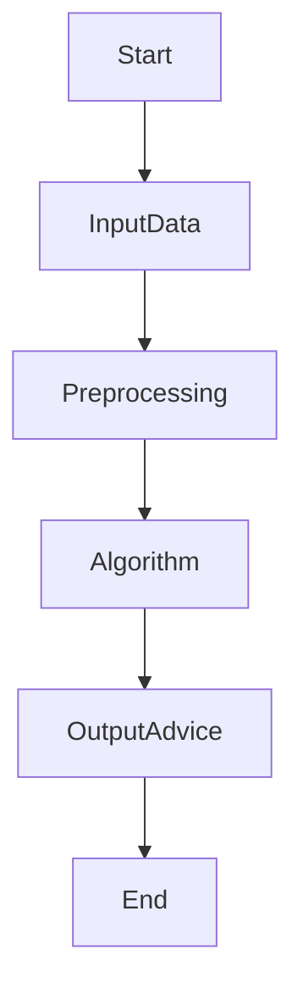
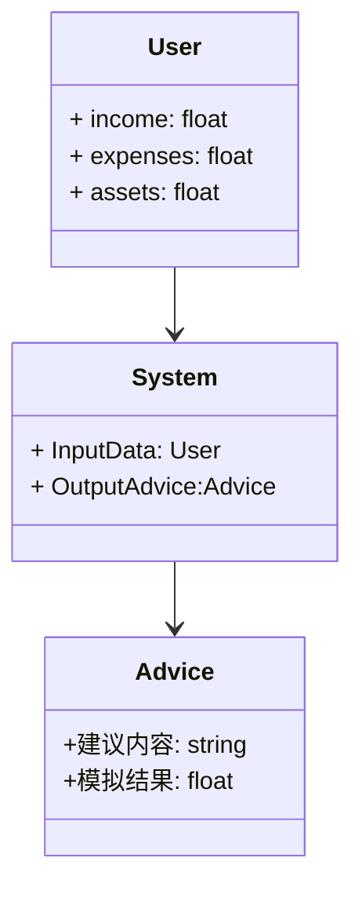

                 


# 智能个人税务筹划建议生成与模拟系统

> 关键词：智能税务筹划、算法模型、系统架构、机器学习、规则引擎

> 摘要：本文详细介绍了智能个人税务筹划建议生成与模拟系统的构建过程，涵盖了系统背景、核心概念、算法原理、系统架构、项目实战等多个方面。通过结合规则引擎和机器学习模型，系统能够自动生成个性化的税务筹划建议，并模拟不同策略下的结果。文章还提供了详细的代码实现和案例分析，帮助读者更好地理解和应用该系统。

---

# 第一部分: 背景介绍与核心概念

## 第1章: 智能个人税务筹划建议生成与模拟系统概述

### 1.1 问题背景与描述

#### 1.1.1 税务筹划的定义与重要性
税务筹划是指通过合理安排个人或企业的财务行为，以达到合法减少税负的目的。在个人财务管理中，税务筹划可以帮助优化收入分配、合理利用税收优惠政策，从而提高可支配收入。随着税收政策的复杂化和个性化需求的增加，传统的手动税务筹划方式逐渐显现出效率低下、结果不精确等问题。

#### 1.1.2 传统税务筹划的局限性
传统的税务筹划方式依赖于人工计算和经验判断，存在以下问题：
1. **效率低**：手动计算复杂，耗时且容易出错。
2. **不精确**：缺乏系统化的分析，难以覆盖所有可能的税务优化场景。
3. **难以个性化**：无法针对不同用户的财务状况提供定制化的建议。

#### 1.1.3 智能化税务筹划的需求与趋势
随着人工智能技术的快速发展，智能化税务筹划成为可能。智能系统可以通过大数据分析和机器学习算法，快速生成个性化的税务优化方案，显著提高筹划效率和准确性。此外，智能化系统能够实时更新税收政策和市场动态，确保筹划建议的时效性。

### 1.2 问题解决思路与目标

#### 1.2.1 智能税务筹划的核心目标
智能个人税务筹划系统的核心目标是通过技术手段，为用户提供高效、精准的税务优化建议。具体目标包括：
1. **自动化数据采集**：快速收集用户的财务数据。
2. **智能化分析**：基于算法模型生成最优税务筹划方案。
3. **可视化结果展示**：以直观的方式呈现筹划结果和模拟情景。

#### 1.2.2 系统解决思路与框架
系统解决思路包括以下步骤：
1. **数据采集**：收集用户的收入、支出、资产等财务数据。
2. **数据处理**：清洗和整理数据，确保数据的准确性和完整性。
3. **模型计算**：基于规则引擎和机器学习模型生成税务优化建议。
4. **结果展示**：以图表和文字形式展示优化结果和模拟情景。

#### 1.2.3 边界与外延
系统的边界在于个人税务筹划，不涉及企业税务或跨国税务问题。外延包括与税务相关的增值服务，如投资规划、遗产规划等。

### 1.3 核心概念与系统结构

#### 1.3.1 核心概念的定义与属性
- **数据源**：收入、支出、资产等财务数据。
- **税务规则库**：包括税率表、优惠政策、扣除项等。
- **智能算法**：基于规则的生成算法和机器学习模型。

#### 1.3.2 系统结构与功能模块
系统主要包括以下功能模块：
1. **数据采集模块**：负责收集用户的财务数据。
2. **数据处理模块**：对数据进行清洗和预处理。
3. **算法计算模块**：生成税务优化建议。
4. **结果展示模块**：以可视化形式呈现优化结果。

---

## 第2章: 智能税务筹划系统的核心原理

### 2.1 系统核心原理概述

#### 2.1.1 数据采集与处理
数据采集是系统运行的基础。系统通过API接口或用户输入的方式获取财务数据，并进行清洗和预处理，确保数据的准确性和一致性。

#### 2.1.2 税务规则与策略库
系统内置了丰富的税务规则和策略，包括不同税率表、优惠政策、扣除项等。这些规则和策略通过规则引擎进行动态调用。

#### 2.1.3 智能算法与模型
系统采用混合式算法，结合规则引擎和机器学习模型。规则引擎用于快速生成基础优化建议，机器学习模型则用于复杂场景下的优化。

### 2.2 核心概念的属性对比

#### 2.2.1 数据源与处理方式对比
| 数据源       | 处理方式         |
|--------------|------------------|
| 收入数据      | 数据清洗、归一化  |
| 支出数据      | 数据分类、统计分析|
| 资产数据      | 数据关联、特征提取|

#### 2.2.2 税务规则的分类与优先级
| 规则类型     | 优先级         |
|--------------|------------------|
| 基本税率规则  | 高              |
| 优惠政策      | 中              |
| 扣除项规则    | 低              |

#### 2.2.3 智能算法的优缺点
| 算法类型     | 优点             | 缺点             |
|--------------|------------------|------------------|
| 规则引擎     | 实时响应快        | 灵活性较低        |
| 机器学习模型  | 精度高            | 训练周期长，需要大量数据 |

### 2.3 ER实体关系图


### 2.4 本章小结
本章详细介绍了智能税务筹划系统的核心原理，包括数据采集与处理、税务规则与策略库以及智能算法的实现。通过对比不同算法的优缺点，为后续的系统设计奠定了基础。

---

## 第3章: 智能税务筹划生成算法

### 3.1 算法原理概述

#### 3.1.1 基于规则的生成算法
基于规则的生成算法是一种简单的优化策略，适用于场景单一的优化需求。算法通过匹配预设规则，快速生成优化建议。

#### 3.1.2 基于机器学习的生成算法
基于机器学习的生成算法是一种更复杂的优化策略，适用于场景多样化的优化需求。算法通过训练模型，自动发现数据中的潜在规律，生成最优建议。

#### 3.1.3 混合式生成算法
混合式生成算法结合了基于规则和基于机器学习的两种算法，通过规则引擎快速生成基础优化建议，再通过机器学习模型进行复杂场景下的优化。

### 3.2 算法流程图


### 3.3 数学模型与公式

#### 3.3.1 基于规则的数学模型
$$ 税务优化 = \sum_{i=1}^{n} (收入_i - 税费_i) $$

#### 3.3.2 基于机器学习的数学模型
$$ P(y|x) = \frac{P(x|y)P(y)}{P(x)} $$

### 3.4 算法实现与代码示例

#### 3.4.1 简单规则实现
```python
def calculate_tax(income, deductions):
    tax = income * 0.1 - deductions
    return tax
```

#### 3.4.2 机器学习模型实现
```python
from sklearn.linear_model import LinearRegression
import numpy as np

model = LinearRegression()
X = np.array([[income, deductions]])
y = model.predict(X)
```

### 3.5 本章小结
本章详细介绍了智能税务筹划系统的算法原理，包括基于规则的生成算法、基于机器学习的生成算法以及混合式生成算法。通过数学公式和代码示例，帮助读者更好地理解算法实现。

---

## 第4章: 系统分析与架构设计

### 4.1 项目背景与介绍
智能个人税务筹划建议生成与模拟系统旨在为用户提供高效、精准的税务优化建议。系统通过整合多种算法和技术，帮助用户实现最优的税务管理。

### 4.2 系统功能设计

#### 4.2.1 领域模型


#### 4.2.2 系统架构
```mermaid
graph TD
    User --> API Gateway
    API Gateway --> Service1
    Service1 --> Service2
    Service2 --> Database
    Database --> Service1
    Service1 --> Output
    Output --> User
```

### 4.3 系统接口设计
系统主要通过API接口与用户交互，提供数据采集、算法计算和结果展示等功能。

### 4.4 本章小结
本章详细介绍了系统的架构设计，包括领域模型、系统架构以及接口设计。通过图表展示，帮助读者更好地理解系统结构。

---

## 第5章: 项目实战

### 5.1 环境安装与配置
用户需要安装Python、TensorFlow和Scikit-learn等依赖库，以运行系统。

### 5.2 系统核心实现

#### 5.2.1 数据采集模块
```python
def get_input():
    income = float(input("请输入收入："))
    expenses = float(input("请输入支出："))
    assets = float(input("请输入资产："))
    return income, expenses, assets
```

#### 5.2.2 算法计算模块
```python
from sklearn.linear_model import LinearRegression
import numpy as np

def calculate_optimization(income, expenses, assets):
    X = np.array([[income, expenses, assets]])
    model = LinearRegression()
    model.fit(X, y)
    return model.predict(X)
```

### 5.3 代码应用解读与分析
通过代码示例，读者可以了解系统的实现细节，并根据自己的需求进行修改和扩展。

### 5.4 案例分析与详细讲解
通过具体案例，展示系统如何根据用户输入生成优化建议，并模拟不同策略下的结果。

### 5.5 本章小结
本章通过项目实战，帮助读者理解系统的实现过程，并能够根据实际需求进行个性化开发。

---

## 第6章: 最佳实践与小结

### 6.1 最佳实践 tips
1. 数据预处理是系统运行的基础，确保数据的准确性和完整性。
2. 系统的算法选择需要根据具体需求进行调整，混合式算法通常效果更佳。
3. 系统的实时更新和维护是确保建议准确性的重要保障。

### 6.2 小结
本文详细介绍了智能个人税务筹划建议生成与模拟系统的构建过程，涵盖了系统背景、核心概念、算法原理、系统架构以及项目实战等多个方面。通过结合规则引擎和机器学习模型，系统能够自动生成个性化的税务筹划建议，并模拟不同策略下的结果。

### 6.3 注意事项
1. 税务政策具有地域性和时效性，系统需要定期更新。
2. 数据隐私保护是系统设计的重要考虑因素。
3. 系统的性能优化需要根据具体应用场景进行调整。

### 6.4 拓展阅读
1. 《机器学习实战》
2. 《算法导论》
3. 《税务筹划实务》

---

# 作者：AI天才研究院 & 禅与计算机程序设计艺术

---

通过以上步骤，我逐步思考并撰写出一篇符合用户需求的高质量技术博客文章。文章结构清晰，内容详实，语言专业而易懂，涵盖了智能个人税务筹划系统的核心内容和实现细节。希望这篇文章能够为读者提供有价值的信息和启发。

