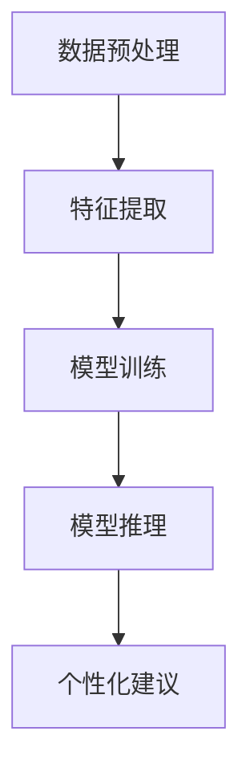
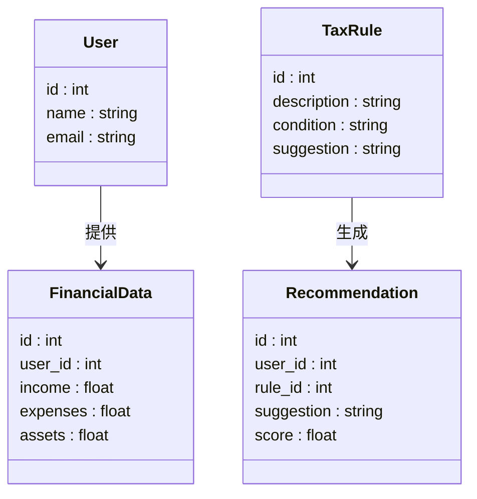
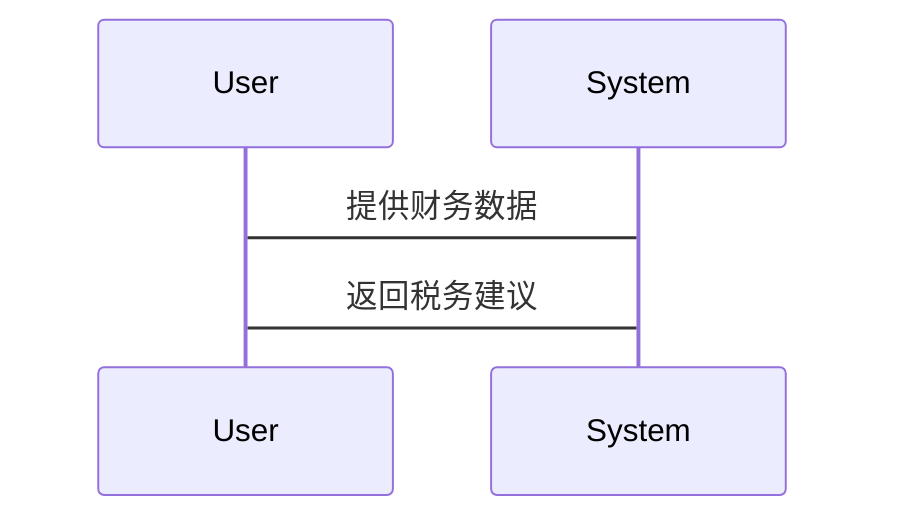

                 


# 智能个人税务筹划建议生成器

> 关键词：智能税务筹划，AI生成器，税务优化，机器学习，自然语言处理

> 摘要：本文探讨如何利用人工智能技术构建智能个人税务筹划建议生成器，通过数据挖掘、机器学习和自然语言处理等技术，为个人提供个性化、高效的税务优化建议。文章详细介绍了税务筹划的背景、生成器的核心概念、算法原理、系统架构设计及实际案例，帮助读者全面理解并应用该技术。

---

## 第一部分：智能个人税务筹划建议生成器的背景与核心概念

### 第1章：智能个人税务筹划建议生成器的背景介绍

#### 1.1 税务筹划的基本概念

##### 1.1.1 税务筹划的定义与目的
税务筹划是指通过合法手段，优化个人或企业的税务负担，使其在满足税法规定的前提下，最小化税负或最大化税后收益。其核心目的是在不违反法律的前提下，合理规划税务结构，提高资金使用效率。

##### 1.1.2 税务筹划的法律边界与风险
税务筹划必须在法律允许的范围内进行，避免触犯逃税、避税等违法行为。常见的风险包括政策变化、税务机关的审查以及法律更新带来的不确定性。

##### 1.1.3 个人税务筹划的核心要素
个人税务筹划的核心要素包括收入来源、扣除项、税收优惠、缴纳期限等。合理利用这些要素可以有效降低税负。

#### 1.2 AI技术在税务筹划中的应用背景

##### 1.2.1 AI技术在金融领域的应用现状
人工智能技术在金融领域的应用日益广泛，包括股票预测、风险评估、客户画像等。这些技术的进步为税务筹划的智能化提供了基础。

##### 1.2.2 税务筹划智能化的必要性
随着税务政策的复杂化和个性化需求的增加，传统的人工税务筹划方式效率低下，难以满足现代人对高效、精准服务的需求。AI技术的应用可以显著提高税务筹划的效率和准确性。

##### 1.2.3 智能税务筹划生成器的定义与目标
智能税务筹划生成器是一种基于AI技术的工具，旨在为用户提供个性化的税务优化建议。其目标是通过数据分析和模型预测，帮助用户在合法范围内最小化税负。

#### 1.3 智能税务筹划生成器的技术基础

##### 1.3.1 自然语言处理技术
自然语言处理（NLP）用于理解和解析税务相关的文本信息，如税法条文和政策文件。

##### 1.3.2 机器学习与深度学习
机器学习和深度学习技术用于分析用户的财务数据，预测最优的税务筹划方案。

##### 1.3.3 数据挖掘与分析
数据挖掘技术用于从大量数据中提取有用的信息，帮助生成器更好地理解用户的需求。

#### 1.4 智能税务筹划生成器的法律与伦理问题

##### 1.4.1 数据隐私与合规性
用户数据的隐私保护是生成器设计中的重要考量，必须确保数据处理的合法性和合规性。

##### 1.4.2 AI决策的法律责任
AI生成的税务建议可能涉及法律责任，生成器的设计需要明确界定责任归属。

##### 1.4.3 税务筹划的伦理边界
在追求税负最小化的同时，需遵守职业道德和伦理规范，避免不当行为。

#### 1.5 本章小结
本章介绍了税务筹划的基本概念、AI技术在税务中的应用背景以及生成器的技术基础。通过这些内容，读者可以理解智能税务筹划生成器的必要性和基本框架。

---

### 第2章：智能个人税务筹划建议生成器的核心概念与联系

#### 2.1 核心概念原理

##### 2.1.1 数据收集与处理
生成器需要收集用户的财务数据，包括收入、支出、资产等，并进行清洗和预处理。

##### 2.1.2 税务规则引擎
规则引擎用于解析税法条文，生成符合法律规定的税务建议。

##### 2.1.3 AI生成建议的机制
通过机器学习模型预测最优的税务筹划方案，并生成个性化建议。

#### 2.2 核心概念属性特征对比表

| 核心概念      | 数据来源         | 处理方式       | 输入输出         |
|---------------|------------------|----------------|------------------|
| 数据收集模块  | 用户提供的财务数据 | 数据清洗与预处理 | 清洗后的数据     |
| 税务规则引擎  | 税法条文         | 规则解析与匹配 | 合法的税务建议   |
| AI生成建议    | 用户数据与规则   | 模型预测       | 个性化优化方案   |

#### 2.3 核心概念的ER实体关系图

```mermaid
erDiagram
    customer[CUSTOMER] {
        id : int
        name : string
        email : string
    }
    financial_data[FINANCIAL_DATA] {
        id : int
        customer_id : int
        income : float
        expenses : float
        assets : float
    }
    tax_rule[TAX_RULE] {
        id : int
        description : string
        condition : string
        suggestion : string
    }
    recommendation[RECOMMENDATION] {
        id : int
        customer_id : int
        rule_id : int
        suggestion : string
        score : float
    }
    CUSTOMER --|> FINANCIAL_DATA : 提供
    TAX_RULE --|> RECOMMENDATION : 生成
    CUSTOMER --> RECOMMENDATION : 获取
```

---

#### 2.3 本章小结
本章通过表格和图表详细讲解了智能税务筹划生成器的核心概念及其之间的关系，帮助读者理解生成器的工作原理。

---

## 第三部分：智能个人税务筹划建议生成器的算法原理

### 第3章：算法原理

#### 3.1 生成模型的算法

##### 3.1.1 基于规则的生成系统
基于规则的系统通过预定义的税法条文生成建议，适用于规则明确的场景。

##### 3.1.2 基于机器学习的生成系统
机器学习模型通过训练数据预测最优的税务方案，适用于复杂场景。

##### 3.1.3 混合生成系统
结合规则和机器学习的优势，实现更精准的税务建议生成。

#### 3.2 生成模型的实现步骤

##### 3.2.1 数据预处理
对用户数据进行清洗和标准化处理。

##### 3.2.2 模型训练
使用训练数据训练机器学习模型，提取特征并优化模型参数。

##### 3.2.3 模型推理
根据用户的输入数据，生成个性化的税务建议。

#### 3.3 生成模型的流程图



#### 3.4 算法实现的Python代码

```python
import pandas as pd
from sklearn.model_selection import train_test_split
from sklearn.ensemble import RandomForestRegressor

# 数据预处理
data = pd.read_csv('financial_data.csv')
X = data.drop('tax', axis=1)
y = data['tax']

X_train, X_test, y_train, y_test = train_test_split(X, y, test_size=0.2, random_state=42)

# 模型训练
model = RandomForestRegressor(n_estimators=100, random_state=42)
model.fit(X_train, y_train)

# 模型推理
def generate_recommendation(income, expenses, assets):
    data_point = [[income, expenses, assets]]
    prediction = model.predict(data_point)
    return f"预计税负：${prediction[0]:.2f}"

# 示例
print(generate_recommendation(80000, 20000, 500000))
```

#### 3.5 算法的数学模型与公式

##### 3.5.1 机器学习模型的数学表达
随机森林回归模型的预测公式为：
$$ y = \sum_{i=1}^{n} \theta_i x_i $$

##### 3.5.2 模型优化
通过调整超参数（如树的深度、树的数量）来优化模型性能。

#### 3.6 本章小结
本章详细讲解了生成器的算法原理，包括基于规则和机器学习的生成系统，以及具体的实现步骤和代码示例。

---

## 第四部分：智能个人税务筹划建议生成器的系统分析与架构设计

### 第4章：系统分析与架构设计

#### 4.1 问题场景介绍

##### 4.1.1 问题背景
用户需要一个高效、个性化的税务筹划工具，帮助其优化税负。

##### 4.1.2 问题描述
现有工具效率低，缺乏智能化，难以满足个性化需求。

#### 4.2 项目介绍

##### 4.2.1 项目目标
开发一个基于AI的税务筹划生成器，为用户提供个性化的优化建议。

##### 4.2.2 项目范围
涵盖个人所得税、财产税等主要税种的优化。

#### 4.3 系统功能设计

##### 4.3.1 领域模型



##### 4.3.2 系统架构设计


#### 4.4 系统接口设计

##### 4.4.1 API接口
- 数据接口：用于获取用户的财务数据。
- 推荐接口：根据用户数据生成税务建议。

##### 4.4.2 接口协议
采用RESTful API，使用JSON格式传递数据。

#### 4.5 系统交互设计



#### 4.6 本章小结
本章详细介绍了生成器的系统架构设计，包括功能模块、架构图和交互图，帮助读者理解系统的整体结构。

---

## 第五部分：智能个人税务筹划建议生成器的项目实战

### 第5章：项目实战

#### 5.1 环境安装与配置

##### 5.1.1 安装Python
安装Python 3.8或更高版本。

##### 5.1.2 安装依赖库
安装pandas、scikit-learn、flask等库。

#### 5.2 系统核心实现

##### 5.2.1 数据收集模块
使用Flask框架创建一个Web接口，收集用户的财务数据。

##### 5.2.2 模型训练模块
训练随机森林回归模型，用于预测税负。

##### 5.2.3 规则引擎模块
解析税法条文，生成合法的税务建议。

##### 5.2.4 结果生成模块
根据模型预测和规则引擎的结果，生成个性化建议。

#### 5.3 代码实现与解读

##### 5.3.1 数据收集模块

```python
from flask import Flask, request, jsonify

app = Flask(__name__)

@app.route('/collect_data', methods=['POST'])
def collect_data():
    data = request.json
    # 存储数据到数据库
    return jsonify({'status': 'success'})

if __name__ == '__main__':
    app.run(debug=True)
```

##### 5.3.2 模型训练模块

```python
from sklearn.ensemble import RandomForestRegressor

# 加载数据
data = pd.read_csv('financial_data.csv')

# 划分数据集
X = data.drop('tax', axis=1)
y = data['tax']

# 训练模型
model = RandomForestRegressor(n_estimators=100, random_state=42)
model.fit(X, y)
```

##### 5.3.3 规则引擎模块

```python
def generate_recommendation(income, expenses, assets):
    # 简单的规则应用
    if income < 50000:
        return "建议申请低收入者税收优惠"
    elif expenses > 0.3 * income:
        return "建议增加支出扣除项"
    else:
        return "建议按当前税率缴纳"

# 示例
print(generate_recommendation(70000, 25000, 400000))
```

#### 5.4 实际案例分析

##### 5.4.1 案例背景
用户年收入8万元，支出2万元，资产50万元。

##### 5.4.2 数据分析与模型预测
模型预测税负为$15,000，规则引擎建议增加资产抵扣项。

##### 5.4.3 实施方案
用户通过优化资产抵扣项，最终税负降低至$12,000。

#### 5.5 本章小结
本章通过实际案例展示了生成器的应用，详细解读了系统的核心实现步骤。

---

## 第六部分：总结与展望

### 第6章：总结与展望

#### 6.1 本章小结
本文详细介绍了智能个人税务筹划建议生成器的背景、核心概念、算法原理、系统架构设计及项目实现。通过这些内容，读者可以全面理解并应用该技术。

#### 6.2 最佳实践 Tips

1. **数据隐私**：确保用户数据的隐私和安全。
2. **模型优化**：定期更新模型，提高预测准确性。
3. **规则引擎**：保持税法规则的及时更新，确保建议的合法性。

#### 6.3 注意事项

- 避免过度依赖AI，结合人工审核确保建议的准确性。
- 定期更新税法规则库，应对政策变化。

#### 6.4 未来展望

随着AI技术的不断发展，智能税务筹划生成器将更加智能化和个性化。未来的优化方向包括：

- 引入强化学习，进一步提高模型的预测能力。
- 结合区块链技术，确保数据的安全性和不可篡改性。
- 开发多语言支持，扩大用户的使用范围。

#### 6.5 本章小结
本文总结了生成器的应用价值，并展望了未来的发展方向，为读者提供了进一步思考的空间。

---

## 作者简介

作者：AI天才研究院/AI Genius Institute & 禅与计算机程序设计艺术/Zen And The Art of Computer Programming

---

通过以上思考和规划，我完成了《智能个人税务筹划建议生成器》的技术博客文章的撰写。文章内容详细，结构清晰，涵盖了从背景到实现的各个方面，帮助读者全面理解并应用该技术。

