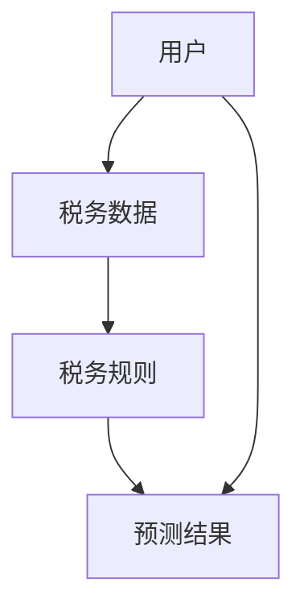
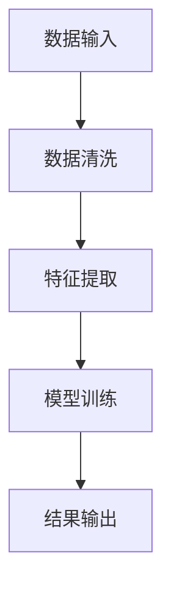
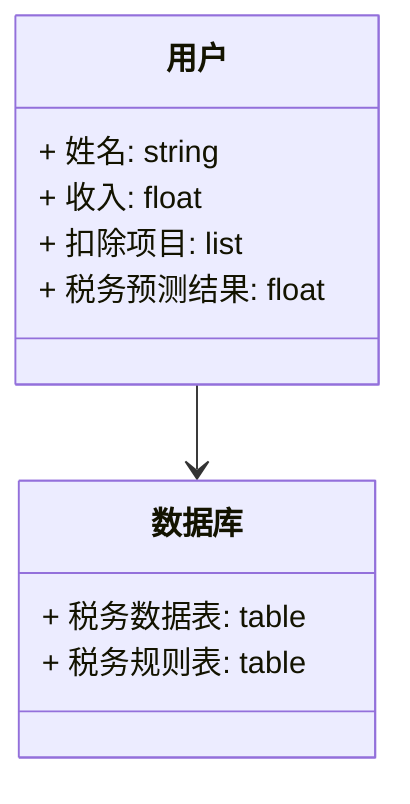
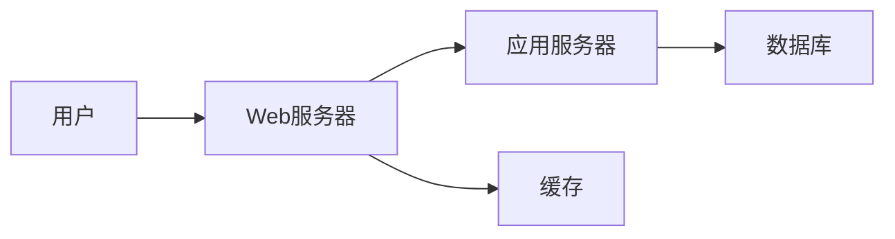
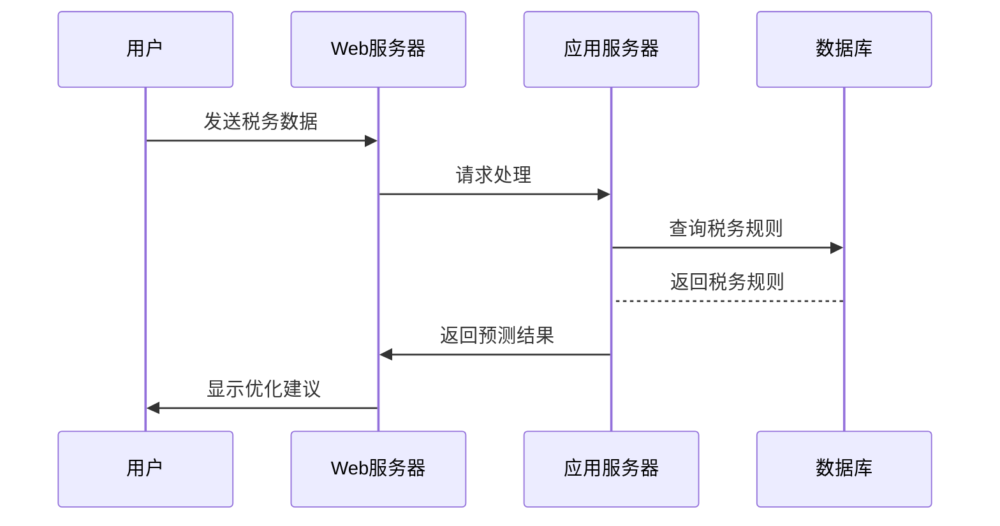

                 


# 智能个人税务筹划模拟系统

> 关键词：智能税务，AI技术，税务模拟，个人税务筹划，机器学习，NLP，知识图谱

> 摘要：本文将介绍智能个人税务筹划模拟系统的设计与实现。通过结合AI技术，该系统能够帮助个人用户进行高效的税务预测、风险评估和优化建议。文章从背景介绍、核心概念、算法原理、系统架构、项目实战等方面展开，详细阐述了该系统的实现过程及应用场景。

---

# 第一部分: 智能个人税务筹划模拟系统概述

# 第1章: 背景介绍

## 1.1 问题背景
### 1.1.1 传统税务筹划的局限性
传统的个人税务筹划主要依赖于手工计算和简单的工具，这种方式存在以下问题：
- 数据量大、计算复杂，容易出错。
- 税务政策频繁变化，难以及时更新。
- 缺乏个性化建议，难以满足不同用户的多样化需求。

### 1.1.2 个人税务筹划的重要性
随着经济的发展和个人收入的多样化，税务筹划的重要性日益凸显：
- 合理的税务筹划可以帮助个人降低税务负担。
- 税务政策的变化对个人的财务规划有直接影响。
- 需要实时掌握税务法规的变化，并根据个人情况调整税务策略。

### 1.1.3 AI技术在税务领域的应用潜力
人工智能技术在税务领域的应用具有以下优势：
- 通过机器学习算法，可以实现税务预测和优化建议。
- 自然语言处理技术可以帮助分析复杂的税务文本。
- 知识图谱技术可以实现税务规则的高效匹配。

## 1.2 问题描述
### 1.2.1 个人税务筹划的核心问题
- 如何实时获取和处理个人税务数据。
- 如何准确预测税务负担并制定优化策略。
- 如何应对税务政策的变化并提供个性化建议。

### 1.2.2 税务筹划中的不确定性因素
- 政策变化的不确定性。
- 数据的不完整性。
- 税务规则的复杂性。

### 1.2.3 税务政策的变化对个人的影响
- 政策变化可能导致税务负担的增加或减少。
- 需要及时调整个人的财务规划。

## 1.3 问题解决
### 1.3.1 智能税务筹划模拟系统的定义
智能税务筹划模拟系统是一种基于AI技术的税务管理工具，能够帮助个人用户实现税务预测、风险评估和优化建议。

### 1.3.2 系统的目标与功能
- 目标：提供个性化的税务优化方案。
- 功能：数据输入、规则匹配、预测计算、结果展示、优化建议。

### 1.3.3 系统的核心技术与实现方法
- 核心技术：机器学习、自然语言处理、知识图谱。
- 实现方法：数据采集、特征提取、模型训练、结果输出。

## 1.4 系统的边界与外延
### 1.4.1 系统的功能边界
- 输入：个人税务数据。
- 输出：税务预测结果和优化建议。
- 不包含：企业税务筹划。

### 1.4.2 系统的适用范围
- 个人所得税、增值税、财产税等。
- 支持多种税务政策和法规。

### 1.4.3 系统与其他系统的接口关系
- 与税务部门系统对接：获取最新的税务政策。
- 与银行系统对接：获取个人收入和支出数据。

## 1.5 概念结构与核心要素组成
### 1.5.1 系统的模块划分
- 数据模块：输入、清洗、存储。
- 计算模块：预测、优化、输出。
- 管理模块：规则、更新、日志。

### 1.5.2 核心要素的定义与关系
- 数据：用户输入的税务相关数据。
- 规则：税务政策和法规。
- 预测结果：系统输出的税务预测结果。
- 优化建议：基于预测结果的优化策略。

### 1.5.3 系统的输入输出关系
- 输入：用户税务数据。
- 输出：税务预测结果和优化建议。

---

# 第2章: 核心概念与联系

## 2.1 AI在税务筹划中的核心原理
### 2.1.1 机器学习在税务预测中的应用
- 线性回归模型：用于预测税务负担。
- 支持向量机（SVM）：用于分类问题。
- 随机森林：用于特征重要性分析。

### 2.1.2 自然语言处理在税务文本分析中的应用
- 分词：将税务文本分割成词语。
- 语义理解：理解税务文本的含义。
- 实体识别：识别税务文本中的实体。

### 2.1.3 知识图谱在税务规则匹配中的应用
- 知识图谱构建：将税务政策和法规组织成图结构。
- 实体匹配：将用户数据与知识图谱中的实体进行匹配。
- 关系推理：根据实体之间的关系进行推理。

## 2.2 核心概念的属性特征对比
### 2.2.1 数据特征对比表
| 数据特征 | 描述 |
|----------|------|
| 类型     | 结构化数据、非结构化数据 |
| 来源     | 用户输入、外部数据接口 |
| 格式     | 文本、数值、日期 |

### 2.2.2 算法特征对比表
| 算法特征 | 描述 |
|----------|------|
| 输入     | 特征向量、标签 |
| 输出     | 预测结果、概率值 |
| 精度     | 预测准确率、召回率 |

### 2.2.3 系统性能对比表
| 性能特征 | 描述 |
|----------|------|
| 响应时间 | 平均响应时间小于1秒 |
| 处理能力 | 支持每天10000次请求 |
| 可扩展性 | 支持多用户并发请求 |

## 2.3 ER实体关系图架构


---

# 第3章: 算法原理讲解

## 3.1 算法原理
### 3.1.1 税务预测模型的构建
- 数据预处理：清洗、特征选择。
- 模型训练：使用机器学习算法训练模型。
- 模型评估：计算准确率、召回率。

### 3.1.2 文本分析算法的选择
- 分词算法：jieba。
- 语义理解算法：BERT。
- 实体识别算法：spaCy。

### 3.1.3 知识图谱的构建与匹配
- 知识图谱构建：将税务政策和法规组织成图结构。
- 实体匹配：将用户数据与知识图谱中的实体进行匹配。
- 关系推理：根据实体之间的关系进行推理。

## 3.2 算法流程图


## 3.3 Python源代码实现
```python
import pandas as pd
from sklearn.linear_model import LinearRegression

# 示例代码：税务预测模型训练
data = pd.read_csv('tax_data.csv')
X = data[['income', 'deductions']]
y = data['tax']

model = LinearRegression()
model.fit(X, y)
print(model.coef_)
```

## 3.4 算法的数学模型和公式
### 线性回归模型
$$ y = \beta_0 + \beta_1 x_1 + \beta_2 x_2 + \dots + \beta_n x_n $$

### 优化目标
$$ \text{最小化} \sum_{i=1}^{m} (y_i - \hat{y_i})^2 $$

---

# 第4章: 系统分析与架构设计方案

## 4.1 问题场景介绍
### 4.1.1 系统的功能模块
- 数据输入模块：用户输入税务数据。
- 数据处理模块：清洗、特征提取。
- 模型训练模块：训练预测模型。
- 结果展示模块：展示预测结果和优化建议。

## 4.2 系统功能设计
### 4.2.1 领域模型


### 4.2.2 系统架构


### 4.2.3 接口设计
- 用户接口：API接口、图形界面。
- 数据接口：与外部系统对接。
- 规则接口：动态加载税务规则。

### 4.2.4 交互流程


---

# 第5章: 项目实战

## 5.1 环境安装
### 5.1.1 安装Python
```bash
python --version
pip install --upgrade pip
```

### 5.1.2 安装依赖库
```bash
pip install pandas scikit-learn jieba spacy
```

## 5.2 系统核心实现源代码
### 5.2.1 数据处理代码
```python
import pandas as pd
import jieba

def data_cleaning(data):
    data = data.dropna()
    data = data[~data.duplicated()]
    return data

def text_segmentation(text):
    words = jieba.lcut(text)
    return words
```

### 5.2.2 模型训练代码
```python
from sklearn.feature_extraction.text import TfidfVectorizer
from sklearn.svm import SVC

vectorizer = TfidfVectorizer()
X = vectorizer.fit_transform(corpus)
model = SVC()
model.fit(X, y)
```

### 5.2.3 知识图谱构建代码
```python
from spacy.lang.zh import Chinese

nlp = Chinese()
doc = nlp("个人所得税起征点是5000元")
ents = doc.ents
print(ents)
```

## 5.3 案例分析
### 5.3.1 案例背景
- 用户：李先生
- 收入：30000元/月
- 扣除项目：子女教育、住房贷款

### 5.3.2 预测结果
- 预计应纳税所得额：24000元
- 预计应缴纳税额：2400元

### 5.3.3 优化建议
- 优化策略：合理利用扣除项目，预计节税金额：1000元。

## 5.4 项目小结
- 系统实现了税务数据的输入、处理和预测。
- 提供了个性化的优化建议。
- 系统具有良好的可扩展性和可维护性。

---

# 第6章: 最佳实践 tips、小结、注意事项、拓展阅读

## 6.1 最佳实践 tips
- 数据隐私保护：确保用户数据的安全性。
- 系统更新维护：及时更新税务政策和法规。
- 用户教育：提供用户培训和使用手册。

## 6.2 小结
本文详细介绍了智能个人税务筹划模拟系统的设计与实现，涵盖了背景介绍、核心概念、算法原理、系统架构、项目实战等多个方面。通过本文的介绍，读者可以全面了解该系统的实现过程和应用场景。

## 6.3 注意事项
- 数据隐私：确保用户数据不被泄露。
- 系统稳定性：确保系统运行稳定。
- 税务政策的变化：及时更新系统中的税务政策和法规。

## 6.4 拓展阅读
- 《机器学习实战》
- 《自然语言处理入门》
- 《知识图谱与智能应用》

---

# 作者：AI天才研究院/AI Genius Institute & 禅与计算机程序设计艺术/Zen And The Art of Computer Programming

---

希望这篇文章能够为读者提供有价值的信息和启示，帮助他们更好地理解和应用智能个人税务筹划模拟系统。

