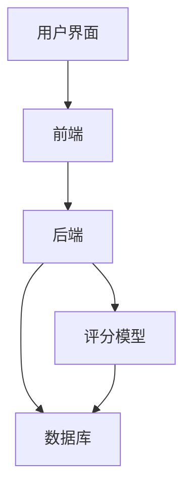
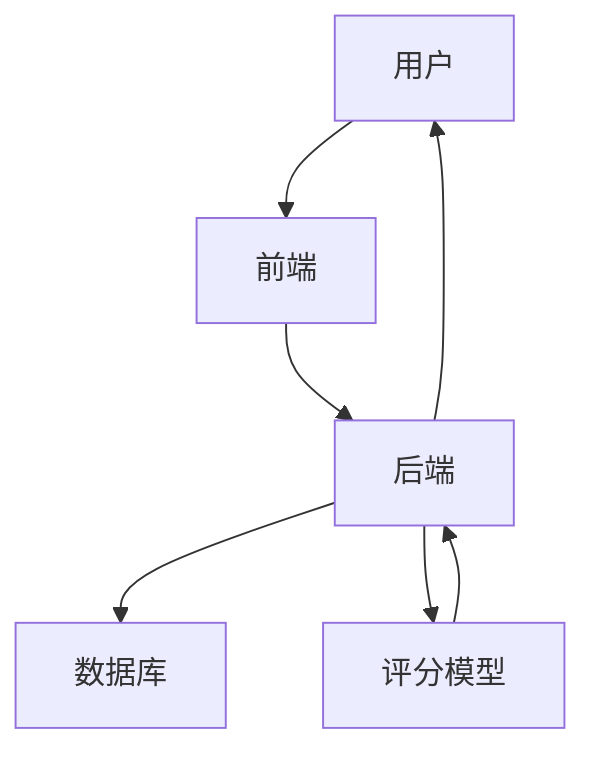

                 


# 智能个人财务健康评分与改善建议系统

> 关键词：个人财务健康，智能评分系统，改善建议，机器学习，财务数据分析

> 摘要：本文将介绍一种基于人工智能的智能个人财务健康评分与改善建议系统。通过分析个人的财务数据，该系统能够为用户提供个性化的财务评分，并基于评分结果提出针对性的改进建议。本文将从系统的核心概念、算法原理、系统架构设计到实际项目实现进行全面阐述。

---

## 第一部分：系统背景与核心概念

### 第1章：个人财务健康的重要性

#### 1.1 什么是个人财务健康？
- 财务健康的核心定义
- 财务健康对个人生活的影响
- 财务健康与生活质量的关系

#### 1.2 智能评分系统的优势
- 系统如何帮助用户实现自动化财务评估
- 个性化评分的意义
- 数据驱动的决策优势

#### 1.3 系统的目标与意义
- 提高财务管理效率
- 降低财务风险
- 优化个人财务状况

---

### 第2章：核心概念与术语解析

#### 2.1 财务健康评分模型
- 模型的定义与作用
- 评分维度的详细解释
- 评分标准的制定方法

#### 2.2 数据处理与分析
- 数据预处理的重要性
- 数据分析的核心步骤
- 数据可视化的作用

#### 2.3 机器学习在评分系统中的应用
- 机器学习如何用于财务评分
- 常见算法的对比与选择
- 模型训练与优化方法

---

## 第二部分：算法原理与系统架构

### 第3章：评分算法的原理与实现

#### 3.1 算法选择与优化
- 常见评分算法的优缺点对比
- 基于机器学习的评分模型选择
- 算法的可解释性与稳定性分析

#### 3.2 算法实现的步骤
- 数据预处理：数据清洗、特征提取
- 模型训练：选择训练数据、参数调优
- 模型评估：准确率、召回率、F1值

#### 3.3 算法的数学模型
- 线性回归模型：$$y = \beta_0 + \beta_1x + \epsilon$$
- 支持向量机模型：$$\text{maximize} \quad \frac{1}{2}\|w\|^2$$
- 随机森林模型：$$\text{集成学习方法}$$

### 第4章：系统架构设计

#### 4.1 系统功能模块划分
- 用户模块：用户信息管理、数据输入
- 数据处理模块：数据清洗、特征提取
- 评分计算模块：模型调用、评分输出

#### 4.2 系统架构图


#### 4.3 数据流设计


---

## 第三部分：系统实现与项目实战

### 第5章：项目实战：环境搭建与核心代码实现

#### 5.1 环境配置
- 安装Python与相关库（如pandas、scikit-learn、xgboost）
- 数据集准备与预处理

#### 5.2 核心代码实现
```python
import pandas as pd
from sklearn.ensemble import RandomForestClassifier
from sklearn.metrics import accuracy_score

# 数据加载
data = pd.read_csv('financial_data.csv')

# 特征提取
features = data[['income', 'expenses', 'assets', ' liabilities']]
labels = data['health_score']

# 模型训练
model = RandomForestClassifier()
model.fit(features, labels)

# 模型预测
predicted_labels = model.predict(features)
print("Accuracy:", accuracy_score(labels, predicted_labels))
```

#### 5.3 算法优化与测试
- 参数调优：使用网格搜索（GridSearchCV）
- 模型评估：混淆矩阵、ROC曲线
- 案例分析：实际数据输入与评分结果输出

### 第6章：系统功能与交互设计

#### 6.1 系统功能设计
- 用户登录与注册
- 数据上传与管理
- 评分结果查看
- 改善建议生成

#### 6.2 系统交互流程


#### 6.3 系统界面设计
- 登录界面
- 数据输入界面
- 评分结果展示界面
- 改善建议展示界面

---

## 第四部分：总结与展望

### 第7章：总结与最佳实践

#### 7.1 系统总结
- 系统实现的主要成果
- 系统的优势与不足
- 系统的创新点

#### 7.2 最佳实践
- 数据安全与隐私保护
- 系统性能优化建议
- 用户体验提升方法

#### 7.3 未来展望
- 新算法的引入（如深度学习）
- 系统功能的扩展（如投资建议）
- 多平台支持

---

## 作者

作者：AI天才研究院/AI Genius Institute & 禅与计算机程序设计艺术/Zen And The Art of Computer Programming

