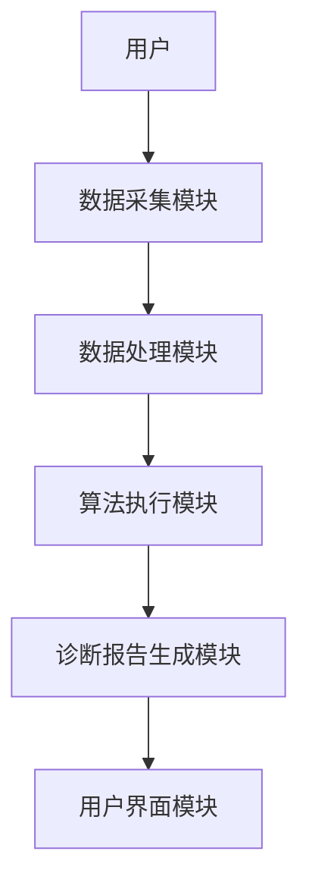

                 


# 智能个人财务健康诊断系统

> 关键词：智能诊断系统、个人财务、健康诊断、机器学习、数据处理

> 摘要：本文详细探讨了智能个人财务健康诊断系统的构建与应用。通过结合机器学习算法和系统架构设计，我们能够实现对个人财务状况的智能化诊断与优化。文章从背景、核心概念、算法原理、系统设计到项目实战，全面解析了该系统的实现过程。

---

## 第一部分: 智能个人财务健康诊断系统概述

### 第1章: 个人财务健康诊断的背景与挑战

#### 1.1 个人财务健康的重要性

- **1.1.1 财务健康对个人生活的影响**  
  财务健康直接关系到个人的生活质量、未来发展和风险抵御能力。良好的财务状况能够为个人提供安全感，帮助应对突发经济危机。

- **1.1.2 当前个人财务管理的痛点**  
  随着生活水平的提高，人们的财务来源和支出渠道日益多样化，传统的手工记账和简单分析已难以满足需求。数据分散、分析复杂、缺乏个性化建议等问题凸显。

- **1.1.3 智能化诊断的必要性**  
  通过智能化手段，可以实时采集和分析财务数据，快速生成诊断结果并提供个性化建议，帮助个人更好地管理财务。

#### 1.2 智能化诊断的核心概念

- **1.2.1 数据驱动的诊断方法**  
  基于数据的采集、处理和分析，利用机器学习算法对财务状况进行评估。

- **1.2.2 人工智能在财务诊断中的应用**  
  利用AI技术实现自动化数据处理、模式识别和预测分析，提高诊断的准确性和效率。

- **1.2.3 智能诊断系统的边界与外延**  
  系统主要关注个人财务数据的分析与诊断，不涉及具体的财务操作或投资建议。

#### 1.3 本章小结  
本章介绍了个人财务健康诊断的重要性及其面临的挑战，阐述了智能化诊断的核心概念和价值。

---

## 第二部分: 智能个人财务健康诊断系统的核心概念

### 第2章: 财务健康诊断的核心要素

#### 2.1 财务健康诊断的指标体系

- **2.1.1 收入与支出分析**  
  包括总收入、主要支出项目（如住房、教育、医疗等）的分析，评估收支平衡状况。

- **2.1.2 资产与负债评估**  
  综合分析个人的资产规模、负债情况及债务风险。

- **2.1.3 财务风险评估**  
  通过杠杆率、偿债能力等指标评估财务风险程度。

- **2.1.4 财务规划与优化**  
  根据诊断结果，制定个性化的财务优化方案，如储蓄、投资建议等。

#### 2.2 数据采集与处理

- **2.2.1 数据来源的多样性**  
  包括银行流水、信用卡记录、投资账户等多渠道数据。

- **2.2.2 数据清洗与预处理**  
  对数据进行去重、填补缺失值、异常值处理等步骤，确保数据质量。

- **2.2.3 数据安全与隐私保护**  
  采用加密技术和访问控制，确保用户数据的安全性。

#### 2.3 系统的核心功能模块

- **2.3.1 数据采集模块**  
  负责从不同数据源获取财务数据，并进行初步整理。

- **2.3.2 数据分析模块**  
  对数据进行建模和分析，生成诊断结果。

- **2.3.3 诊断报告生成模块**  
  以图表和文字形式呈现诊断结果，并提供优化建议。

- **2.3.4 个性化建议模块**  
  根据诊断结果，为用户提供定制化的财务优化方案。

#### 2.4 本章小结  
本章详细介绍了财务健康诊断的核心要素，包括指标体系、数据处理和系统功能模块的设计。

---

## 第三部分: 智能诊断系统的算法原理

### 第3章: 机器学习在财务诊断中的应用

#### 3.1 常见的机器学习算法

- **3.1.1 线性回归**  
  用于预测连续型变量，如预测未来收入。

- **3.1.2 支持向量机（SVM）**  
  适用于分类问题，如判断财务状况是否健康。

- **3.1.3 随机森林**  
  适合处理高维数据，用于复杂分类或回归问题。

- **3.1.4 神经网络**  
  适用于非线性关系建模，如深度学习模型。

#### 3.2 基于机器学习的财务诊断模型

- **3.2.1 数据特征选择**  
  选取对财务健康影响较大的特征，如收入、支出比例等。

- **3.2.2 模型训练与优化**  
  使用交叉验证优化模型参数，防止过拟合。

- **3.2.3 模型评估与验证**  
  通过准确率、召回率等指标评估模型性能。

#### 3.3 深度学习在诊断中的应用

- **3.3.1 神经网络结构**  
  采用多层感知机（MLP）或卷积神经网络（CNN）进行特征提取和分类。

- **3.3.2 深度学习的优势**  
  能够自动提取高阶特征，提升模型的表达能力。

- **3.3.3 案例分析**  
  使用神经网络对财务数据进行分类，验证其优越性。

#### 3.4 本章小结  
本章探讨了机器学习和深度学习在财务诊断中的应用，展示了如何通过算法实现智能化诊断。

---

## 第四部分: 系统架构与设计

### 第4章: 系统架构设计

#### 4.1 系统功能模块划分

- **4.1.1 用户界面模块**  
  提供友好的用户交互界面，展示诊断结果和建议。

- **4.1.2 数据处理模块**  
  负责数据的清洗、转换和存储。

- **4.1.3 算法执行模块**  
  执行机器学习模型，生成诊断结果。

- **4.1.4 报告生成模块**  
  生成可视化的诊断报告。

#### 4.2 系统架构图



#### 4.3 数据流设计

- **4.3.1 数据输入流程**  
  用户输入财务数据，经过数据采集模块进入系统。

- **4.3.2 数据处理流程**  
  数据清洗、特征提取，为算法模块提供输入。

- **4.3.3 数据输出流程**  
  诊断结果通过报告生成模块展示给用户。

#### 4.4 本章小结  
本章详细设计了系统的架构，展示了各模块之间的协作关系。

---

## 第五部分: 项目实战与实现

### 第5章: 环境搭建与核心代码实现

#### 5.1 开发环境安装

```bash
# 安装Python和必要的库
pip install numpy pandas scikit-learn matplotlib
```

#### 5.2 核心代码实现

```python
import numpy as np
import pandas as pd
from sklearn.model

