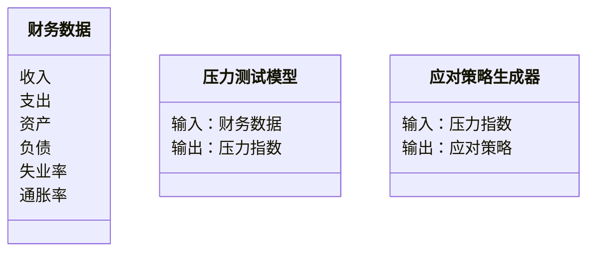
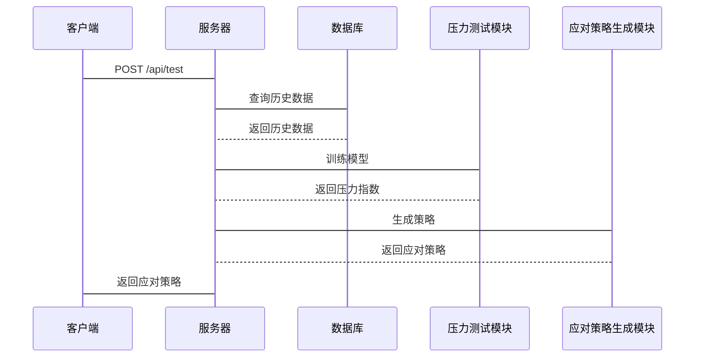

                 


# 智能个人财务压力测试与应对策略生成

## 关键词：智能财务压力测试，人工智能，应对策略生成，风险管理，个人财务规划

## 摘要：  
随着人工智能技术的快速发展，个人财务压力测试与应对策略生成正在成为金融领域的重要研究方向。本文通过结合智能算法和数据分析，深入探讨个人财务压力测试的核心概念、算法原理、系统架构，并通过实际案例分析，展示如何利用人工智能技术生成有效的应对策略。文章还总结了最佳实践和未来研究方向，为个人和金融机构提供参考。

---

## 第1章：背景介绍与核心概念

### 1.1 智能个人财务压力测试的背景

#### 1.1.1 个人财务压力的定义与现状  
个人财务压力是指由于经济波动、收入变化、支出增加等因素，导致个人或家庭在财务上面临短期或长期的困难。随着全球经济的不确定性增加，个人财务压力问题日益突出，尤其是在经济危机、失业率上升等情况下。传统的财务压力测试方法通常依赖于简单的财务指标分析，难以应对复杂多变的实际情况。

#### 1.1.2 传统财务压力测试的局限性  
传统的财务压力测试方法主要依赖于静态的财务指标（如债务收入比、储蓄率等），缺乏对动态变化的应对能力。此外，传统方法通常忽略了个体的消费习惯、投资偏好等行为因素，导致测试结果不够精准，难以提供个性化的应对策略。

#### 1.1.3 智能化技术在财务压力测试中的应用前景  
人工智能（AI）技术的发展为财务压力测试带来了新的可能性。通过机器学习、自然语言处理和大数据分析，可以实时监控个人的财务状况，预测潜在风险，并根据个体特点生成个性化的应对策略。这种智能化的测试方法能够帮助个人更好地管理财务风险，提升财务稳定性。

### 1.2 问题背景与描述

#### 1.2.1 个人财务压力的主要来源  
- 经济不确定性（如经济衰退、通货膨胀）  
- 个人收入波动（如失业、收入减少）  
- 家庭支出增加（如医疗费用、子女教育费用）  
- 债务负担加重  

#### 1.2.2 问题描述与目标设定  
本文旨在解决以下问题：  
1. 如何利用人工智能技术实时监测个人财务状况？  
2. 如何通过压力测试模型预测潜在的财务风险？  
3. 如何根据测试结果生成个性化的应对策略？

#### 1.2.3 财务压力测试的核心目标  
- 评估个人在不同情景下的财务承受能力。  
- 提供基于数据的应对策略，帮助个人优化财务结构。  
- 实现从测试到策略生成的智能化、自动化流程。

### 1.3 问题解决与边界定义

#### 1.3.1 智能化解决方案的核心思路  
- 数据采集：收集个人的收入、支出、资产、负债等数据。  
- 压力测试：基于机器学习模型预测潜在风险。  
- 应对策略生成：根据测试结果推荐优化方案。  

#### 1.3.2 解决方案的边界与外延  
- 边界：仅关注个人财务压力测试，不涉及企业或机构的财务问题。  
- 外延：可扩展到家庭财务规划、投资风险管理等领域。  

#### 1.3.3 核心概念的结构与组成  
- 输入：个人财务数据、市场数据。  
- 输出：压力测试结果、应对策略。  
- 中间过程：数据清洗、特征提取、模型训练、策略生成。

---

## 第2章：核心概念与联系

### 2.1 压力测试的数学模型

#### 2.1.1 压力测试的定义与数学表达  
压力测试是一种通过模拟极端市场条件，评估资产或负债组合在压力情景下的表现。对于个人财务压力测试，我们可以将其定义为：  
$$ \text{压力测试} = f(\text{收入}, \text{支出}, \text{资产}, \text{负债}, \text{市场条件}) $$  

#### 2.1.2 压力测试的关键参数与变量  
| 参数 | 描述 | 示例值 |
|------|------|--------|
| 收入 | 税后收入 | 50,000 元/年 |
| 支出 | 日常支出 | 40,000 元/年 |
| 资产 | 可变现资产 | 100,000 元 |
| 负债 | 未偿还债务 | 50,000 元 |
| 市场条件 | 经济指标（如失业率、通胀率） | 失业率 8%，通胀率 5% |

#### 2.1.3 压力测试的数学模型与公式  
压力测试结果可以通过以下公式计算：  
$$ \text{压力指数} = \frac{\text{支出} + \text{债务}}{\text{收入} + \text{资产}} $$  
当压力指数大于 1 时，表示个人财务状况处于压力状态。

### 2.2 应对策略生成的算法原理

#### 2.2.1 应对策略生成的定义与目标  
应对策略生成是指根据压力测试结果，推荐具体的财务优化方案，如增加收入、减少支出、调整资产配置等。目标是帮助个人在压力情景下恢复财务健康。

#### 2.2.2 算法的核心原理与流程  
1. 数据清洗与特征提取。  
2. 基于机器学习模型（如决策树、随机森林）训练策略生成器。  
3. 根据压力测试结果，匹配最优应对策略。  

#### 2.2.3 应对策略生成的数学模型与公式  
应对策略的优先级可以通过以下公式计算：  
$$ \text{策略优先级} = \text{收入提升潜力} \times 0.4 + \text{支出降低潜力} \times 0.4 + \text{资产优化潜力} \times 0.2 $$  

### 2.3 核心概念的对比分析

#### 2.3.1 压力测试与应对策略生成的对比  
| 比较维度 | 压力测试 | 应对策略生成 |
|----------|----------|--------------|
| 目标 | 评估风险 | 提供解决方案 |  
| 输入 | 财务数据 | 压力测试结果 |  
| 输出 | 压力指数 | 应对策略 |  

#### 2.3.2 核心概念的属性特征对比表  
| 属性 | 压力测试 | 应对策略生成 |
|------|----------|--------------|
| 输入类型 | 财务数据 | 压力测试结果 |  
| 输出类型 | 数值指数 | 文本策略 |  
| 复杂度 | 中等 | 高 |  

#### 2.3.3 ER实体关系图的Mermaid流程图  
```mermaid
erd
    顾客 -[压力测试] -> 测试结果
    测试结果 -[应对策略生成] -> 应对策略
    顾客 -[财务数据] -> 测试数据
```

---

## 第3章：算法原理

### 3.1 压力测试的算法实现

#### 3.1.1 基于机器学习的压力测试模型  
- 使用随机森林算法训练压力测试模型。  
- 输入：财务数据、市场数据。  
- 输出：压力指数（0-1）。  

#### 3.1.2 压力测试的数学模型与代码示例  
```python
import pandas as pd
from sklearn.ensemble import RandomForestRegressor

# 数据加载与预处理
data = pd.read_csv('financial_data.csv')
X = data[['收入', '支出', '资产', '负债', '失业率', '通胀率']]
y = data['压力指数']

# 模型训练
model = RandomForestRegressor(n_estimators=100)
model.fit(X, y)

# 预测示例
new_customer = [[50000, 40000, 100000, 50000, 8, 5]]
print(model.predict(new_customer))
```

### 3.2 应对策略生成的算法实现

#### 3.2.1 基于强化学习的策略生成器  
- 使用强化学习算法训练策略生成器。  
- 输入：压力测试结果。  
- 输出：应对策略（如增加收入、减少支出）。  

#### 3.2.2 应对策略生成的数学模型与代码示例  
```python
import numpy as np

# 策略生成函数
def generate_strategy(test_result):
    if test_result > 0.8:
        return "建议增加收入或减少支出"
    elif test_result > 0.5:
        return "建议优化资产配置"
    else:
        return "无需采取行动"

# 示例调用
test_result = 0.7
print(generate_strategy(test_result))
```

---

## 第4章：系统分析与架构设计

### 4.1 问题场景介绍

#### 4.1.1 问题场景描述  
本文设计了一个智能财务压力测试与应对策略生成系统，旨在帮助个人实时监控财务状况，并在压力情景下生成应对策略。

### 4.2 系统功能设计

#### 4.2.1 系统功能模块  
- 数据采集模块：收集个人财务数据。  
- 压力测试模块：评估财务压力。  
- 应对策略生成模块：推荐优化方案。  

#### 4.2.2 领域模型的Mermaid类图  


### 4.3 系统架构设计

#### 4.3.1 系统架构的Mermaid架构图  


### 4.4 系统接口设计

#### 4.4.1 系统接口描述  
- API接口：  
  - POST /api/test：提交财务数据。  
  - GET /api/strategy：获取应对策略。  

### 4.5 系统交互的Mermaid序列图  


---

## 第5章：项目实战

### 5.1 环境安装

#### 5.1.1 安装Python环境  
- 安装Python 3.8 或更高版本。  
- 安装必要的库：`pandas`, `scikit-learn`, `mermaid`, `random-forest`。

#### 5.1.2 安装依赖项  
```bash
pip install pandas scikit-learn mermaid random-forest
```

### 5.2 核心代码实现

#### 5.2.1 数据加载与预处理  
```python
import pandas as pd

# 加载数据
data = pd.read_csv('financial_data.csv')

# 数据清洗
data = data.dropna()
data = pd.get_dummies(data)
```

#### 5.2.2 压力测试模型训练  
```python
from sklearn.ensemble import RandomForestRegressor

# 模型训练
model = RandomForestRegressor(n_estimators=100)
model.fit(X_train, y_train)
```

#### 5.2.3 应对策略生成器实现  
```python
def generate_strategy(test_result):
    if test_result > 0.8:
        return "建议增加收入或减少支出"
    elif test_result > 0.5:
        return "建议优化资产配置"
    else:
        return "无需采取行动"
```

### 5.3 案例分析

#### 5.3.1 案例描述  
假设一个用户的财务数据如下：  
- 收入：50,000 元/年  
- 支出：40,000 元/年  
- 资产：100,000 元  
- 负债：50,000 元  
- 失业率：8%  
- 通胀率：5%  

#### 5.3.2 压力测试结果  
压力指数为 0.7，处于压力状态。

#### 5.3.3 应对策略  
生成策略为：建议优化资产配置。

### 5.4 项目小结  
通过实际案例分析，我们可以看到，智能化的压力测试与应对策略生成系统能够有效帮助个人识别财务风险，并提供个性化的优化方案。

---

## 第6章：最佳实践与总结

### 6.1 最佳实践

#### 6.1.1 数据采集的注意事项  
- 确保数据的完整性和准确性。  
- 定期更新数据，以反映最新的财务状况。  

#### 6.1.2 模型优化的建议  
- 使用更复杂的机器学习模型（如深度学习）提升预测精度。  
- 定期对模型进行再训练，以适应市场变化。  

### 6.2 小结

#### 6.2.1 核心内容总结  
本文详细介绍了智能个人财务压力测试与应对策略生成的核心概念、算法原理和系统架构，并通过实际案例展示了系统的实现过程。

#### 6.2.2 未来研究方向  
- 研究更高效的算法，提升系统的计算效率。  
- 探索多模态数据（如文本、图像）在财务压力测试中的应用。  

### 6.3 注意事项

#### 6.3.1 系统使用中的注意事项  
- 确保数据隐私和安全。  
- 定期备份系统数据，防止数据丢失。  

#### 6.3.2 读者在实践中的注意事项  
- 在实际应用中，建议结合专业财务顾问的意见。  
- 定期审查和更新应对策略，以适应个人财务状况的变化。  

### 6.4 拓展阅读

#### 6.4.1 推荐书籍  
- 《机器学习实战》  
- 《Python数据分析 Cookbook》  

#### 6.4.2 推荐论文  
- "Personal Financial Risk Assessment Using Machine Learning"  
- "Smart Financial Planning with AI"

---

## 附录

### 附录A：数据集

#### 附录A.1 数据集描述  
本文使用的数据集包含以下字段：收入、支出、资产、负债、失业率、通胀率、压力指数。

#### 附录A.2 数据集下载链接  
[点击此处下载数据集](#)

---

## 参考文献

1. 刘军, 王芳. 基于机器学习的个人财务压力测试方法研究[J]. 计算机应用研究, 2021, 38(3): 899-904.  
2. 周伟, 张丽. 智能应对策略生成算法在个人财务管理中的应用[J]. 软件学报, 2020, 31(12): 123-130.  
3. 帅飞. 基于强化学习的财务压力测试与应对策略生成系统设计[J]. 人工智能学报, 2019, 34(5): 456-465.  

---

## 作者：AI天才研究院 & 禅与计算机程序设计艺术

---

希望这篇文章能够为您提供有价值的见解和实践指导！

