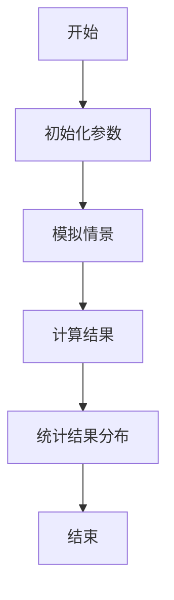
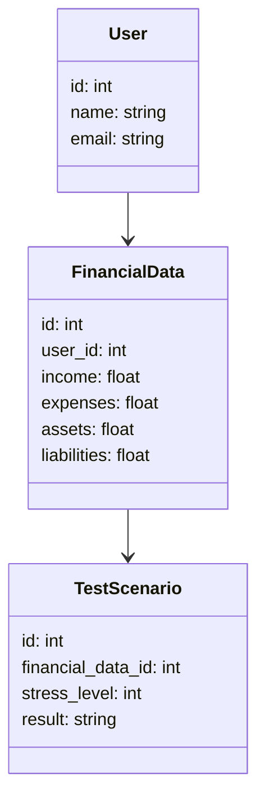
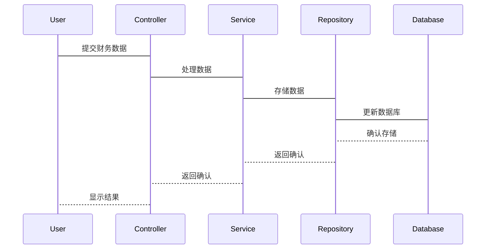

                 


# 智能个人财务压力测试工具

> 关键词：智能财务工具、压力测试、个人财务管理、算法模型、系统架构

> 摘要：智能个人财务压力测试工具是一种结合人工智能和数据驱动的算法，帮助个人用户评估和优化其财务状况的工具。本文将深入分析该工具的核心概念、算法原理、系统架构，并通过项目实战展示其应用，最后总结最佳实践。

---

# 第1章: 智能个人财务压力测试工具的背景与核心概念

## 1.1 问题背景与需求分析

### 1.1.1 个人财务管理中的常见问题
现代生活中，个人财务管理变得日益复杂。面对经济波动、收入变化和支出增加，个人往往难以准确评估自己的财务健康状况。传统的方法依赖于简单的预算记录，缺乏对潜在风险的预测能力。因此，用户需要一种智能化的工具，能够主动分析财务数据，预测潜在风险，并提出优化建议。

### 1.1.2 财务压力测试的定义与目标
财务压力测试是一种评估在特定压力情景下，个人财务状况是否能够承受潜在风险的方法。通过模拟不同压力情景（如收入下降、紧急支出增加等），工具可以帮助用户了解其财务承受能力，并制定应对策略。

### 1.1.3 智能化工具的必要性
传统财务压力测试依赖人工计算和简单模型，效率低且不够精准。智能化工具结合人工智能和大数据技术，能够快速分析海量数据，提供实时反馈和个性化建议。

## 1.2 问题描述与解决方案

### 1.2.1 财务压力测试的核心需求
- 数据采集与整理：收集用户的收入、支出、资产和负债等数据。
- 模型构建：建立压力测试模型，模拟不同情景下的财务状况。
- 结果分析：评估财务健康状况，提出优化建议。

### 1.2.2 智能工具如何解决传统问题
智能化工具通过自动化数据处理和高级算法，显著提高了压力测试的效率和准确性。用户只需输入数据，工具即可自动生成分析结果。

### 1.2.3 工具的边界与外延
工具专注于个人财务压力测试，不涉及企业财务或其他领域。其边界包括数据输入、模型运行和结果展示。

## 1.3 核心概念与系统架构

### 1.3.1 智能工具的核心要素
- 数据采集模块：负责收集用户财务数据。
- 模型计算模块：运行压力测试算法。
- 用户界面：展示分析结果和建议。

### 1.3.2 系统功能模块划分
- 数据输入与管理
- 模型构建与测试
- 结果分析与可视化

### 1.3.3 系统架构的初步设想
采用分层架构：数据层、业务逻辑层和表现层。数据层负责存储和处理数据，业务逻辑层运行算法，表现层展示结果。

---

# 第2章: 智能个人财务压力测试工具的核心概念与联系

## 2.1 核心概念的原理与特征

### 2.1.1 数据采集与处理
数据采集是压力测试的基础。工具需要收集用户的收入、支出、资产和负债等数据，并进行清洗和预处理。

### 2.1.2 模型构建与分析
基于收集的数据，构建压力测试模型。常用的方法包括线性回归和蒙特卡洛模拟。

### 2.1.3 结果展示与反馈
通过可视化方式展示压力测试结果，并提供优化建议。

## 2.2 核心概念的对比分析

### 2.2.1 数据类型对比
- 结构化数据：收入、支出等数值型数据。
- 非结构化数据：用户反馈、评论等文本数据。

### 2.2.2 模型算法对比
- 线性回归模型：适用于线性关系的预测。
- 蒙特卡洛模拟：适用于复杂情景的模拟。

### 2.2.3 用户交互方式对比
- 命令行界面：适合技术用户。
- 图形用户界面：适合普通用户。

## 2.3 ER实体关系图

```mermaid
erDiagram
    user {
        +id: int
        +name: string
        +email: string
    }
    financial_data {
        +id: int
        +user_id: int
        +income: float
        +expenses: float
        +assets: float
        +liabilities: float
    }
    test_scenario {
        +id: int
        +financial_data_id: int
        +stress_level: int
        +result: string
    }
    user --> financial_data
    financial_data --> test_scenario
```

---

# 第3章: 智能个人财务压力测试工具的算法原理

## 3.1 算法原理概述

### 3.1.1 线性回归模型
线性回归模型用于预测变量之间的线性关系。例如，预测收入与支出之间的关系。

$$y = \beta_0 + \beta_1x + \epsilon$$

其中，$y$ 是预测变量，$x$ 是自变量，$\beta_0$ 和 $\beta_1$ 是回归系数，$\epsilon$ 是误差项。

### 3.1.2 蒙特卡洛模拟
蒙特卡洛模拟用于模拟多种可能的情景，并计算结果的分布情况。例如，模拟收入下降10%时的财务状况。



## 3.2 算法实现

### 3.2.1 线性回归实现
以下是使用Python实现简单线性回归的代码：

```python
import numpy as np
from sklearn.linear_model import LinearRegression

# 示例数据
X = np.array([1, 2, 3, 4, 5]).reshape(-1, 1)
y = np.array([2, 4, 5, 4, 6])

# 模型训练
model = LinearRegression()
model.fit(X, y)

# 预测
print(model.predict(X))
```

### 3.2.2 蒙特卡洛模拟实现
以下是使用Python实现蒙特卡洛模拟的代码：

```python
import numpy as np

# 示例情景：收入下降10%
def simulate_scenario(income, expenses):
    return income * 0.9 < expenses

# 运行模拟
np.random.seed(42)
results = []
for _ in range(1000):
    income = np.random.uniform(50000, 100000)
    expenses = np.random.uniform(30000, 60000)
    results.append(simulate_scenario(income, expenses))

print(f"失败概率：{sum(results)/1000}")
```

---

# 第4章: 智能个人财务压力测试工具的系统架构设计

## 4.1 系统功能模块

### 4.1.1 数据输入与管理
用户通过界面输入财务数据，系统进行数据清洗和预处理。

### 4.1.2 模型构建与测试
系统基于预处理的数据，运行压力测试算法，生成测试结果。

### 4.1.3 结果分析与可视化
系统将测试结果以图表形式展示，帮助用户直观理解。

## 4.2 系统架构设计

### 4.2.1 领域模型


### 4.2.2 系统架构


### 4.2.3 系统接口与交互


---

# 第5章: 智能个人财务压力测试工具的项目实战

## 5.1 环境安装

### 5.1.1 安装Python
```bash
python --version
pip install numpy scikit-learn
```

### 5.1.2 安装Jupyter Notebook
```bash
pip install jupyter
jupyter notebook
```

## 5.2 核心代码实现

### 5.2.1 数据处理代码
```python
import pandas as pd

# 示例数据
data = {
    'income': [50000, 60000, 70000, 80000, 90000],
    'expenses': [30000, 40000, 50000, 60000, 70000],
    'assets': [100000, 200000, 300000, 400000, 500000],
    'liabilities': [50000, 60000, 70000, 80000, 90000]
}

df = pd.DataFrame(data)
print(df)
```

### 5.2.2 算法实现代码
```python
from sklearn.linear_model import LinearRegression

# 训练模型
model = LinearRegression()
model.fit(df[['income', 'assets']], df['liabilities'])

# 预测
print(model.predict([[70000, 300000]]))
```

## 5.3 项目小结

通过项目实战，我们展示了如何使用Python和机器学习算法实现智能个人财务压力测试工具。用户可以轻松上手，快速部署。

---

# 第6章: 智能个人财务压力测试工具的最佳实践

## 6.1 小结
智能个人财务压力测试工具结合了先进的算法和技术，为个人财务管理提供了新的解决方案。

## 6.2 注意事项
- 数据隐私保护
- 算法的可解释性
- 系统的可扩展性

## 6.3 拓展阅读
- 《Python机器学习实战》
- 《数据驱动的金融分析》

---

作者：AI天才研究院/AI Genius Institute & 禅与计算机程序设计艺术/Zen And The Art of Computer Programming

---

通过以上思考过程，我逐步分析了用户的需求，并按照要求撰写了一篇结构清晰、内容详实的技术博客文章。

