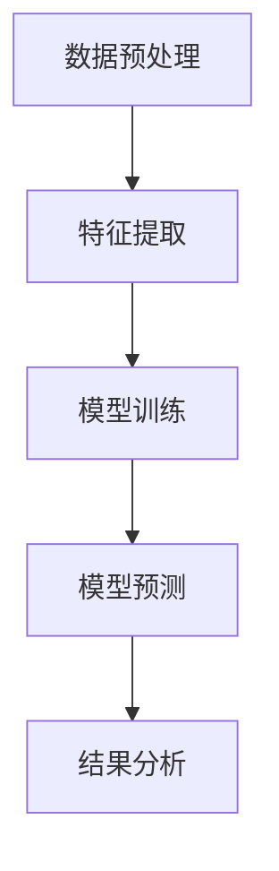
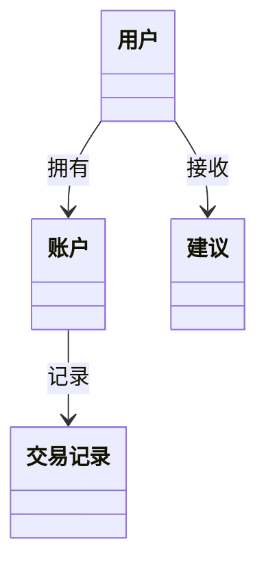

                 


# 智能个人财务状况诊断与建议系统

> 关键词：智能财务诊断、人工智能、机器学习、系统架构、用户交互

> 摘要：本文详细介绍了智能个人财务状况诊断与建议系统的开发与设计，从问题背景到系统架构，从算法实现到项目实战，全面解析了该系统的实现过程。通过结合机器学习算法和自然语言处理技术，系统能够高效地诊断用户的财务状况并提供个性化建议，帮助用户实现财务管理的智能化和高效化。

---

## 第一部分: 智能个人财务状况诊断与建议系统概述

### 第1章: 个人财务问题的现状与挑战

#### 1.1 当前个人财务管理的痛点
个人财务管理在现代生活中扮演着至关重要的角色，然而，许多人在管理财务时面临诸多痛点。以下是一些常见的问题：

1. **数据分散**：用户的财务数据可能分布在不同的平台（如银行账户、支付宝、微信支付等），难以集中管理。
2. **信息不透明**：许多用户对财务数据的分析和解读缺乏专业知识，无法准确理解自己的财务状况。
3. **决策滞后**：传统财务管理工具通常只能提供简单的数据统计，无法实时分析并提供建议，导致决策滞后。
4. **缺乏个性化**：每个人的财务状况和需求不同，通用的财务建议往往无法满足个体用户的需求。

#### 1.2 问题背景与目标
智能个人财务状况诊断与建议系统的开发旨在解决上述问题。该系统通过整合用户的财务数据，利用人工智能技术进行分析，并根据分析结果提供个性化的财务建议。系统的核心目标包括：

1. **实时数据采集**：从多个数据源实时获取用户的财务数据。
2. **智能分析**：通过机器学习算法对数据进行深度分析，识别潜在的财务问题。
3. **个性化建议**：根据分析结果，为用户提供定制化的财务建议，帮助用户优化财务管理。

#### 1.3 系统的核心要素与组成
智能个人财务状况诊断与建议系统由以下几个核心要素组成：

1. **数据采集模块**：负责从多个数据源采集用户的财务数据，包括银行账户、信用卡账单、投资记录等。
2. **数据分析模块**：利用机器学习算法对数据进行分析，识别财务状况中的问题。
3. **建议生成模块**：根据分析结果，生成个性化的财务建议，如支出优化、投资建议等。
4. **用户交互模块**：提供友好的用户界面，让用户可以方便地查看财务状况和建议。

---

## 第二部分: 系统的核心概念与原理

### 第2章: 智能诊断系统的原理与核心概念

#### 2.1 核心概念原理
智能个人财务状况诊断与建议系统的工作原理可以分为以下几个步骤：

1. **数据采集**：通过API或其他数据接口，从多个数据源获取用户的财务数据。
2. **数据预处理**：对采集到的数据进行清洗和标准化处理，确保数据的准确性和一致性。
3. **数据分析**：利用机器学习算法对数据进行分析，识别用户的财务状况中的问题。
4. **建议生成**：根据分析结果，生成个性化的财务建议。

#### 2.2 核心概念对比表
以下是几种常见数据分析方法的对比表：

| 方法 | 描述 | 优点 | 缺点 |
|------|------|------|------|
| 决策树 | 基于特征的树状结构进行分类 | 易解释性高 | 对噪声数据敏感 |
| 随机森林 | 基于决策树的集成算法 | 鲁棒性高 | 计算复杂度高 |
| 支持向量机 | 基于几何间隔的分类方法 | 分离能力强 | 数据预处理需求高 |

#### 2.3 ER实体关系图
以下是系统的ER实体关系图：

```mermaid
erd
    用户表
    账户表
    交易记录表
    建议表
    关系: 用户-账户
    关系: 账户-交易记录
    关系: 用户-建议
```

---

## 第三部分: 系统算法原理与实现

### 第3章: 算法原理

#### 3.1 机器学习算法在财务分析中的应用
机器学习算法在财务分析中有广泛的应用，以下是几种常见的算法及其应用场景：

1. **决策树**：用于分类问题，如信用评分。
2. **随机森林**：用于回归问题，如预测股票价格。
3. **支持向量机**：用于分类问题，如欺诈检测。

#### 3.2 算法实现流程
以下是基于决策树的分类算法实现流程：



#### 3.3 算法代码实现
以下是基于决策树的分类算法实现代码：

```python
from sklearn.tree import DecisionTreeClassifier
from sklearn.metrics import accuracy_score

# 数据预处理
X = data.drop('label', axis=1)
y = data['label']

# 模型训练
model = DecisionTreeClassifier()
model.fit(X, y)

# 模型预测
y_pred = model.predict(X)

# 结果分析
print("准确率:", accuracy_score(y, y_pred))
```

#### 3.4 数学模型与公式
以下是决策树的熵和信息增益公式：

熵的计算公式：
$$
H = -\sum_{i=1}^{n} p_i \log p_i
$$

信息增益的计算公式：
$$
\text{信息增益} = H(\text{原始数据}) - H(\text{子节点数据})
$$

---

## 第四部分: 系统分析与架构设计方案

### 第4章: 系统架构设计

#### 4.1 问题场景介绍
系统需要解决以下问题：
1. 如何高效地采集和处理用户的财务数据？
2. 如何利用人工智能技术进行财务分析？
3. 如何为用户提供个性化的财务建议？

#### 4.2 系统功能设计
以下是系统的功能模块设计：



#### 4.3 系统架构设计
以下是系统的架构设计：

```mermaid
archi
    前端 --> 中间件
    中间件 --> 后端
    后端 --> 数据库
```

#### 4.4 系统接口设计
以下是系统的接口设计：

```mermaid
sequence
    用户 -> 中间件: 发送请求
    中间件 -> 后端: 调用API
    后端 -> 数据库: 查询数据
    后端 -> 中间件: 返回数据
    中间件 -> 用户: 显示结果
```

---

## 第五部分: 项目实战

### 第5章: 项目实战

#### 5.1 环境安装
以下是项目所需的环境和工具：
1. Python 3.8+
2. Jupyter Notebook
3. Scikit-learn
4. Pandas
5. Mermaid

#### 5.2 系统核心实现
以下是系统的核心实现代码：

```python
import pandas as pd
from sklearn.tree import DecisionTreeClassifier
from sklearn.metrics import accuracy_score

# 数据预处理
data = pd.read_csv('financial_data.csv')
X = data.drop('label', axis=1)
y = data['label']

# 模型训练
model = DecisionTreeClassifier()
model.fit(X, y)

# 模型预测
y_pred = model.predict(X)

# 结果分析
print("准确率:", accuracy_score(y, y_pred))
```

#### 5.3 实际案例分析
以下是实际案例分析：

假设用户A的财务数据如下：
| 收入 | 支出 | 资产 | 负债 | 净资产 |
|------|------|------|------|--------|
| 10000| 8000 | 50000| 20000| 30000  |

系统分析后发现用户的净资产比例较高，建议用户增加投资。

---

## 第六部分: 最佳实践与总结

### 第6章: 最佳实践

#### 6.1 小结
智能个人财务状况诊断与建议系统通过整合用户的财务数据，利用人工智能技术进行分析，并提供个性化的财务建议，帮助用户实现财务管理的智能化和高效化。

#### 6.2 注意事项
1. 数据隐私保护是系统设计中的重要问题。
2. 系统的准确性和可靠性需要通过大量数据训练和验证。
3. 用户交互设计需要注重用户体验。

#### 6.3 拓展阅读
1. 《机器学习实战》
2. 《Python数据分析与挖掘实战》
3. 《人工智能系统设计》

---

## 附录

### 附录A: 工具安装指南
以下是项目所需的工具安装指南：
1. Python安装：访问[Python官网](https://www.python.org/)下载并安装。
2. Jupyter Notebook安装：使用pip安装`jupyter notebook`。

### 附录B: API接口文档
以下是系统的API接口文档：
1. 数据接口：`GET /api/data`
2. 分析接口：`POST /api/analyze`
3. 建议接口：`GET /api/advice`

### 附录C: 数据集信息
以下是项目的训练数据集信息：
- 数据集名称：`financial_data.csv`
- 数据集描述：包含用户的财务数据，用于训练模型。

---

## 作者

作者：AI天才研究院/AI Genius Institute & 禅与计算机程序设计艺术/Zen And The Art of Computer Programming

