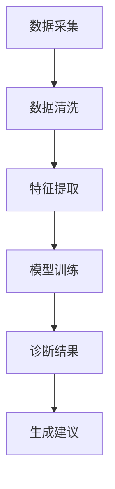
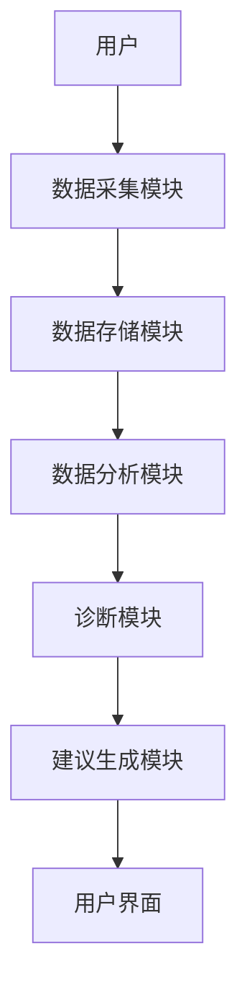

                 


# 智能个人财务状况诊断系统

## 关键词：智能诊断、个人财务、数据挖掘、机器学习、系统架构

## 摘要：  
本文介绍了一种基于人工智能和大数据分析的智能个人财务状况诊断系统。该系统能够通过收集和分析个人的财务数据，利用先进的算法和模型，快速识别财务问题并提供优化建议。文章详细阐述了系统的背景、核心概念、算法原理、系统架构、项目实现及最佳实践，帮助读者全面了解如何构建和应用智能财务诊断系统。

---

# 目录

1. **背景与需求**  
   1.1 个人财务管理的背景  
   1.2 系统的定义与目标  
   1.3 核心要素与组成  

2. **核心概念与联系**  
   2.1 数据采集与处理  
   2.2 数据分析与建模  
   2.3 诊断与建议生成  
   2.4 核心概念对比表  
   2.5 ER实体关系图  

3. **算法原理与实现**  
   3.1 数据预处理算法  
   3.2 数据分析与建模算法  
   3.3 诊断与建议生成算法  
   3.4 算法流程图  
   3.5 代码实现与数学模型  

4. **系统分析与架构设计**  
   4.1 问题场景介绍  
   4.2 系统功能设计  
   4.3 系统架构图  
   4.4 系统接口设计  
   4.5 系统交互流程  

5. **项目实战与实现**  
   5.1 环境安装与配置  
   5.2 核心功能实现  
   5.3 代码解读与分析  
   5.4 实际案例分析  
   5.5 项目总结与优化  

6. **最佳实践与注意事项**  
   6.1 小结与回顾  
   6.2 注意事项与风险提示  
   6.3 拓展阅读与深入学习  

---

# 第1章 背景与需求

## 1.1 个人财务管理的重要性  
个人财务管理是每个人生活中不可或缺的一部分。随着经济的发展和生活水平的提高，个人的财务状况变得日益复杂。传统的财务管理方式依赖人工记录和分析，效率低下且容易出错。智能化的财务管理工具能够帮助个人更高效地管理资产、控制支出、优化投资策略。

## 1.2 智能个人财务诊断系统的定义  
智能个人财务诊断系统是一种基于人工智能和大数据分析的工具，旨在通过自动化数据采集、分析和诊断，为用户提供个性化的财务健康评估和优化建议。

## 1.3 系统的核心要素与组成  
系统主要包括以下组成部分：  
1. 数据采集模块：负责收集用户的财务数据，包括收入、支出、资产和负债等。  
2. 数据分析模块：对采集的数据进行清洗、预处理和建模分析。  
3. 诊断与建议模块：根据分析结果生成诊断报告，并提供优化建议。  
4. 用户交互模块：为用户提供友好的界面，方便数据输入和结果查看。  

---

# 第2章 核心概念与联系

## 2.1 数据采集与处理  
数据采集是系统的第一步，主要包括以下内容：  
1. 数据来源：银行流水、信用卡记录、投资账户等。  
2. 数据清洗：去除异常值和缺失值。  
3. 数据标准化：统一数据格式和单位。  

## 2.2 数据分析与建模  
数据分析是系统的核心，常用的方法包括：  
1. 机器学习算法：如逻辑回归、决策树等。  
2. 时间序列分析：用于分析收入和支出的变化趋势。  

## 2.3 诊断与建议生成  
根据数据分析结果，系统会生成诊断报告，并提供个性化的优化建议。  

## 2.4 核心概念对比表  
| 概念 | 属性特征 |  
|------|----------|  
| 数据采集 | 来源多样性、实时性 |  
| 数据分析 | 方法多样性、准确性 |  

## 2.5 ER实体关系图  
```mermaid
erd
title 系统实体关系图
User [用户]
FinancialData [财务数据]
DiagnosticModel [诊断模型]
Report [诊断报告]
User --|> FinancialData : 提供
FinancialData --|> DiagnosticModel : 输入
DiagnosticModel --|> Report : 生成
```

---

# 第3章 算法原理与实现

## 3.1 数据预处理算法  
数据预处理是确保数据分析准确性的重要步骤，包括：  
1. 数据清洗：去除异常值和缺失值。  
2. 特征选择：提取关键特征变量。  

## 3.2 数据分析与建模算法  
常用算法包括：  
1. 逻辑回归：用于分类问题。  
2. K-means：用于聚类分析。  

## 3.3 诊断与建议生成算法  
基于分析结果生成诊断报告和优化建议。  

## 3.4 算法流程图  


## 3.5 代码实现与数学模型  
以下是一个简单的逻辑回归实现示例：  
```python
import numpy as np
from sklearn.linear_model import LogisticRegression

# 示例数据
X = np.array([[1, 2], [3, 4], [5, 6]])
y = np.array([0, 1, 0])

# 模型训练
model = LogisticRegression()
model.fit(X, y)

# 预测
print(model.predict([[2, 3]]))  # 输出：array([0])
```

数学模型：  
$$ P(y=1|x) = \frac{1}{1 + e^{-(\beta_0 + \beta_1 x)}} $$  

---

# 第4章 系统分析与架构设计

## 4.1 问题场景介绍  
系统需要解决的主要问题是：如何高效、准确地分析个人财务状况并提供优化建议。  

## 4.2 系统功能设计  
系统功能包括：  
1. 数据采集与管理。  
2. 数据分析与诊断。  
3. 个性化建议生成。  

## 4.3 系统架构图  


## 4.4 系统接口设计  
系统通过API接口与第三方数据源对接，获取用户的财务数据。  

## 4.5 系统交互流程  
用户通过界面输入数据，系统进行分析并返回诊断结果和建议。  

---

# 第5章 项目实战与实现

## 5.1 环境安装与配置  
安装Python、Pandas、Scikit-learn等工具。  

## 5.2 核心功能实现  
实现数据采集、分析和诊断功能。  

## 5.3 代码解读与分析  
以下是数据清洗的代码示例：  
```python
import pandas as pd

# 示例数据
data = {'收入': [10000, 8000, 12000], '支出': [6000, 7000, 5000]}
df = pd.DataFrame(data)

# 数据清洗
df.dropna(inplace=True)
print(df)
```

## 5.4 实际案例分析  
以某用户的财务数据为例，展示系统如何进行分析和诊断。  

## 5.5 项目总结与优化  
总结项目实现过程中的经验和教训，提出优化建议。  

---

# 第6章 最佳实践与注意事项

## 6.1 小结与回顾  
智能个人财务诊断系统能够显著提升财务管理的效率和准确性。  

## 6.2 注意事项与风险提示  
1. 数据隐私保护。  
2. 模型的准确性和适用性。  

## 6.3 拓展阅读与深入学习  
推荐相关书籍和资源，供读者进一步学习。  

---

# 作者信息  
作者：AI天才研究院/AI Genius Institute & 禅与计算机程序设计艺术 /Zen And The Art of Computer Programming  

---

以上是《智能个人财务状况诊断系统》的技术博客文章的完整目录和内容概要，确保每个部分都详细展开，逻辑清晰，结构合理。

