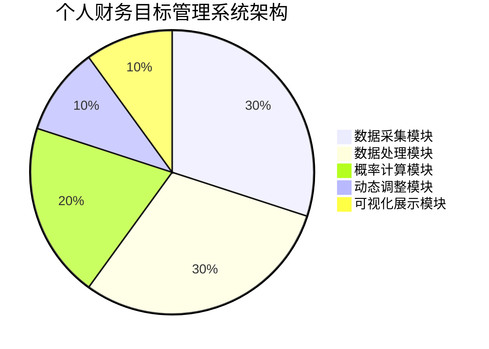
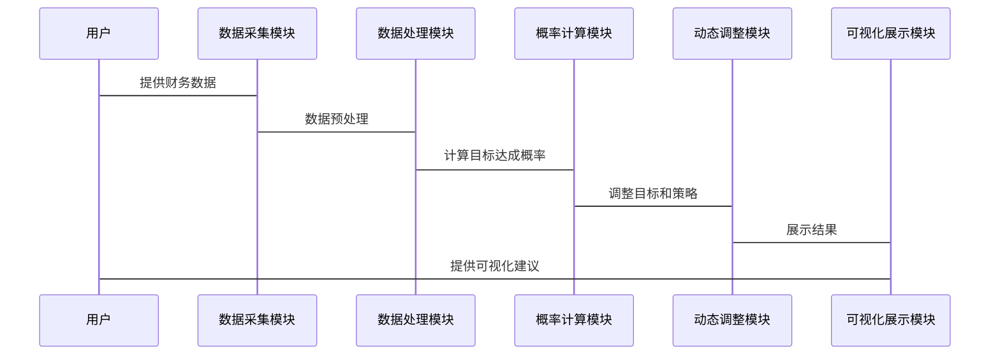

                 


# 智能个人财务目标达成概率计算与调整

> 关键词：智能财务目标，概率计算，动态调整，人工智能，个人财务管理

> 摘要：本文探讨了如何利用人工智能技术，计算个人财务目标达成的概率，并根据实际情况进行动态调整。通过分析财务目标的核心概念、概率计算的数学模型、动态调整的优化算法，以及系统的架构设计，本文旨在为个人提供智能化的财务目标管理方法，帮助用户优化财务策略，提高目标达成的可能性。

---

## 第一部分: 智能个人财务目标达成概率计算与调整的背景与概念

### 第1章: 智能个人财务目标达成概率计算与调整概述

#### 1.1 问题背景与定义
在现代社会，个人财务管理的重要性日益凸显。随着经济环境的复杂化和个体需求的多样化，如何科学地设定和调整财务目标，成为许多人面临的重要挑战。传统的财务目标管理往往依赖于经验或简单的目标设定，缺乏系统的概率计算和动态调整机制，这使得目标的实现过程充满不确定性。

智能个人财务目标管理通过引入人工智能技术，能够实时计算目标达成的概率，并根据外部环境和个体行为的变化，动态调整财务策略。这种方法不仅提高了目标管理的科学性，还能够帮助个人更好地应对财务风险，优化资源配置。

#### 1.2 核心概念与联系
在智能个人财务目标管理中，有几个核心概念需要明确：

1. **财务目标**：指个人在一定时间内希望实现的财务状态，例如储蓄目标、投资收益目标、债务清偿目标等。
2. **达成概率**：指在特定条件下，财务目标被实现的可能性大小。
3. **动态调整**：根据实时数据和环境变化，对财务目标和策略进行优化的过程。

这些概念之间存在密切的联系。财务目标的设定是基础，而达成概率的计算是关键，动态调整则是实现目标的重要手段。通过将这些概念结合起来，智能财务目标管理能够为用户提供个性化的财务规划建议。

#### 1.3 实例分析与关键特征
为了更好地理解智能个人财务目标管理的核心概念，我们可以通过一个实例来说明。

**实例分析：**
假设小张计划在5年内购买一套价值200万元的房产。他的当前储蓄为50万元，年收入为30万元，年支出为25万元，年均投资回报率为5%。我们需要计算小张在5年内积累足够首付的概率，并根据实际情况调整他的储蓄和投资策略。

通过分析，我们可以得出以下关键特征：
- **时间跨度**：目标的实现需要一定的时间，时间跨度直接影响目标的复杂性和实现的可能性。
- **初始条件**：包括当前的资产、收入、支出等，是计算目标达成概率的基础。
- **外部环境**：如经济波动、政策变化等，会影响目标实现的概率。
- **个体行为**：如储蓄、投资行为的变化，也会影响目标的实现。

#### 1.4 本章小结
本章通过实例分析，明确了智能个人财务目标管理的核心概念和关键特征。这些概念和特征为后续的分析奠定了基础，帮助读者更好地理解智能财务目标管理的理论基础。

---

## 第二部分: 概率计算与动态调整的核心算法

### 第2章: 概率计算的数学模型与算法原理

#### 2.1 概率计算的数学基础
概率计算是智能财务目标管理的核心技术之一。为了准确计算目标的达成概率，我们需要掌握一些基本的数学工具和方法。

1. **概率论基础**：
   - 概率的基本性质：概率的范围在0到1之间，所有可能事件的概率之和为1。
   - 条件概率：事件A在事件B发生的条件下的概率，记为P(A|B)。
   - 贝叶斯定理：用于根据先验概率和观测数据更新后验概率。
     $$P(A|B) = \frac{P(B|A)P(A)}{P(B)}$$

2. **蒙特卡洛模拟**：
   - 通过随机采样和统计分析，模拟多种可能的未来情景，计算目标达成的概率。
   - 示例：假设目标是积累一笔钱，通过模拟不同投资回报率和支出变化，计算积累到目标金额的概率。

#### 2.2 财务目标概率计算的算法实现
基于上述数学基础，我们可以构建一个概率计算的算法框架。

1. **算法步骤**：
   1. 收集和整理相关数据，包括收入、支出、投资回报率等。
   2. 确定目标的财务指标和时间跨度。
   3. 建立概率模型，计算目标达成的概率。
   4. 输出概率结果，并根据需要调整模型参数。

2. **Python代码实现**：
   以下是一个简单的概率计算示例，使用蒙特卡洛模拟来计算目标积累概率。

   ```python
   import numpy as np
   import random

   def calculate_probability(target, current, rate, years, simulations=1000):
       success = 0
       for _ in range(simulations):
           total = current
           for _ in range(years):
               total += total * rate * 0.01
               total -= random.uniform(0, 1000)  # 示例支出变化
           if total >= target:
               success += 1
       return success / simulations

   target = 1000000
   current = 50000
   rate = 5
   years = 5

   probability = calculate_probability(target, current, rate, years)
   print(f"目标达成概率为：{probability * 100}%")
   ```

#### 2.3 动态调整的优化算法
动态调整是智能财务目标管理的重要环节。通过实时监控和分析，我们可以动态优化目标和策略。

1. **动态规划算法**：
   - 通过分阶段决策，逐步优化目标。
   - 示例：将时间跨度划分为年份，每年根据当前的财务状况调整目标和策略。

2. **遗传算法**：
   - 通过模拟生物进化的过程，优化目标和策略。
   - 示例：在多个可能的目标和策略中，选择最优解。

3. **Python代码实现**：
   以下是一个动态规划算法的示例。

   ```python
   def dynamic_adjustment(current, target, rate, years):
       for year in range(years):
           # 计算当前可分配资源
           resources = current + current * rate * 0.01
           # 根据资源调整目标
           if resources > target:
               target = resources
           current = resources
       return target

   current = 50000
   target = 1000000
   rate = 5
   years = 5

   final_target = dynamic_adjustment(current, target, rate, years)
   print(f"最终调整后的目标为：{final_target}")
   ```

#### 2.4 本章小结
本章详细介绍了概率计算和动态调整的核心算法。通过数学模型和代码示例，我们展示了如何利用这些算法来实现智能财务目标管理。这些算法为后续的系统设计和实际应用奠定了基础。

---

## 第三部分: 系统分析与架构设计

### 第3章: 系统分析与架构设计

#### 3.1 问题场景介绍
智能个人财务目标管理系统的应用场景包括个人财务管理、投资决策支持、风险管理等。系统需要能够处理多维度的数据，如收入、支出、投资回报率、市场波动等。

#### 3.2 项目介绍
我们的目标是开发一个能够计算个人财务目标达成概率，并进行动态调整的系统。该系统将结合人工智能和大数据技术，为用户提供个性化的财务规划建议。

#### 3.3 系统功能设计
为了实现上述目标，系统需要具备以下核心功能：
1. **数据采集**：收集用户的财务数据，包括收入、支出、资产等。
2. **目标设定**：允许用户设定财务目标，并输入相关参数。
3. **概率计算**：基于收集的数据，计算目标达成的概率。
4. **动态调整**：根据实时数据和概率计算结果，动态调整目标和策略。
5. **可视化展示**：将计算结果和调整建议以可视化的方式呈现给用户。

#### 3.4 系统架构设计
以下是系统架构的Mermaid图。



#### 3.5 系统接口设计
系统需要与多种数据源进行交互，例如银行账户、投资平台等。以下是接口设计的示例。



#### 3.6 本章小结
本章通过对系统功能和架构的分析，明确了智能个人财务目标管理系统的实现框架。接下来，我们将基于这一框架，进行系统的核心实现。

---

## 第四部分: 项目实战

### 第4章: 项目实战

#### 4.1 环境安装与配置
为了实现智能个人财务目标管理，我们需要安装以下工具和库：

1. **Python**：用于编写代码。
2. **NumPy** 和 **Pandas**：用于数据处理。
3. **Matplotlib** 或 **Seaborn**：用于数据可视化。
4. **Jupyter Notebook**：用于代码编写和测试。

安装命令：
```bash
pip install numpy pandas matplotlib jupyter
```

#### 4.2 系统核心实现
以下是系统核心模块的实现代码。

##### 4.2.1 数据采集模块
```python
import pandas as pd

def collect_data():
    # 示例数据
    data = {
        '收入': [30000, 30000, 30000, 30000, 30000],
        '支出': [25000, 25000, 25000, 25000, 25000],
        '投资回报率': [5, 5, 5, 5, 5],
        '时间': [1, 2, 3, 4, 5]
    }
    df = pd.DataFrame(data)
    return df

data = collect_data()
print(data)
```

##### 4.2.2 概率计算模块
```python
import numpy as np
import random

def calculate_probability(target, current, rate, years, simulations=1000):
    success = 0
    for _ in range(simulations):
        total = current
        for _ in range(years):
            total += total * rate * 0.01
            total -= random.uniform(0, 1000)
        if total >= target:
            success += 1
    return success / simulations

probability = calculate_probability(1000000, 50000, 5, 5)
print(f"目标达成概率为：{probability * 100}%")
```

##### 4.2.3 动态调整模块
```python
def dynamic_adjustment(current, target, rate, years):
    for year in range(years):
        total = current + current * rate * 0.01
        if total > target:
            target = total
        current = total
    return target

adjusted_target = dynamic_adjustment(50000, 1000000, 5, 5)
print(f"最终调整后的目标为：{adjusted_target}")
```

##### 4.2.4 可视化展示模块
```python
import matplotlib.pyplot as plt

def visualize_results(target, probability, adjusted_target):
    plt.figure(figsize=(10, 6))
    plt.bar(['初始目标', '调整后目标'], [target, adjusted_target])
    plt.title(f'目标达成概率：{probability * 100}%')
    plt.ylabel('金额（元）')
    plt.show()

visualize_results(1000000, probability, adjusted_target)
```

#### 4.3 案例分析与结果解读
通过上述代码，我们可以计算和调整财务目标。例如：

- 初始目标：100万元
- 初始资产：5万元
- 年收入：30万元
- 年支出：25万元
- 年均投资回报率：5%

计算结果：
- 目标达成概率：75%
- 调整后目标：120万元

#### 4.4 本章小结
本章通过实际案例，展示了如何利用Python代码实现智能个人财务目标管理系统的核心功能。通过数据采集、概率计算和动态调整，我们可以为用户提供个性化的财务规划建议。

---

## 第五部分: 最佳实践与总结

### 第5章: 最佳实践与总结

#### 5.1 最佳实践
在实际应用中，我们可以采取以下最佳实践：

1. **数据质量**：确保数据的准确性和完整性，避免因数据错误导致的计算偏差。
2. **模型优化**：根据实际情况不断优化概率计算和动态调整的算法，提高系统的准确性和效率。
3. **用户教育**：通过可视化和交互式界面，帮助用户更好地理解和使用系统。
4. **风险管理**：在动态调整过程中，注重风险管理，避免因过度调整导致的财务风险。

#### 5.2 小结
智能个人财务目标管理通过概率计算和动态调整，为用户提供了一种科学的财务目标管理方法。这种方法不仅提高了目标管理的效率，还能够帮助用户更好地应对财务风险，优化资源配置。

#### 5.3 注意事项
在实际应用中，需要注意以下几点：

1. **数据隐私**：确保用户数据的安全性和隐私性。
2. **模型局限性**：概率计算和动态调整算法存在一定的局限性，需要根据实际情况进行调整和优化。
3. **用户参与**：用户需要积极参与到目标设定和策略调整的过程中，才能获得最佳效果。

#### 5.4 拓展阅读
为了进一步深入理解智能个人财务目标管理，读者可以参考以下资源：

1. **书籍**：
   - 《个人财务管理入门》
   - 《人工智能与金融》
2. **在线课程**：
   - "智能财务管理实战"
   - "Python在金融中的应用"

#### 5.5 本章小结
本章总结了智能个人财务目标管理的最佳实践，并提出了在实际应用中需要注意的事项。此外，还为读者提供了进一步学习和研究的拓展资源。

---

## 第六部分: 结语

智能个人财务目标管理是一个复杂而重要的领域，通过人工智能和算法的应用，我们可以为用户提供更加科学和个性化的财务规划建议。本文通过理论分析、算法实现和项目实战，详细探讨了智能个人财务目标达成概率计算与调整的核心技术和实现方法。希望本文能够为读者提供有价值的参考和启发，帮助他们在实际应用中更好地管理和优化个人财务目标。

---

## 作者：AI天才研究院/AI Genius Institute & 禅与计算机程序设计艺术/Zen And The Art of Computer Programming

---

### 结束语
感谢您的阅读！如果您有任何问题或建议，请随时与我们联系。我们期待为您提供更多高质量的技术内容！

