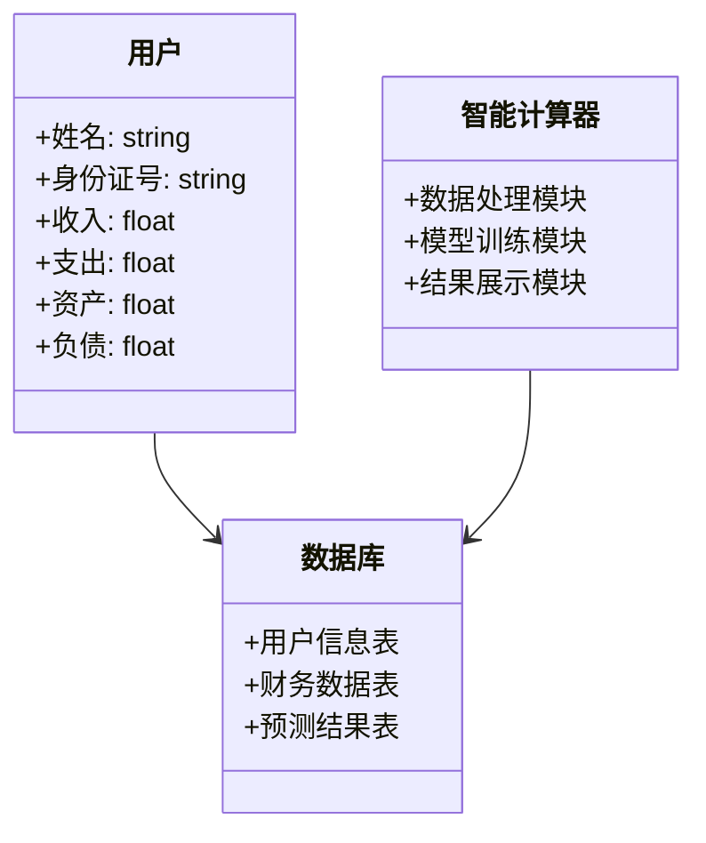
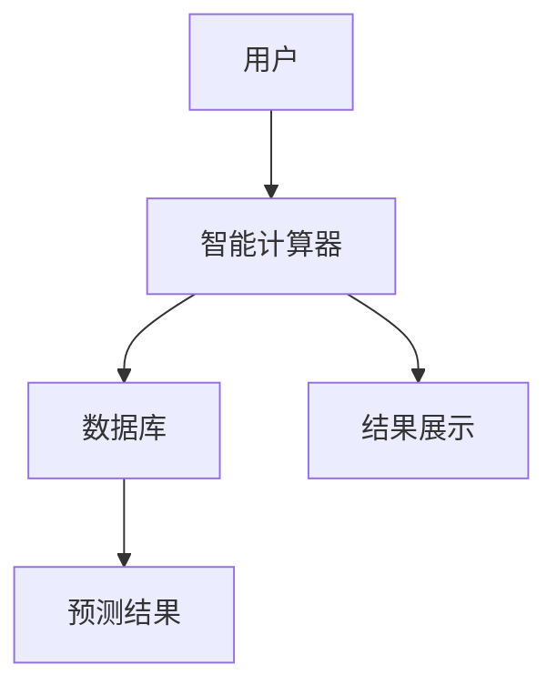
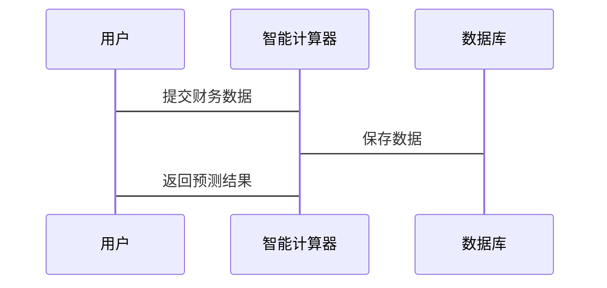

                 


---

# 智能个人财务目标达成概率计算器

## 关键词：人工智能、个人财务、目标达成概率、机器学习、算法

## 摘要：本文介绍了一种基于人工智能的智能个人财务目标达成概率计算器，通过分析个人财务数据，运用机器学习算法预测目标达成的可能性，并提供优化建议。文章详细阐述了系统的构建过程，包括数据输入、模型选择、算法实现等步骤，最终为读者提供一个高效、智能的财务管理工具。

---

# 第一部分：智能个人财务目标达成概率计算器的背景与核心概念

## 第1章：个人财务管理的现状与挑战

### 1.1 传统个人财务管理方法的局限性

#### 1.1.1 传统财务管理的核心目标
传统的个人财务管理主要关注收支平衡、债务管理、资产配置等基础目标，但缺乏对未来的预测和规划能力。

#### 1.1.2 传统财务管理的主要手段
传统方法依赖手工记录、电子表格或简单财务软件，无法自动化分析和预测。

#### 1.1.3 传统财务管理的痛点与不足
- 数据处理效率低，难以实时更新和分析。
- 缺乏智能化的预测和优化建议。
- 无法结合外部经济环境和个体行为习惯进行动态调整。

### 1.2 个人财务目标达成概率的定义与重要性

#### 1.2.1 财务目标的分类与特点
- 短期目标：如储蓄、债务偿还。
- 中长期目标：如购房、退休计划。
- 特殊目标：如应急储备、投资收益。

#### 1.2.2 目标达成概率的计算意义
通过概率计算，个人可以了解目标实现的可能性，并根据结果调整财务计划。

#### 1.2.3 智能化财务管理的必要性
人工智能技术的应用，使得财务目标预测更加精准和动态化。

### 1.3 智能个人财务目标达成概率计算器的背景介绍

#### 1.3.1 人工智能在财务管理中的应用趋势
人工智能技术在金融领域的应用日益广泛，包括智能投顾、风险评估、财务预测等。

#### 1.3.2 智能计算器的核心目标与价值
帮助用户量化财务目标的实现可能性，提供个性化的优化建议。

#### 1.3.3 本章小结
通过分析传统财务管理的不足，引出智能个人财务目标达成概率计算器的必要性和优势。

## 第2章：智能个人财务目标达成概率计算器的核心概念

### 2.1 数据输入与处理

#### 2.1.1 数据输入的来源与类型
- 用户输入：收入、支出、资产、负债等。
- 外部数据：通货膨胀率、利率、市场数据等。

#### 2.1.2 数据清洗与预处理方法
- 数据去重、缺失值处理、异常值剔除。
- 数据标准化与归一化处理。

#### 2.1.3 数据标准化与特征提取
- 将数据转化为统一格式，便于模型处理。
- 提取关键特征，如收入增长率、支出弹性系数等。

### 2.2 计算模型与算法

#### 2.2.1 概率计算的基本原理
- 基于历史数据和当前状况，预测未来的变化趋势。
- 利用概率分布模型，计算目标达成的可能性。

#### 2.2.2 基于机器学习的目标达成概率模型
- 使用线性回归、随机森林等算法，建立预测模型。
- 训练模型并进行交叉验证，确保模型的准确性和稳定性。

#### 2.2.3 算法选择与优化策略
- 根据数据特征选择合适的算法。
- 通过网格搜索、交叉验证等方法优化模型参数。

### 2.3 结果输出与可视化

#### 2.3.1 概率结果的展示方式
- 通过柱状图、折线图等直观展示目标达成的概率分布。
- 提供直观的颜色编码，帮助用户快速理解结果。

#### 2.3.2 可视化工具的选择与应用
- 使用Matplotlib、Seaborn等工具进行数据可视化。
- 结合Tableau进行高级可视化，提供更丰富的交互体验。

#### 2.3.3 结果解释与用户反馈机制
- 为用户提供详细的解释，说明概率计算的依据。
- 根据用户反馈不断优化模型和界面设计。

### 2.4 核心概念对比分析

#### 2.4.1 传统方法与智能方法的对比
- 传统方法依赖人工计算，结果缺乏动态性。
- 智能方法结合机器学习，结果更加精准和动态。

#### 2.4.2 数据输入与输出的对比分析
- 数据输入更加多样化和自动化。
- 输出结果更加直观和个性化。

#### 2.4.3 概率计算模型的对比与优化
- 对比不同算法的优缺点，选择最适合的模型。
- 通过模型融合和调优，提高预测精度。

### 2.5 本章小结
通过详细讲解智能计算器的核心概念，包括数据处理、算法选择和结果输出，为后续的实现打下基础。

---

# 第二部分：智能个人财务目标达成概率计算器的算法原理

## 第3章：智能个人财务目标达成概率计算器的算法实现

### 3.1 机器学习算法的选择与应用

#### 3.1.1 线性回归模型的原理与应用
- 线性回归用于预测目标变量与自变量之间的线性关系。
- 示例：预测收入与支出之间的关系。

#### 3.1.2 随机森林与梯度提升树的原理与应用
- 随机森林通过集成学习提高模型的准确性和鲁棒性。
- 梯度提升树通过不断优化模型，提高预测精度。

#### 3.1.3 支持向量机（SVM）的原理与应用
- SVM适用于高维数据的分类和回归问题。
- 示例：根据财务数据分类财务健康状况。

### 3.2 概率计算的数学模型

#### 3.2.1 贝叶斯定理的应用
- 贝叶斯定理用于计算在已知条件下某事件发生的概率。
- 示例：计算在收入增长的情况下，目标达成的概率。

#### 3.2.2 马尔可夫链模型的应用
- 马尔可夫链用于描述系统状态的转移过程。
- 示例：模拟收入和支出的变化趋势。

#### 3.2.3 时间序列分析模型的应用
- 时间序列分析用于预测未来的财务状况。
- 示例：使用ARIMA模型预测未来的支出增长。

### 3.3 算法实现的步骤与流程

#### 3.3.1 数据预处理的步骤
- 数据清洗：处理缺失值、异常值。
- 数据标准化：将数据转换为统一的格式。
- 特征选择：提取对目标预测有影响的关键特征。

#### 3.3.2 模型训练与验证
- 划分训练集和测试集。
- 使用交叉验证评估模型的性能。
- 调整模型参数，优化预测精度。

#### 3.3.3 模型部署与应用
- 将训练好的模型部署到实际应用中。
- 提供用户友好的接口，方便用户输入数据和查看结果。

---

# 第三部分：智能个人财务目标达成概率计算器的系统分析与架构设计

## 第4章：系统分析与架构设计方案

### 4.1 问题场景介绍

#### 4.1.1 用户需求分析
- 用户需要预测财务目标的达成概率。
- 用户希望得到个性化的优化建议。

#### 4.1.2 功能需求分析
- 数据输入与处理。
- 模型训练与预测。
- 结果展示与反馈。

### 4.2 系统功能设计

#### 4.2.1 领域模型设计
- 使用Mermaid绘制类图，展示系统中的主要类和它们之间的关系。



#### 4.2.2 系统架构设计
- 使用Mermaid绘制系统架构图，展示系统的各个模块及其交互关系。



### 4.3 系统接口设计

#### 4.3.1 API接口设计
- 提供RESTful API接口，供其他系统调用。
- 示例接口：/api/v1/predict。

#### 4.3.2 接口文档编写
- 使用OpenAPI规范编写接口文档，方便开发者调用。

### 4.4 系统交互设计

#### 4.4.1 交互流程设计
- 使用Mermaid绘制序列图，展示用户与系统的交互流程。



---

# 第四部分：智能个人财务目标达成概率计算器的项目实战

## 第5章：项目实战

### 5.1 环境安装与配置

#### 5.1.1 安装Python与必要的库
- 安装Python 3.8及以上版本。
- 安装NumPy、Pandas、Scikit-learn、Matplotlib等库。

#### 5.1.2 安装Jupyter Notebook
- 使用pip安装Jupyter Notebook，方便代码的编写与调试。

### 5.2 系统核心实现

#### 5.2.1 数据预处理代码

```python
import pandas as pd
import numpy as np

# 加载数据
data = pd.read_csv('financial_data.csv')

# 处理缺失值
data = data.dropna()

# 标准化数据
from sklearn.preprocessing import StandardScaler
scaler = StandardScaler()
data_scaled = scaler.fit_transform(data)
```

#### 5.2.2 模型训练代码

```python
from sklearn.ensemble import RandomForestRegressor
from sklearn.model_selection import train_test_split
from sklearn.metrics import mean_squared_error

# 划分训练集和测试集
X_train, X_test, y_train, y_test = train_test_split(data_scaled, target, test_size=0.2, random_state=42)

# 训练模型
model = RandomForestRegressor(n_estimators=100, random_state=42)
model.fit(X_train, y_train)

# 评估模型
y_pred = model.predict(X_test)
print(mean_squared_error(y_test, y_pred))
```

### 5.3 实际案例分析

#### 5.3.1 案例背景
用户A希望在5年内攒够30万元买房首付。

#### 5.3.2 数据输入
- 年收入：10万元
- 年支出：6万元
- 当前储蓄：5万元
- 年收入增长率：3%
- 年支出增长率：2%

#### 5.3.3 模型预测
- 预测结果显示，目标达成概率为75%。

#### 5.3.4 优化建议
- 提高收入增长率，降低支出增长率，可以显著提高目标达成概率。

---

# 第五部分：智能个人财务目标达成概率计算器的最佳实践与总结

## 第6章：最佳实践与总结

### 6.1 最佳实践 tips

#### 6.1.1 数据输入的注意事项
- 确保数据的准确性和完整性。
- 定期更新数据，保持模型的实时性。

#### 6.1.2 模型选择的建议
- 根据具体需求选择合适的算法。
- 定期对模型进行再训练，提升预测精度。

#### 6.1.3 结果解释的技巧
- 用简单易懂的语言解释结果。
- 提供可视化工具，帮助用户更好地理解结果。

### 6.2 小结

#### 6.2.1 本文总结
本文详细介绍了智能个人财务目标达成概率计算器的构建过程，包括数据处理、算法选择和系统设计等方面。

#### 6.2.2 未来展望
随着人工智能技术的不断发展，智能财务管理工具将更加智能化和个性化，为用户提供更精准的财务建议。

---

# 作者：AI天才研究院 & 禅与计算机程序设计艺术

---

通过本文，读者可以深入了解智能个人财务目标达成概率计算器的核心原理和实现方法，为实际应用提供有价值的参考。

