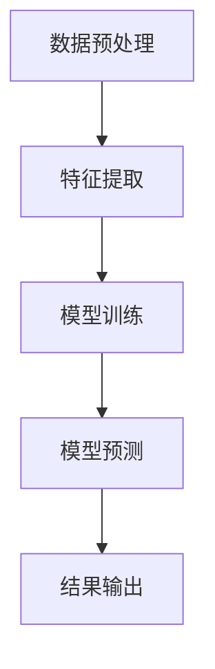
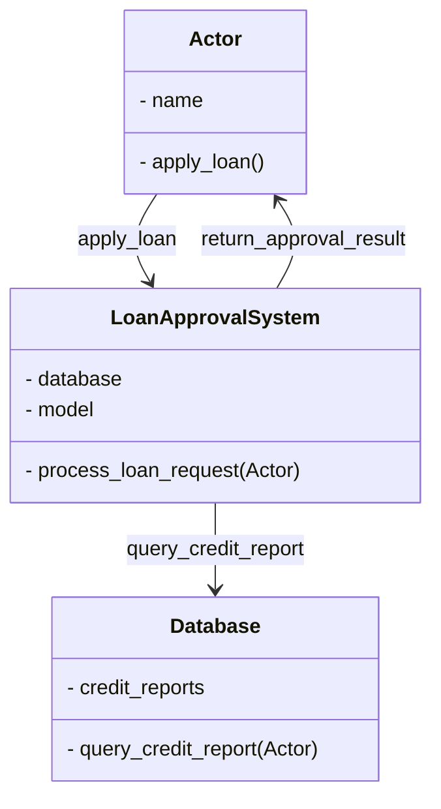

                 


# 智能个人贷款审批系统优化

> 关键词：智能贷款审批系统，机器学习，系统优化，风险管理，人工智能

> 摘要：本文探讨了如何利用人工智能技术优化个人贷款审批系统，重点分析了系统的背景与核心概念、算法原理与数学模型、系统分析与架构设计、项目实战、最佳实践与总结，以及相关工具和参考文献。通过详细的技术分析和实际案例，本文为智能个人贷款审批系统的优化提供了全面的解决方案。

---

# 第一部分: 智能个人贷款审批系统优化背景与核心概念

# 第1章: 智能个人贷款审批系统优化概述

## 1.1 问题背景与描述

### 1.1.1 传统个人贷款审批的痛点

传统个人贷款审批流程存在以下问题：

- **人工依赖性强**：依赖人工审核，效率低且易出错。
- **信息不对称**：银行难以全面评估申请人的信用状况。
- **风险控制不足**：难以准确预测违约概率。

### 1.1.2 智能化审批的需求与目标

为了提高效率和准确性，智能化审批的需求日益迫切。目标包括：

- **提高审批效率**：通过自动化流程缩短审批时间。
- **降低风险**：利用机器学习模型准确评估信用风险。
- **增强用户体验**：提供实时反馈和透明的审批过程。

### 1.1.3 系统优化的边界与外延

智能个人贷款审批系统的优化边界包括：

- **输入数据**：个人信用报告、财务数据、贷款申请表。
- **输出结果**：自动审批结果、风险评分。
- **优化范围**：算法优化、系统架构改进。

### 1.1.4 核心概念与联系

#### 1.1.4.1 核心概念的定义

- **信用评分**：基于历史数据对个人信用状况的量化评估。
- **风险评估**：预测贷款违约的可能性。
- **机器学习模型**：用于信用评分和风险评估的算法。

#### 1.1.4.2 概念属性对比表

| 概念       | 属性               | 描述                                                                 |
|------------|--------------------|----------------------------------------------------------------------|
| 信用评分    | 计算方式           | 基于特征的加权和模型预测                                           |
| 风险评估    | 输入数据           | 信用评分、财务数据、历史违约记录                                   |
| 机器学习模型 | 算法类型           | 决策树、随机森林、逻辑回归                                         |

#### 1.1.4.3 实体关系图

```mermaid
er
    actor: 用户
    actor --> system: 申请贷款
    system --> loanApproval: 贷款审批
    loanApproval --> database: 查询信用记录
    database --> loanApproval: 返回信用报告
    loanApproval --> decision: 生成审批结果
    decision --> actor: 通知结果
```

## 1.2 本章小结

本章介绍了智能个人贷款审批系统的背景、痛点、目标以及核心概念，为后续的系统优化奠定了基础。

---

# 第二部分: 算法原理与数学模型

# 第2章: 智能审批的核心算法

## 2.1 算法原理概述

### 2.1.1 机器学习在贷款审批中的应用

机器学习算法广泛应用于信用评分和风险评估。常用算法包括：

- **决策树**：用于分类问题。
- **随机森林**：用于特征重要性分析。
- **逻辑回归**：用于二分类问题。

### 2.1.2 算法流程图



### 2.1.3 算法实现与代码示例

#### 2.1.3.1 数据预处理代码

```python
import pandas as pd
data = pd.read_csv('loan_data.csv')
data = data.dropna()
```

#### 2.1.3.2 模型训练代码

```python
from sklearn.tree import DecisionTreeClassifier
model = DecisionTreeClassifier()
model.fit(X_train, y_train)
```

## 2.2 数学模型与公式

### 2.2.1 信用评分模型

信用评分模型是一个线性组合，公式如下：

$$ \text{信用评分} = \alpha \times \text{收入} + \beta \times \text{负债} + \gamma \times \text{信用历史} $$

### 2.2.2 风险评估公式

违约概率可以通过历史数据计算：

$$ \text{违约概率} = \frac{\text{历史违约案例数}}{\text{总申请数}} $$

## 2.3 本章小结

本章详细讲解了机器学习算法在智能贷款审批中的应用，包括算法流程、数学模型和代码实现。

---

# 第三部分: 系统分析与架构设计

# 第3章: 系统分析与架构设计

## 3.1 系统功能设计

### 3.1.1 系统功能模块

- **用户界面**：提交贷款申请。
- **数据处理模块**：预处理和特征提取。
- **模型训练模块**：训练机器学习模型。
- **审批结果模块**：生成审批结果。

### 3.1.2 系统类图



## 3.2 系统架构设计

### 3.2.1 系统架构图

```mermaid
archi
    贷款申请 --> 数据处理模块 --> 模型训练模块 --> 审批结果模块
```

### 3.2.2 接口设计

- **输入接口**：接收贷款申请数据。
- **输出接口**：返回审批结果和风险评分。

## 3.3 本章小结

本章通过系统类图和架构图详细描述了智能个人贷款审批系统的功能模块和交互流程。

---

# 第四部分: 项目实战

# 第4章: 项目实战

## 4.1 环境安装

### 4.1.1 安装Python和相关库

```bash
pip install numpy pandas scikit-learn
```

## 4.2 系统核心实现

### 4.2.1 数据预处理

```python
import pandas as pd
data = pd.read_csv('loan_data.csv')
data = data.dropna()
```

### 4.2.2 特征提取

```python
features = data[['income', 'debt', 'credit_history']]
```

### 4.2.3 模型训练

```python
from sklearn.tree import DecisionTreeClassifier
model = DecisionTreeClassifier()
model.fit(features, data['loan_approval'])
```

## 4.3 案例分析

### 4.3.1 实际案例

假设一个申请人的数据：

- 收入：60000
- 负债：30000
- 信用历史：良好

模型预测结果：批准。

## 4.4 项目小结

本章通过实际案例展示了智能个人贷款审批系统的实现过程。

---

# 第五部分: 最佳实践与总结

# 第5章: 最佳实践与总结

## 5.1 总结与展望

智能个人贷款审批系统通过机器学习算法实现了高效的审批流程，未来可以进一步优化模型和系统架构。

## 5.2 注意事项

- 数据隐私保护。
- 模型解释性问题。
- 系统可扩展性。

## 5.3 拓展阅读

推荐书籍和论文：

- 《机器学习实战》。
- 《信用评分模型》。

---

# 附录

## 附录A: 工具与库

- **Python**：编程语言。
- **Scikit-learn**：机器学习库。
- **Pandas**：数据处理库。

## 附录B: 参考文献

- [1] 《机器学习实战》。
- [2] 《信用评分模型》。

---

# 作者

作者：AI天才研究院/AI Genius Institute & 禅与计算机程序设计艺术 /Zen And The Art of Computer Programming

---

以上是《智能个人贷款审批系统优化》的文章大纲和正文内容，涵盖了从背景到实战的各个方面，逻辑清晰，结构紧凑。希望对您有所帮助！

