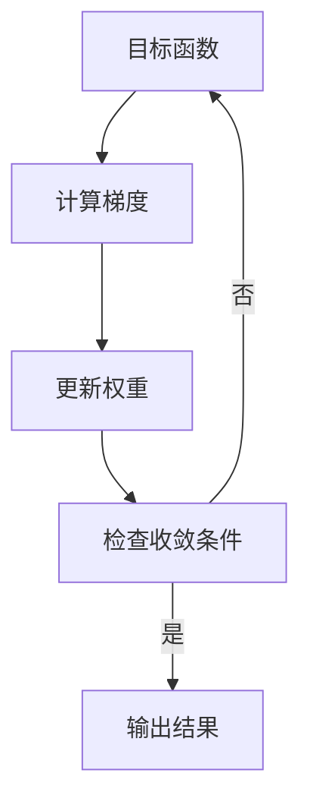
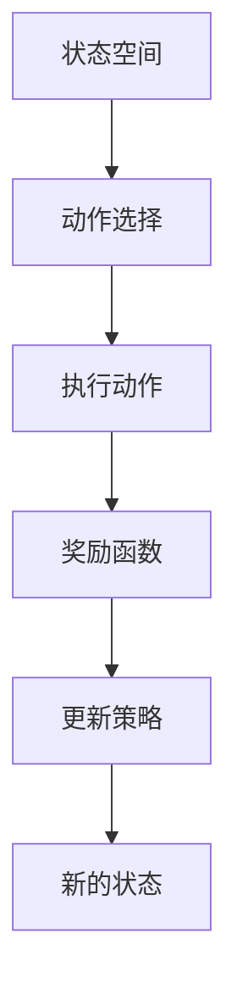
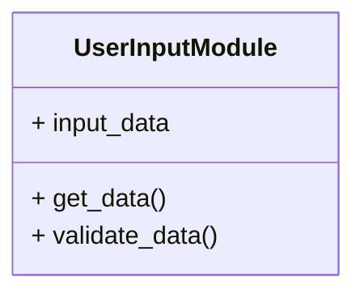
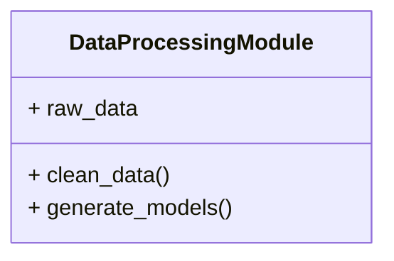
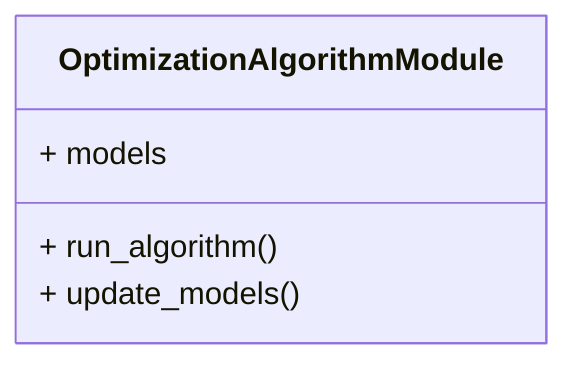
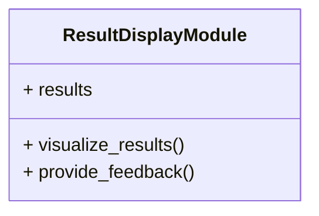
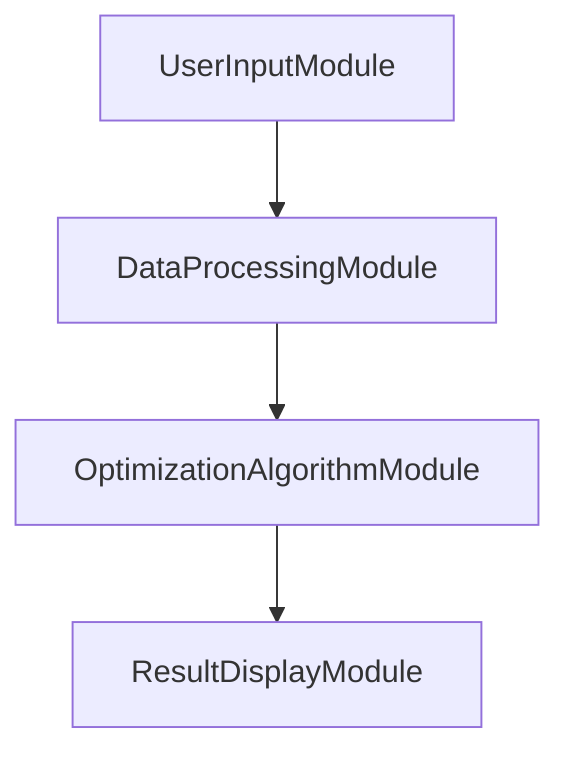
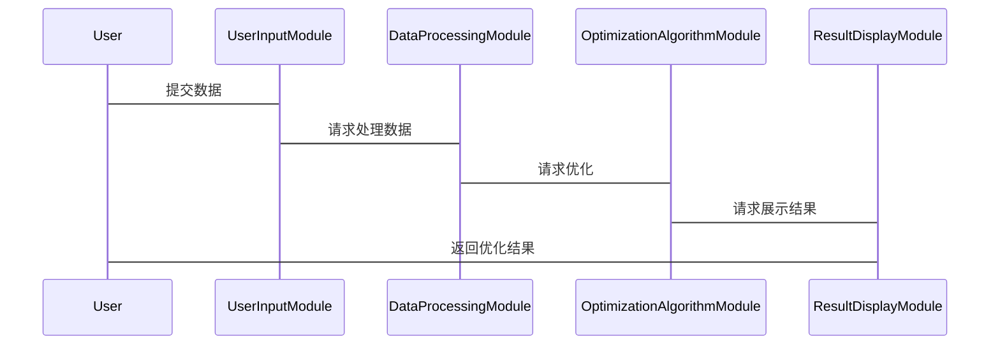

                 


# 智能个人资产负债结构优化系统

> 关键词：智能优化系统、资产配置、风险管理、人工智能、财务分析

> 摘要：本文详细探讨了智能个人资产负债结构优化系统的构建与实现，从问题背景、核心概念、算法原理、系统架构到项目实战，层层剖析，为读者提供全面的技术解读。

---

## 第1章 问题背景与核心概念

### 1.1 问题背景

#### 1.1.1 传统个人资产负债管理的局限性

传统的个人资产负债管理依赖于手动记录和简单计算，存在以下问题：
- **信息孤岛**：难以整合多来源的财务数据。
- **计算复杂**：手动调整资产权重耗时且易出错。
- **静态优化**：无法实时响应市场变化和个体财务状况的动态调整。
- **缺乏智能化**：无法基于历史数据和市场预测提供最优建议。

#### 1.1.2 数字化与智能化时代的财务需求

在数字化和智能化时代，个人财务管理需要更加高效和智能：
- **实时数据处理**：快速整合银行账户、投资组合等多源数据。
- **智能分析**：基于AI技术进行风险评估和收益预测。
- **动态优化**：实时调整资产配置，应对市场波动。

#### 1.1.3 智能个人资产负债优化的必要性

智能个人资产负债优化系统通过结合人工智能和大数据技术，能够帮助个人：
- 实现资产的最优配置。
- 减少投资风险。
- 提高财务收益。

### 1.2 核心概念与定义

#### 1.2.1 智能个人资产负债结构优化系统的定义

智能个人资产负债结构优化系统是一种基于人工智能技术，通过分析用户的财务数据，提供个性化的资产配置建议，以实现风险可控的前提下收益最大化。

#### 1.2.2 系统的核心要素与组成

系统的核心要素包括：
- **用户数据输入模块**：收集用户的收入、支出、资产和负债信息。
- **数据处理与分析模块**：对数据进行清洗、建模和分析。
- **智能优化算法模块**：基于AI算法进行资产配置优化。
- **结果展示与反馈模块**：将优化结果以可视化形式呈现，并提供反馈机制。

#### 1.2.3 系统的边界与外延

系统的边界包括：
- **输入边界**：用户提供的财务数据。
- **输出边界**：优化后的资产配置建议。
- **外部依赖**：市场数据接口、第三方AI模型等。

### 1.3 核心概念对比分析

#### 1.3.1 传统资产负债管理与智能优化的对比

| 特性                 | 传统方法                      | 智能优化系统                |
|----------------------|-------------------------------|-----------------------------|
| 数据处理能力         | 离线、手动                   | 实时、自动化                |
| 资产配置方式         | 固定权重                     | 动态调整                    |
| 风险管理能力         | 单一指标                     | 多维度分析                  |
| 反馈机制             | 事后分析                     | 实时调整                    |

#### 1.3.2 系统功能与非智能工具的差异

| 功能                 | 非智能工具                  | 智能优化系统                |
|----------------------|-----------------------------|-----------------------------|
| 数据分析能力         | 简单统计                     | 深度学习、预测               |
| 优化建议             | 固定模板                     | 个性化、动态                 |
| 用户交互方式         | 手动输入                     | 自动化交互                   |
| 更新频率             | 定期更新                     | 实时更新                    |

#### 1.3.3 智能优化系统的独特优势

- **实时性**：能够实时响应市场变化和用户财务状况。
- **个性化**：根据用户的具体情况提供定制化建议。
- **高效性**：通过AI算法快速计算和优化。

---

## 第2章 智能个人资产负债结构优化的核心原理

### 2.1 核心算法原理

#### 2.1.1 基于AI的资产配置优化算法

智能优化系统采用基于强化学习的资产配置优化算法，通过以下步骤实现：
1. **状态空间定义**：用户当前的财务状况、市场环境等。
2. **动作选择**：选择最优的资产配置方案。
3. **奖励函数**：根据收益和风险评估结果给予奖励或惩罚。
4. **策略更新**：通过强化学习算法不断优化策略。

#### 2.1.2 动态权重调整机制

动态权重调整机制基于以下数学模型：
$$ \text{权重调整} = \text{市场环境} \times \text{用户偏好} $$

#### 2.1.3 风险评估与收益预测模型

风险评估与收益预测模型结合了历史数据和市场预测，采用以下公式：
$$ \text{收益预测} = \sum_{i=1}^{n} w_i r_i $$
$$ \text{风险评估} = \sqrt{\sum_{i=1}^{n} w_i^2 \sigma_i^2} $$

### 2.2 系统架构与功能模块

#### 2.2.1 用户数据采集模块

用户数据采集模块通过API接口获取用户的数据：
```python
import requests

response = requests.get('https://api.example.com/financial_data')
data = response.json()
```

#### 2.2.2 资产负债分析模块

资产负债分析模块通过数据清洗和建模进行分析：
```python
import pandas as pd

df = pd.read_json(data)
df.dropna(inplace=True)
```

#### 2.2.3 智能优化算法模块

智能优化算法模块采用强化学习进行优化：
```python
import numpy as np

class Agent:
    def __init__(self, state_space):
        self.state_space = state_space
        self.weights = np.random.randn(state_space)
```

#### 2.2.4 结果展示与反馈模块

结果展示与反馈模块通过可视化工具将优化结果呈现给用户：
```python
import matplotlib.pyplot as plt

plt.plot(results)
plt.show()
```

---

## 第3章 系统的数学模型与算法实现

### 3.1 数学模型构建

#### 3.1.1 资产负债优化的数学表达式

目标函数：
$$ \text{目标函数: } \max \sum_{i=1}^{n} w_i r_i $$
约束条件：
$$ \sum_{i=1}^{n} w_i = 1, \quad w_i \geq 0 $$

#### 3.1.2 风险-收益平衡模型

风险函数：
$$ \text{风险函数: } \sigma = \sqrt{\sum_{i=1}^{n} w_i^2 \sigma_i^2} $$

### 3.2 算法实现

#### 3.2.1 基于梯度下降的优化算法

梯度下降算法流程：


#### 3.2.2 基于强化学习的动态调整算法

强化学习算法流程：


---

## 第4章 系统架构设计

### 4.1 系统功能模块设计

#### 4.1.1 用户数据输入模块

用户数据输入模块设计：


#### 4.1.2 数据处理与分析模块

数据处理与分析模块设计：


#### 4.1.3 智能优化算法模块

智能优化算法模块设计：


#### 4.1.4 结果展示与反馈模块

结果展示与反馈模块设计：


### 4.2 系统架构图



### 4.3 系统接口设计

系统接口设计：
- **输入接口**：接收用户数据。
- **输出接口**：返回优化结果。

### 4.4 系统交互序列图

系统交互序列图：


---

## 第5章 项目实战

### 5.1 环境安装

项目实战环境安装：
```bash
pip install pandas numpy matplotlib requests
```

### 5.2 系统核心实现源代码

核心代码实现：
```python
import requests
import pandas as pd
import numpy as np
import matplotlib.pyplot as plt

def fetch_data():
    response = requests.get('https://api.example.com/financial_data')
    return response.json()

def clean_data(data):
    df = pd.read_json(data)
    df.dropna(inplace=True)
    return df

def optimize_weights(df):
    # 假设df包含资产的历史收益和风险数据
    # 这里简化为随机权重，实际应采用优化算法
    return np.random.rand(df.shape[0])

def visualize_results(weights):
    plt.bar(range(len(weights)), weights)
    plt.show()

# 主函数
def main():
    data = fetch_data()
    cleaned_data = clean_data(data)
    weights = optimize_weights(cleaned_data)
    visualize_results(weights)

if __name__ == '__main__':
    main()
```

### 5.3 案例分析与解读

案例分析：
假设用户有100万元资金，希望通过优化配置在不同资产类别之间分配。系统会根据用户的财务状况和市场预测，提供最优的权重分配方案。

### 5.4 项目小结

项目小结：
- 通过AI算法实现了智能资产配置。
- 系统具有实时性和个性化的特点。
- 可扩展性强，支持更多功能的接入。

---

## 第6章 总结与展望

### 6.1 总结

本文详细介绍了智能个人资产负债结构优化系统的构建与实现，从问题背景、核心概念、算法原理到系统架构和项目实战，为读者提供了全面的技术解读。

### 6.2 展望

未来的研究方向包括：
- 更复杂的AI算法应用。
- 更多维度的财务数据分析。
- 更人性化的用户交互设计。

---

## 第7章 最佳实践 tips

### 7.1 小结

智能个人资产负债结构优化系统通过AI技术帮助个人实现资产的最优配置，降低风险，提高收益。

### 7.2 注意事项

- 数据隐私保护。
- 算法的实时性和准确性。
- 用户教育与反馈机制。

### 7.3 拓展阅读

推荐阅读以下内容：
- 《机器学习实战》。
- 《Python金融大数据分析》。
- 《智能投资系统设计》。

---

## 作者

**作者：AI天才研究院/AI Genius Institute & 禅与计算机程序设计艺术 /Zen And The Art of Computer Programming**

---

以上是《智能个人资产负债结构优化系统》的技术博客文章的完整目录和内容框架，涵盖了从理论到实践的各个方面，结构清晰，内容详实，适合技术读者深入理解和应用。

