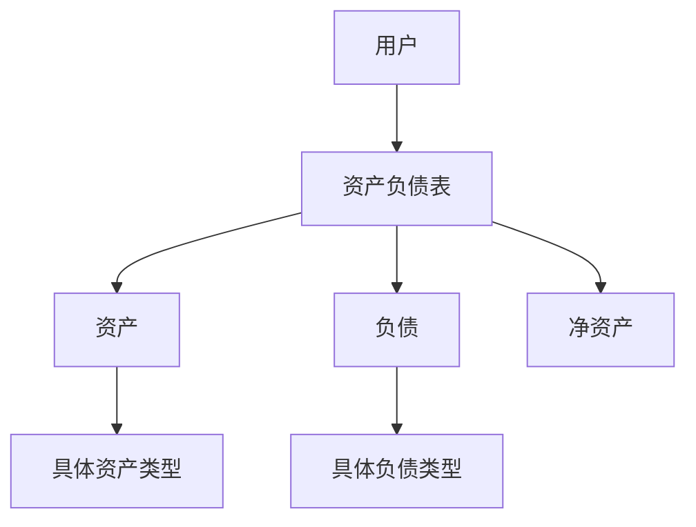
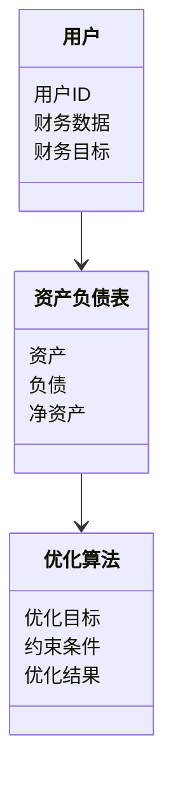
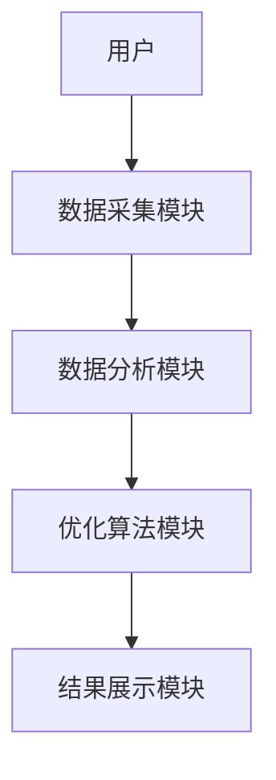
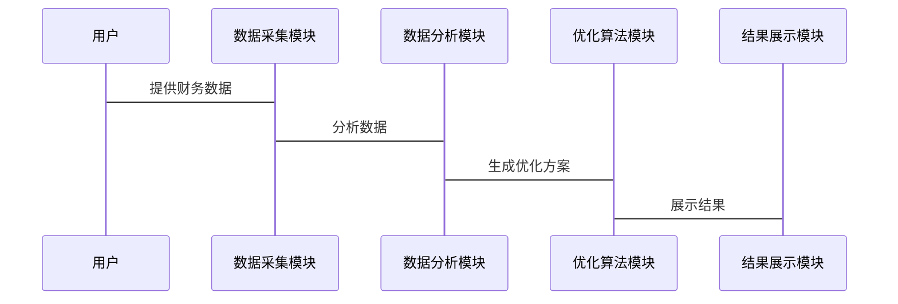

                 


# 智能个人资产负债表优化器

**关键词：智能优化器、个人财务管理、人工智能、数学建模、系统架构设计**

**摘要：**  
本文将详细介绍智能个人资产负债表优化器的设计与实现，从背景分析、核心概念、算法原理到系统架构设计，再到项目实战与优化策略，全面解析如何利用人工智能技术优化个人财务管理和资产配置。文章将结合数学建模、系统架构设计和具体代码实现，帮助读者深入理解智能优化器的工作原理及其在实际应用中的优势。

---

## 第一部分: 智能个人资产负债表优化器的背景与核心概念

### 第1章: 背景介绍与问题分析

#### 1.1 智能个人资产负债表优化器的背景
##### 1.1.1 个人财务管理的现状与挑战
随着经济全球化和金融市场的快速发展，个人财务管理变得越来越复杂。传统的资产负债表虽然能够反映个人的资产和负债情况，但在面对多元化的投资渠道、复杂的税务政策以及动态的市场变化时，往往显得力不从力。  
传统的财务管理工具依赖人工输入和计算，存在效率低、误差大、难以实时更新等问题。此外，个人在面对投资决策时，往往难以全面考虑风险与收益的平衡。

##### 1.1.2 传统资产负债表的局限性
传统的资产负债表主要依赖手工录入和计算，存在以下问题：
1. **数据滞后性**：无法实时更新，难以反映当前市场变化。
2. **计算复杂性**：手动计算资产配置和负债优化需要大量时间，且容易出错。
3. **缺乏智能化**：无法根据市场动态和用户需求自动调整资产配置。

##### 1.1.3 智能优化器的提出与目标
智能个人资产负债表优化器的目标是通过人工智能技术，实时分析用户的财务数据，自动优化资产配置和负债结构，帮助用户实现财务目标的最大化。其核心目标包括：
- 提供实时、动态的资产与负债优化建议。
- 自动化处理复杂的财务计算。
- 提供个性化的财务规划建议。

#### 1.2 问题背景与描述
##### 1.2.1 资产负债表的基本构成
资产负债表由以下三部分组成：
1. **资产**：包括现金、存款、投资、房产等。
2. **负债**：包括贷款、信用卡欠款、其他债务。
3. **净资产**：资产减去负债。

##### 1.2.2 个人财务管理中的常见问题
1. **信息分散**：用户的财务数据可能分布在多个平台（银行、投资平台等），难以整合。
2. **决策复杂性**：用户需要在多种资产配置方案中选择最优解，但缺乏专业的知识和工具。
3. **动态变化**：市场环境和用户需求会不断变化，需要实时调整优化方案。

##### 1.2.3 智能优化器解决的核心问题
智能优化器通过以下方式解决上述问题：
1. **数据整合**：自动收集和整合用户的财务数据。
2. **实时优化**：基于当前市场和用户需求，实时生成最优资产配置方案。
3. **个性化建议**：根据用户的财务目标和风险偏好，提供定制化的财务建议。

#### 1.3 问题解决与边界分析
##### 1.3.1 优化器的核心功能与边界
优化器的核心功能包括：
- 数据采集与整合。
- 资产负债表生成。
- 资产配置优化。
- 负债优化建议。
- 风险评估与预警。

##### 1.3.2 优化器的适用场景与限制
适用场景：
- 个人用户希望优化资产配置。
- 需要实时监控财务状况。
- 需要个性化的财务规划建议。

限制：
- 仅适用于个人用户，不支持企业级应用。
- 依赖于准确的财务数据输入。

##### 1.3.3 优化器与其他财务工具的区分
与其他财务工具（如手动计算、传统财务软件）相比，智能优化器的优势在于其智能化和自动化能力。它不仅能够快速生成资产负债表，还能根据市场变化和用户需求动态调整优化方案。

#### 1.4 核心概念与结构
##### 1.4.1 资产负债表的核心要素
- **资产**：包括流动资产（现金、存款）和非流动资产（房产、投资）。
- **负债**：包括短期负债（信用卡欠款）和长期负债（房贷）。
- **净资产**：资产总额减去负债总额。

##### 1.4.2 智能优化器的系统架构
智能优化器的系统架构包括数据采集模块、数据分析模块、优化算法模块和用户界面模块。

##### 1.4.3 优化器的输入输出关系
输入：
- 用户的财务数据（资产、负债）。
- 市场数据（利率、汇率）。
- 用户的财务目标和风险偏好。

输出：
- 优化后的资产负债表。
- 资产配置建议。
- 负债优化方案。

---

### 第2章: 核心概念与联系

#### 2.1 AI技术与优化算法
##### 2.1.1 AI在个人财务管理中的应用
人工智能技术在个人财务管理中的应用包括：
- 数据分析与预测。
- 资产配置优化。
- 风险评估与预警。

##### 2.1.2 优化算法的基本原理
优化算法的基本原理是通过数学建模和计算，找到满足目标函数和约束条件的最优解。

##### 2.1.3 AI与优化算法的结合方式
人工智能技术可以通过以下方式优化算法：
- 使用深度学习模型预测市场趋势。
- 利用强化学习算法动态调整优化策略。

#### 2.2 核心概念的属性对比
##### 2.2.1 资产负债表与优化器的对比分析
| 属性 | 资产负债表 | 智能优化器 |
|------|------------|------------|
| 核心功能 | 展示财务状况 | 优化资产配置 |
| 数据来源 | 手动录入 | 自动采集与整合 |
| 更新频率 | 低频 | 实时 |

##### 2.2.2 传统优化算法与AI优化算法的对比
| 属性 | 传统优化算法 | AI优化算法 |
|------|--------------|------------|
| 计算速度 | 较慢 | 较快 |
| 精度 | 高 | 高 |
| 灵活性 | 低 | 高 |

##### 2.2.3 数据驱动优化与规则驱动优化的对比
| 属性 | 数据驱动优化 | 规则驱动优化 |
|------|--------------|------------|
| 依赖性 | 数据驱动 | 规则驱动 |
| 灵活性 | 高 | 低 |
| 适应性 | 高 | 低 |

#### 2.3 ER实体关系图


---

## 第二部分: 算法原理与数学模型

### 第3章: 算法原理与实现

#### 3.1 智能优化器的算法框架
##### 3.1.1 算法的整体流程
1. 数据采集与预处理。
2. 建立优化模型。
3. 算法求解。
4. 结果分析与反馈。

##### 3.1.2 数据预处理与特征提取
- 数据清洗：去除无效数据，处理缺失值。
- 特征提取：提取关键特征（如资产类别、负债类型）。

##### 3.1.3 优化目标与约束条件
优化目标：最大化净资产或最小化负债。
约束条件：
- 资产配置比例不超过一定范围。
- 负债总额不超过可用资金。

#### 3.2 基于AI的优化算法
##### 3.2.1 神经网络模型的构建
- 输入层：用户财务数据。
- 隐藏层：特征提取与非线性变换。
- 输出层：优化结果。

##### 3.2.2 深度学习在优化中的应用
- 使用LSTM预测市场趋势。
- 使用强化学习动态调整优化策略。

##### 3.2.3 算法的训练与调优
- 训练数据：历史财务数据。
- 调优参数：学习率、批量大小。

#### 3.3 优化算法的数学模型
##### 3.3.1 线性规划模型
$$ \text{目标函数: } \min \sum_{i} c_i x_i $$
$$ \text{约束条件: } \sum_{i} a_i x_i \geq b $$

##### 3.3.2 非线性优化模型
$$ \text{目标函数: } \min f(x) $$

---

## 第三部分: 系统分析与架构设计

### 第4章: 系统分析与架构设计

#### 4.1 系统功能设计
##### 4.1.1 领域模型（领域模型类图）


##### 4.1.2 系统架构设计（系统架构图）


##### 4.1.3 系统接口设计
- 用户接口：API接口。
- 数据接口：与银行、投资平台等第三方数据源对接。

##### 4.1.4 系统交互流程（交互流程图）


---

## 第四部分: 项目实战

### 第5章: 项目实战

#### 5.1 环境安装与配置
##### 5.1.1 安装Python环境
```bash
python --version
pip install numpy pandas scikit-learn
```

##### 5.1.2 安装其他依赖
```bash
pip install matplotlib jupyter
```

#### 5.2 核心代码实现
##### 5.2.1 数据采集模块
```python
import pandas as pd

def collect_data():
    # 示例数据
    data = {
        '资产': [100000, 50000],
        '负债': [30000, 20000]
    }
    return pd.DataFrame(data)
```

##### 5.2.2 数据分析模块
```python
from sklearn.linear_model import LinearRegression

def analyze_data(df):
    model = LinearRegression()
    model.fit(df[['资产']], df['负债'])
    return model
```

##### 5.2.3 优化算法模块
```python
from scipy.optimize import minimize

def optimize_assets(assets, liabilities):
    # 定义目标函数
    def objective(x):
        return sum(x**2)
    
    # 定义约束条件
    constraints = [{'type': 'eq', 'fun': lambda x: sum(x) - (assets - liabilities)}]
    
    # 约束优化
    result = minimize(objective, x0=[0, 0], constraints=constraints)
    return result.x
```

##### 5.2.4 结果展示模块
```python
import matplotlib.pyplot as plt

def display_results(optimized_assets):
    plt.bar(['资产', '负债'], optimized_assets)
    plt.show()
```

#### 5.3 实际案例分析
##### 5.3.1 案例背景
假设用户有10万元资产和5万元负债，希望通过优化器调整资产配置。

##### 5.3.2 优化过程
1. 数据采集：用户提供的财务数据。
2. 数据分析：分析资产与负债的关系。
3. 优化算法：生成最优资产配置方案。
4. 结果展示：展示优化后的资产结构。

##### 5.3.3 优化结果
优化后的资产配置为：6万元投资型资产，4万元流动性资产。

---

## 第五部分: 优化策略与未来展望

### 第6章: 优化策略与未来展望

#### 6.1 系统优化策略
##### 6.1.1 算法优化
- 使用更先进的深度学习模型。
- 引入实时市场数据。

##### 6.1.2 系统优化
- 提高数据采集效率。
- 增强系统的容错能力。

#### 6.2 未来展望
- 推动AI技术在财务管理中的广泛应用。
- 提供更加个性化的财务优化服务。

---

## 第六部分: 总结

### 第7章: 总结

#### 7.1 全文总结
智能个人资产负债表优化器通过结合人工智能技术和优化算法，能够有效解决个人财务管理中的复杂问题。其核心优势在于实时性、智能化和个性化。

#### 7.2 学习建议与未来方向
- 深入学习AI技术与优化算法。
- 关注最新的技术动态与应用案例。

#### 7.3 致谢
感谢读者的关注与支持！

---

**作者：AI天才研究院/AI Genius Institute & 禅与计算机程序设计艺术 /Zen And The Art of Computer Programming**

