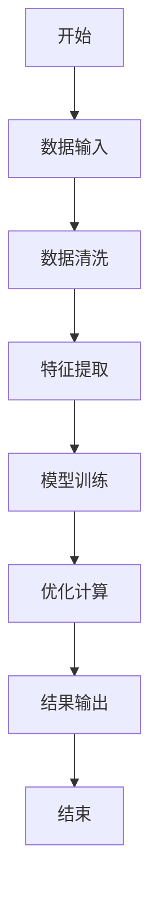
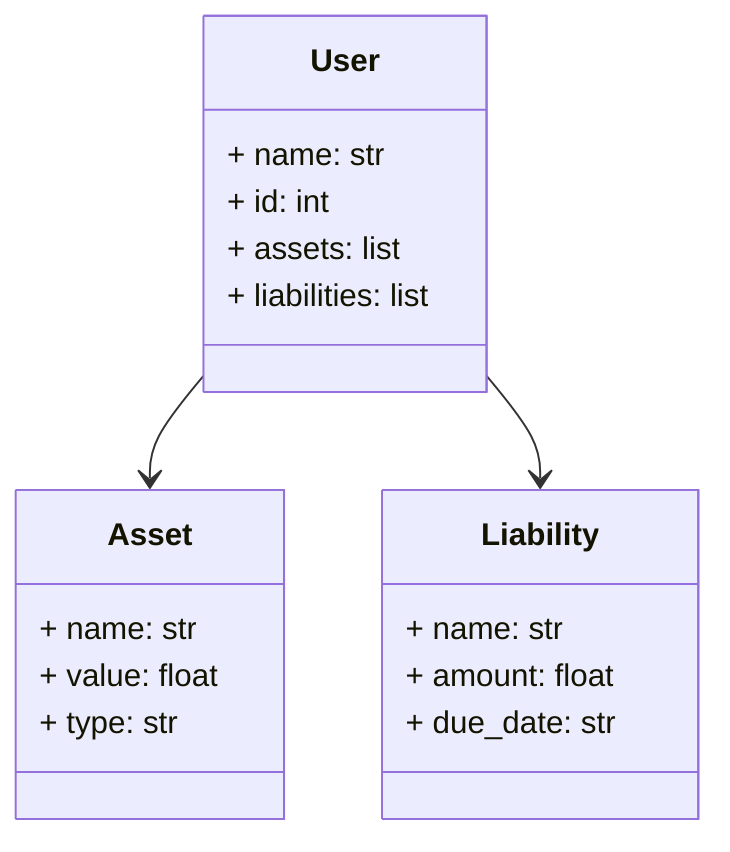
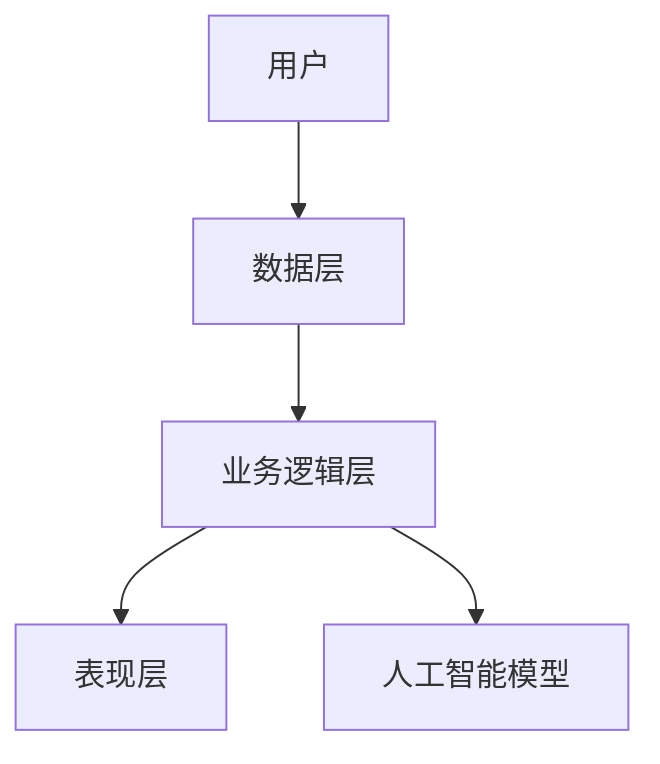
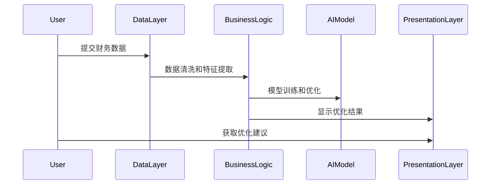

                 


# 智能个人资产负债表优化系统

## 关键词：智能资产负债表，财务优化，人工智能，大数据分析，投资组合管理

## 摘要：  
《智能个人资产负债表优化系统》是一篇深入探讨如何利用人工智能和大数据技术优化个人财务状况的技术博客。本文从个人资产负债表的基本概念出发，分析其优化的必要性，结合智能算法和系统架构设计，提出一套完整的解决方案。通过实际案例分析，展示了该系统在提高财务健康度和投资回报率方面的显著优势，为个人财务管理提供了新的思路和工具。

---

## 第1章: 智能个人资产负债表优化系统概述

### 1.1 背景介绍

#### 1.1.1 个人资产负债表的定义与作用
个人资产负债表是记录个人资产和负债的财务报表，反映了个人的财富状况和偿债能力。资产包括现金、存款、投资、房产等；负债包括信用卡欠款、贷款、个人借款等。通过资产负债表，个人可以清晰了解自己的财务状况，制定合理的财务计划。

#### 1.1.2 智能优化的必要性
传统的资产负债表优化主要依赖人工分析，效率低且难以实时更新。随着大数据和人工智能技术的发展，通过智能算法实时优化资产配置、降低财务风险成为可能。

#### 1.1.3 当前传统资产负债表的局限性
- 数据更新滞后：传统资产负债表通常每月或每季度更新一次，无法实时反映资产和负债的变化。
- 缺乏智能化分析：人工分析难以覆盖海量数据，且容易受到主观因素影响。
- 风险评估不全面：传统方法难以准确预测市场波动和潜在风险。

#### 1.1.4 智能优化的核心目标与边界
智能优化的核心目标是通过算法最大化资产回报率，同时最小化财务风险。边界包括数据隐私保护、合规性要求和用户个性化需求。

---

### 1.2 核心概念与联系

#### 1.2.1 核心概念原理
智能个人资产负债表优化系统通过收集和分析用户的财务数据，利用机器学习算法预测市场趋势，优化资产配置。核心概念包括：
- 数据采集与清洗
- 资产负债分析
- 投资组合优化
- 风险评估与控制

#### 1.2.2 核心概念属性特征对比表

| **概念**       | **属性**             | **特征**                                                                 |
|-----------------|----------------------|--------------------------------------------------------------------------|
| 资产            | 类型                 | 现金、存款、股票、房地产等                                            |
| 负债            | 类型                 | 信用卡欠款、贷款、个人借款等                                          |
| 投资组合        | 优化目标             | 最大化回报率，最小化风险                                              |
| 风险评估         | 方法                 | VaR（风险价值）、CVaR（条件风险价值）                                |

#### 1.2.3 ER实体关系图架构
```mermaid
graph TD
    User[用户] --> Asset[资产]
    User --> Liability[负债]
    User --> Net Worth[净资产]
    Asset --> Cash[现金]
    Asset --> Investment[投资]
    Liability --> Credit Card Debt[信用卡欠款]
    Liability --> Loan[贷款]
```

---

## 第2章: 智能个人资产负债表优化算法原理

### 2.1 算法原理讲解

#### 2.1.1 算法流程图


#### 2.1.2 算法数学模型
$$ \text{目标函数} = \max \sum_{i=1}^{n} w_i x_i $$
$$ \text{约束条件} = \sum_{i=1}^{n} x_i \leq \text{资产总额} $$

其中，$w_i$ 是资产 $i$ 的权重，$x_i$ 是资产 $i$ 的配置比例。

#### 2.1.3 算法实现代码
```python
import numpy as np
from sklearn.linear_model import LinearRegression

def optimize_asset_allocation(weights, assets):
    max_return = 0
    best_allocation = {}
    for i in range(len(assets)):
        current_return = 0
        for j in range(len(weights)):
            current_return += weights[j] * assets[i][j]
        if current_return > max_return:
            max_return = current_return
            best_allocation = assets[i]
    return best_allocation
```

---

## 第3章: 系统分析与架构设计方案

### 3.1 系统分析

#### 3.1.1 问题场景介绍
用户希望通过系统实时监控和优化个人资产配置，降低财务风险，提高投资回报率。

#### 3.1.2 项目介绍
智能个人资产负债表优化系统通过采集用户财务数据，利用机器学习算法优化资产配置，提供个性化的财务建议。

---

### 3.2 系统功能设计

#### 3.2.1 领域模型类图


#### 3.2.2 系统架构设计


#### 3.2.3 接口设计
- 数据层接口：API用于数据存储和检索。
- 表现层接口：提供用户友好的界面和交互。

#### 3.2.4 交互流程图


---

## 第4章: 项目实战

### 4.1 环境安装

#### 4.1.1 安装Python和相关库
```bash
pip install numpy pandas scikit-learn
```

#### 4.1.2 数据库安装
```bash
pip install SQLAlchemy pymysql
```

### 4.2 核心代码实现

#### 4.2.1 数据采集与清洗
```python
import pandas as pd

# 数据采集
data = pd.read_csv('financial_data.csv')

# 数据清洗
data.dropna(inplace=True)
data.drop_duplicates(inplace=True)
```

#### 4.2.2 特征提取与建模
```python
from sklearn.linear_model import LinearRegression

# 特征提取
X = data[['income', 'expenses', 'assets', ' liabilities']]
y = data['net_worth']

# 建模
model = LinearRegression()
model.fit(X, y)
```

#### 4.2.3 优化算法实现
```python
def optimize_asset Allocation(weights, assets):
    max_return = 0
    best_allocation = {}
    for i in range(len(assets)):
        current_return = 0
        for j in range(len(weights)):
            current_return += weights[j] * assets[i][j]
        if current_return > max_return:
            max_return = current_return
            best_allocation = assets[i]
    return best_allocation
```

---

## 第5章: 最佳实践与总结

### 5.1 最佳实践
- 数据隐私保护：采用加密技术确保用户数据安全。
- 系统维护：定期更新模型和数据，保持系统的高效性。

### 5.2 小结
智能个人资产负债表优化系统通过结合人工智能和大数据分析，为个人用户提供高效、个性化的财务优化方案。

### 5.3 注意事项
- 确保数据来源的合法性和准确性。
- 定期评估和更新优化模型，以适应市场变化。

### 5.4 拓展阅读
- 《Python机器学习实战》
- 《大数据分析与应用》

---

## 作者：AI天才研究院 & 禅与计算机程序设计艺术

---

**本文完。**

