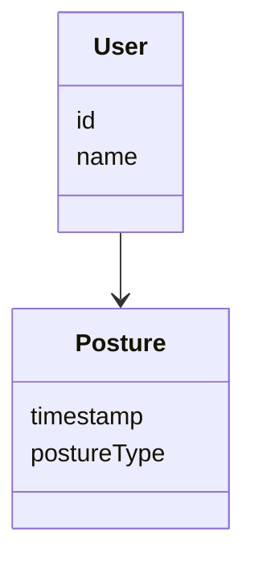
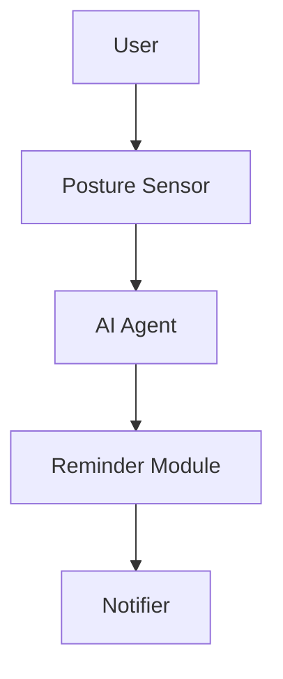

                 


```markdown
# 智能书桌：AI Agent的姿势提醒系统

> 关键词：智能书桌，AI Agent，姿势提醒系统，姿态检测，人体工程学

> 摘要：本文详细探讨了智能书桌中AI Agent的姿势提醒系统的设计与实现，结合背景介绍、核心概念、算法原理、系统架构、项目实战以及最佳实践，为读者提供全面的技术解析。

---

# 第1章: 背景介绍

## 1.1 问题背景

### 1.1.1 长时间坐姿不良的危害
长时间保持不良坐姿会导致颈椎病、腰椎病等健康问题，影响工作效率和生活质量。

### 1.1.2 当前姿势提醒系统的现状
现有的提醒系统多依赖手动提醒或简单设备，缺乏智能化和个性化。

### 1.1.3 AI技术在姿势提醒中的应用潜力
AI技术能够通过姿态检测和分析，实时提供个性化的提醒服务。

## 1.2 问题描述

### 1.2.1 坐姿提醒系统的核心目标
帮助用户保持良好的坐姿，预防健康问题。

### 1.2.2 系统需要解决的主要问题
实现对用户坐姿的实时检测和智能提醒。

### 1.2.3 系统的边界与外延
系统仅关注坐姿检测和提醒，不涉及其他健康监测功能。

## 1.3 问题解决思路

### 1.3.1 AI Agent的基本概念
AI Agent是一种智能体，能够感知环境并采取行动以实现目标。

### 1.3.2 姿势提醒系统的实现方式
通过摄像头或传感器获取坐姿数据，AI Agent分析后发出提醒。

### 1.3.3 系统的实现步骤与流程
1. 数据采集：获取用户的坐姿数据。
2. 数据分析：AI算法分析坐姿是否正确。
3. 提醒反馈：当检测到不良坐姿时，发出提醒。

## 1.4 系统的核心要素组成

### 1.4.1 系统的主要组成部分
- 数据采集模块：摄像头或传感器。
- AI算法模块：姿态检测算法。
- 提醒模块：发出提醒的设备。

### 1.4.2 各部分之间的关系
数据采集模块将数据传递给AI算法模块，分析结果传递给提醒模块。

### 1.4.3 系统的核心功能与非核心功能
核心功能：坐姿检测、提醒。
非核心功能：数据存储、用户设置。

## 1.5 本章小结
本章介绍了智能书桌中AI Agent姿势提醒系统的背景、目标、实现思路和组成要素，为后续章节奠定了基础。

---

# 第2章: AI Agent与姿势提醒系统的核心概念

## 2.1 AI Agent的基本原理

### 2.1.1 AI Agent的定义与特点
AI Agent是一种智能体，具备感知、决策、执行能力。

### 2.1.2 AI Agent的核心算法与技术
- 机器学习：用于姿态识别。
- 自然语言处理：用于个性化提醒。

### 2.1.3 AI Agent在姿势提醒中的应用
通过实时检测用户的坐姿，提供个性化的提醒服务。

## 2.2 姿势提醒系统的核心原理

### 2.2.1 姿势检测的基本原理
通过摄像头或传感器获取用户坐姿数据，结合AI算法分析坐姿是否正确。

### 2.2.2 姿势分析的算法实现
使用深度学习算法，如卷积神经网络（CNN）进行姿势分类。

### 2.2.3 姿势提醒的触发机制
当检测到不良坐姿时，通过声音或震动提醒用户。

## 2.3 AI Agent与姿势提醒系统的联系

### 2.3.1 系统的整体架构
AI Agent作为核心，集成姿势检测和提醒功能。

### 2.3.2 AI Agent在系统中的角色
负责数据处理、决策和提醒触发。

### 2.3.3 系统的实现
结合AI技术和传感器数据，实现智能化的姿势提醒。

## 2.4 本章小结
本章详细介绍了AI Agent和姿势提醒系统的核心概念及其联系，为后续章节的实现提供了理论基础。

---

# 第3章: 算法原理

## 3.1 姿态检测算法

### 3.1.1 算法流程
1. 数据采集：获取用户坐姿图像。
2. 数据预处理：调整图像大小，归一化。
3. 特征提取：使用CNN提取姿势特征。
4. 模型训练：训练分类模型。
5. 姿态分类：识别坐姿是否正确。

### 3.1.2 算法实现

```python
import tensorflow as tf
from tensorflow.keras import layers

model = tf.keras.Sequential([
    layers.Conv2D(32, (3,3), activation='relu', input_shape=(64, 64, 3)),
    layers.MaxPooling2D((2,2)),
    layers.Conv2D(64, (3,3), activation='relu'),
    layers.MaxPooling2D((2,2)),
    layers.Flatten(),
    layers.Dense(128, activation='relu'),
    layers.Dense(2, activation='softmax')
])
```

### 3.1.3 数学模型与公式
$$ P(y|x) = \frac{P(x|y)P(y)}{P(x)} $$

## 3.2 提醒算法

### 3.2.1 提醒触发条件
当坐姿分类结果为“不良”时，触发提醒。

### 3.2.2 提醒方式
声音提醒和震动提醒。

## 3.3 本章小结
本章详细讲解了姿态检测和提醒算法的实现原理，为系统开发提供了技术支持。

---

# 第4章: 系统分析与架构设计

## 4.1 系统架构设计

### 4.1.1 领域模型



### 4.1.2 系统架构



### 4.1.3 接口设计
- 数据接口：传感器数据的读取。
- 提醒接口：向Notifier发送提醒指令。

## 4.2 本章小结
本章通过系统架构设计和接口设计，明确了系统的实现方式和各部分之间的关系。

---

# 第5章: 项目实战

## 5.1 环境安装

### 5.1.1 安装Python环境
```bash
python --version
pip install --upgrade pip
```

### 5.1.2 安装依赖库
```bash
pip install tensorflow keras numpy matplotlib
```

## 5.2 系统核心实现

### 5.2.1 数据采集
```python
import cv2

cap = cv2.VideoCapture(0)
while True:
    ret, frame = cap.read()
    cv2.imshow('frame', frame)
    if cv2.waitKey(1) & 0xFF == ord('q'):
        break
cap.release()
cv2.destroyAllWindows()
```

### 5.2.2 算法实现
```python
model.compile(optimizer='adam', loss='sparse_categorical_crossentropy', metrics=['accuracy'])
model.fit(X_train, y_train, epochs=10, batch_size=32)
```

## 5.3 案例分析

### 5.3.1 数据分析
通过训练好的模型，分析用户坐姿数据，识别不良坐姿。

### 5.3.2 案例实现
实现一个简单的坐姿提醒系统，测试模型的准确性和提醒效果。

## 5.4 本章小结
本章通过实际项目实战，详细讲解了系统的实现过程和案例分析，帮助读者更好地理解系统的实际应用。

---

# 第6章: 最佳实践

## 6.1 小结
智能书桌的AI Agent姿势提醒系统通过实时检测和智能提醒，有效改善了用户的坐姿问题。

## 6.2 注意事项
- 数据隐私保护。
- 系统的稳定性和响应速度。

## 6.3 拓展阅读
建议读者深入学习AI技术在人体工程学中的应用，探索更多智能健康设备的可能性。

---

# 作者

作者：AI天才研究院/AI Genius Institute & 禅与计算机程序设计艺术 /Zen And The Art of Computer Programming
```

