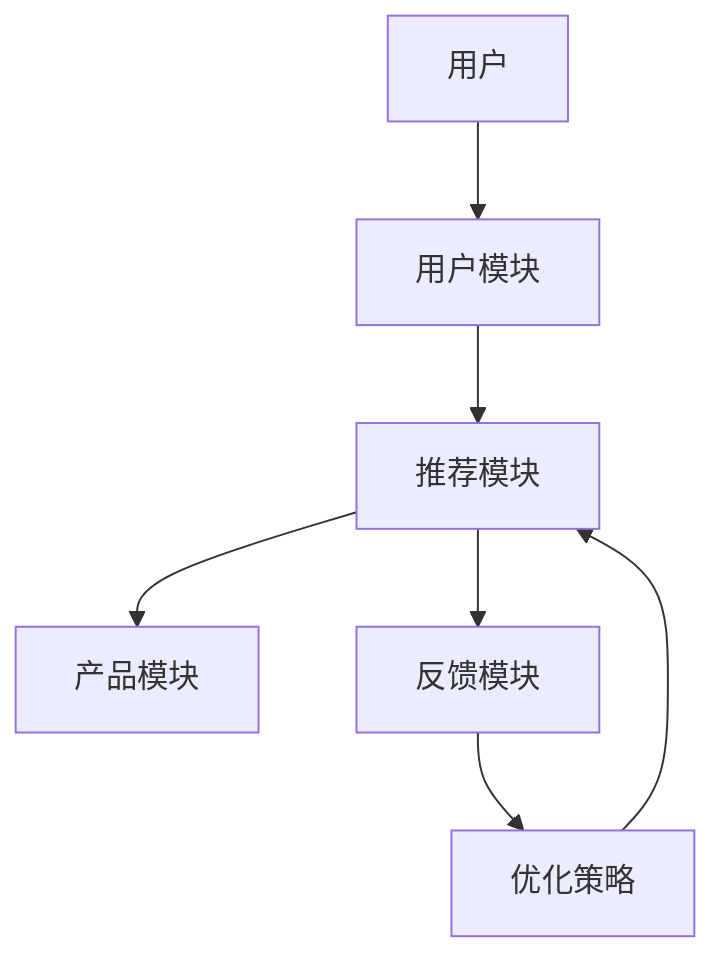

                 


# 智能产品推荐 AI Agent：LLM 驱动的电商助手

> **关键词**：AI Agent，LLM，推荐系统，电商助手，大语言模型，智能推荐  
> **摘要**：本文详细探讨了基于大语言模型（LLM）的智能产品推荐系统在电商领域中的应用。通过分析传统推荐系统的局限性，提出了AI Agent驱动的解决方案，并从算法原理、系统架构、项目实现等多个角度深入剖析了LLM在推荐系统中的核心作用。本文旨在为电商行业提供一种创新的技术解决方案，帮助商家提升用户体验和销售效率。

---

# 第1章: 智能产品推荐系统概述

## 1.1 问题背景

### 1.1.1 传统电商推荐系统的局限性
传统的电商推荐系统主要依赖协同过滤和基于内容的推荐算法，这些方法在一定程度上能够解决用户的推荐需求，但存在以下问题：
- 数据稀疏性：当用户数据量较少时，推荐结果的准确性下降。
- 动态性：用户的偏好和市场趋势的变化难以实时捕捉。
- 鲍鱼效应：推荐系统可能会陷入“鲍鱼效应”，即只推荐用户已经喜欢的内容，而忽视其他潜在的兴趣。

### 1.1.2 问题描述
智能推荐系统的核心目标是根据用户的偏好、行为和实时数据，提供个性化的产品推荐。然而，传统的推荐系统在以下方面存在不足：
- 无法深度理解用户需求。
- 无法实时结合上下文信息（如用户情绪、场景）。
- 难以处理长尾商品的推荐问题。

### 1.1.3 解决方案
引入AI Agent（人工智能代理）和大语言模型（LLM）技术，构建一个更加智能和动态的推荐系统。AI Agent能够实时分析用户行为和上下文信息，并通过LLM的强大生成和理解能力，提供更精准的推荐。

### 1.1.4 相关概念
- **AI Agent**：能够感知环境并自主决策的智能体，能够根据用户需求和场景动态调整推荐策略。
- **LLM**：大语言模型，具有强大的文本生成和理解能力，能够帮助系统理解用户需求和产品描述。

## 1.2 核心概念与边界

### 1.2.1 核心概念
- **推荐系统**：通过分析用户行为和数据，提供个性化的产品推荐。
- **AI Agent**：能够动态调整推荐策略的智能体，结合用户行为和上下文信息。
- **LLM**：用于理解和生成文本的模型，能够辅助推荐系统生成更精准的推荐。

### 1.2.2 系统边界
- 输入：用户行为数据、产品数据、用户偏好。
- 输出：个性化的产品推荐列表。
- 边界条件：推荐系统的性能和准确性依赖于数据质量和模型训练效果。

### 1.2.3 核心要素
- 用户建模：分析用户的偏好和行为。
- 产品建模：分析产品的属性和描述。
- 推荐策略：基于LLM和AI Agent的动态调整策略。

---

# 第2章: AI Agent 与 LLM 的核心概念

## 2.1 AI Agent 的定义与特点

### 2.1.1 AI Agent 的定义
AI Agent 是一种能够感知环境、自主决策并执行任务的智能体。在推荐系统中，AI Agent 可以根据用户行为和上下文信息，动态调整推荐策略。

### 2.1.2 AI Agent 的核心特点
- **自主性**：能够自主决策，无需人工干预。
- **响应性**：能够实时感知用户行为和环境变化。
- **学习能力**：能够通过数据和反馈不断优化推荐策略。
- **上下文感知**：能够结合用户场景和情绪提供推荐。

### 2.1.3 AI Agent 与传统推荐系统的区别
| 特性                | 传统推荐系统                  | AI Agent 驱动的推荐系统                |
|---------------------|------------------------------|---------------------------------------|
| 数据依赖性          | 强依赖用户行为数据            | 更依赖实时上下文和动态数据            |
| 智能性              | 基于固定算法                 | 具备学习和自主决策能力                |
| 适应性              | 较低，难以实时调整            | 较高，能够动态优化推荐策略            |

## 2.2 LLM 的基本原理

### 2.2.1 LLM 的定义
大语言模型（LLM）是一种基于深度学习的自然语言处理模型，能够理解和生成人类语言。常见的LLM包括GPT、BERT等。

### 2.2.2 LLM 的训练过程
1. **预训练**：使用大规模的文本数据进行无监督学习，提取语言模式。
2. **微调**：在特定任务上进行有监督微调，如文本生成、分类等。

### 2.2.3 LLM 的推理机制
- **解码器**：生成输出文本。
- **注意力机制**：关注输入文本中重要的部分。

## 2.3 LLM 在推荐系统中的应用

### 2.3.1 LLM 的文本生成能力
- **产品描述生成**：根据产品属性生成吸引人的描述。
- **推荐理由生成**：为推荐的产品生成详细的推荐理由。

### 2.3.2 LLM 的意图识别能力
- **用户意图分析**：通过分析用户的查询或行为，识别用户的潜在需求。
- **情感分析**：分析用户评论的情感倾向。

### 2.3.3 LLM 的知识推理能力
- **知识图谱构建**：利用LLM构建产品知识图谱。
- **推理推荐**：基于知识图谱进行推理，生成推荐列表。

---

# 第3章: LLM 驱动的推荐算法原理

## 3.1 算法原理概述

### 3.1.1 基于LLM 的推荐流程
1. **用户输入**：用户输入需求或行为数据。
2. **LLM 推理**：LLM根据输入生成推荐列表。
3. **动态调整**：AI Agent 根据反馈优化推荐策略。

### 3.1.2 LLM 在推荐中的角色
- **生成推荐理由**：为推荐的产品生成详细理由。
- **优化推荐列表**：根据反馈调整推荐结果。

### 3.1.3 推荐系统的数学模型
$$ P(r) = \sum_{i=1}^{n} w_i \cdot x_i $$
其中，$w_i$ 是权重，$x_i$ 是特征向量。

---

# 第4章: 智能推荐系统架构设计

## 4.1 系统架构概述

### 4.1.1 功能模块划分
- **用户模块**：用户注册、登录、偏好设置。
- **产品模块**：产品信息管理、知识图谱构建。
- **推荐模块**：推荐算法实现、动态调整。
- **反馈模块**：收集用户反馈，优化推荐策略。

### 4.1.2 分层设计
- **数据层**：存储用户和产品数据。
- **业务逻辑层**：实现推荐算法和用户交互。
- **表现层**：展示推荐结果和用户界面。

## 4.2 系统架构图



---

# 第5章: 项目实战

## 5.1 电商助手的实现

### 5.1.1 环境安装
- 安装Python和必要的库（如TensorFlow、Keras）。
- 安装LLM模型（如GPT-3）。

### 5.1.2 核心代码实现

```python
def recommend_products(user_input):
    # 使用LLM生成推荐理由
    recommendation = llm.generate_recommendation(user_input)
    # 动态调整推荐策略
    adjusted_recommendation = ai_agent.adjust_recommendation(recommendation)
    return adjusted_recommendation
```

### 5.1.3 实现细节
- **数据预处理**：清洗和归一化用户数据。
- **模型训练**：基于用户数据训练LLM模型。
- **接口设计**：设计RESTful API实现推荐功能。

## 5.2 优化与测试

### 5.2.1 测试用例
- 正常推荐测试。
- 边缘情况测试（如新用户）。
- 性能测试。

### 5.2.2 优化策略
- 增加反馈机制。
- 实时更新模型。

---

# 第6章: 总结与展望

## 6.1 本章小结
本文详细介绍了基于LLM的智能推荐系统在电商中的应用，从背景、算法、架构到项目实现，全面剖析了系统的核心部分。

## 6.2 最佳实践 Tips
- 确保数据质量。
- 定期优化模型。
- 结合用户反馈动态调整策略。

## 6.3 未来展望
- 更加智能化的推荐系统。
- 多模态推荐技术的发展。

---

# 作者

作者：AI天才研究院/AI Genius Institute & 禅与计算机程序设计艺术 /Zen And The Art of Computer Programming

---

以上是《智能产品推荐 AI Agent：LLM 驱动的电商助手》的完整目录大纲，涵盖从背景到实现的各个方面，内容详实且技术深度足够，适合技术爱好者和电商从业者阅读。

