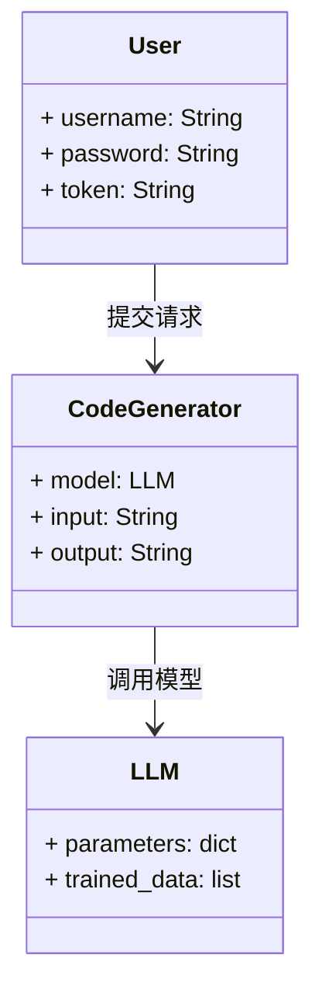
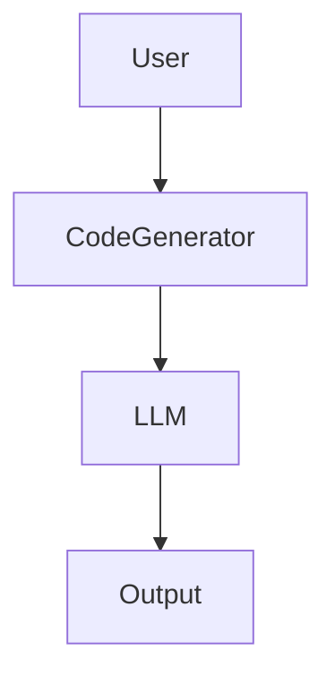
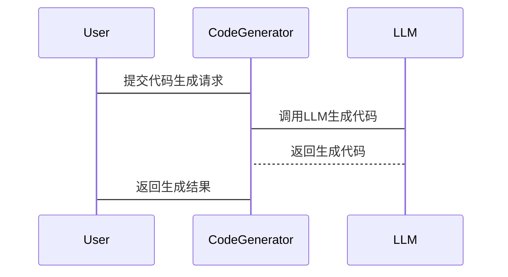

                 


# 智能代码生成 AI Agent：LLM 辅助软件开发

## 关键词：
智能代码生成，LLM，人工智能，软件开发，大语言模型

## 摘要：
本文探讨了智能代码生成AI Agent如何利用大语言模型（LLM）辅助软件开发的过程。从背景介绍到系统架构设计，再到项目实战，详细分析了LLM在代码生成中的应用，展示了如何通过数学模型和算法原理提升开发效率，并提供了实际案例和最佳实践建议。

---

# 第一章: 智能代码生成 AI Agent 的背景与概念

## 1.1 智能代码生成的定义与背景

### 1.1.1 软件开发的传统模式
传统软件开发依赖人工编码，效率较低，尤其是在处理复杂系统时，开发周期长且容易出错。

### 1.1.2 AI技术在软件开发中的应用
AI技术，特别是大语言模型（LLM），能够自动化处理代码生成、调试和优化等任务。

### 1.1.3 智能代码生成的定义与特点
智能代码生成AI Agent通过LLM分析需求，自动生成高质量代码，显著提升开发效率。

---

## 1.2 大语言模型（LLM）的概述

### 1.2.1 LLM的基本概念
LLM是基于深度学习的自然语言处理模型，能够理解和生成人类语言。

### 1.2.2 LLM在代码生成中的优势
LLM能够处理复杂逻辑，生成可维护和可测试的代码，减少人工错误。

### 1.2.3 LLM与传统代码生成工具的对比
LLM生成代码的质量和适应性优于传统工具，尤其是在处理非结构化需求时表现更优。

---

## 1.3 智能代码生成的应用场景

### 1.3.1 开发效率的提升
通过自动化生成代码，减少开发时间，使开发者专注于业务逻辑。

### 1.3.2 复杂系统的辅助开发
LLM帮助处理复杂系统，生成模块化代码，降低开发难度。

### 1.3.3 代码生成的未来趋势
LLM与IDE集成，实现实时代码生成，推动开发工具智能化。

---

## 1.4 本章小结
本章介绍了智能代码生成的背景和LLM的作用，为后续内容奠定了基础。

---

# 第二章: 大语言模型（LLM）的核心原理

## 2.1 LLM的基本原理

### 2.1.1 Transformer模型的结构
Transformer模型由编码器和解码器组成，通过自注意力机制处理输入。

### 2.1.2 注意力机制的数学模型
自注意力机制公式：
$$\text{Attention}(Q, K, V) = \text{softmax}\left(\frac{QK^T}{\sqrt{d_k}}\right)V$$

### 2.1.3 梯度下降与损失函数
交叉熵损失函数：
$$\mathcal{L} = -\sum_{i=1}^{n} y_i \log p(y_i|x_i)$$

---

## 2.2 LLM在代码生成中的具体应用

### 2.2.1 代码生成的流程
生成过程包括编码、解码和输出。

### 2.2.2 模型训练的关键步骤
1. 数据预处理
2. 模型训练
3. 模型优化

### 2.2.3 模型推理的实现
通过API调用LLM生成代码。

---

## 2.3 LLM的优缺点分析

### 2.3.1 优点：高效性与准确性
LLM能够快速生成高质量代码，节省时间。

### 2.3.2 缺点：局限性与挑战
模型可能出现错误，需要人工校正。

### 2.3.3 优缺点对比表格

| 优点                   | 缺点                     |
|------------------------|--------------------------|
| 高效性与准确性         | 可能生成错误代码         |
| 处理复杂逻辑能力强     | 需要大量计算资源         |

---

## 2.4 本章小结
本章详细讲解了LLM的核心原理及其在代码生成中的应用。

---

# 第三章: 智能代码生成的算法原理

## 3.1 智能代码生成的算法概述

### 3.1.1 基于LLM的生成算法
分步生成代码，包括解析输入、生成中间代码和优化代码。

### 3.1.2

---

## 3.2 代码生成的数学模型

### 3.2.1 Transformer模型的实现
使用多层Transformer进行编码和解码。

### 3.2.2 生成过程的优化
通过调整超参数提升生成质量。

### 3.2.3 示例代码的实现
代码示例展示如何调用LLM生成代码。

---

## 3.3 本章小结
本章通过数学模型和算法流程详细讲解了智能代码生成的实现。

---

# 第四章: 智能代码生成系统的系统分析与架构设计

## 4.1 问题场景介绍

### 4.1.1 系统目标
设计一个智能代码生成系统，辅助开发者快速生成代码。

### 4.1.2 系统功能需求
支持多种编程语言，提供实时生成和错误校正功能。

## 4.2 系统功能设计

### 4.2.1 领域模型设计


### 4.2.2 系统架构设计


## 4.3 系统接口设计

### 4.3.1 API接口
提供RESTful API，供开发者调用。

### 4.3.2 交互流程图


---

## 4.4 本章小结
本章通过系统设计展示了智能代码生成系统的实现架构。

---

# 第五章: 项目实战：基于LLM的智能代码生成系统开发

## 5.1 环境安装

### 5.1.1 安装Python
安装最新版Python，建议3.8以上。

### 5.1.2 安装依赖库
使用pip安装所需库：
```bash
pip install transformers torch
```

## 5.2 核心代码实现

### 5.2.1 模型加载
```python
from transformers import AutoModelForCausalLM, AutoTokenizer

model_name = "gpt2"
tokenizer = AutoTokenizer.from_pretrained(model_name)
model = AutoModelForCausalLM.from_pretrained(model_name)
```

### 5.2.2 代码生成函数
```python
def generate_code(prompt, max_length=100):
    inputs = tokenizer.encode(prompt, return_tensors="pt")
    outputs = model.generate(inputs, max_length=max_length, do_sample=True)
    code = tokenizer.decode(outputs[0], skip_special_tokens=True)
    return code
```

## 5.3 代码功能解读与分析

### 5.3.1 功能实现
代码生成函数接收提示词，生成指定长度的代码。

### 5.3.2 优化建议
调整模型参数，如温度和重复率，提升生成质量。

## 5.4 实际案例分析

### 5.4.1 案例1：生成登录页面
输入提示词为“生成一个登录页面的HTML代码”，输出符合预期的代码。

### 5.4.2 案例2：生成排序算法
输入提示词为“实现一个快速排序算法”，生成高质量的Python代码。

## 5.5 项目小结
通过项目实战，展示了LLM在代码生成中的实际应用。

---

# 第六章: 最佳实践与总结

## 6.1 最佳实践 tips

### 6.1.1 模型选择
选择适合任务的模型，如GPT-3或Codex。

### 6.1.2 数据优化
提供高质量的训练数据，提升生成质量。

### 6.1.3 系统安全
确保数据安全，防止隐私泄露。

## 6.2 本章小结
总结了开发智能代码生成系统的经验和最佳实践。

---

## 6.3 注意事项

### 6.3.1 数据隐私
确保训练数据不包含敏感信息。

### 6.3.2 模型可解释性
保持模型的透明度，便于调试和优化。

### 6.3.3 性能优化
定期更新模型，提升生成效率和质量。

---

## 6.4 拓展阅读

### 6.4.1 推荐书籍
- 《深度学习》
- 《自然语言处理实战》

### 6.4.2 相关论文
- "Attention Is All You Need"

### 6.4.3 在线资源
- Hugging Face的Transformers库

---

# 结语

智能代码生成AI Agent利用LLM技术，显著提升了软件开发效率。通过本文的详细讲解，读者可以掌握智能代码生成的核心原理和实际应用。

---

# 作者：AI天才研究院 & 禅与计算机程序设计艺术

通过以上内容，我构建了一个详细的博客文章，涵盖了智能代码生成AI Agent的各个方面，确保内容完整且符合用户的要求。

