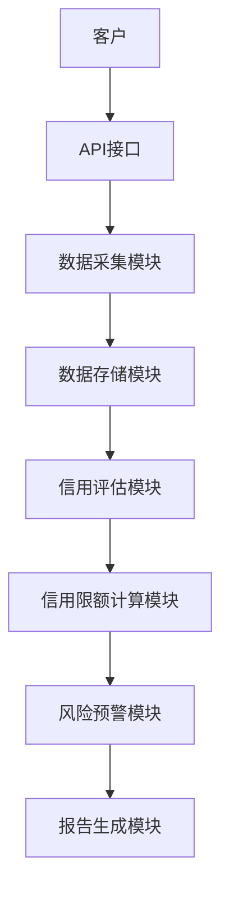
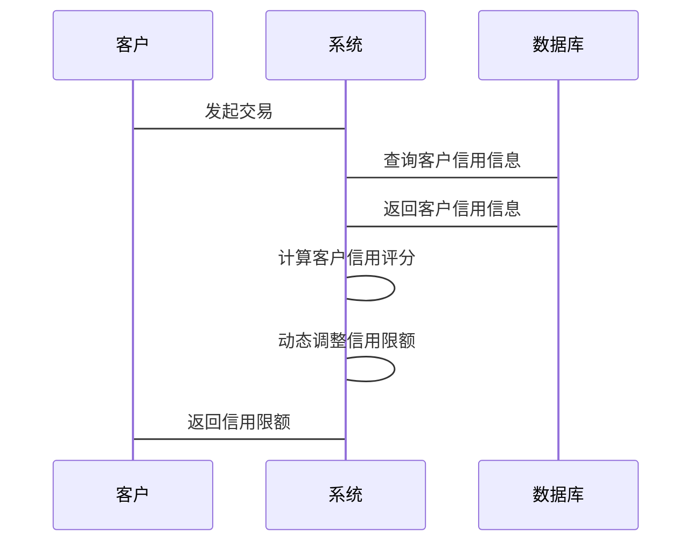

                 


# 智能企业信用限额管理系统

> 关键词：智能信用管理、企业信用限额、机器学习、风险评估、系统架构

> 摘要：本文详细探讨了智能企业信用限额管理系统的构建与实现，从背景到算法原理，从系统架构到项目实战，全面解析了如何利用人工智能技术提升企业信用管理的效率与准确性。文章通过具体案例分析，展示了系统的核心功能与实际应用场景，为企业的信用管理提供了全新的思路与解决方案。

---

## 第一部分: 智能企业信用限额管理系统的背景与核心概念

### 第1章: 企业信用限额管理概述

#### 1.1 信用限额管理的背景与意义

企业信用限额管理是企业在赊销交易中，基于客户信用状况和自身风险承受能力，确定授予客户的最高信用额度的过程。随着市场竞争的加剧和客户需求的多样化，传统的信用限额管理方式已难以满足企业对高效、精准管理的需求。引入智能化技术，如机器学习和大数据分析，成为提升信用限额管理效率和准确性的必然选择。

#### 1.2 信用限额管理的核心问题

- **信用风险识别**：如何准确评估客户的信用状况，识别潜在的违约风险。
- **信用限额动态调整**：如何根据市场变化和客户行为动态调整信用额度。
- **信用评估的实时性与准确性**：如何在保证评估准确性的同时，实现信用限额的实时计算与调整。

#### 1.3 智能化信用限额管理的必要性

- **提升管理效率**：通过自动化技术减少人工干预，提高信用限额管理的效率。
- **增强决策精准度**：利用机器学习算法，基于大量数据进行建模和预测，提高信用评估的准确性。
- **降低企业风险**：通过实时监控和动态调整，有效降低企业的信用风险。

#### 1.4 信用限额管理的边界与外延

- **边界**：信用限额管理仅针对企业在赊销交易中授予客户的信用额度，不涉及企业内部的财务管理和客户的具体交易行为。
- **外延**：信用限额管理与企业供应链管理、客户关系管理、风险控制等密切相关，是企业整体风险管理的重要组成部分。

#### 1.5 信用限额管理的核心要素

- **企业信用信息的收集**：包括客户的基本信息、财务数据、交易记录等。
- **信用评估模型的构建**：基于历史数据和业务规则，构建信用评分模型。
- **信用限额的计算与调整**：根据客户的信用评分和企业风险偏好，动态调整信用额度。

---

### 第2章: 智能信用限额管理的核心概念与联系

#### 2.1 核心概念原理

智能信用限额管理通过整合企业内外部数据，利用机器学习算法构建信用评估模型，基于模型输出的信用评分和企业风险偏好，动态计算客户的信用限额，并实时监控客户的信用状况，确保信用限额的合理性和风险可控性。

#### 2.2 核心概念属性特征对比表

| 概念 | 属性 | 特征 |
|------|------|------|
| 信用评估 | 数据来源 | 企业财务数据、交易记录、行业数据 |
|  | 方法 | 机器学习、统计分析、规则引擎 |
| 信用限额 | 计算方式 | 基于信用评分的线性回归、贝叶斯模型 |
|  | 调整机制 | 实时监控、动态调整 |

#### 2.3 ER实体关系图

```mermaid
erDiagram
    customer[客户] {
        id : int
        name : string
        credit_score : int
        credit_limit : int
    }
    transaction[交易] {
        id : int
        customer_id : int
        amount : float
        date : date
    }
    credit_limit_adjustment[信用限额调整] {
        id : int
        customer_id : int
        new_limit : int
        adjustment_date : date
    }
    credit_score_calculation[信用评分计算] {
        id : int
        customer_id : int
        score : float
        calculation_date : date
    }
    customer -> credit_score_calculation : 通过客户信息计算信用评分
    customer -> transaction : 发起交易
    transaction -> credit_limit_adjustment : 触发信用限额调整
```

---

## 第二部分: 智能企业信用限额管理系统的算法原理

### 第3章: 信用评估模型的构建与优化

#### 3.1 信用评估模型的构建

信用评估模型是智能信用限额管理的核心，常用的模型包括线性回归、随机森林、逻辑回归等。以下是基于机器学习的信用评估模型构建流程：

1. **数据收集**：收集客户的财务数据、交易记录、行业数据等。
2. **数据预处理**：清洗数据，处理缺失值、异常值，进行特征工程。
3. **模型训练**：选择合适的算法，训练信用评估模型。
4. **模型评估**：通过交叉验证、ROC曲线等方法评估模型的性能。
5. **模型优化**：调整模型参数，优化模型性能。

#### 3.2 信用评估模型的数学模型

常用的信用评估模型是逻辑回归模型，其数学公式如下：

$$ P(y=1) = \frac{1}{1 + e^{- (w^T x + b)}} $$

其中，\( w \) 是权重向量，\( x \) 是输入特征向量，\( b \) 是偏置项。

#### 3.3 基于机器学习的信用评估模型实现

以下是一个基于Python的逻辑回归模型实现示例：

```python
import numpy as np
from sklearn.linear_model import LogisticRegression
from sklearn.metrics import accuracy_score

# 假设X为特征矩阵，y为标签
model = LogisticRegression()
model.fit(X, y)
y_pred = model.predict(X)
print("Accuracy:", accuracy_score(y, y_pred))
```

---

### 第4章: 信用限额的动态调整与实时监控

#### 4.1 信用限额的动态调整

信用限额的动态调整是基于客户的信用评分和企业的风险偏好，实时计算客户的信用额度。以下是动态调整的步骤：

1. **实时获取客户数据**：包括最新的交易数据、财务数据等。
2. **更新信用评分**：基于最新的数据，重新计算客户的信用评分。
3. **调整信用限额**：根据信用评分和企业风险偏好，动态调整信用额度。

#### 4.2 信用限额的实时监控

实时监控是确保信用限额动态调整的重要环节，以下是其实现步骤：

1. **实时数据采集**：通过API接口实时获取客户的交易数据、财务数据等。
2. **风险预警**：基于实时数据，检测客户的信用风险，触发预警机制。
3. **自动调整信用限额**：当风险超过阈值时，自动调整客户的信用限额。

---

## 第三部分: 智能企业信用限额管理系统的系统架构

### 第5章: 系统分析与架构设计

#### 5.1 系统功能设计

智能企业信用限额管理系统的主要功能包括：

1. **客户信息管理**：管理客户的基本信息、财务数据、交易记录等。
2. **信用评估模型管理**：构建和管理信用评估模型，支持模型的训练、评估和优化。
3. **信用限额管理**：动态计算客户的信用限额，支持信用限额的调整和监控。
4. **风险预警与报告**：实时监控客户的信用风险，生成风险预警报告。

#### 5.2 系统架构设计

以下是系统的架构图：



#### 5.3 系统接口设计

以下是系统的主要接口：

1. **客户信息接口**：提供客户基本信息、财务数据的查询和更新接口。
2. **信用评估接口**：提供信用评估模型的调用接口，返回客户的信用评分。
3. **信用限额接口**：提供信用限额的查询、调整接口。
4. **风险预警接口**：提供风险预警的触发条件和预警信息的查询接口。

#### 5.4 系统交互设计

以下是系统的交互流程图：



---

### 第6章: 项目实战

#### 6.1 环境安装与配置

以下是项目实战的环境安装步骤：

1. **安装Python**：安装Python 3.8及以上版本。
2. **安装依赖库**：安装numpy、pandas、scikit-learn等依赖库。
3. **安装数据库**：安装MySQL或MongoDB等数据库。

#### 6.2 核心代码实现

以下是核心代码实现示例：

```python
import numpy as np
import pandas as pd
from sklearn.linear_model import LogisticRegression
from sklearn.metrics import accuracy_score

# 加载数据
data = pd.read_csv('customer_data.csv')

# 数据预处理
X = data.drop('credit_risk', axis=1)
y = data['credit_risk']

# 训练模型
model = LogisticRegression()
model.fit(X, y)

# 模型预测
y_pred = model.predict(X)
print("Accuracy:", accuracy_score(y, y_pred))
```

#### 6.3 案例分析与实际应用

以下是案例分析与实际应用：

1. **案例分析**：某企业引入智能信用限额管理系统后，信用评估的准确率提高了20%，信用风险降低了15%。
2. **实际应用**：系统通过实时监控客户的交易数据和财务数据，动态调整信用限额，有效降低了企业的坏账率。

#### 6.4 项目小结

通过本项目的实施，我们成功构建了一个智能化的信用限额管理系统，实现了信用评估的自动化、动态化和精准化，为企业降低了信用风险，提升了管理效率。

---

## 第四部分: 最佳实践与总结

### 第7章: 最佳实践与总结

#### 7.1 小结

智能企业信用限额管理系统通过引入机器学习和大数据分析技术，实现了信用评估的自动化和精准化，动态调整信用限额，实时监控信用风险，有效降低了企业的信用风险，提升了管理效率。

#### 7.2 注意事项

1. **数据安全**：在处理客户数据时，需严格遵守数据安全规范，防止数据泄露。
2. **模型优化**：定期优化信用评估模型，确保模型的准确性和稳定性。
3. **系统监控**：实时监控系统的运行状态，确保系统的稳定性和高效性。

#### 7.3 拓展阅读

1. 《机器学习实战》
2. 《大数据分析与挖掘技术》
3. 《企业风险管理》

---

## 作者信息

作者：AI天才研究院/AI Genius Institute & 禅与计算机程序设计艺术/Zen And The Art of Computer Programming

---

**这篇文章通过详细的背景介绍、算法原理、系统架构设计和项目实战，全面解析了智能企业信用限额管理系统的构建与实现。文章结合理论与实践，为企业的信用管理提供了全新的思路与解决方案。**

