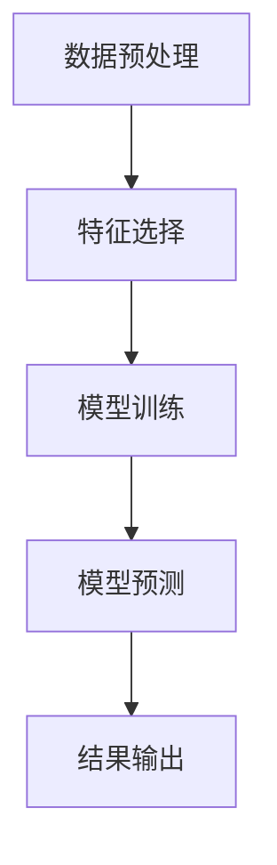
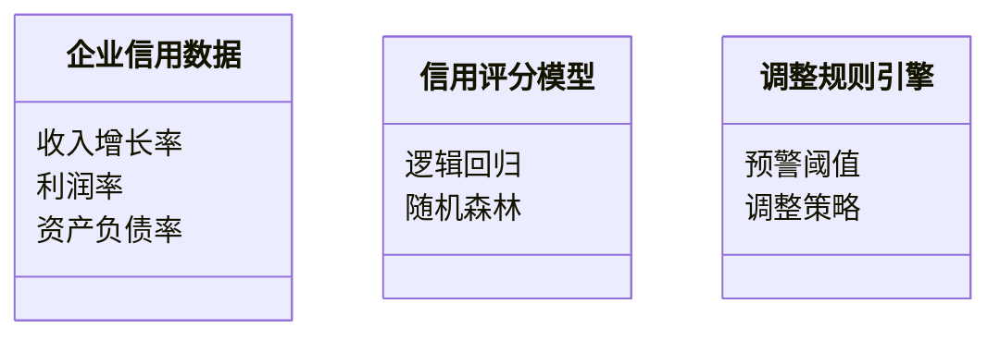
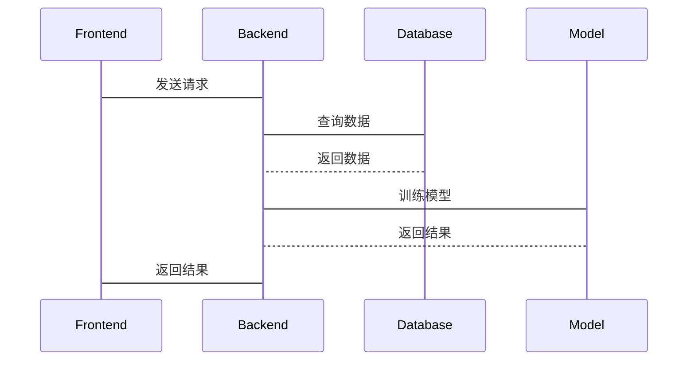

                 


# 智能企业信用额度动态调整与控制系统

> 关键词：智能控制系统、信用额度调整、机器学习、实时监控、风险控制

> 摘要：本文深入探讨了智能企业信用额度动态调整与控制系统的构建与实现。从背景介绍到核心概念，从算法原理到系统架构设计，再到项目实战与最佳实践，系统性地分析了如何利用智能化技术解决企业信用管理中的关键问题。文章结合实际案例，详细阐述了基于机器学习的信用评分模型、系统功能设计与架构实现，为读者提供了从理论到实践的完整指南。

---

# 第1章: 企业信用额度动态调整的背景与挑战

## 1.1 企业信用额度管理的重要性

### 1.1.1 信用额度管理的定义与作用
信用额度是指企业在一定时期内可以使用的信用金额上限，是企业财务管理中的重要组成部分。传统的信用额度管理依赖于人工审核和固定规则，这种方式存在效率低、灵活性差、风险控制能力弱等问题。

### 1.1.2 传统信用额度管理的局限性
- 数据量大：企业每天产生的交易数据庞大，人工处理效率低下。
- 风险滞后：传统方法难以实时捕捉市场变化和客户行为，导致信用风险滞后。
- 规则僵化：固定的信用评估规则难以应对复杂多变的市场环境。

### 1.1.3 智能化信用额度管理的必要性
随着大数据和人工智能技术的发展，企业需要更加智能化的信用额度管理方式，以实现实时监控、动态调整和风险控制。

## 1.2 信用额度动态调整的核心问题

### 1.2.1 信用风险的实时监控
企业需要实时监测客户的信用状况，包括交易数据、财务状况、市场环境等因素。

### 1.2.2 市场变化对企业信用的影响
市场波动、经济周期变化等因素会影响企业的信用能力，需要动态调整信用额度。

### 1.2.3 客户行为与信用额度的关联性
客户的交易行为、还款记录等数据与信用额度调整密切相关，需要通过数据分析实现精准调整。

## 1.3 信用额度动态调整的实现思路

### 1.3.1 数据驱动的信用评估
通过收集和分析企业数据，利用机器学习模型进行信用评分。

### 1.3.2 智能算法的应用
采用机器学习算法（如随机森林、逻辑回归）进行信用风险预测和动态调整。

### 1.3.3 系统化管理与实时调整
构建智能化系统，实现信用额度的实时计算和动态调整。

## 1.4 本章小结
本章从企业信用管理的背景出发，分析了传统信用管理的局限性，提出了智能化信用额度管理的必要性，并总结了其实现的核心思路。

---

# 第2章: 智能信用额度控制系统的概念与架构

## 2.1 智能信用额度控制系统的定义

### 2.1.1 系统的核心概念
智能信用额度控制系统是一种基于机器学习和大数据技术的智能化管理系统，能够实时监控企业信用状况并动态调整信用额度。

### 2.1.2 系统的主要功能
- 实时数据采集与处理
- 信用评分模型计算
- 信用额度动态调整
- 风险预警与报告

### 2.1.3 系统的目标与价值
- 提高信用管理效率
- 减少信用风险
- 优化企业资金流动性

## 2.2 系统的核心要素与关系

### 2.2.1 数据源与特征分析
- 数据源：企业财务数据、交易记录、市场数据等。
- 特征分析：收入增长率、利润率、资产负债率、偿债能力等。

### 2.2.2 智能算法与模型
- 算法：逻辑回归、随机森林、支持向量机等。
- 模型：信用评分模型、风险预测模型。

### 2.2.3 系统架构与模块划分
- 数据采集模块
- 数据处理模块
- 模型计算模块
- 结果输出模块

## 2.3 系统架构的ER实体关系图

```mermaid
er
    entity: 企业信用数据
    entity --> entity: 信用评分模型
    entity --> entity: 调整规则引擎
```

## 2.4 本章小结
本章详细介绍了智能信用额度控制系统的概念、核心要素与架构设计，为后续的系统实现奠定了基础。

---

# 第3章: 基于机器学习的信用评分模型

## 3.1 信用评分模型的原理

### 3.1.1 线性回归模型
线性回归是一种简单但有效的回归模型，用于预测连续型变量。

$$ y = \beta_0 + \beta_1 x + \epsilon $$

其中，$y$ 是目标变量，$x$ 是特征变量，$\beta_0$ 和 $\beta_1$ 是模型参数，$\epsilon$ 是误差项。

### 3.1.2 随机森林模型
随机森林是一种基于决策树的集成学习算法，具有较强的抗过拟合能力。

### 3.1.3 逻辑回归模型
逻辑回归用于分类问题，适合二分类场景。

$$ P(y=1|x) = \frac{1}{1 + e^{-(\beta_0 + \beta_1 x)}} $$

## 3.2 算法实现与流程

### 3.2.1 算法流程图



### 3.2.2 代码实现

```python
# 线性回归模型实现
from sklearn.linear_model import LinearRegression

model = LinearRegression()
model.fit(X_train, y_train)
y_pred = model.predict(X_test)
```

## 3.3 数学模型与公式

### 3.3.1 线性回归公式
$$ \hat{y} = \beta_0 + \beta_1 x $$

### 3.3.2 随机森林模型
随机森林通过构建多个决策树并集成预测结果，公式如下：

$$ P(y|x) = \frac{1}{N} \sum_{i=1}^{N} P_i(y|x) $$

其中，$P_i(y|x)$ 是第 $i$ 棵决策树的预测概率，$N$ 是决策树的数量。

## 3.4 案例分析与解释

### 3.4.1 案例背景
某企业最近季度的收入增长率为10%，利润率下降至5%，资产负债率上升至70%。

### 3.4.2 模型预测
基于线性回归模型，预测该企业的信用评分为75分（满分100分）。

### 3.4.3 结果解释
信用评分75分表明企业的信用风险较低，可以适当提高信用额度。

## 3.5 本章小结
本章通过介绍机器学习算法，详细讲解了信用评分模型的原理与实现，结合案例分析，展示了模型的应用价值。

---

# 第4章: 系统分析与架构设计方案

## 4.1 问题场景介绍

### 4.1.1 企业信用评估流程
企业信用评估流程包括数据采集、特征提取、模型计算、结果输出四个阶段。

### 4.1.2 信用额度调整的业务流程
- 数据采集：收集企业财务数据、市场数据等。
- 数据处理：清洗、转换和特征提取。
- 模型计算：基于机器学习算法计算信用评分。
- 结果输出：动态调整信用额度并输出报告。

## 4.2 系统功能设计

### 4.2.1 领域模型设计



### 4.2.2 系统架构设计


### 4.2.3 接口设计与交互



## 4.3 本章小结
本章从系统分析的角度，详细设计了智能信用额度控制系统的功能模块与架构，为后续的系统实现提供了理论基础。

---

# 第5章: 项目实战——信用额度动态调整系统实现

## 5.1 环境安装与配置

### 5.1.1 安装Python环境
使用Anaconda安装Python 3.8及以上版本。

### 5.1.2 安装依赖库
```bash
pip install numpy pandas scikit-learn matplotlib
```

## 5.2 核心代码实现

### 5.2.1 数据预处理

```python
import pandas as pd
from sklearn.preprocessing import StandardScaler

# 加载数据
data = pd.read_csv('企业信用数据.csv')
# 数据清洗
data.dropna(inplace=True)
# 特征提取
features = data[['收入增长率', '利润率', '资产负债率']]
# 标准化处理
scaler = StandardScaler()
features_scaled = scaler.fit_transform(features)
```

### 5.2.2 模型训练与预测

```python
from sklearn.linear_model import LinearRegression
from sklearn.metrics import mean_squared_error

# 训练模型
model = LinearRegression()
model.fit(features_scaled, data['信用评分'])
# 预测结果
y_pred = model.predict(features_scaled)
# 计算误差
 mse = mean_squared_error(data['信用评分'], y_pred)
 print(f'均方误差：{mse}')
```

### 5.2.3 接口开发

```python
from flask import Flask, request, jsonify

app = Flask(__name__)

@app.route('/adjust_credit', methods=['POST'])
def adjust_credit():
    data = request.json
    features = data['features']
    # 调用模型预测
    y_pred = model.predict(features)
    return jsonify({'credit_score': y_pred[0]})

if __name__ == '__main__':
    app.run(debug=True)
```

## 5.3 实际案例分析

### 5.3.1 案例背景
某企业最近季度的收入增长率为15%，利润率为3%，资产负债率为60%。

### 5.3.2 数据处理
```python
features = [[0.15, 0.03, 0.6]]
features_scaled = scaler.transform(features)
```

### 5.3.3 模型预测
```python
y_pred = model.predict(features_scaled)
print(f'预测信用评分：{y_pred[0]}')
```

## 5.4 项目总结
本章通过实际项目案例，详细讲解了智能信用额度控制系统的实现过程，包括数据预处理、模型训练与接口开发。

---

# 第6章: 最佳实践与系统优化

## 6.1 最佳实践

### 6.1.1 数据质量管理
确保数据的完整性、准确性和及时性。

### 6.1.2 模型优化
采用交叉验证、超参数调优等方法优化模型性能。

### 6.1.3 系统维护
定期更新模型，监控系统性能，及时修复问题。

## 6.2 小结与注意事项

### 6.2.1 小结
智能信用额度控制系统通过实时数据采集、智能算法计算和动态调整，能够有效降低信用风险，提高企业资金流动性。

### 6.2.2 注意事项
- 数据隐私保护
- 模型解释性
- 系统稳定性

## 6.3 拓展阅读

### 6.3.1 推荐书籍
- 《机器学习实战》
- 《深入浅出数据分析》

### 6.3.2 在线资源
- scikit-learn官方文档
- TensorFlow官方文档

## 6.4 本章小结
本章总结了智能信用额度控制系统的最佳实践，提出了系统优化的注意事项，并推荐了进一步学习的资源。

---

# 作者信息

作者：AI天才研究院/AI Genius Institute & 禅与计算机程序设计艺术/Zen And The Art of Computer Programming

---

感谢您的耐心阅读！如果对本文内容有任何疑问或建议，欢迎随时与我联系。

