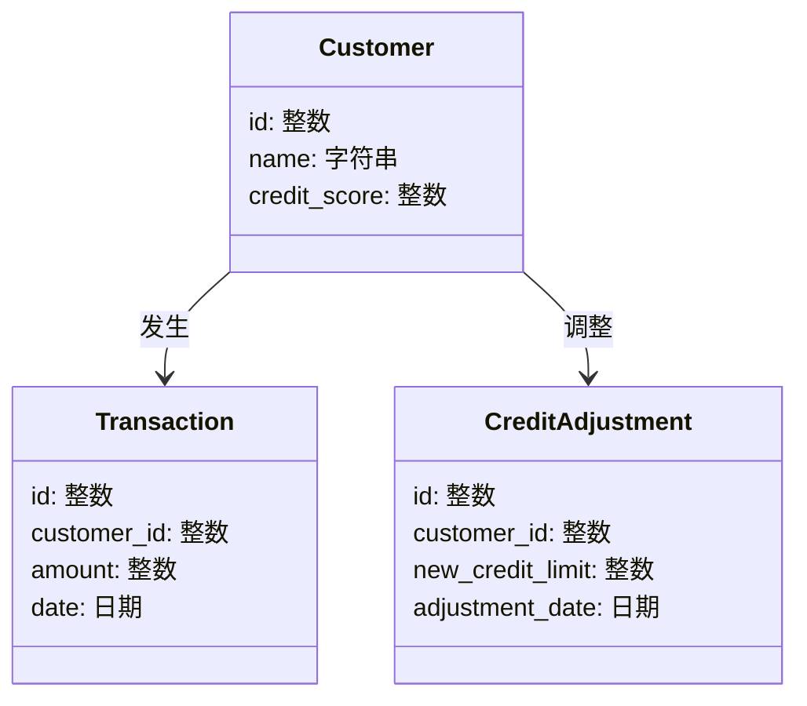
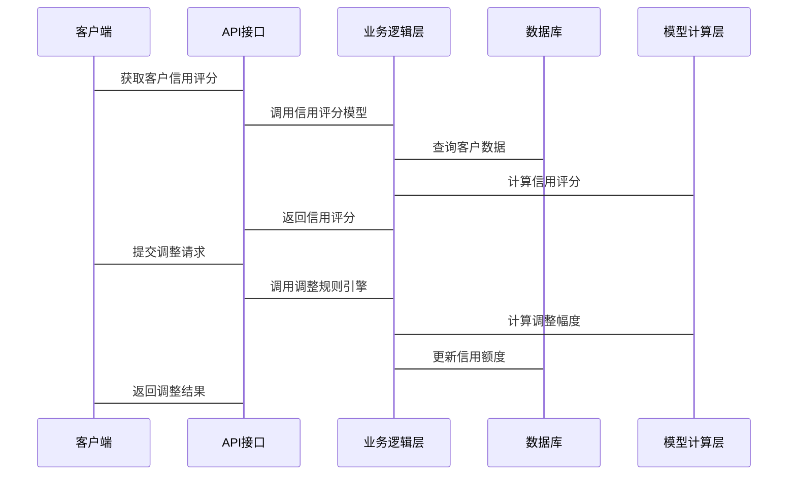

                 


# 智能企业信用额度动态调整系统

## 关键词：智能信用额度、动态调整、企业风险管理、机器学习、系统架构

## 摘要：本文系统介绍智能企业信用额度动态调整系统的构建与实现，涵盖背景分析、核心算法、系统架构设计、项目实战与优化建议，深度剖析如何利用人工智能技术提升企业信用管理效率与准确性。

---

## 第一部分：背景介绍

### 第1章：问题背景与需求分析

#### 1.1 问题背景

**1.1.1 传统信用额度管理的痛点**

传统企业信用额度管理存在以下问题：
- **人工依赖**：依赖人工审核，效率低且易出错。
- **静态调整**：信用额度固定，无法根据实时数据调整。
- **风险控制不足**：难以及时识别和应对信用风险。
- **数据孤岛**：各部门数据分散，难以有效整合。

**1.1.2 企业信用风险管理的重要性**

- 信用管理是企业资金周转的核心环节。
- 信用额度管理直接关系到企业的财务健康和风险控制。
- 动态调整信用额度有助于优化客户关系和企业收益。

**1.1.3 智能化信用额度调整的必要性**

- 应对市场变化和客户需求的快速变化。
- 提高信用额度调整的效率和准确性。
- 降低企业信用风险，提升客户满意度。

#### 1.2 问题描述

**1.2.1 信用额度调整的核心问题**

- 如何基于实时数据动态调整信用额度？
- 如何平衡信用额度的松紧与企业风险承受能力？
- 如何确保调整策略的公平性和透明性？

**1.2.2 传统信用额度调整的局限性**

- 依赖人工经验，主观性强。
- 调整周期长，无法实时响应。
- 数据维度有限，难以全面评估客户信用状况。

**1.2.3 智能信用额度调整的目标与边界**

- **目标**：实现信用额度的智能化、自动化调整，提升风险控制能力。
- **边界**：仅针对企业客户的信用额度调整，不涉及个人客户。
- **实现路径**：基于机器学习和大数据分析，构建动态调整模型。

#### 1.3 问题解决思路

**1.3.1 数据驱动的信用额度调整方法**

- 收集和分析客户的交易数据、信用历史、市场波动等多维度数据。
- 通过数据建模预测客户的信用风险。
- 根据预测结果动态调整信用额度。

**1.3.2 人工智能在信用额度调整中的应用**

- 使用机器学习算法（如随机森林、XGBoost）进行信用评分和风险预测。
- 利用自然语言处理技术分析客户反馈和市场舆情。
- 通过深度学习模型预测市场波动对信用风险的影响。

**1.3.3 动态调整的实现路径**

- 建立实时数据采集和处理系统。
- 构建信用评分模型和风险评估模型。
- 设定动态调整规则和触发条件，实现自动化调整。

#### 1.4 核心概念与系统架构

**1.4.1 系统核心要素**

- 数据源：交易数据、客户信息、市场数据。
- 数据处理：数据清洗、特征提取、数据建模。
- 模型构建：信用评分模型、风险预测模型。
- 调整规则：基于模型输出的信用额度调整策略。

**1.4.2 系统架构的边界与外延**

- 系统边界：仅处理企业客户的信用额度调整，不涉及其他业务模块。
- 系统外延：可与企业ERP系统、CRM系统集成，实现数据共享和业务联动。

**1.4.3 系统核心功能模块**

- 数据采集模块：实时采集客户交易数据、市场数据等。
- 数据处理模块：清洗数据、提取特征。
- 模型计算模块：运行信用评分和风险预测模型。
- 规则引擎模块：根据模型结果生成调整建议。
- 执行模块：调整信用额度并记录调整日志。

---

## 第二部分：核心概念与系统架构

### 第2章：核心概念与联系

#### 2.1 核心概念解析

**信用评分**

- 信用评分是对客户信用状况的量化评估。
- 评分模型基于客户的交易历史、财务状况、市场表现等因素。
- 评分结果用于判断客户的信用风险等级。

**风险评估**

- 风险评估是对客户在特定时间段内的信用风险的综合判断。
- 评估指标包括违约概率、损失程度、风险敞口等。
- 风险评估结果用于制定信用额度调整策略。

**动态调整机制**

- 动态调整机制是根据实时数据和模型预测结果，自动调整客户的信用额度。
- 调整规则基于信用评分和风险评估结果。
- 调整幅度根据客户信用状况的变化而定。

#### 2.2 核心概念对比表

| 概念       | 属性特征 |
|------------|----------|
| 信用评分    | 数据来源（交易历史、财务数据）、评分模型（逻辑回归、随机森林）、评分标准（AAA、AA、A等） |
| 风险评估    | 评估方法（VaR、CVaR）、风险指标（违约概率、损失程度）、评估频率（实时、每日、每周） |
| 动态调整机制 | 调整规则（基于评分和风险等级）、触发条件（评分变化、市场波动）、调整幅度（±10%、±20%） |

#### 2.3 ER实体关系图

```mermaid
erDiagram
    customer[客户] {
        id : 整数
        name : 字符串
        credit_score : 整数
    }
    transaction[交易记录] {
        id : 整数
        customer_id : 整数
        amount : 整数
        date : 日期
    }
    credit_adjustment[信用调整] {
        id : 整数
        customer_id : 整数
        new_credit_limit : 整数
        adjustment_date : 日期
    }
    customer "1..n" -- "1..n" transaction : 发生
    customer "1..n" -- "1..n" credit_adjustment : 调整
```

---

## 第三部分：算法原理

### 第3章：算法原理与实现

#### 3.1 算法原理

**3.1.1 信用评分模型**

- 使用逻辑回归或随机森林模型对客户信用评分。
- 输入特征包括交易历史、财务数据、市场数据等。
- 输出结果为信用评分和风险等级。

**3.1.2 风险预测模型**

- 使用XGBoost或LightGBM模型预测客户违约概率。
- 输入特征与信用评分模型相似。
- 输出结果为违约概率和风险敞口。

**3.1.3 动态调整规则**

- 根据信用评分和违约概率动态调整信用额度。
- 调整规则示例：
  - 如果客户信用评分下降，降低信用额度。
  - 如果违约概率超过阈值，冻结信用额度。

#### 3.2 算法实现

**3.2.1 数据预处理**

```python
import pandas as pd
from sklearn.preprocessing import StandardScaler

# 数据加载
data = pd.read_csv('credit_data.csv')

# 数据清洗
data.dropna()

# 特征提取
features = data[['transaction_amount', 'credit_history', 'market_trend']]
target = data['default_flag']

# 标准化处理
scaler = StandardScaler()
features_scaled = scaler.fit_transform(features)
```

**3.2.2 模型训练**

```python
from sklearn.ensemble import RandomForestClassifier
from sklearn.metrics import accuracy_score

# 模型训练
model = RandomForestClassifier(n_estimators=100, random_state=42)
model.fit(features_scaled, target)

# 模型预测
predicted = model.predict(features_scaled)
print("Accuracy:", accuracy_score(target, predicted))
```

**3.2.3 调整规则**

```python
def adjust_credit_limit(customer_id, current_limit, predicted_score, predicted_default_prob):
    if predicted_default_prob > 0.2:
        return current_limit * 0.8
    elif predicted_score < 600:
        return current_limit * 0.9
    else:
        return current_limit * 1.05
```

#### 3.3 数学模型与公式

**信用评分模型（逻辑回归）**

$$ P(y=1|x) = \frac{e^{\beta_0 + \beta_1x}}{1 + e^{\beta_0 + \beta_1x}} $$

其中，$y$ 是违约标志（1表示违约，0表示不违约），$x$ 是客户的特征向量，$\beta$ 是模型参数。

**风险预测模型（XGBoost）**

$$ \text{预测违约概率} = \text{模型预测输出} $$

模型输出是概率值，范围在0到1之间。

---

## 第四部分：系统分析与架构设计

### 第4章：系统分析与架构设计

#### 4.1 系统功能设计

**领域模型类图**



**系统架构图**

```mermaid
rectangle 数据层 {
    数据库
}
rectangle 业务逻辑层 {
    信用评分计算
    风险评估
    调整规则引擎
}
rectangle 表现层 {
    管理界面
    API接口
}
数据层 --|> 业务逻辑层
业务逻辑层 --|> 表现层
```

**系统接口设计**

- API接口：
  - GET /api/customers/{id}/credit_score
  - POST /api/customers/{id}/adjust_credit_limit

**系统交互序列图**



---

## 第五部分：项目实战

### 第5章：项目实战与优化建议

#### 5.1 环境安装与配置

```bash
# 安装依赖
pip install pandas scikit-learn xgboost mermaid
```

#### 5.2 核心代码实现

**信用评分模型实现**

```python
from sklearn.ensemble import RandomForestClassifier
from sklearn.metrics import accuracy_score

# 数据加载
data = pd.read_csv('credit_data.csv')

# 特征工程
features = data[['transaction_amount', 'credit_history', 'market_trend']]
target = data['default_flag']

# 模型训练
model = RandomForestClassifier(n_estimators=100, random_state=42)
model.fit(features, target)

# 模型预测
predicted = model.predict(features)
print("Accuracy:", accuracy_score(target, predicted))
```

**动态调整规则引擎**

```python
def adjust_credit_limit(customer_id, current_limit, predicted_score, predicted_default_prob):
    if predicted_default_prob > 0.2:
        return current_limit * 0.8
    elif predicted_score < 600:
        return current_limit * 0.9
    else:
        return current_limit * 1.05
```

#### 5.3 代码解读与分析

- **数据加载**：使用pandas读取CSV文件中的数据。
- **特征工程**：提取交易金额、信用历史、市场趋势作为特征。
- **模型训练**：使用随机森林分类器训练信用评分模型。
- **模型预测**：预测客户信用评分，并计算准确率。

#### 5.4 实际案例分析

**案例1：客户A**

- 信用评分：650
- 预测违约概率：15%
- 当前信用额度：10000元
- 调整后的信用额度：10000 * 1.05 = 10500元

**案例2：客户B**

- 信用评分：580
- 预测违约概率：25%
- 当前信用额度：10000元
- 调整后的信用额度：10000 * 0.8 = 8000元

#### 5.5 项目总结与优化建议

**总结**

- 成功实现智能信用额度动态调整系统。
- 系统具备实时数据处理、自动化调整和风险控制能力。

**优化建议**

- 引入实时数据流处理技术（如Kafka、Apache Flink）。
- 增加市场舆情分析功能，提升风险预测能力。
- 优化模型性能，采用更先进的机器学习算法（如GPT-3、BERT）。

---

## 第六部分：总结与展望

### 第6章：总结与展望

#### 6.1 总结

智能企业信用额度动态调整系统通过机器学习和大数据分析，实现了信用额度的智能化调整。系统具备以下特点：

- **实时性**：基于实时数据进行信用评分和风险预测。
- **自动化**：根据模型结果自动调整信用额度。
- **精准性**：通过机器学习模型提高信用评估的准确性。

#### 6.2 未来展望

- **技术优化**：引入深度学习技术，提升模型预测能力。
- **功能扩展**：增加客户行为分析、市场趋势预测等功能。
- **应用推广**：在更多行业推广智能信用额度调整系统。

---

## 作者

作者：AI天才研究院/AI Genius Institute & 禅与计算机程序设计艺术 /Zen And The Art of Computer Programming

