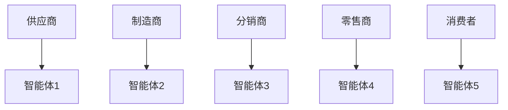
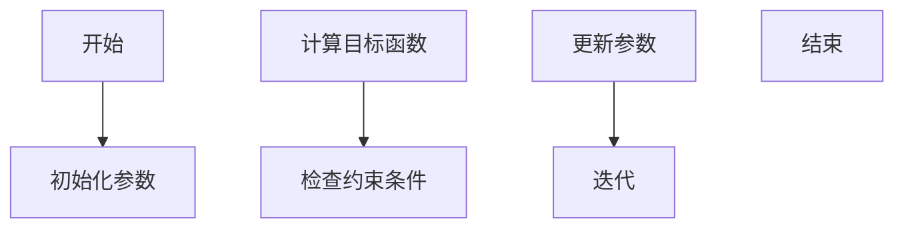
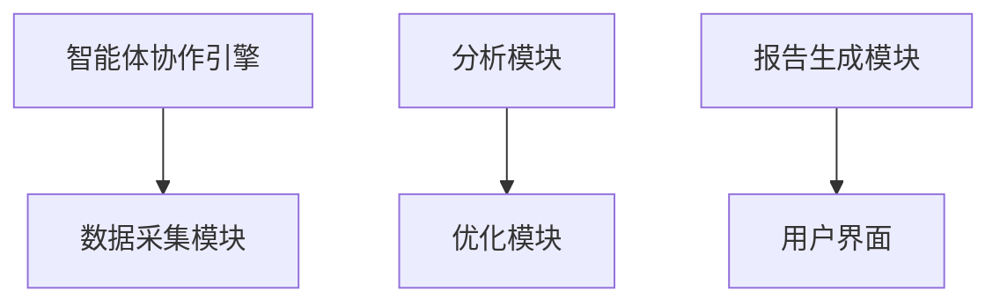
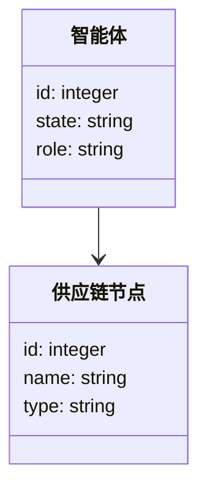
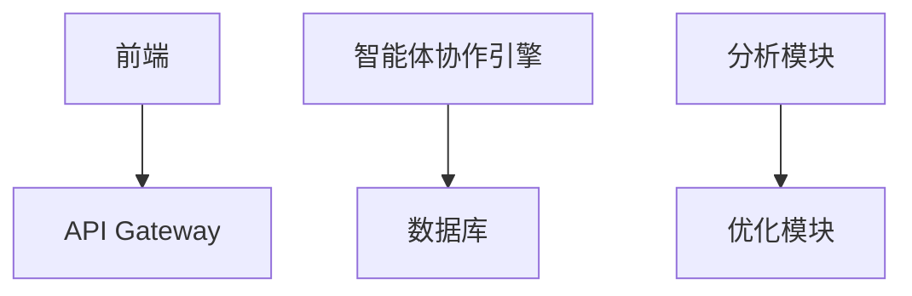
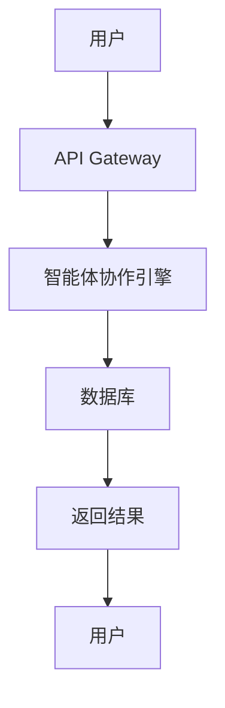

                 


# 智能体协作分析供应链：全面评估公司价值

---

## 关键词
- 智能体协作
- 供应链分析
- 公司价值评估
- 分布式系统
- 优化算法

---

## 摘要
智能体协作通过分布式计算和多智能体协同优化，能够有效分析和优化供应链，从而全面评估公司的价值。本文详细探讨了智能体协作的基本原理、算法实现、系统设计及实际应用，为读者提供了一套完整的理论与实践框架。

---

# 第1章: 智能体协作与供应链分析引论

## 1.1 智能体协作的背景与意义
### 1.1.1 智能体协作的定义与特点
智能体协作是指多个智能体通过通信和协调，共同完成复杂任务的过程。其特点包括自主性、反应性、协作性和分布性。

### 1.1.2 供应链分析的定义与目标
供应链分析是对供应链各环节进行评估和优化，目标是提高效率、降低成本和增强灵活性。

### 1.1.3 智能体协作在供应链分析中的作用
智能体协作能够实时协调供应链中的各个节点，优化库存、物流和生产计划，从而提升整体效率。

## 1.2 智能体协作的核心概念
### 1.2.1 智能体的定义与分类
智能体可以分为简单反射型、基于模型的反应型、目标驱动型和效用驱动型。

### 1.2.2 供应链中的智能体协作模式
包括分布式协作、层次化协作和混合式协作。

### 1.2.3 智能体协作的优势与挑战
优势：提高效率、增强灵活性、降低成本。挑战：通信延迟、协调复杂性。

## 1.3 供应链分析的基本原理
### 1.3.1 供应链的基本组成与功能
包括供应商、制造商、分销商、零售商和消费者。

### 1.3.2 供应链优化的目标与方法
目标：降低成本、提高效率。方法：预测分析、优化算法。

### 1.3.3 智能体协作在供应链优化中的应用
通过智能体协作优化库存管理和物流调度。

## 1.4 本章小结
总结智能体协作在供应链分析中的基本概念和作用。

---

# 第2章: 智能体协作的核心概念与联系

## 2.1 智能体协作的核心原理
### 2.1.1 分布式智能体协作机制
通过分布式计算实现协作，避免单点故障。

### 2.1.2 智能体之间的通信与协调
使用消息传递机制实现通信，通过协商达成一致。

### 2.1.3 智能体协作的决策过程
基于多智能体的决策模型，进行分布式决策。

## 2.2 供应链分析中的智能体协作模型
### 2.2.1 智能体协作的实体关系图

```mermaid
graph TD
A[供应商] --> B[制造商]
C[分销商] <-- B
D[零售商] <-- C
E[消费者] <-- D
```

### 2.2.2 智能体协作的协作流程



## 2.3 供应链分析中的协作机制

### 2.3.1 分布式计算与任务分配
使用分布式算法优化任务分配。

### 2.3.2 共识机制与决策优化
通过共识算法达成一致，优化决策过程。

## 2.4 本章小结
总结智能体协作的核心概念及其在供应链分析中的应用。

---

# 第3章: 智能体协作的算法原理

## 3.1 智能体协作的算法基础
### 3.1.1 分布式计算与通信
通过分布式系统实现智能体协作。

### 3.1.2 共识机制
介绍共识算法，如拜占庭容错。

## 3.2 供应链分析中的优化算法

### 3.2.1 优化目标
如最小化成本、最大化效率。

### 3.2.2 算法实现

#### 3.2.2.1 优化模型
$$\text{目标函数} = \sum_{i=1}^{n} c_i x_i$$
$$\text{约束条件} = \{x_i \geq 0\}$$

#### 3.2.2.2 算法流程图



## 3.3 代码实现

```python
def optimize(parameters):
    while not converged:
        compute gradients
        update parameters
    return optimal solution
```

## 3.4 本章小结
总结算法原理及其在供应链优化中的应用。

---

# 第4章: 系统分析与架构设计

## 4.1 系统分析
### 4.1.1 项目背景
介绍智能体协作分析供应链的背景。

### 4.1.2 系统功能设计
包括数据采集、分析、优化和报告生成。

### 4.1.3 系统架构设计



## 4.2 系统设计

### 4.2.1 领域模型类图



### 4.2.2 系统架构图



## 4.3 接口设计与交互流程

### 4.3.1 API接口设计
如RESTful API。

### 4.3.2 交互流程图



## 4.4 本章小结
总结系统分析与架构设计。

---

# 第5章: 项目实战

## 5.1 环境安装
### 5.1.1 安装Python
```bash
python --version
pip install -r requirements.txt
```

## 5.2 核心代码实现

### 5.2.1 数据采集模块
```python
import requests
def get_supply_chain_data():
    response = requests.get('http://api.supplychain.com/data')
    return response.json()
```

### 5.2.2 智能体协作引擎
```python
class Agent:
    def __init__(self, id):
        self.id = id
        self.state = 'idle'
    def collaborate(self, other_agents):
        # 协作逻辑
        pass
```

### 5.2.3 优化算法实现
```python
def optimize(params):
    for i in range(100):
        compute gradients
        update params
    return params
```

### 5.2.4 报告生成
```python
from reportlab.pdfgen import canvas
def generate_report():
    c = canvas.Canvas('report.pdf')
    c.drawString(10, 10, 'Supply Chain Optimization Report')
    c.save()
```

## 5.3 代码应用解读与分析
详细解读每一部分代码的功能和实现逻辑。

## 5.4 实际案例分析
分析一个具体案例，展示智能体协作如何优化供应链。

## 5.5 项目小结
总结项目实现过程中的经验和教训。

---

# 第6章: 最佳实践与总结

## 6.1 最佳实践 tips
### 6.1.1 系统设计建议
如模块化设计、可扩展性考虑。

### 6.1.2 算法优化建议
如选择合适的算法、参数调优。

## 6.2 小结
总结全文内容，强调智能体协作的重要性。

## 6.3 注意事项
提醒读者注意智能体协作中的潜在问题，如通信延迟、数据安全。

## 6.4 拓展阅读
推荐相关书籍和资源，供读者深入学习。

---

# 结论与展望

智能体协作通过优化供应链分析，显著提升了公司价值评估的准确性。未来，随着AI和分布式技术的发展，智能体协作将在供应链管理中发挥更大的作用。

---

# 作者

作者：AI天才研究院 & 禅与计算机程序设计艺术

---

通过以上结构和内容，本文系统地介绍了智能体协作在供应链分析中的应用，从理论到实践，为读者提供了全面的知识和实用的指导。

