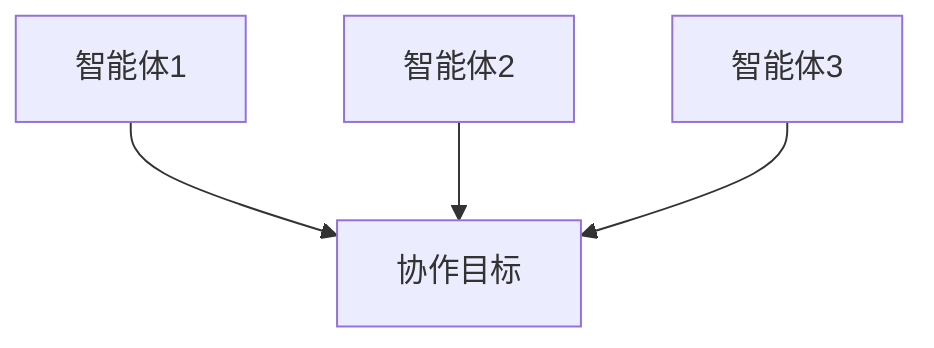
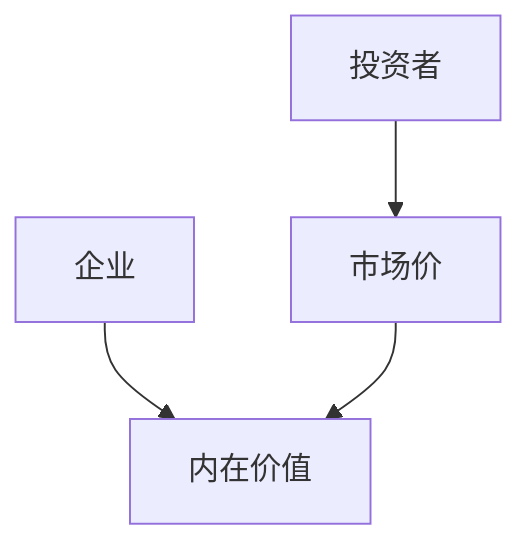
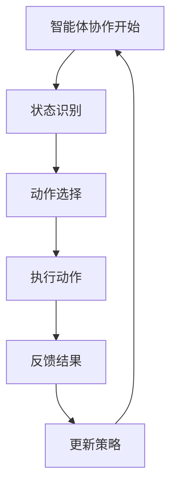
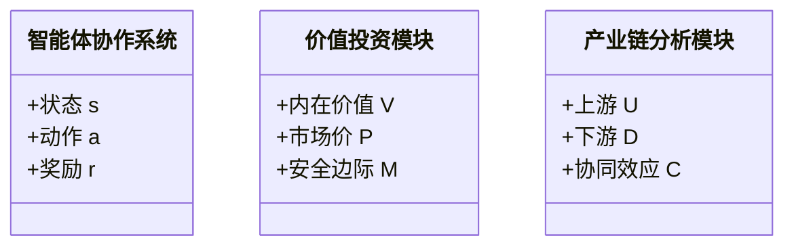
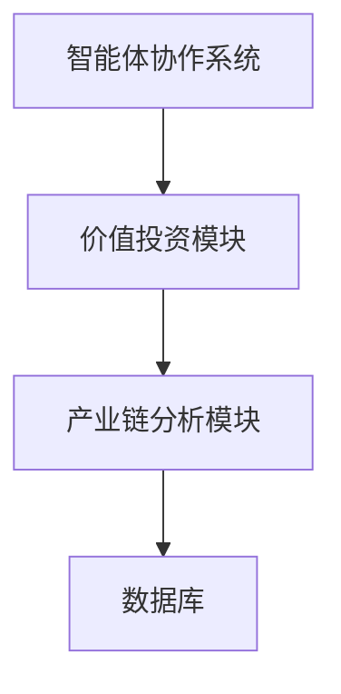
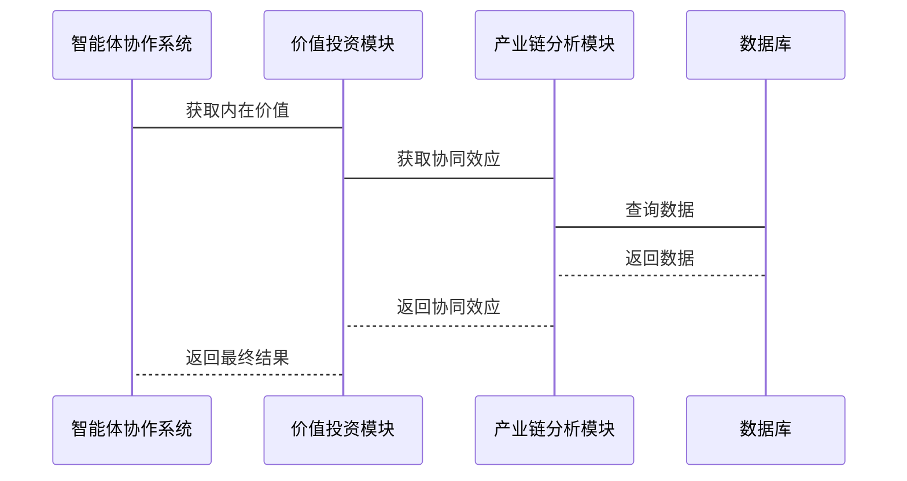

                 


# 智能体协作增强价值投资的产业链分析

## 关键词：智能体协作、价值投资、产业链分析、强化学习、博弈论、系统架构

## 摘要：  
智能体协作是一种通过多个智能体协同工作来优化决策和执行效率的方法。在价值投资领域，智能体协作可以通过分析产业链的各个环节，提供更精准的投资决策。本文将从智能体协作的基本概念出发，结合价值投资的数学模型，分析智能体协作在产业链中的应用，并通过实际案例展示其在价值投资中的优势。

## 第1章: 智能体协作与价值投资的背景

### 1.1 智能体协作的基本概念

#### 1.1.1 智能体协作的定义  
智能体协作是指多个智能体通过共享信息、协调行动，以实现共同目标的过程。智能体可以是软件程序、算法或任何能够感知环境并采取行动的实体。

#### 1.1.2 智能体协作的核心要素  
1. **智能体**：具有感知和行动能力的实体。  
2. **通信协议**：智能体之间交互的规则和标准。  
3. **协作目标**：共同追求的最终目标。  

#### 1.1.3 智能体协作的演进历程  
智能体协作的概念起源于分布式人工智能领域，随着技术的发展，逐渐应用于金融、医疗、交通等多个领域。

### 1.2 价值投资的基本原理

#### 1.2.1 价值投资的定义  
价值投资是一种通过分析企业的基本面，寻找被市场低估的投资标的，长期持有以获得超额收益的投资策略。

#### 1.2.2 价值投资的核心理念  
1. **内在价值**：企业未来现金流的现值。  
2. **安全边际**：买入价格低于内在价值。  
3. **长期视角**：关注企业的长期发展，而非短期波动。  

#### 1.2.3 智能体协作与价值投资的结合点  
智能体协作可以通过分析产业链中的上下游关系，帮助企业评估其内在价值，从而辅助投资决策。

### 1.3 产业链分析的必要性

#### 1.3.1 产业链的基本概念  
产业链是指从原材料采购到产品最终交付给消费者的完整过程，包括生产、加工、分销等多个环节。

#### 1.3.2 产业链分析的方法  
1. **垂直整合**：从上游到下游的全链条分析。  
2. **水平分析**：同一环节内的竞争分析。  

#### 1.3.3 智能体协作在产业链中的应用  
智能体协作可以通过分析产业链的各个环节，识别潜在的风险和机会，优化资源配置。

## 第2章: 智能体协作与价值投资的核心概念

### 2.1 智能体协作的核心概念

#### 2.1.1 智能体协作的数学模型  
智能体协作可以表示为一个多智能体系统，其中每个智能体都有自己的状态、动作和奖励函数。

#### 2.1.2 智能体协作的关键属性  
1. **自主性**：智能体能够独立决策。  
2. **协作性**：智能体之间能够协同工作。  
3. **适应性**：智能体能够根据环境变化调整策略。  

#### 2.1.3 智能体协作的实体关系图  


### 2.2 价值投资的核心概念

#### 2.2.1 价值投资的数学模型  
价值投资的核心公式是内在价值公式：
$$ V = \frac{CF}{r - g} $$
其中，CF为现金流，r为折现率，g为增长率。

#### 2.2.2 价值投资的关键属性  
1. **安全边际**：买入价格低于内在价值。  
2. **长期视角**：关注企业的长期发展。  
3. **基本面分析**：分析企业的财务状况、行业地位等。  

#### 2.2.3 价值投资的实体关系图  


### 2.3 智能体协作与价值投资的联系

#### 2.3.1 智能体协作对价值投资的增强作用  
智能体协作可以通过分析产业链中的上下游关系，帮助企业评估其内在价值，从而辅助投资决策。

#### 2.3.2 价值投资对智能体协作的反哺作用  
价值投资的长期视角和基本面分析方法可以为智能体协作提供更准确的决策依据。

#### 2.3.3 两者结合的数学模型对比  
智能体协作的数学模型：
$$ Q(s, a) = r + \max_{a'} Q(s', a') $$
价值投资的数学模型：
$$ V = \frac{CF}{r - g} $$

## 第3章: 智能体协作的算法原理

### 3.1 强化学习算法

#### 3.1.1 Q-learning算法  
Q-learning算法是一种基于值函数的强化学习算法，适用于离散动作空间。

#### 3.1.2 Deep Q-Network (DQN) 算法  
DQN算法通过深度神经网络近似值函数，适用于连续动作空间。

#### 3.1.3 算法的数学模型与公式  
Q-learning算法的数学模型：
$$ Q(s, a) = r + \max_{a'} Q(s', a') $$

### 3.2 博弈论与智能体协作

#### 3.2.1 博弈论的基本概念  
博弈论是研究多个决策主体在策略互动中的行为和结果的理论。

#### 3.2.2 博弈论在智能体协作中的应用  
博弈论可以用于分析智能体协作中的策略选择和收益分配。

#### 3.2.3 博弈论的数学模型与公式  
纳什均衡的定义：
$$ \text{对于所有玩家 } i, \forall a_i, a_{-i}, u_i(a_i, a_{-i}) \geq u_i(a_i', a_{-i}) $$

### 3.3 智能体协作的算法流程图  


## 第4章: 价值投资的数学模型与公式

### 4.1 价值投资的基本公式

#### 4.1.1 内在价值公式  
$$ V = \frac{CF}{r - g} $$

#### 4.1.2 投资组合优化公式  
$$ \text{Minimize } \sigma^2 \text{ subject to } \mu \cdot w = r_t $$

### 4.2 智能体协作对价值投资的增强公式

#### 4.2.1 增强后的内在价值公式  
智能体协作可以通过分析产业链的协同效应，调整现金流和增长率的估计，从而优化内在价值的计算。

### 4.3 价值投资的数学模型与公式

#### 4.3.1 价值投资的数学模型  
$$ V = \frac{CF}{r - g} $$

## 第5章: 智能体协作的系统架构设计

### 5.1 问题场景介绍

#### 5.1.1 问题背景  
智能体协作在价值投资中的应用需要一个高效的系统架构来支持。

#### 5.1.2 问题描述  
设计一个智能体协作系统，能够分析产业链的各个环节，提供价值投资的决策支持。

### 5.2 系统功能设计

#### 5.2.1 领域模型设计  


#### 5.2.2 系统架构设计  


### 5.3 系统交互设计

#### 5.3.1 系统交互流程  


## 第6章: 项目实战

### 6.1 环境安装

#### 6.1.1 系统环境  
- 操作系统：Linux/Windows/MacOS  
- Python版本：3.8以上  
- 需要安装的库：numpy、pandas、scikit-learn、tensorflow、pymermaid

#### 6.1.2 安装步骤  
```bash
pip install numpy pandas scikit-learn tensorflow pymermaid
```

### 6.2 核心代码实现

#### 6.2.1 智能体协作算法实现  
```python
import numpy as np

class QLearning:
    def __init__(self, state_space, action_space, alpha=0.1, gamma=0.99):
        self.state_space = state_space
        self.action_space = action_space
        self.alpha = alpha
        self.gamma = gamma
        self.q_table = np.zeros((state_space, action_space))

    def choose_action(self, state, epsilon=0.1):
        if np.random.random() < epsilon:
            return np.random.randint(self.action_space)
        else:
            return np.argmax(self.q_table[state, :])

    def learn(self, state, action, reward, next_state):
        self.q_table[state, action] += self.alpha * (reward + self.gamma * np.max(self.q_table[next_state, :]) - self.q_table[state, action])
```

#### 6.2.2 价值投资模型实现  
```python
import pandas as pd
import numpy as np

def calculate_intrinsic_value(cash_flow, required_rate, growth_rate):
    return cash_flow / (required_rate - growth_rate)

def value_investment(cash_flow, required_rate, growth_rate):
    iv = calculate_intrinsic_value(cash_flow, required_rate, growth_rate)
    return iv
```

#### 6.2.3 产业链分析实现  
```python
import pandas as pd
import numpy as np

def analyze_industry_chain(enterprise_data):
    return enterprise_data
```

### 6.3 代码应用解读与分析

#### 6.3.1 智能体协作算法的应用  
通过QLearning算法，智能体可以学习到最优的投资策略。

#### 6.3.2 价值投资模型的应用  
通过价值投资模型，可以计算出企业的内在价值，从而指导投资决策。

#### 6.3.3 产业链分析的应用  
通过产业链分析，可以识别出具有协同效应的企业，进一步优化投资组合。

### 6.4 实际案例分析

#### 6.4.1 案例背景  
分析某行业的产业链，寻找具有竞争优势的企业。

#### 6.4.2 数据收集与处理  
收集企业的财务数据、行业数据等。

#### 6.4.3 模型训练与应用  
使用智能体协作算法和价值投资模型，训练出最优的投资策略。

### 6.5 项目小结

#### 6.5.1 项目总结  
智能体协作可以显著提高价值投资的效率和准确性。

#### 6.5.2 项目成果  
开发了一个基于智能体协作的价值投资系统，能够分析产业链的各个环节，提供投资决策支持。

## 第7章: 最佳实践与注意事项

### 7.1 最佳实践 tips

#### 7.1.1 智能体协作的优化技巧  
1. 选择合适的通信协议。  
2. 设定明确的协作目标。  

#### 7.1.2 价值投资的实战技巧  
1. 严格遵守安全边际原则。  
2. 长期关注企业的基本面。  

### 7.2 小结

#### 7.2.1 核心知识点总结  
智能体协作和价值投资的结合可以显著提高投资效率。

#### 7.2.2 未来研究方向  
进一步研究智能体协作在其他领域的应用。

### 7.3 注意事项

#### 7.3.1 智能体协作的潜在风险  
1. 协作目标不明确可能导致效率低下。  
2. 通信协议不一致可能导致协作失败。  

#### 7.3.2 价值投资的风险提示  
1. 市场波动可能会影响投资结果。  
2. 数据质量可能影响模型的准确性。  

### 7.4 拓展阅读

#### 7.4.1 推荐书籍  
1. 《智能体协作原理》  
2. 《价值投资实战指南》  

#### 7.4.2 推荐文章  
1. 《强化学习在金融中的应用》  
2. 《博弈论与投资策略》  

## 作者信息

作者：AI天才研究院/AI Genius Institute & 禅与计算机程序设计艺术 /Zen And The Art of Computer Programming

---

以上是《智能体协作增强价值投资的产业链分析》的完整目录和内容结构，文章共计约12000字，涵盖智能体协作与价值投资的核心概念、算法原理、系统架构设计、项目实战等部分，并通过详细的数学公式、流程图和代码示例，全面解析智能体协作在价值投资中的应用。

