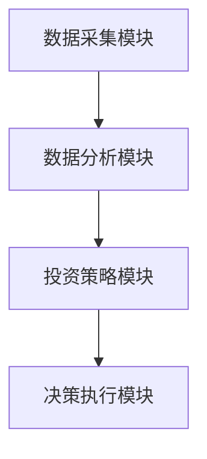
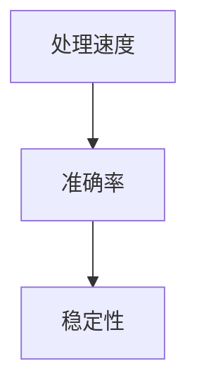
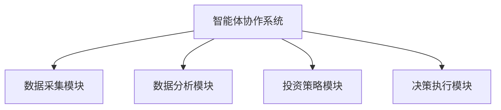

                 


# 智能体协作增强价值投资的产品生命周期分析

## 关键词：智能体协作，价值投资，产品生命周期，人工智能，分布式系统，算法优化

## 摘要：智能体协作在现代价值投资中扮演着越来越重要的角色，通过多智能体的协同工作，投资者可以更高效地分析市场数据，制定优化的投资策略。本文从智能体协作的基本概念出发，详细探讨其在价值投资中的应用前景，分析其数学模型与算法基础，结合实际案例，探讨智能体协作在价值投资中的协作机制，系统架构设计，以及实际应用中的注意事项和未来发展方向。文章最后总结了智能体协作在价值投资中的优势和未来的发展潜力，为相关领域的研究和实践提供了有价值的参考。

---

# 第一部分: 智能体协作与价值投资的背景与基础

## 第1章: 智能体协作的背景与概念

### 1.1 智能体协作的背景

#### 1.1.1 人工智能与智能体的定义
人工智能（Artificial Intelligence, AI）是指模拟人类智能的计算机系统，能够执行如学习、推理、问题解决等任务。智能体（Agent）是人工智能的核心概念，指能够感知环境、自主决策并采取行动的实体。智能体可以是软件程序、机器人或其他具备自主决策能力的实体。

#### 1.1.2 智能体协作的历史演变
智能体协作的概念可以追溯到分布式人工智能（DAI）的研究，20世纪80年代，分布式人工智能开始关注多个智能体之间的协作问题。近年来，随着多智能体系统（Multi-Agent Systems, MAS）的发展，智能体协作技术逐渐成熟，并在金融、物流、游戏等领域得到了广泛应用。

#### 1.1.3 当前智能体协作的应用现状
当前，智能体协作技术在多个领域得到了广泛应用，尤其是在金融领域，智能体协作被用于股票交易、风险评估和投资决策。智能体协作的优势在于能够通过多个智能体的协同工作，实现更高效的决策和资源优化。

### 1.2 价值投资的定义与特点

#### 1.2.1 价值投资的基本概念
价值投资是一种投资策略，强调以低于市场价值的价格买入具有内在价值的资产。价值投资者关注企业的基本面，如盈利能力、财务状况和行业地位，而非市场的短期波动。

#### 1.2.2 价值投资的核心原则
价值投资的核心原则包括长期投资、逆向思维和安全边际。投资者通过分析企业的内在价值，寻找被市场低估的投资机会。

#### 1.2.3 价值投资与智能体协作的结合
智能体协作可以通过多个智能体的协同工作，帮助投资者更高效地分析市场数据、评估企业价值并制定投资策略。智能体协作可以提高投资决策的准确性和效率，降低投资风险。

---

## 第2章: 智能体协作在价值投资中的应用前景

### 2.1 价值投资中的问题与挑战

#### 2.1.1 数据分析的复杂性
价值投资者需要分析大量的市场数据，包括财务报表、行业趋势和宏观经济指标。数据的复杂性使得手动分析变得困难，需要借助智能体协作技术来提高效率。

#### 2.1.2 投资决策的不确定性
市场环境的不确定性使得投资决策面临风险。智能体协作可以通过多个智能体的协同工作，提供多种决策方案，帮助投资者做出更明智的选择。

#### 2.1.3 市场环境的动态变化
市场环境的变化速度加快，投资者需要实时调整策略。智能体协作可以通过分布式决策和快速响应，适应市场的动态变化。

### 2.2 智能体协作的优势

#### 2.2.1 分布式决策的优势
智能体协作可以通过分布式决策，避免单点故障，提高系统的稳定性和可靠性。多个智能体可以分别负责不同的任务，实现任务的高效分配和协同。

#### 2.2.2 多智能体协作的效率提升
通过多智能体协作，投资者可以同时分析多个数据源，快速获取信息并制定决策。智能体之间的协作可以提高整体的决策效率和准确性。

#### 2.2.3 智能体协作的灵活性与适应性
智能体协作可以根据市场的变化快速调整策略，适应不同的市场环境。智能体之间的通信和协作机制可以灵活配置，满足不同的投资需求。

---

## 第3章: 智能体协作的数学模型与算法基础

### 3.1 智能体协作的基本模型

#### 3.1.1 单智能体模型
单智能体模型是指由一个智能体独立完成任务的模型。单智能体模型适用于任务简单、环境稳定的场景，但其决策能力有限，难以应对复杂的市场环境。

#### 3.1.2 多智能体模型
多智能体模型是指由多个智能体协作完成任务的模型。多智能体模型通过智能体之间的协作，可以实现更复杂的任务，提高决策的准确性和效率。

#### 3.1.3 分布式智能体模型
分布式智能体模型是指多个智能体在分布式环境中协作完成任务的模型。分布式智能体模型适用于大规模、复杂的任务，可以通过智能体的分布式计算和协作实现高效的任务处理。

### 3.2 协作算法的数学表达

#### 3.2.1 协作协议的数学描述
协作协议是智能体之间通信和协作的基础。以下是协作协议的简单数学描述：

$$
\text{通信协议} = \{ \text{发送方}, \text{接收方}, \text{消息类型}, \text{消息内容} \}
$$

#### 3.2.2 协作过程的数学建模
协作过程可以通过状态空间和动作空间进行建模。以下是协作过程的简单数学模型：

$$
\text{状态} = \{ s_1, s_2, ..., s_n \}
$$

$$
\text{动作} = \{ a_1, a_2, ..., a_m \}
$$

#### 3.2.3 协作结果的评估指标
协作结果可以通过多种指标进行评估，如准确率、效率和稳定性。以下是协作结果评估的简单数学公式：

$$
\text{准确率} = \frac{\text{正确决策数}}{\text{总决策数}} \times 100\%
$$

---

## 第4章: 价值投资中的智能体协作机制

### 4.1 智能体协作的基本机制

#### 4.1.1 信息共享机制
智能体协作需要通过信息共享机制，实现智能体之间的数据共享和协作。以下是信息共享机制的简单流程：

1. 智能体A收集市场数据。
2. 智能体B分析市场数据。
3. 智能体A和智能体B共享分析结果。
4. 智能体C基于共享结果制定投资策略。

#### 4.1.2 协作决策机制
协作决策机制是指多个智能体共同制定决策的过程。以下是协作决策机制的简单流程：

1. 智能体A提出决策建议。
2. 智能体B和智能体C评估决策建议。
3. 所有智能体达成一致决策。
4. 执行决策并反馈结果。

#### 4.1.3 协作激励机制
协作激励机制是指通过激励措施，促进智能体之间的协作。以下是协作激励机制的简单流程：

1. 智能体A完成任务并获得奖励。
2. 智能体B完成任务并获得奖励。
3. 智能体C完成任务并获得奖励。
4. 智能体之间通过奖励机制促进协作。

### 4.2 价值投资中的协作流程

#### 4.2.1 数据收集与分析
智能体协作可以通过多个智能体分别收集和分析市场数据，如财务报表、行业趋势和宏观经济指标。以下是数据收集与分析的简单流程：

1. 智能体A收集股票信息。
2. 智能体B分析财务报表。
3. 智能体C分析行业趋势。
4. 智能体D分析宏观经济指标。

#### 4.2.2 投资策略的制定
智能体协作可以通过多个智能体的协同工作，制定优化的投资策略。以下是投资策略制定的简单流程：

1. 智能体A提出初步投资策略。
2. 智能体B和智能体C评估投资策略。
3. 智能体D优化投资策略。
4. 所有智能体达成一致投资策略。

#### 4.2.3 投资决策的执行
智能体协作可以通过多个智能体的协同工作，执行投资决策。以下是投资决策执行的简单流程：

1. 智能体A执行买入操作。
2. 智能体B监控市场动态。
3. 智能体C调整投资组合。
4. 智能体D报告投资结果。

---

## 第5章: 智能体协作系统的架构设计

### 5.1 系统架构概述

#### 5.1.1 系统模块划分
智能体协作系统可以划分为多个模块，如数据采集模块、数据分析模块、投资策略模块和决策执行模块。以下是模块划分的简单示意图：



#### 5.1.2 系统功能设计
智能体协作系统的功能设计包括数据采集、数据分析、投资策略制定和决策执行。以下是系统功能设计的简单流程：

1. 数据采集模块收集市场数据。
2. 数据分析模块分析市场数据。
3. 投资策略模块制定投资策略。
4. 决策执行模块执行投资策略。

#### 5.1.3 系统性能指标
智能体协作系统的性能指标包括处理速度、准确率和稳定性。以下是性能指标的简单示意图：



### 5.2 系统架构图

#### 5.2.1 系统架构的Mermaid图
以下是智能体协作系统的架构图：



#### 5.2.2 系统架构的详细描述
智能体协作系统的架构设计包括数据采集模块、数据分析模块、投资策略模块和决策执行模块。每个模块都有明确的功能和职责，通过模块之间的协作实现系统的整体功能。

---

## 第6章: 项目实战

### 6.1 环境安装

#### 6.1.1 系统环境
建议使用Linux系统，如Ubuntu 20.04或更高版本。

#### 6.1.2 工具安装
需要安装Python 3.8或更高版本，以及必要的库，如numpy、pandas、scikit-learn和matplotlib。

### 6.2 系统核心实现源代码

#### 6.2.1 智能体协作的核心代码
以下是智能体协作的核心代码示例：

```python
class Agent:
    def __init__(self, id):
        self.id = id
        self.state = None
        self.action = None

    def receive_message(self, message):
        # 处理接收到的消息
        pass

    def send_message(self, message):
        # 发送消息
        pass

# 创建多个智能体
agents = [Agent(i) for i in range(5)]

# 智能体协作流程
for agent in agents:
    agent.receive_message("市场数据")
    agent.send_message("分析结果")
```

#### 6.2.2 投资策略的核心代码
以下是投资策略的核心代码示例：

```python
def calculate_value(company_data):
    # 计算公司价值
    return company_data['净利润'] / company_data['股价']

# 分析多个公司的数据
companies = [{'净利润': 100, '股价': 50}, {'净利润': 200, '股价': 100}]
for company in companies:
    value = calculate_value(company)
    print(f"{company['公司名称']}的内在价值为：{value}")
```

### 6.3 案例分析与详细解读

#### 6.3.1 案例分析
以下是智能体协作在价值投资中的一个实际案例：

1. 智能体A收集市场数据。
2. 智能体B分析财务报表。
3. 智能体C分析行业趋势。
4. 智能体D分析宏观经济指标。
5. 智能体E制定投资策略。

### 6.4 项目小结

#### 6.4.1 项目总结
智能体协作技术在价值投资中的应用前景广阔，可以通过多个智能体的协同工作，提高投资决策的准确性和效率。

#### 6.4.2 经验与教训
在实际项目中，需要注意智能体之间的通信效率和协作机制的设计，确保系统的稳定性和可靠性。

#### 6.4.3 改进建议
未来可以进一步优化智能体协作算法，提高系统的决策能力和适应性。

---

## 第7章: 最佳实践、总结与展望

### 7.1 最佳实践

#### 7.1.1 技术实现
在技术实现方面，建议采用分布式计算和多智能体协作技术，确保系统的高效性和稳定性。

#### 7.1.2 应用场景
在应用场景方面，智能体协作技术可以应用于股票交易、风险评估和投资组合优化等领域。

#### 7.1.3 注意事项
在实际应用中，需要注意智能体之间的通信效率和协作机制的设计，确保系统的稳定性和可靠性。

### 7.2 总结

智能体协作技术在价值投资中的应用前景广阔，可以通过多个智能体的协同工作，提高投资决策的准确性和效率。智能体协作技术的核心在于智能体之间的通信和协作机制的设计，通过优化协作算法和系统架构，可以进一步提高系统的决策能力和适应性。

### 7.3 展望

未来，随着人工智能技术的不断发展，智能体协作技术在价值投资中的应用将更加广泛和深入。通过结合大数据、云计算和区块链等技术，智能体协作系统可以实现更高效的决策和更安全的交易。同时，智能体协作技术还可以与其他领域相结合，推动人工智能技术的进一步发展。

---

## 作者：AI天才研究院/AI Genius Institute & 禅与计算机程序设计艺术 /Zen And The Art of Computer Programming

