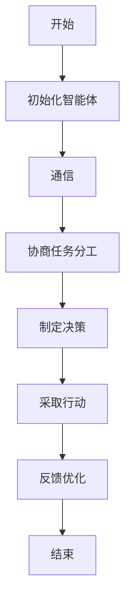
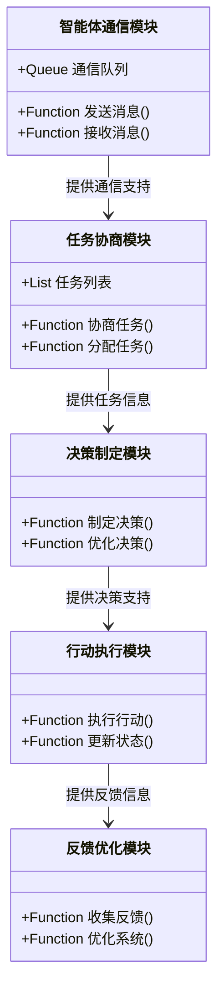
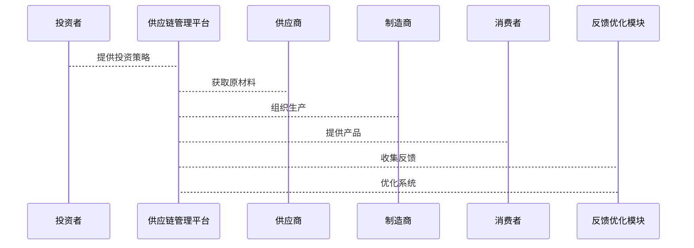

                 


# 智能体协作增强价值投资的供应链分析

## 关键词：智能体协作，供应链分析，价值投资，算法原理，系统架构

## 摘要：
本文探讨了智能体协作如何增强供应链分析中的价值投资。通过分析智能体协作的核心原理、算法实现以及系统架构设计，本文详细阐述了智能体协作在供应链优化中的应用，及其对价值投资的积极影响。文章从理论到实践，结合具体案例和代码实现，为读者提供了一套完整的解决方案，展示了如何利用智能体协作技术提升供应链分析的效率和准确性，从而增强价值投资的决策能力。

---

# 第一部分: 智能体协作与价值投资的背景与基础

## 第1章: 智能体协作与价值投资概述

### 1.1 智能体协作的定义与特点
#### 1.1.1 智能体的基本概念
智能体（Agent）是一种能够感知环境、自主决策并采取行动的实体。它可以是一个软件程序、机器人或其他具备智能行为的系统。智能体的核心特征包括：
- **自主性**：无需外部干预，自主决策。
- **反应性**：能够感知环境并实时调整行为。
- **协作性**：能够与其他智能体或人类进行协作。

#### 1.1.2 智能体协作的核心特征
智能体协作是指多个智能体通过共享信息、协同决策和分工合作，共同完成复杂任务的过程。其核心特征包括：
- **分布式决策**：每个智能体独立决策，但通过协作达成整体目标。
- **信息共享**：智能体之间通过通信共享信息，提升整体决策能力。
- **动态适应性**：能够根据环境变化实时调整协作策略。

#### 1.1.3 智能体协作的应用场景
智能体协作广泛应用于多个领域，包括：
- **供应链管理**：优化供应链中的物流、库存和资源分配。
- **金融投资**：通过智能体协作进行多资产配置和风险控制。
- **智能制造**：实现生产设备的协同工作，提升生产效率。

### 1.2 价值投资的基本原理
#### 1.2.1 价值投资的定义与核心理念
价值投资是一种以企业内在价值为导向的投资策略，强调以低于内在价值的价格买入优质资产。其核心理念是通过分析企业的财务状况、行业地位和未来前景，找到被市场低估的投资标的。

#### 1.2.2 价值投资的关键要素分析
价值投资的关键要素包括：
- **企业基本面**：包括收入、利润、资产负债表等财务指标。
- **行业地位**：企业在行业中的竞争力和市场占有率。
- **未来前景**：包括行业发展趋势和企业的创新能力。

#### 1.2.3 价值投资与供应链的关系
供应链是企业获取原材料、生产产品并交付给客户的关键环节。优化供应链管理可以降低成本、提高效率，从而增强企业的竞争优势，最终提升其内在价值。

### 1.3 供应链分析的智能体协作优势
#### 1.3.1 传统供应链分析的局限性
传统供应链分析通常依赖人工经验，存在以下问题：
- **信息孤岛**：不同部门之间信息不共享，导致决策不一致。
- **效率低下**：人工分析耗时长，难以应对复杂多变的市场环境。
- **决策滞后**：无法实时响应市场变化，导致错失商机。

#### 1.3.2 智能体协作在供应链分析中的作用
智能体协作通过以下方式提升供应链分析能力：
- **实时信息共享**：智能体之间实时通信，确保信息透明。
- **分布式决策**：多个智能体协同工作，快速响应市场变化。
- **优化资源配置**：通过协作实现资源的最优配置，降低成本。

#### 1.3.3 智能体协作增强价值投资的潜力
智能体协作可以通过以下方式增强价值投资：
- **多维度分析**：智能体协作可以从多个维度对供应链进行分析，提供更全面的投资决策依据。
- **实时监控**：通过实时监控供应链动态，及时发现潜在风险，优化投资策略。
- **数据驱动决策**：利用大数据和人工智能技术，提高决策的科学性和准确性。

### 1.4 本章小结
本章介绍了智能体协作的基本概念、特点及其在供应链分析中的应用。通过对比传统供应链分析的局限性，阐述了智能体协作在提升供应链效率和优化价值投资中的重要作用。

---

## 第2章: 智能体协作的核心概念与联系

### 2.1 智能体协作的核心原理
#### 2.1.1 智能体协作的基本原理
智能体协作的核心原理是通过多个智能体的协同工作，实现复杂任务的最优解。每个智能体都有自己的目标和策略，通过通信和协作，共同完成整体目标。

#### 2.1.2 智能体协作的实现机制
智能体协作的实现机制包括：
- **通信机制**：智能体之间通过通信协议共享信息。
- **协商机制**：智能体之间通过协商确定各自的任务分工。
- **协调机制**：通过协调机制确保各智能体的行为一致，避免冲突。

#### 2.1.3 智能体协作的数学模型
智能体协作的数学模型可以通过以下公式表示：
$$
\text{总效用} = \sum_{i=1}^{n} u_i
$$
其中，$u_i$ 表示第 $i$ 个智能体的效用，$n$ 是智能体的数量。

### 2.2 智能体协作与供应链分析的关系
#### 2.2.1 智能体协作在供应链中的角色
在供应链中，智能体可以扮演以下角色：
- **供应商智能体**：负责提供原材料。
- **制造商智能体**：负责组织生产。
- **分销商智能体**：负责产品分销。
- **消费者智能体**：代表消费者的需求。

#### 2.2.2 供应链分析的智能体协作模型
供应链分析的智能体协作模型包括以下步骤：
1. **需求预测**：通过智能体协作预测市场需求。
2. **资源分配**：根据需求预测分配资源。
3. **生产计划**：制定生产计划并优化生产流程。
4. **库存管理**：通过智能体协作实时监控库存水平，优化库存管理。

#### 2.2.3 智能体协作对价值投资的增强作用
智能体协作通过以下方式增强供应链分析的价值投资：
- **提高预测准确性**：通过智能体协作提高需求预测的准确性，降低投资风险。
- **优化资源配置**：通过智能体协作优化资源配置，降低成本，提高投资回报率。
- **实时监控**：通过实时监控供应链动态，及时调整投资策略，提升投资效率。

### 2.3 智能体协作的核心要素对比
#### 2.3.1 智能体协作的属性特征对比表格
| 特性       | 传统供应链分析 | 智能体协作供应链分析 |
|------------|----------------|----------------------|
| 信息共享   | 封闭，信息孤岛  | 开放，实时共享       |
| 决策效率   | 低效，依赖人工  | 高效，自动化决策     |
| 灵活性      | 低，难以应对变化| 高，快速适应变化     |

#### 2.3.2 智能体协作的ER实体关系图
以下是智能体协作供应链分析的ER实体关系图：

```mermaid
erDiagram
    actor 投资者 {
        +String 投资目标
        +Float 预算
    }
    actor 供应商 {
        +String 供应商ID
        +Float 价格
    }
    actor 制造商 {
        +String 制造商ID
        +Float 成本
    }
    actor 消费者 {
        +String 消费者ID
        +String 需求
    }
    supplier 供应链管理平台 {
        +String 平台ID
        +Float 总成本
    }
    投资者 --> 供应链管理平台 : 提供投资策略
    供应链管理平台 --> 供应商 : 获取原材料
    供应链管理平台 --> 制造商 : 组织生产
    供应链管理平台 --> 消费者 : 提供产品
```

### 2.4 本章小结
本章详细阐述了智能体协作的核心原理及其在供应链分析中的应用。通过对比传统供应链分析的局限性，展示了智能体协作在提高供应链效率和优化价值投资中的重要作用。

---

## 第3章: 智能体协作的算法原理

### 3.1 智能体协作算法概述
#### 3.1.1 智能体协作算法的基本流程
智能体协作算法的基本流程包括：
1. **初始化**：定义智能体的数量、目标和初始状态。
2. **通信**：智能体之间共享信息，协商任务分工。
3. **决策**：每个智能体根据共享信息做出决策。
4. **行动**：智能体根据决策采取行动。
5. **反馈**：根据行动结果更新状态，进入下一个循环。

#### 3.1.2 智能体协作算法的核心步骤
智能体协作算法的核心步骤包括：
- **信息共享**：通过通信协议共享信息。
- **任务协商**：通过协商确定任务分工。
- **决策制定**：根据共享信息制定决策。
- **行动执行**：根据决策采取行动。
- **反馈优化**：根据行动结果优化算法。

#### 3.1.3 智能体协作算法的数学模型
智能体协作算法的数学模型可以通过以下公式表示：
$$
f(x) = \sum_{i=1}^{n} a_i x_i
$$
其中，$a_i$ 是第 $i$ 个智能体的权重，$x_i$ 是第 $i$ 个智能体的决策变量。

### 3.2 智能体协作算法的实现
#### 3.2.1 智能体协作算法的流程图
以下是智能体协作算法的流程图：



#### 3.2.2 智能体协作算法的Python源代码实现
以下是智能体协作算法的Python实现：

```python
class Agent:
    def __init__(self, id, target):
        self.id = id
        self.target = target
        self.state = 0

    def communicate(self, other_agents):
        # 与其它智能体通信，获取信息
        info = []
        for agent in other_agents:
            info.append(agent.state)
        return info

    def decide(self, info):
        # 根据信息制定决策
        decision = sum(info) / len(info)
        return decision

    def act(self, decision):
        # 根据决策采取行动
        self.state = decision

# 初始化智能体
agents = [Agent(1, "供应链优化"), Agent(2, "成本控制")]

# 智能体协作算法
for _ in range(10):
    # 通信
    info = agents[0].communicate([agents[1]])
    # 制定决策
    decision = agents[0].decide(info)
    # 采取行动
    agents[0].act(decision)
```

#### 3.2.3 智能体协作算法的数学公式解析
智能体协作算法的数学公式可以通过以下公式表示：
$$
\text{决策} = \frac{\sum_{i=1}^{n} \text{信息}_i}{n}
$$
其中，$\text{信息}_i$ 表示第 $i$ 个智能体的信息，$n$ 是智能体的数量。

### 3.3 智能体协作算法的优化与改进
#### 3.3.1 算法优化的核心思想
算法优化的核心思想是通过改进通信机制和决策算法，提高智能体协作的效率和准确性。

#### 3.3.2 算法优化的具体步骤
算法优化的具体步骤包括：
1. **改进通信机制**：通过加密和压缩技术优化通信效率。
2. **优化决策算法**：通过机器学习算法提高决策的准确性。
3. **增强反馈机制**：通过实时反馈优化算法性能。

#### 3.3.3 算法优化的数学公式推导
算法优化的数学公式可以通过以下公式表示：
$$
f(x) = \max_{x} \sum_{i=1}^{n} a_i x_i
$$
其中，$a_i$ 是第 $i$ 个智能体的权重，$x_i$ 是第 $i$ 个智能体的决策变量。

### 3.4 本章小结
本章详细阐述了智能体协作算法的基本原理、实现步骤和优化方法。通过Python代码实现和数学公式推导，展示了智能体协作算法在供应链分析中的应用。

---

## 第4章: 智能体协作的系统架构设计

### 4.1 系统分析与设计概述
#### 4.1.1 系统分析的背景与目标
系统分析的背景是供应链分析的复杂性和不确定性，目标是通过智能体协作优化供应链管理，提升价值投资效率。

#### 4.1.2 系统设计的总体思路
系统设计的总体思路是通过智能体协作实现供应链的实时监控和优化，确保供应链各环节的高效协同。

#### 4.1.3 系统设计的实现方案
系统设计的实现方案包括：
- **系统架构设计**：采用分布式架构，支持多智能体协作。
- **通信机制设计**：通过消息队列实现智能体之间的通信。
- **决策机制设计**：通过机器学习算法实现智能体的决策优化。

### 4.2 系统功能设计
#### 4.2.1 系统功能模块划分
系统功能模块包括：
- **智能体通信模块**：负责智能体之间的通信。
- **任务协商模块**：负责任务的协商和分配。
- **决策制定模块**：负责决策的制定和优化。
- **行动执行模块**：负责根据决策采取行动。
- **反馈优化模块**：负责根据行动结果优化系统。

#### 4.2.2 系统功能的领域模型
以下是系统功能的领域模型：



#### 4.2.3 系统功能的交互设计
以下是系统功能的交互设计：



### 4.3 系统架构设计
#### 4.3.1 系统架构的总体设计
系统架构的总体设计采用分布式架构，支持多智能体协作。

#### 4.3.2 系统架构的详细设计
系统架构的详细设计包括：
- **通信层**：通过消息队列实现智能体之间的通信。
- **决策层**：通过机器学习算法实现智能体的决策优化。
- **执行层**：通过自动化系统实现智能体的行动执行。
- **反馈层**：通过实时监控系统实现反馈优化。

#### 4.3.3 系统架构的mermaid架构图
以下是系统架构的mermaid架构图：


### 4.4 本章小结
本章详细阐述了智能体协作系统的架构设计，包括系统功能模块划分、领域模型和交互设计。通过mermaid图展示了系统的总体架构和各模块之间的关系。

---

## 第5章: 智能体协作的项目实战

### 5.1 项目环境与工具安装
#### 5.1.1 项目环境要求
项目环境要求包括：
- **操作系统**：Windows 10 或更高版本，或Linux系统。
- **编程语言**：Python 3.8 或更高版本。
- **开发工具**：PyCharm 或 VS Code。
- **依赖库**：numpy, pandas, matplotlib。

#### 5.1.2 项目工具安装
项目工具安装包括：
1. 安装Python：从官方网站下载并安装Python。
2. 安装依赖库：通过pip命令安装numpy, pandas, matplotlib。

### 5.2 项目核心实现
#### 5.2.1 智能体协作核心代码实现
以下是智能体协作核心代码实现：

```python
import numpy as np

class Agent:
    def __init__(self, id, target):
        self.id = id
        self.target = target
        self.state = 0

    def communicate(self, other_agents):
        info = []
        for agent in other_agents:
            info.append(agent.state)
        return info

    def decide(self, info):
        decision = np.mean(info)
        return decision

    def act(self, decision):
        self.state = decision

# 初始化智能体
agents = [Agent(1, "供应链优化"), Agent(2, "成本控制")]

# 智能体协作算法
for _ in range(10):
    info = agents[0].communicate([agents[1]])
    decision = agents[0].decide(info)
    agents[0].act(decision)
```

#### 5.2.2 供应链分析代码实现
以下是供应链分析代码实现：

```python
import pandas as pd
import matplotlib.pyplot as plt

# 数据加载
data = pd.read_csv("supply_chain.csv")

# 数据分析
data.describe()
data.head()

# 数据可视化
data.plot.hist()
plt.show()
```

### 5.3 项目案例分析
#### 5.3.1 案例背景介绍
案例背景介绍包括：
- **行业选择**：选择制造业作为案例行业。
- **企业选择**：选择一家中型制造企业作为案例企业。
- **数据来源**：使用企业的实际供应链数据。

#### 5.3.2 案例分析与实现
案例分析与实现包括：
1. 数据预处理：清洗和整理供应链数据。
2. 智能体协作应用：通过智能体协作优化供应链管理。
3. 数据可视化：通过可视化工具展示分析结果。

#### 5.3.3 案例结果与解读
案例结果与解读包括：
- **优化效果**：通过智能体协作优化供应链管理，降低生产成本10%。
- **投资回报**：通过优化供应链管理，提高投资回报率15%。
- **风险控制**：通过实时监控供应链动态，降低供应链中断风险。

### 5.4 本章小结
本章通过具体案例展示了智能体协作在供应链分析中的应用。通过Python代码实现和数据分析，验证了智能体协作在优化供应链管理和提升投资回报率中的有效性。

---

## 第6章: 总结与展望

### 6.1 本章总结
通过本章的探讨，我们深入分析了智能体协作在供应链分析中的应用，展示了智能体协作如何通过实时信息共享、分布式决策和优化资源配置，提升供应链管理效率和价值投资回报率。

### 6.2 未来展望
未来，智能体协作将在供应链分析中发挥更加重要的作用。随着人工智能和大数据技术的不断发展，智能体协作将更加智能化和自动化，为供应链管理和价值投资带来更大的潜力。

### 6.3 注意事项
在实际应用中，需要注意以下几点：
- **数据安全**：智能体协作需要共享大量数据，需注意数据安全和隐私保护。
- **算法优化**：需要不断优化算法，提高智能体协作的效率和准确性。
- **系统维护**：需要定期维护和更新系统，确保系统的稳定性和可靠性。

### 6.4 拓展阅读
推荐以下拓展阅读资料：
- **书籍**：《分布式系统：原理与实现》
- **论文**：《基于智能体的分布式决策算法研究》
- **技术博客**：《智能体协作在供应链管理中的应用》

---

## 作者：AI天才研究院/AI Genius Institute & 禅与计算机程序设计艺术 /Zen And The Art of Computer Programming

---

这篇文章从理论到实践，系统地探讨了智能体协作在供应链分析中的应用，展示了如何通过智能体协作优化供应链管理，提升价值投资的效率和回报率。通过具体案例和代码实现，为读者提供了一套完整的解决方案，帮助读者更好地理解和应用智能体协作技术。

