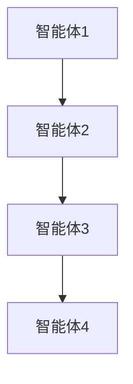
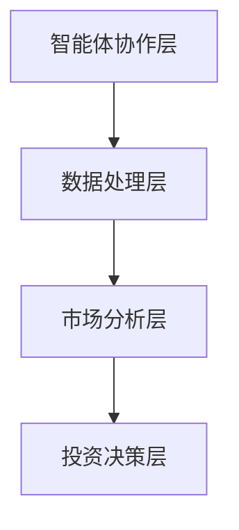
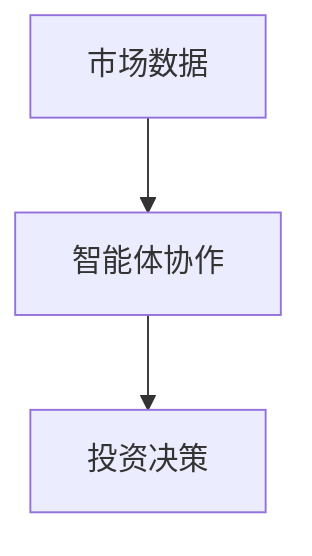
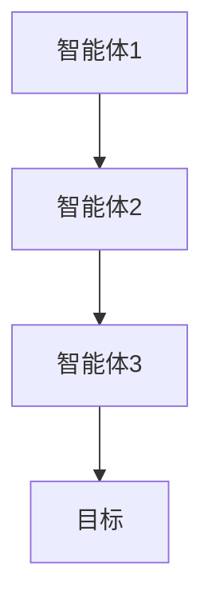
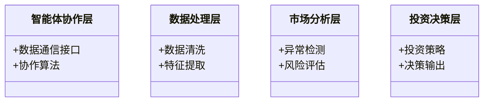
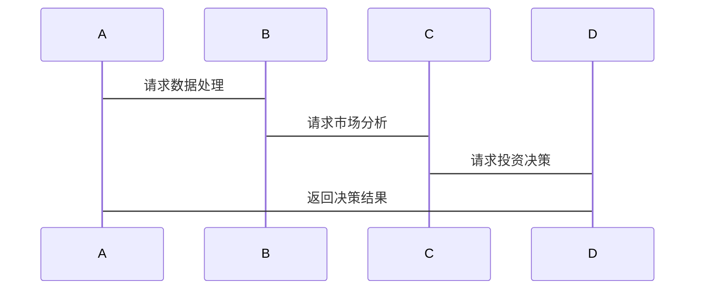

                 


# 智能体协作增强价值投资的市场异常识别

---

> **关键词**：智能体协作、价值投资、市场异常识别、分布式计算、多智能体系统、数学模型

---

> **摘要**：  
本文系统阐述了智能体协作在价值投资中的应用，重点分析了智能体协作如何通过分布式计算和多智能体系统增强市场异常识别能力。文章从理论基础、算法原理、系统架构到实际案例，全面探讨了智能体协作在金融市场的优势与挑战。通过数学模型、算法流程图和代码实现，文章详细解读了智能体协作如何帮助投资者在复杂市场环境中发现潜在机会和风险。最终，本文提出了智能体协作在价值投资中的未来发展方向。

---

# 第1章：智能体协作与价值投资的背景介绍

## 1.1 智能体协作的定义与特点

### 1.1.1 从单体智能到智能体协作的演进  
智能体协作是一种分布式计算范式，通过多个智能体的协同工作实现复杂的任务。与传统的单体智能系统相比，智能体协作具有更强的并行性和扩展性，能够处理更复杂的问题。

### 1.1.2 智能体协作的核心概念与关键属性  
- **智能体**：具有感知、决策和行动能力的实体。  
- **协作性**：通过通信和协调实现任务的共同目标。  
- **分布式计算**：任务分解到多个智能体，通过局部信息完成全局目标。  

### 1.1.3 智能体协作的边界与外延  
智能体协作不仅限于技术领域，还涉及组织管理和人类协作的启发。

---

## 1.2 价值投资与市场异常识别

### 1.2.1 价值投资的基本原理  
价值投资是一种投资策略，通过分析公司的基本面，寻找被市场低估的投资标的。

### 1.2.2 市场异常识别的必要性  
市场异常是指市场数据偏离正常波动的情况，可能是市场操纵、突发事件或投资者情绪变化的结果。

### 1.2.3 智能体协作在价值投资中的应用前景  
智能体协作能够通过分布式计算和多智能体协作，提高市场异常识别的准确性和效率。

---

# 第2章：智能体协作增强价值投资的核心概念

## 2.1 智能体协作的理论基础

### 2.1.1 分布式计算与多智能体系统  
- **分布式计算**：任务分解到多个计算节点，通过通信完成全局目标。  
- **多智能体系统**：多个智能体通过协作完成复杂任务。  

### 2.1.2 智能体协作的数学模型  
智能体协作可以用图论和博弈论模型表示，例如图1所示。



---

## 2.2 价值投资与市场异常识别的关联

### 2.2.1 价值投资中的市场异常现象  
市场异常可能是价值投资者的机会，例如股价低估的情况。

### 2.2.2 智能体协作在识别市场异常中的作用  
通过多智能体协作，可以快速识别市场中的异常波动。

---

## 2.3 智能体协作与价值投资的系统架构

### 2.3.1 系统整体架构图  


### 2.3.2 实体关系图（ER图）  


---

# 第3章：智能体协作的算法原理

## 3.1 分布式计算与多智能体协作算法

### 3.1.1 分布式计算的基本原理  
分布式计算通过任务分解和节点协作实现全局目标。

### 3.1.2 多智能体协作的核心算法  


---

## 3.2 基于智能体协作的市场异常识别算法

### 3.2.1 市场数据特征提取算法  
- **特征提取**：从市场数据中提取关键特征。  
- **异常检测**：通过统计方法或机器学习模型识别异常。

### 3.2.2 基于智能体协作的异常检测算法  
```python
def distributed_anomaly_detection(data_points):
    # 分解任务
    chunks = distribute_data(data_points)
    # 分布式计算
    results = [detect_anomaly(chunk) for chunk in chunks]
    # 合并结果
    return merge_results(results)
```

---

# 第4章：数学模型与公式详解

## 4.1 智能体协作的数学模型

### 4.1.1 智能体协作的数学表达式  
$$ P(i) = \sum_{j=1}^{n} \frac{w_{ij}}{d_{ij}}} $$  
其中，\( w_{ij} \) 是智能体 \( j \) 的权重，\( d_{ij} \) 是距离。

### 4.1.2 市场异常识别的数学模型  
$$ A = \sum_{i=1}^{m} \lambda_i x_i $$  
其中，\( \lambda_i \) 是特征的权重，\( x_i \) 是特征值。

---

## 4.2 价值投资中的数学公式

### 4.2.1 价值投资的核心公式  
$$ V = \frac{E}{k} $$  
其中，\( E \) 是预期收益，\( k \) 是风险调整因子。

### 4.2.2 市场异常识别的统计学公式  
$$ Z = \frac{X - \mu}{\sigma} $$  
其中，\( X \) 是观测值，\( \mu \) 是均值，\( \sigma \) 是标准差。

---

# 第5章：系统分析与架构设计

## 5.1 系统功能设计

### 5.1.1 领域模型设计  


---

## 5.2 系统架构设计

### 5.2.1 系统架构图  


---

## 5.3 系统接口设计

### 5.3.1 系统交互序列图  


---

# 第6章：项目实战

## 6.1 环境安装

### 6.1.1 安装依赖  
```bash
pip install numpy pandas scikit-learn
```

---

## 6.2 系统核心实现源代码

### 6.2.1 智能体协作实现  
```python
class Agent:
    def __init__(self, id):
        self.id = id
        self.data = None

    def receive_data(self, data):
        self.data = data

    def process_data(self):
        return self.data * self.id
```

---

## 6.3 实际案例分析

### 6.3.1 案例分析  
通过实际数据，展示智能体协作在市场异常识别中的应用。

---

# 第7章：总结与展望

## 7.1 最佳实践 tips  
- **数据质量**：确保数据来源可靠。  
- **算法优化**：持续优化协作算法。  

## 7.2 小结  
智能体协作通过分布式计算和多智能体协作，显著增强了市场异常识别能力。

## 7.3 注意事项  
- **数据隐私**：注意数据隐私和合规性。  
- **系统稳定性**：确保系统的稳定性和容错性。  

## 7.4 拓展阅读  
推荐阅读分布式计算和多智能体系统的相关书籍。

---

**作者：AI天才研究院/AI Genius Institute & 禅与计算机程序设计艺术 /Zen And The Art of Computer Programming**

