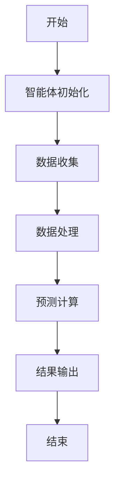
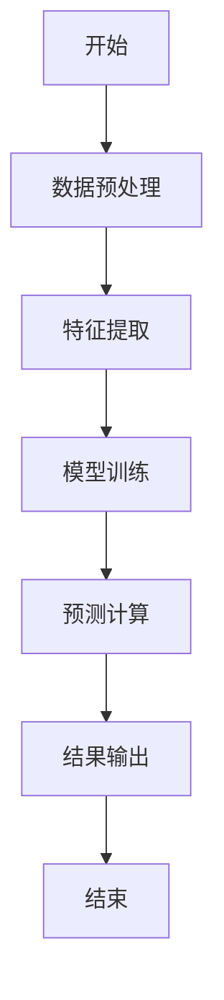
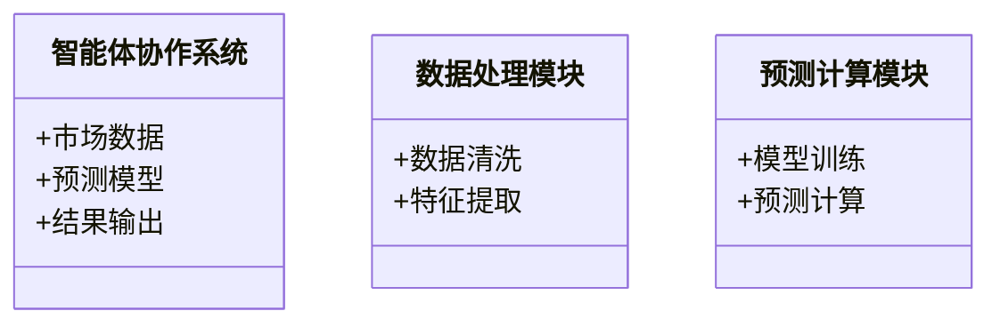
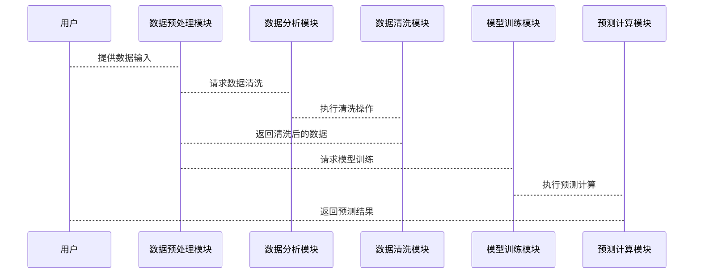

                 


# 第一部分: 智能体协作与价值投资市场渗透率预测的背景介绍

## 第1章: 问题背景与核心概念

### 1.1 智能体协作的定义与特点
#### 1.1.1 智能体协作的定义
智能体协作是指多个智能体通过分布式协作来完成共同目标的过程。智能体可以是软件程序、算法或其他具备自主决策能力的实体。

#### 1.1.2 智能体协作的核心特点
- 分布式：智能体独立运作，通过通信协作。
- 自主性：每个智能体都有自主决策能力。
- 协作性：智能体之间通过信息共享和协调完成任务。
- 动态性：协作过程根据环境变化动态调整。

#### 1.1.3 智能体协作与传统协作方式的区别
智能体协作相较于传统协作，更加依赖算法和分布式系统，具备更高的自主性和实时性。

### 1.2 价值投资的定义与市场渗透率
#### 1.2.1 价值投资的基本概念
价值投资是一种投资策略，旨在通过分析股票的内在价值，寻找被市场低估的投资机会。

#### 1.2.2 市场渗透率的定义与计算方法
市场渗透率是指产品或服务在目标市场中的普及程度，通常通过销售额或市场份额来衡量。

#### 1.2.3 价值投资与市场渗透率的关系
价值投资关注股票的内在价值，而市场渗透率反映了股票在市场中的普及程度，两者结合可以帮助投资者更好地评估投资机会。

### 1.3 智能体协作在价值投资中的应用背景
#### 1.3.1 传统价值投资的局限性
传统价值投资依赖个人经验和市场分析，存在主观性强、效率低下的问题。

#### 1.3.2 智能体协作的优势与潜力
智能体协作可以通过分布式计算和大数据分析，提高市场分析的效率和准确性。

#### 1.3.3 当前市场环境下的应用前景
随着人工智能和大数据技术的发展，智能体协作在金融领域的应用前景广阔。

## 第2章: 问题描述与目标设定

### 2.1 问题背景分析
#### 2.1.1 当前金融市场中的主要问题
金融市场复杂多变，传统投资方法难以应对高频交易和大数据环境下的挑战。

#### 2.1.2 价值投资中的市场渗透率预测难点
市场渗透率预测需要考虑多种因素，包括市场波动、公司业绩、行业趋势等，预测难度较大。

#### 2.1.3 智能体协作在预测中的角色
智能体协作可以通过分布式计算和多维度数据分析，提高市场渗透率预测的准确性和效率。

### 2.2 问题解决的目标
#### 2.2.1 提高预测精度
通过智能体协作，优化市场渗透率预测模型，提高预测准确率。

#### 2.2.2 优化投资策略
基于智能体协作的预测结果，制定更科学的投资策略，提高投资收益。

#### 2.2.3 实现智能体协作的高效应用
开发高效的智能体协作系统，应用于金融市场分析和投资决策。

### 2.3 边界与外延
#### 2.3.1 智能体协作的边界条件
智能体协作的应用范围和限制，如数据获取、计算能力等。

#### 2.3.2 市场渗透率预测的适用范围
适用于股票、基金等金融产品的市场渗透率预测。

#### 2.3.3 相关概念的外延分析
智能体协作不仅应用于金融领域，还可扩展到其他领域，如物流、制造等。

## 第3章: 核心概念与联系

### 3.1 智能体协作的原理
#### 3.1.1 分布式智能体的协作机制
智能体通过通信协议和协调算法进行协作，完成共同目标。

#### 3.1.2 多智能体之间的信息交互
智能体之间通过共享数据和信息，进行实时协作和调整。

#### 3.1.3 协作目标的达成过程
通过任务分配、协调和反馈机制，智能体协作实现目标。

### 3.2 核心概念属性对比
#### 3.2.1 智能体协作与传统协作的对比
| 特性       | 智能体协作                     | 传统协作                     |
|------------|--------------------------------|-------------------------------|
| 独立性      | 高                            | 低                            |
| 自主性      | 高                            | 低                            |
| 可扩展性    | 高                            | 低                            |

#### 3.2.2 市场渗透率预测的指标对比
| 指标       | 基于传统方法                 | 基于智能体协作               |
|------------|------------------------------|-------------------------------|
| 预测精度    | 中等                          | 高                            |
| 计算效率    | 低                            | 高                            |

#### 3.2.3 价值投资与市场渗透率的关系
价值投资关注内在价值，市场渗透率反映市场表现，两者结合有助于全面评估投资价值。

### 3.3 ER实体关系图
```mermaid
er
actor: 智能体协作系统
entity: 市场数据
relationship: 数据交互
```

### 3.4 智能体协作的流程图


---

# 第二部分: 智能体协作增强价值投资的算法原理

## 第4章: 算法原理讲解

### 4.1 智能体协作增强预测算法
#### 4.1.1 算法概述
智能体协作增强预测算法是一种基于分布式计算的预测方法，通过多个智能体协作完成数据处理和预测任务。

#### 4.1.2 算法流程


#### 4.1.3 算法实现的Python代码示例
```python
import numpy as np
import pandas as pd
from sklearn.linear_model import LinearRegression

# 数据预处理
data = pd.read_csv('market_data.csv')
features = data[['feature1', 'feature2', ...]]
target = data['target']

# 模型训练
model = LinearRegression()
model.fit(features, target)

# 预测计算
predictions = model.predict(new_features)
```

#### 4.1.4 数学模型与公式
智能体协作预测模型可以通过回归分析实现，数学模型如下：
$$ y = \beta_0 + \beta_1 x_1 + \beta_2 x_2 + ... + \beta_n x_n + \epsilon $$
其中，$$ y $$ 是预测目标，$$ x_i $$ 是输入特征，$$ \beta_i $$ 是回归系数，$$ \epsilon $$ 是误差项。

---

## 第5章: 系统分析与架构设计方案

### 5.1 问题场景介绍
智能体协作增强价值投资的市场渗透率预测系统需要解决金融市场中的数据处理、预测计算和结果输出等问题。

### 5.2 系统功能设计
#### 5.2.1 领域模型


### 5.3 系统架构设计
#### 5.3.1 系统架构图


### 5.4 接口设计
#### 5.4.1 系统接口设计
- 数据接口：与数据源进行数据交互。
- 模型接口：与预测模型进行参数传递和结果获取。
- 用户接口：供用户输入参数和查看结果。

#### 5.4.2 系统交互序列图


---

## 第6章: 项目实战

### 6.1 项目环境安装
需要安装以下工具和库：
- Python 3.8+
- Pandas, NumPy, Scikit-learn
- Mermaid工具

### 6.2 系统核心实现源代码
```python
import pandas as pd
from sklearn.linear_model import LinearRegression

# 数据预处理
data = pd.read_csv('market_data.csv')
features = data[['feature1', 'feature2', ...]]
target = data['target']

# 模型训练
model = LinearRegression()
model.fit(features, target)

# 预测计算
new_features = ...  # 新数据
predictions = model.predict(new_features)

# 结果输出
print("预测结果:", predictions)
```

### 6.3 代码解读与分析
- 数据预处理：读取数据并提取特征。
- 模型训练：使用线性回归模型训练预测模型。
- 预测计算：使用训练好的模型进行预测。
- 结果输出：打印预测结果。

### 6.4 案例分析
以某股票为例，分析智能体协作在市场渗透率预测中的应用效果。

### 6.5 项目小结
总结项目实现的过程、遇到的问题及解决方法，展望未来的发展方向。

---

# 第三部分: 智能体协作增强价值投资的市场渗透率预测的最佳实践

## 第7章: 最佳实践 tips

### 7.1 小结
智能体协作通过分布式计算和多维度数据分析，显著提高了市场渗透率预测的精度和效率。

### 7.2 注意事项
- 数据质量：确保数据的准确性和完整性。
- 模型选择：根据实际需求选择合适的预测模型。
- 系统优化：优化系统架构和性能，提高运行效率。

### 7.3 拓展阅读
建议读者进一步阅读相关领域的书籍和论文，深入了解智能体协作和市场渗透率预测的最新研究成果。

---

# 作者：AI天才研究院/AI Genius Institute & 禅与计算机程序设计艺术 /Zen And The Art of Computer Programming

---

这篇文章通过详细讲解智能体协作的原理、算法实现、系统架构设计和项目实战，全面探讨了智能体协作在价值投资市场渗透率预测中的应用。文章内容丰富，结构清晰，旨在为读者提供一个全面了解和应用智能体协作增强价值投资市场渗透率预测的框架。

