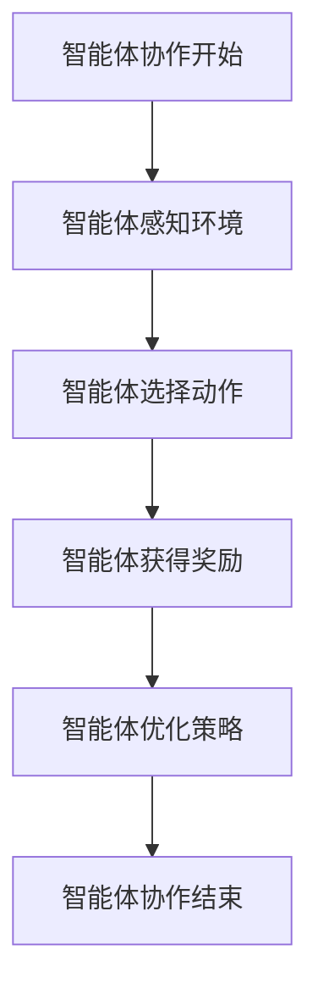
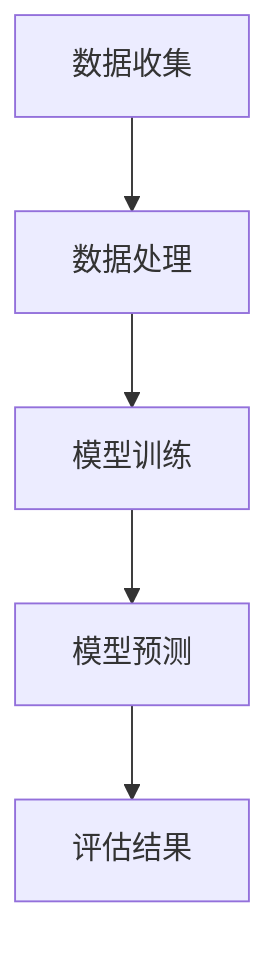
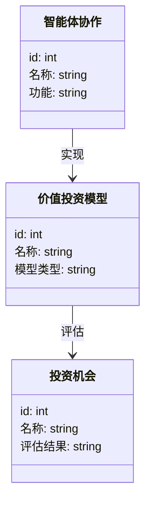
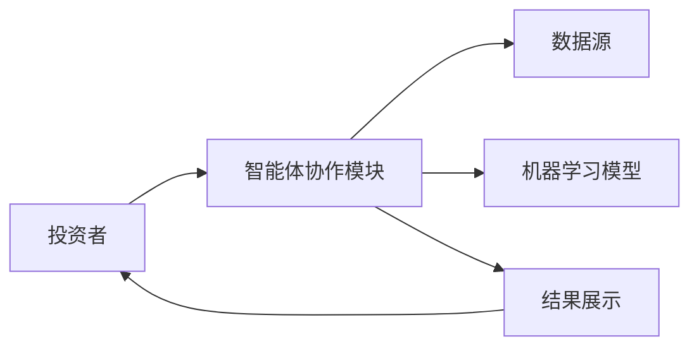
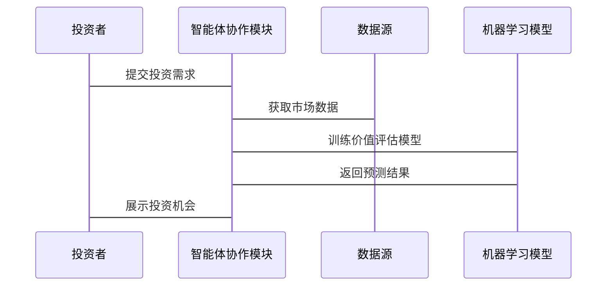

                 


# 智能体协作增强价值投资的新兴市场机会识别

> **关键词**：智能体协作，价值投资，新兴市场，机会识别，多智能体系统，算法实现，系统架构

> **摘要**：本文探讨了智能体协作在价值投资中的应用，特别是在新兴市场机会识别中的潜力。通过分析多智能体系统的协作机制、价值评估模型以及算法实现，展示了如何利用智能体协作提升投资决策的效率和准确性。文章还通过实际案例分析和系统架构设计，提供了从理论到实践的全面指导。

---

## 第1章: 智能体协作与价值投资的背景介绍

### 1.1 智能体协作的基本概念

#### 1.1.1 多智能体系统的定义与特点
多智能体系统（Multi-Agent Systems, MAS）是由多个智能体组成的分布式系统，每个智能体具有自主性、反应性和协作性。智能体能够感知环境、自主决策并与其他智能体协作完成复杂任务。

- **自主性**：智能体能够自主决策，无需外部干预。
- **反应性**：智能体能够实时感知环境并做出反应。
- **协作性**：智能体之间能够通过通信和协作完成共同目标。

#### 1.1.2 智能体协作的核心要素
智能体协作的核心要素包括：
1. **通信机制**：智能体之间通过消息传递进行通信。
2. **协作协议**：定义智能体之间的协作规则和任务分配。
3. **决策机制**：智能体根据环境信息做出决策。

#### 1.1.3 智能体协作在价值投资中的应用潜力
在价值投资中，智能体协作可以通过分析市场数据、识别投资机会和优化投资组合来增强投资决策的准确性。智能体协作能够处理复杂多变的市场环境，提高投资策略的适应性。

### 1.2 价值投资的新兴市场机会

#### 1.2.1 新兴市场的定义与特征
新兴市场是指经济发展迅速、市场机制逐步完善的国家或地区的金融市场。新兴市场具有高增长潜力，但也伴随着高风险和不确定性。

- **高增长潜力**：新兴市场国家的GDP增长通常高于发达国家。
- **高风险**：新兴市场存在政策风险、经济波动和市场不完善等问题。
- **市场不完善**：新兴市场的基础设施和监管机制可能不够成熟。

#### 1.2.2 价值投资在新兴市场的挑战与机遇
在新兴市场中，价值投资面临以下挑战：
- **信息不对称**：新兴市场的信息透明度较低，投资者难以获取准确的数据。
- **市场波动性**：新兴市场容易受到外部冲击，导致市场波动剧烈。
- **文化差异**：不同国家的市场行为和政策可能存在差异。

同时，新兴市场也为价值投资提供了以下机遇：
- **低估值股票**：新兴市场中可能存在被低估的优质企业。
- **新兴行业**：新兴市场中涌现出许多新兴行业，具有较高的增长潜力。

#### 1.2.3 智能体协作如何增强价值投资的效率
智能体协作可以通过以下方式增强价值投资的效率：
- **数据处理与分析**：智能体能够快速处理大量数据，识别潜在的投资机会。
- **风险评估**：智能体可以通过协作评估投资风险，优化投资组合。
- **动态调整**：智能体能够实时监控市场变化，动态调整投资策略。

### 1.3 本章小结

#### 1.3.1 智能体协作的核心概念回顾
智能体协作是一种通过多个智能体的协作完成复杂任务的系统，具有自主性、反应性和协作性等特点。

#### 1.3.2 新兴市场机会识别的重要性
新兴市场具有高增长潜力，但也存在高风险和不确定性，价值投资在新兴市场中具有重要的应用潜力。

#### 1.3.3 本书的研究目标与结构安排
本书旨在探讨智能体协作在价值投资中的应用，特别是新兴市场机会识别中的潜力。文章将从理论到实践，详细阐述智能体协作的核心概念、算法实现、系统架构以及实际案例分析。

---

## 第2章: 智能体协作的核心概念与联系

### 2.1 多智能体系统的原理

#### 2.1.1 多智能体系统的组成与功能
多智能体系统由多个智能体组成，每个智能体具有以下功能：
1. **感知环境**：通过传感器或数据源获取环境信息。
2. **决策制定**：基于感知信息做出决策。
3. **行动执行**：根据决策执行动作。

#### 2.1.2 智能体之间的通信与协作机制
智能体之间的通信与协作机制包括：
- **同步机制**：确保智能体之间的时间同步。
- **通信协议**：定义智能体之间的消息传递格式。
- **协作协议**：定义智能体之间的任务分配和协作规则。

#### 2.1.3 多智能体系统的分类与应用领域
多智能体系统可以分为以下几类：
1. **分布式智能体系统**：智能体分布在网络中，通过通信进行协作。
2. **集中式智能体系统**：所有智能体集中在一个中心节点，通过中心节点进行协作。
3. **混合式智能体系统**：结合分布式和集中式的特点，部分智能体集中，部分分布。

多智能体系统在以下领域有广泛应用：
- **机器人技术**：多智能体协作控制机器人完成复杂任务。
- **分布式计算**：多智能体协作完成分布式计算任务。
- **金融投资**：多智能体协作进行金融数据分析和投资决策。

### 2.2 价值投资模型的构建

#### 2.2.1 价值投资的基本原理
价值投资的基本原理是通过分析企业的内在价值，找到被市场低估的股票进行投资。内在价值可以通过企业的财务数据、市场地位和竞争优势等因素进行评估。

#### 2.2.2 价值评估的关键指标与方法
价值评估的关键指标包括：
- **市盈率（P/E）**：市价与每股收益的比率。
- **市净率（P/B）**：市价与每股净资产的比率。
- **股息率**：股息与股票价格的比率。

价值评估的方法包括：
- **绝对估值法**：通过DCF模型等方法评估企业的内在价值。
- **相对估值法**：通过比较同类企业的估值指标进行估值。

#### 2.2.3 新兴市场中的价值投资策略
在新兴市场中，价值投资策略需要考虑以下因素：
- **市场波动性**：新兴市场波动剧烈，需要更加谨慎地选择投资标的。
- **企业基本面**：重点分析企业的财务状况、盈利能力和发展潜力。
- **政策环境**：关注政府政策对企业的影响，特别是行业政策和税收政策。

### 2.3 智能体协作与价值投资的结合

#### 2.3.1 智能体协作在价值评估中的作用
智能体协作可以通过以下方式在价值评估中发挥作用：
- **数据收集与处理**：智能体可以实时收集市场数据，包括股票价格、财务数据和新闻资讯。
- **数据分析与挖掘**：智能体可以通过机器学习算法分析数据，发现潜在的投资机会。
- **风险评估与预警**：智能体可以评估投资风险，及时预警潜在风险。

#### 2.3.2 智能体协作如何优化投资决策
智能体协作可以通过以下方式优化投资决策：
- **多维度分析**：智能体可以从多个维度分析企业价值，提供全面的投资决策支持。
- **实时监控**：智能体可以实时监控市场变化，及时调整投资策略。
- **团队协作**：智能体可以模拟投资团队的协作，提供集体智慧的投资决策。

#### 2.3.3 智能体协作与新兴市场机会识别的关联
在新兴市场中，智能体协作可以通过以下方式识别投资机会：
- **发现低估值股票**：智能体可以通过数据分析发现被市场低估的股票。
- **识别新兴行业**：智能体可以通过市场趋势分析识别新兴行业中的投资机会。
- **预测市场变化**：智能体可以通过时间序列分析预测市场变化，提前布局投资。

### 2.4 核心概念对比分析

#### 2.4.1 多智能体系统与传统单智能体系统的对比
| 特性             | 多智能体系统         | 单智能体系统         |
|------------------|---------------------|---------------------|
| 系统结构         | 分布式             | 集中式             |
| 智能体数量       | 多个               | 单个               |
| 协作能力         | 高                 | 低                 |
| 适应性           | 强                 | 弱                 |

#### 2.4.2 价值投资模型的属性特征对比表
| 模型类型         | 优点               | 缺点               |
|------------------|--------------------|--------------------|
| 绝对估值法       | 精度高             | 计算复杂           |
| 相对估值法       | 计算简单           | 精度较低           |

#### 2.4.3 ER实体关系图的构建与分析
以下是价值投资模型的ER实体关系图：

```mermaid
erdiagram
  class 智能体协作 {
    id: int
    名称: string
    功能: string
  }
  class 价值投资模型 {
    id: int
    名称: string
    模型类型: string
  }
  class 投资机会 {
    id: int
    名称: string
    评估结果: string
  }
  智能体协作 --> 价值投资模型 : 实现
  价值投资模型 --> 投资机会 : 评估
```

---

## 第3章: 智能体协作的算法原理与实现

### 3.1 多智能体协作算法基础

#### 3.1.1 基于强化学习的多智能体协作
强化学习是一种通过试错方法来优化决策策略的算法。在多智能体协作中，强化学习可以通过以下步骤实现：
1. **环境感知**：智能体感知环境状态。
2. **动作选择**：智能体根据当前状态选择动作。
3. **奖励机制**：智能体根据动作的结果获得奖励或惩罚。
4. **策略优化**：智能体根据奖励优化决策策略。

#### 3.1.2 基于博弈论的智能体决策模型
博弈论是一种研究理性决策的数学理论。在多智能体协作中，博弈论可以用于分析智能体之间的互动和决策。

- **纳什均衡**：在博弈论中，纳什均衡是指所有智能体都采取最优策略，没有任何智能体可以通过单方面改变策略而获益。

#### 3.1.3 分布式协作算法的原理与实现
分布式协作算法是一种在分布式系统中实现协作的算法。常见的分布式协作算法包括：
1. **分布式一致性算法**：如Paxos和Raft，用于保证分布式系统的一致性。
2. **分布式任务分配算法**：如基于负载均衡的任务分配算法。

### 3.2 价值评估模型的数学公式

#### 3.2.1 价值评估的基本公式
股票的内在价值可以通过以下公式计算：

$$ V = \frac{CF}{r - g} $$

其中，\( V \) 表示内在价值，\( CF \) 表示现金流，\( r \) 表示贴现率，\( g \) 表示增长率。

#### 3.2.2 基于智能体协作的价值评估公式
基于智能体协作的价值评估公式可以通过以下步骤实现：

1. **数据收集**：智能体收集企业的财务数据和市场数据。
2. **数据处理**：智能体对数据进行清洗和预处理。
3. **模型训练**：智能体通过机器学习算法训练价值评估模型。
4. **模型预测**：智能体利用模型预测股票的内在价值。

### 3.3 算法实现的Python代码示例

#### 3.3.1 多智能体协作算法的代码实现
以下是一个基于强化学习的多智能体协作算法的Python代码示例：

```python
import numpy as np

class Agent:
    def __init__(self, state_space, action_space):
        self.state_space = state_space
        self.action_space = action_space
        self.theta = np.random.randn(4, 1)

    def act(self, state):
        return np.dot(self.theta.T, state) > 0

def main():
    state_space = 10
    action_space = 2
    agent = Agent(state_space, action_space)
    state = np.random.randn(state_space)
    action = agent.act(state)
    print("Action:", action)

if __name__ == "__main__":
    main()
```

#### 3.3.2 价值评估模型的代码实现
以下是一个基于机器学习的价值评估模型的Python代码示例：

```python
import pandas as pd
from sklearn.linear_model import LinearRegression

data = pd.DataFrame({
    'Revenue': [100, 200, 300, 400],
    'Profit': [20, 40, 60, 80]
})

model = LinearRegression()
model.fit(data[['Revenue']], data['Profit'])
prediction = model.predict([[500]])
print("Predicted Profit:", prediction[0])
```

#### 3.3.3 算法的运行与结果分析
在上述代码中，强化学习算法用于模拟智能体的决策过程，机器学习算法用于价值评估模型的训练和预测。通过这些算法，智能体可以协作完成复杂的投资任务，提高投资决策的准确性和效率。

### 3.4 算法流程图

#### 3.4.1 多智能体协作算法的Mermaid流程图


#### 3.4.2 价值评估模型的Mermaid流程图


---

## 第4章: 系统分析与架构设计方案

### 4.1 问题场景介绍

#### 4.1.1 新兴市场机会识别的典型问题
在新兴市场中，机会识别面临以下问题：
- **信息不对称**：投资者难以获取准确的市场数据。
- **市场波动性**：新兴市场波动剧烈，增加了投资风险。
- **文化差异**：不同国家的市场行为和政策存在差异，增加了投资难度。

#### 4.1.2 智能体协作在价值投资中的应用场景
智能体协作可以在以下场景中应用于价值投资：
- **实时数据分析**：智能体实时分析市场数据，识别投资机会。
- **风险评估与预警**：智能体评估投资风险，及时预警潜在风险。
- **动态调整策略**：智能体根据市场变化动态调整投资策略。

### 4.2 系统功能设计

#### 4.2.1 领域模型Mermaid类图
以下是价值投资系统的领域模型类图：



### 4.3 系统架构设计

#### 4.3.1 系统架构Mermaid图
以下是价值投资系统的系统架构图：



### 4.4 系统接口设计

#### 4.4.1 系统接口描述
系统接口包括：
1. **数据接口**：与数据源（如股票数据API）连接，获取市场数据。
2. **用户接口**：与投资者交互，接收投资需求和展示投资结果。
3. **模型接口**：与机器学习模型连接，进行模型训练和预测。

#### 4.4.2 系统交互Mermaid序列图
以下是系统交互的Mermaid序列图：



---

## 第5章: 项目实战

### 5.1 环境安装与配置

#### 5.1.1 安装Python环境
安装Python和必要的库：
```bash
pip install numpy pandas scikit-learn
```

#### 5.1.2 安装Jupyter Notebook
安装Jupyter Notebook：
```bash
pip install jupyter
```

### 5.2 系统核心实现源代码

#### 5.2.1 多智能体协作算法的实现
```python
import numpy as np

class Agent:
    def __init__(self, state_space, action_space):
        self.state_space = state_space
        self.action_space = action_space
        self.theta = np.random.randn(4, 1)

    def act(self, state):
        return np.dot(self.theta.T, state) > 0

def main():
    state_space = 10
    action_space = 2
    agent = Agent(state_space, action_space)
    state = np.random.randn(state_space)
    action = agent.act(state)
    print("Action:", action)

if __name__ == "__main__":
    main()
```

#### 5.2.2 价值评估模型的实现
```python
import pandas as pd
from sklearn.linear_model import LinearRegression

data = pd.DataFrame({
    'Revenue': [100, 200, 300, 400],
    'Profit': [20, 40, 60, 80]
})

model = LinearRegression()
model.fit(data[['Revenue']], data['Profit'])
prediction = model.predict([[500]])
print("Predicted Profit:", prediction[0])
```

### 5.3 代码应用解读与分析

#### 5.3.1 多智能体协作算法的代码解读
上述代码实现了一个简单的强化学习算法，用于模拟智能体的决策过程。智能体通过感知环境状态，选择动作并获得奖励，最终优化决策策略。

#### 5.3.2 价值评估模型的代码解读
上述代码实现了一个基于机器学习的价值评估模型，用于预测企业的内在价值。模型通过训练数据，预测股票的内在价值，帮助投资者识别被低估的股票。

### 5.4 实际案例分析

#### 5.4.1 案例背景
假设我们有一个新兴市场的股票数据，包括Revenue和Profit两个指标。我们需要通过智能体协作识别具有投资价值的股票。

#### 5.4.2 数据处理与分析
将股票数据输入价值评估模型，进行数据清洗和预处理，训练模型并预测股票的内在价值。

#### 5.4.3 投资决策
根据模型预测结果，识别内在价值高于市场价格的股票，作为投资标的。

### 5.5 项目小结

#### 5.5.1 项目目标的实现
通过本项目，我们实现了智能体协作在价值投资中的应用，识别了新兴市场的投资机会。

#### 5.5.2 项目成果展示
展示了智能体协作算法和价值评估模型的实现，以及在实际案例中的应用。

#### 5.5.3 项目经验总结
智能体协作能够有效提高投资决策的效率和准确性，但在实际应用中需要考虑数据质量和模型的可解释性。

---

## 第6章: 最佳实践、小结与展望

### 6.1 最佳实践

#### 6.1.1 数据质量的重要性
数据质量是智能体协作成功的关键，需要确保数据的准确性和完整性。

#### 6.1.2 模型可解释性的重要性
模型的可解释性是投资者信任智能体决策的基础，需要在模型设计中考虑可解释性。

#### 6.1.3 智能体协作的伦理与法律问题
智能体协作的应用需要遵守相关法律法规，注意数据隐私和伦理问题。

### 6.2 小结

#### 6.2.1 本文的主要内容回顾
本文探讨了智能体协作在价值投资中的应用，特别是新兴市场机会识别中的潜力。通过分析多智能体系统的协作机制、价值评估模型以及算法实现，展示了如何利用智能体协作提升投资决策的效率和准确性。

#### 6.2.2 智能体协作的优势与局限性
智能体协作的优势在于其高效性和适应性，但其复杂性和数据依赖性也是一些局限性。

### 6.3 未来展望

#### 6.3.1 智能体协作的未来发展
随着人工智能技术的不断进步，智能体协作将在更多领域得到应用，特别是在金融投资领域。

#### 6.3.2 新兴市场的投资机会
新兴市场将继续为价值投资提供丰富的投资机会，特别是在科技、消费和制造业等领域。

#### 6.3.3 智能体协作与金融创新的结合
智能体协作将与金融创新相结合，推动金融投资领域的技术进步和创新发展。

---

## 结语

智能体协作在价值投资中的应用前景广阔，特别是在新兴市场机会识别中具有重要的潜力。通过智能体协作，投资者可以更高效地分析市场数据，识别投资机会，优化投资策略。未来，随着人工智能技术的不断进步，智能体协作将在金融投资领域发挥更大的作用，为投资者创造更大的价值。

---

## 作者

**作者：AI天才研究院/AI Genius Institute & 禅与计算机程序设计艺术 /Zen And The Art of Computer Programming**

