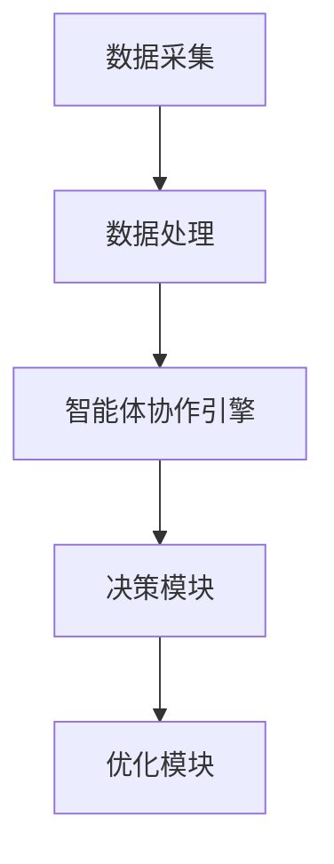

                 


# 智能体协作增强价值投资组合管理效率

> 关键词：智能体协作，价值投资组合，多智能体系统，分布式计算，博弈论

> 摘要：本文探讨了智能体协作如何提升投资组合管理的效率与价值。通过分析多智能体系统的协作机制、算法原理及实际应用，展示了智能体协作在金融领域的潜力。结合项目实战与最佳实践，提供了从理论到实践的全面指导，帮助读者理解并应用智能体协作技术。

---

## 第一部分: 智能体协作与价值投资组合管理概述

### 第1章: 智能体协作的基本概念

#### 1.1 智能体协作的定义与背景

智能体协作是指多个智能体通过协同工作，共同完成复杂任务的过程。智能体（Agent）是一种能够感知环境并采取行动以实现目标的实体。在金融领域，智能体协作可以通过分布式计算和博弈论优化投资组合管理，提升决策效率和收益。

#### 1.2 价值投资组合管理的基本原理

投资组合管理是通过优化资产配置，降低风险并提高收益的过程。传统方法依赖人工分析和经验判断，效率较低且可能存在主观偏差。智能体协作通过自动化和分布式计算，能够实时分析市场动态，优化投资组合。

---

### 第2章: 智能体协作的核心概念与联系

#### 2.1 多智能体系统的基本原理

多智能体系统由多个智能体组成，通过协作完成复杂任务。与单智能体系统相比，多智能体系统具有更高的并行性和容错性。以下是单智能体与多智能体系统的对比：

| 特性             | 单智能体系统          | 多智能体系统          |
|------------------|----------------------|----------------------|
| 任务处理         | 独立完成             | 分散任务             |
| 并行性           | 串行                | 并行                |
| 容错性           | 低                  | 高                  |

#### 2.2 智能体协作的数学模型与公式

智能体协作的收益可以通过以下公式计算：

$$ \text{总收益} = \sum_{i=1}^{n} r_i $$

其中，$r_i$ 是第 $i$ 个智能体的收益。

博弈论中的纳什均衡是智能体协作的重要理论基础，定义为：在给定其他智能体策略的情况下，智能体无法通过单方面改变策略而提高收益的状态。

---

### 第3章: 智能体协作的算法原理

#### 3.1 分布式计算与共识机制

分布式计算通过将任务分配给多个节点，提高计算效率。共识机制确保各节点达成一致，常用算法包括：

1. **工作量证明（PoW）**：通过解决哈希难题达成共识。
2. **权益证明（PoS）**：根据节点持有代币数量分配记账权。

#### 3.2 博弈论与智能体协作

博弈论中的纳什均衡是智能体协作的重要理论基础。通过构建收益矩阵，智能体可以找到最优策略。

**收益矩阵示例：**

| 智能体B策略 | 合作   | 不合作 |
|------------|--------|--------|
| 合作       | 3,3    | 0,5    |
| 不合作     | 5,0    | 1,1    |

---

### 第4章: 智能体协作的系统架构设计

#### 4.1 系统功能设计

系统功能模块包括：

1. 数据采集与处理模块：收集市场数据并进行预处理。
2. 智能体协作引擎：实现智能体之间的协作与通信。
3. 决策与优化模块：根据协作结果优化投资组合。

#### 4.2 系统架构图



---

### 第5章: 智能体协作的项目实战

#### 5.1 环境安装与配置

安装Python和相关库（如NumPy、Pandas）：

```bash
pip install numpy pandas
```

#### 5.2 核心代码实现

以下是智能体协作引擎的实现代码：

```python
import numpy as np

class Agent:
    def __init__(self, id):
        self.id = id
        self.strategy = None

    def set_strategy(self, strategy):
        self.strategy = strategy

    def execute_strategy(self, data):
        return self.strategy(data)

def collaborative_strategy(data):
    # 简单平均策略
    return np.mean(data)

# 初始化智能体
agents = [Agent(i) for i in range(4)]
for agent in agents:
    agent.set_strategy(collaborative_strategy)

# 执行策略
data = np.random.randn(100)
results = [agent.execute_strategy(data) for agent in agents]
print(results)
```

---

### 第6章: 智能体协作的最佳实践与注意事项

#### 6.1 最佳实践 tips

1. **系统设计**：确保各模块的独立性，便于维护和扩展。
2. **数据安全**：采取加密措施，保护数据隐私。
3. **性能优化**：使用并行计算和缓存技术提升效率。

---

## 结语

智能体协作通过分布式计算和博弈论，显著提升了投资组合管理的效率和收益。未来，随着技术的进步，智能体协作将在金融领域发挥更大的作用。

---

**作者：AI天才研究院 & 禅与计算机程序设计艺术**

