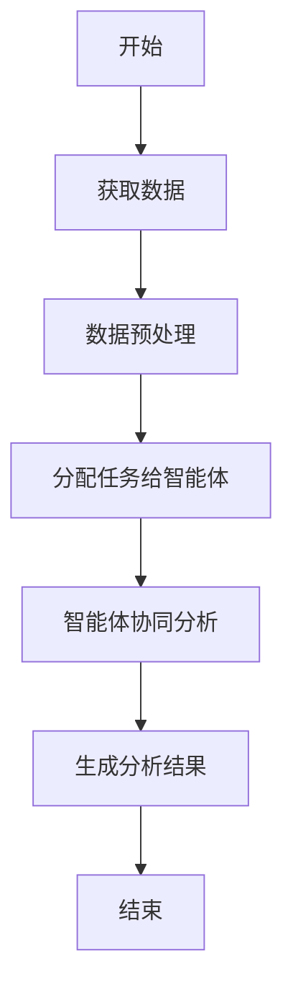
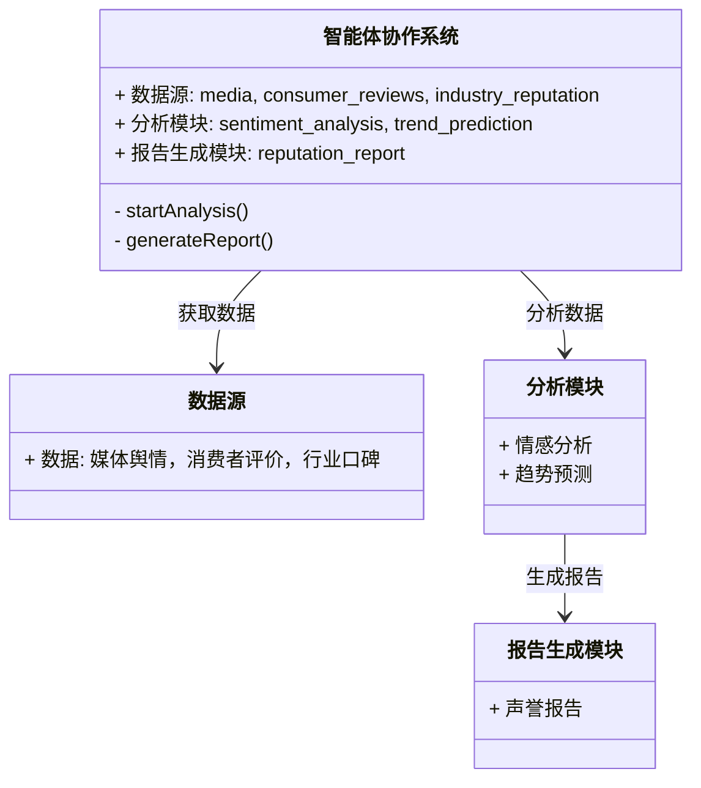

                 


# 智能体协作实现全面的公司声誉分析

## 关键词：智能体协作，公司声誉，声誉分析，多智能体系统，机器学习

## 摘要：  
公司声誉是企业在市场中的重要资产，直接影响客户信任、投资者信心和品牌价值。然而，传统声誉管理方法往往依赖人工分析，存在效率低、覆盖面窄、实时性差等问题。智能体协作作为一种新兴的技术手段，通过多个智能体的协同工作，能够实现对公司声誉的全面、实时分析。本文将详细探讨智能体协作在公司声誉分析中的应用，从背景介绍、核心概念、算法原理到系统架构、项目实战，再到总结与最佳实践，为读者提供一个全面的视角。

---

## 第一部分: 智能体协作与公司声誉分析的背景介绍

### 第1章: 智能体协作的基本概念

#### 1.1 问题背景
##### 1.1.1 公司声誉的重要性
公司在市场中的声誉是其核心竞争力之一。良好的声誉能够吸引更多的客户、投资者和合作伙伴，而声誉受损则可能导致业务流失、股价下跌甚至品牌危机。然而，随着信息传播速度的加快，声誉的波动也变得更加频繁和复杂。

##### 1.1.2 传统声誉管理的局限性
传统的声誉管理方法通常依赖人工收集和分析数据，效率低下且覆盖面有限。例如，公司可能只能监测部分主流媒体或社交平台的声誉信息，难以全面捕捉市场中的声誉变化。此外，人工分析还容易受到主观因素的影响，缺乏客观性和准确性。

##### 1.1.3 智能体协作的引入
智能体协作是一种基于多智能体系统的技术，通过多个智能体的协同工作，能够高效地完成复杂任务。将智能体协作应用于声誉分析，可以实现对公司声誉的全面、实时监控和评估，从而帮助公司更好地应对声誉风险。

#### 1.2 问题描述
##### 1.2.1 声誉分析的复杂性
声誉分析需要考虑多个维度，包括媒体舆情、消费者评价、行业口碑等。每个维度的数据来源多样，且彼此之间可能存在关联和影响，使得声誉分析成为一个复杂的问题。

##### 1.2.2 智能体协作的目标
通过智能体协作，实现对公司声誉的全面分析，包括实时监控、情感分析、趋势预测等功能。智能体协作能够将多个智能体的任务分解，分别处理不同的数据源和分析任务，最终整合结果，提供全面的声誉评估。

##### 1.2.3 当前声誉管理的挑战
传统声誉管理方法在数据处理能力、分析深度和实时性方面存在明显不足。例如，难以处理海量数据、缺乏对非结构化数据的分析能力、无法实时响应声誉变化等问题亟待解决。

---

### 第2章: 智能体协作的定义与特点

#### 2.1 智能体协作的定义
智能体协作是指多个智能体通过共享信息和协同工作，共同完成特定任务的过程。每个智能体都有自己的目标和能力，通过协作实现整体目标的优化。

#### 2.2 智能体协作的核心要素
智能体协作的核心要素包括：
- **智能体的独立性**：每个智能体能够独立完成部分任务。
- **协作目标的明确性**：协作任务的目标必须清晰，以确保智能体之间的协同。
- **信息共享与隐私保护**：智能体需要共享信息，但必须确保信息的安全性和隐私性。

---

## 第3章: 智能体协作在声誉分析中的应用

### 3.1 声誉分析的多维度性
声誉分析需要考虑多个维度，包括媒体舆情、消费者评价、行业口碑等。每个维度的数据来源多样，且彼此之间可能存在关联和影响，使得声誉分析成为一个复杂的问题。

### 3.2 智能体协作的优势
智能体协作在声誉分析中的优势包括：
- **提高分析效率**：通过多个智能体的协同工作，能够快速处理海量数据。
- **增强分析深度**：智能体可以专注于不同的分析任务，提供更全面的声誉评估。
- **实时响应**：智能体协作能够实时监控声誉变化，及时发出预警。

---

## 第二部分: 智能体协作的核心概念与联系

### 第4章: 智能体协作的核心原理

#### 4.1 智能体协作的原理
智能体协作的原理包括：
- **信息共享机制**：智能体之间通过共享信息，实现协同工作。
- **协作规则与协议**：智能体需要遵循一定的规则和协议，确保协作的顺利进行。
- **协作目标的分解与分配**：协作目标需要分解为多个子任务，并分配给不同的智能体。

#### 4.2 智能体协作的属性特征对比
以下是智能体协作的属性特征对比：

| **属性**      | **独立智能体**          | **协作智能体**          |
|---------------|-------------------------|-------------------------|
| **目标**      | 单一目标               | 多个目标协同完成         |
| **信息共享**  | 信息不共享             | 信息共享               |
| **决策方式**  | 独立决策               | 协同决策               |
| **效率**      | 可能较低               | 更高                   |

---

### 第5章: 智能体协作的ER实体关系图

以下是智能体协作的ER实体关系图：

```mermaid
erDiagram
    actor 智能体协作系统{}{
        reputation_data
    }
    actor 数据源{}{
        media
        consumer_reviews
        industry_reputation
    }
    actor 分析模块{}{
        sentiment_analysis
        trend_prediction
    }
    actor 报告生成模块{}{
        reputation_report
    }
    智能体协作系统 --> 数据源: 获取数据
    智能体协作系统 --> 分析模块: 分析数据
    分析模块 --> 报告生成模块: 生成报告
```

---

## 第三部分: 智能体协作的算法原理

### 第6章: 智能体协作的算法原理

#### 6.1 算法的 mermaid 流程图
以下是智能体协作算法的 mermaid 流程图：



#### 6.2 算法的数学模型
以下是智能体协作的数学模型：

$$
\text{ Reputation Score} = \sum_{i=1}^{n} w_i \cdot x_i
$$

其中：
- $w_i$ 是第 $i$ 个智能体的权重
- $x_i$ 是第 $i$ 个智能体的分析结果

---

## 第四部分: 智能体协作的系统架构

### 第7章: 系统分析与架构设计方案

#### 7.1 问题场景介绍
公司声誉分析系统需要实时监控和评估公司在多个渠道的声誉信息，包括媒体、消费者评价和行业口碑等。

#### 7.2 项目介绍
公司声誉分析系统基于智能体协作技术，通过多个智能体协同工作，实现对公司声誉的全面分析。

#### 7.3 系统功能设计
以下是系统功能设计的 mermaid 类图：



---

## 第五部分: 智能体协作的项目实战

### 第8章: 项目实战

#### 8.1 环境安装
项目实战需要安装以下工具：
- Python 3.8+
- pip
- mermaid
- jupyter notebook

#### 8.2 系统核心实现源代码
以下是系统核心实现的源代码：

```python
import pandas as pd
from sklearn import linear_model

class Agent:
    def __init__(self, data_source):
        self.data_source = data_source
        self.model = linear_model.LinearRegression()

    def analyze(self):
        # 假设数据源是一个DataFrame
        data = self.data_source
        # 训练模型
        self.model.fit(data[['feature1', 'feature2']], data['target'])
        return self.model.predict(data[['feature1', 'feature2']])

# 创建多个智能体
agent1 = Agent(data_source=media_data)
agent2 = Agent(data_source=consumer_reviews_data)
agent3 = Agent(data_source=industry_reputation_data)

# 协作分析
result1 = agent1.analyze()
result2 = agent2.analyze()
result3 = agent3.analyze()

# 整合结果
final_result = pd.concat([result1, result2, result3], axis=1)
```

---

### 第9章: 总结与最佳实践

#### 9.1 总结
智能体协作在公司声誉分析中的应用，能够显著提高声誉分析的效率和准确性。通过多个智能体的协同工作，公司可以实现对声誉的全面监控和评估，从而更好地应对声誉风险。

#### 9.2 最佳实践 tips
- 定期更新智能体的模型和规则，以适应市场变化。
- 确保智能体协作系统的数据安全和隐私保护。
- 建立有效的反馈机制，及时调整智能体协作策略。

---

## 作者：AI天才研究院 & 禅与计算机程序设计艺术

