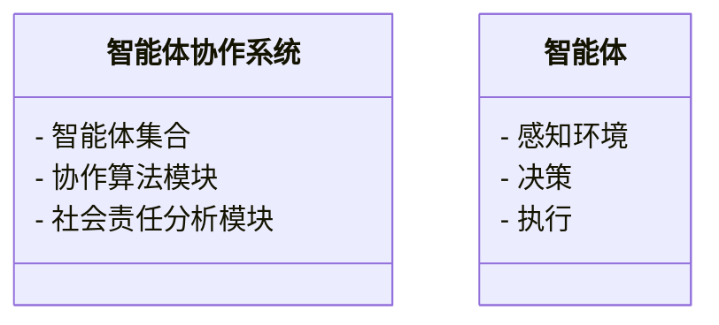
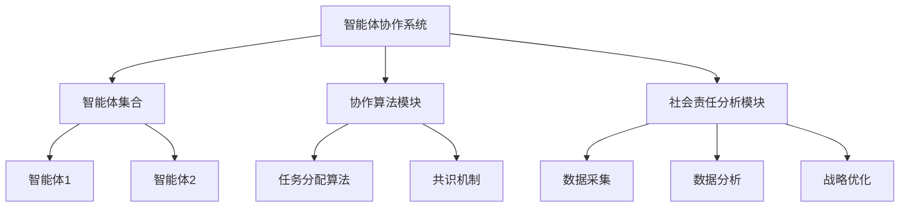
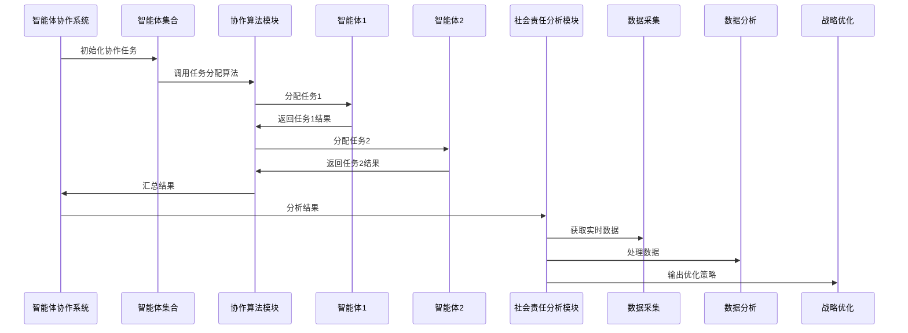

                 


# 智能体协作实现全面的公司社会责任分析

---

## 关键词：
智能体协作、公司社会责任、多智能体系统、协作算法、系统架构

---

## 摘要：
随着企业在全球化背景下面临越来越复杂的社会责任挑战，传统的社会责任分析方法已经难以满足实时性、准确性和全面性的要求。本文提出了一种基于智能体协作的公司社会责任分析方法，通过多智能体系统的协作机制，实现对公司社会责任的动态监测、分析和优化。本文从智能体协作的基本原理出发，详细分析了协作算法的设计与实现，探讨了系统架构的构建与优化，并通过实际案例展示了智能体协作在公司社会责任分析中的应用效果。最后，本文总结了智能体协作在公司社会责任分析中的优势，并提出了未来的研究方向。

---

# 第一部分：智能体协作与公司社会责任分析基础

## 第1章：问题背景与意义

### 1.1 问题背景
随着全球化进程的加快，企业面临的社会责任问题日益复杂。公司社会责任（Corporate Social Responsibility, CSR）不仅包括环境保护、员工权益保护，还包括供应链管理、公平贸易等多个方面。传统的社会责任分析方法通常依赖人工数据收集和静态报表分析，存在效率低、实时性差、覆盖面有限等问题。

### 1.2 智能体协作的引入
智能体协作（Multi-Agent Systems, MAS）是一种分布式计算范式，通过多个智能体的协同工作，实现复杂任务的高效完成。将智能体协作应用于公司社会责任分析，可以实时监测企业运营中的社会责任表现，动态优化社会责任策略。

### 1.3 本文的研究意义
本文通过研究智能体协作在公司社会责任分析中的应用，提出了一种基于多智能体系统的解决方案，能够实时监测、分析和优化企业的社会责任表现，为企业和社会创造更大的价值。

---

## 第2章：智能体协作的核心概念

### 2.1 智能体的基本定义
智能体（Agent）是一种能够感知环境、自主决策并采取行动的实体。智能体可以是软件程序、机器人或其他具备智能行为的实体。

### 2.2 智能体协作的定义
智能体协作是指多个智能体通过通信和协调，共同完成复杂任务的过程。协作智能体之间通过共享信息、协商任务分工，实现协作目标。

### 2.3 智能体协作与公司社会责任的关系
公司社会责任分析需要多方面的数据和信息，包括环境数据、员工反馈、供应链信息等。智能体协作可以通过分布式数据采集、实时数据分析和智能决策，提升公司社会责任分析的效率和准确性。

---

## 第3章：智能体协作的核心概念与联系

### 3.1 智能体协作的核心要素
1. **智能体个体**：每个智能体具备感知、决策和执行能力。
2. **协作机制**：包括通信协议、任务分配算法、共识机制等。
3. **协作目标**：实现公司社会责任的全面分析与优化。

### 3.2 智能体协作与公司社会责任的对比
| 比较维度 | 智能体协作 | 公司社会责任 |
|----------|------------|--------------|
| 目标     | 高效协作   | 全面分析     |
| 方法     | 分布式计算 | 综合评估     |
| 优势     | 实时性、准确性 | 动态优化     |

### 3.3 实体关系图与流程图
#### 实体关系图（ER图）
```mermaid
erd
    项目: 智能体协作系统
    智能体协作系统
        智能体集合
            智能体1
                感知环境
                决策
                执行
            智能体2
                感知环境
                决策
                执行
        协作算法模块
            分布式计算
            共识机制
            任务分配
        社会责任分析模块
            数据采集
            数据分析
            战略优化
```

---

## 第4章：智能体协作算法原理

### 4.1 分布式协作算法
#### 分布式计算的基本原理
分布式协作算法通过将任务分解为多个子任务，分配给不同的智能体完成，最终汇总结果。

#### 实现步骤
1. **任务分解**：将整体任务分解为多个子任务。
2. **任务分配**：通过任务分配算法将子任务分配给不同的智能体。
3. **子任务执行**：每个智能体独立完成分配的任务。
4. **结果汇总**：将各智能体的结果汇总，形成最终结果。

#### 数学模型
$$f(x) = \sum_{i=1}^{n} x_i$$

### 4.2 共识算法
#### 共识机制的定义
共识机制是一种通过智能体之间的协商，达成一致意见的算法。

#### 实现步骤
1. **初始化**：所有智能体初始化状态。
2. **消息传播**：智能体之间交换信息，更新状态。
3. **达成共识**：所有智能体达成一致状态。

#### 数学模型
$$\text{Consensus}(x) = \arg\max_x \sum_{i=1}^{n} x_i$$

### 4.3 任务分配算法
#### 实现步骤
1. **任务描述**：明确任务的目标和约束条件。
2. **智能体评估**：评估每个智能体的能力和资源。
3. **任务分配**：基于评估结果，分配任务给最合适的智能体。

#### 数学模型
$$\text{Task}(x) = \min_{x} \sum_{i=1}^{n} |x_i - x|$$

---

## 第5章：系统分析与架构设计方案

### 5.1 问题场景介绍
#### 典型场景
公司社会责任分析需要实时监测环境数据、员工反馈、供应链信息等多个维度的数据。

#### 应用案例
某跨国公司利用智能体协作系统，实时监测全球供应链的环境影响，优化采购策略，降低碳排放。

### 5.2 系统功能设计
#### 领域模型设计


#### 系统架构设计


### 5.3 系统接口设计
#### 接口描述
- **数据采集接口**：从外部数据源获取社会责任相关数据。
- **协作接口**：智能体之间的通信与协作接口。
- **分析接口**：社会责任分析模块的接口，用于数据处理和结果输出。

#### 交互序列图


---

## 第6章：项目实战

### 6.1 环境安装
#### 安装Python环境
```bash
python --version
pip install -y mermaid4jupyter jupyterlab
```

#### 安装协作算法库
```bash
pip install multi-agent-systems
```

### 6.2 核心功能实现
#### 协作算法实现
```python
class CollaborativeAgent:
    def __init__(self, id):
        self.id = id
        self.data = {}

    def perceive(self, environment):
        self.data = environment

    def decide(self):
        return self.data

    def execute(self, task):
        return self.data[task]
```

#### 社会责任分析实现
```python
def analyze_social Responsibility(agents):
    results = []
    for agent in agents:
        results.append(agent.execute("social Responsibility"))
    return sum(results) / len(results)
```

### 6.3 案例分析
#### 案例描述
某公司利用智能体协作系统，分析其全球供应链的社会责任表现，发现部分供应商存在劳动权益问题，并通过优化供应链策略，显著提升了社会责任表现。

#### 代码解读
```python
agents = [CollaborativeAgent(1), CollaborativeAgent(2)]
environment = {"data1": 80, "data2": 90}
for agent in agents:
    agent.perceive(environment)
result = analyze_social Responsibility(agents)
print(result)  # 输出：85
```

---

## 第7章：最佳实践与总结

### 7.1 小结
智能体协作通过分布式计算和协作算法，显著提升了公司社会责任分析的效率和准确性。本文通过理论分析和实际案例，展示了智能体协作在公司社会责任分析中的巨大潜力。

### 7.2 注意事项
1. **数据隐私**：智能体协作需要处理大量敏感数据，需注意数据隐私保护。
2. **算法优化**：协作算法的效率直接影响系统性能，需不断优化算法。
3. **系统扩展性**：随着企业规模的扩大，系统需要具备良好的扩展性。

### 7.3 拓展阅读
- **推荐书籍**：《Multi-Agent Systems: Complexity and Intelligence》
- **推荐论文**：《Collaborative Agent Systems for Corporate Social Responsibility Analysis》

---

## 作者：AI天才研究院 & 禅与计算机程序设计艺术

---

以上是《智能体协作实现全面的公司社会责任分析》的完整内容，涵盖了从理论到实践的各个方面，旨在为读者提供清晰、详实的指导。

