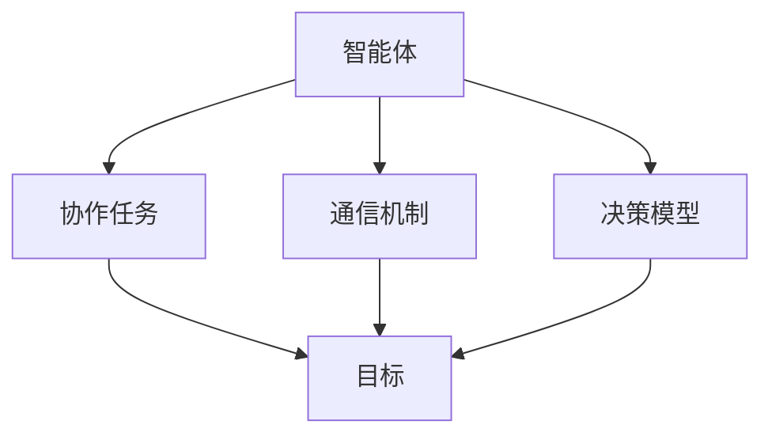
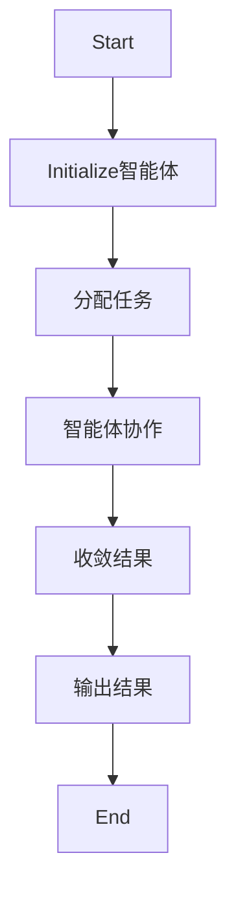
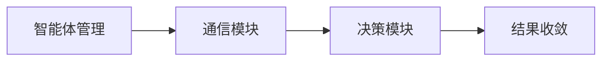

                 


# 《智能体协作实现全面的公司竞争力分析》

## 关键词：智能体协作，公司竞争力，算法原理，系统架构，项目实战

## 摘要：智能体协作是一种通过多个智能体协同工作来提升公司竞争力的方法。本文从背景、核心概念、算法原理、系统架构、项目实战和最佳实践等方面，详细阐述了智能体协作在公司竞争力分析中的应用，帮助读者理解如何通过智能体协作提升企业竞争力。

---

# 第1章: 智能体协作与公司竞争力分析概述

## 1.1 智能体协作的基本概念

### 1.1.1 智能体的定义与特点

智能体（Agent）是指能够感知环境、自主决策并执行任务的实体。智能体的特点包括自主性、反应性、目标导向性和协作性。

### 1.1.2 智能体协作的定义与核心要素

智能体协作是指多个智能体通过通信和协调共同完成任务的过程。其核心要素包括通信机制、任务分配、协调算法和目标收敛。

### 1.1.3 公司竞争力分析的背景与意义

公司竞争力分析是企业在市场中生存和发展的关键。通过智能体协作，可以更高效地整合资源、优化决策，从而提升竞争力。

## 1.2 智能体协作在公司竞争力分析中的作用

### 1.2.1 协作智能体的优势与特点

协作智能体能够通过分布式计算和并行处理提高效率，同时能够适应复杂多变的市场环境。

### 1.2.2 智能体协作如何提升公司竞争力

通过智能体协作，企业可以实时分析市场动态、优化资源配置，从而在竞争中占据优势。

### 1.2.3 智能体协作的应用场景与边界

智能体协作适用于供应链管理、市场分析、风险管理等领域，但需注意数据隐私和系统复杂性。

## 1.3 本章小结

---

# 第2章: 智能体协作的核心概念与联系

## 2.1 智能体协作的核心原理

### 2.1.1 智能体协作的通信机制

通信机制是协作的关键，包括消息传递、事件触发等方式。

### 2.1.2 协作智能体的决策模型

决策模型基于环境感知和历史数据，通过推理和学习做出最优决策。

### 2.1.3 协作智能体的协调机制

协调机制确保任务分配合理，资源利用最大化。

## 2.2 智能体协作的核心概念对比

### 2.2.1 智能体与传统算法的对比

智能体协作具有更高的灵活性和适应性，但实现复杂度较高。

### 2.2.2 协作智能体与单体智能体的对比

协作智能体在任务分配和资源利用上更具优势。

### 2.2.3 智能体协作的属性特征分析

属性包括自主性、协作性、动态性和学习能力。

## 2.3 智能体协作的ER实体关系图



## 2.4 本章小结

---

# 第3章: 智能体协作的算法原理

## 3.1 智能体协作算法的流程

### 3.1.1 算法输入与输出

输入包括任务描述和环境数据，输出为协作结果。

### 3.1.2 算法步骤分解

步骤包括初始化智能体、分配任务、协作、收敛结果。

### 3.1.3 算法流程图



## 3.2 智能体协作的通信机制

### 3.2.1 通信模型

使用发布-订阅模式，确保高效通信。

### 3.2.2 通信协议设计

定义数据格式和交互规则。

### 3.2.3 通信实现的代码示例

```python
# 发布者
class Publisher:
    def publish(self, topic, message):
        # 发布消息到指定主题
        pass

# 订阅者
class Subscriber:
    def subscribe(self, topic, callback):
        # 订阅主题并注册回调函数
        pass
```

## 3.3 智能体协作的决策模型

### 3.3.1 决策模型的数学表达

$$ \text{决策} = \argmax_{a} Q(s,a) $$

### 3.3.2 决策模型的优化

使用强化学习优化Q值函数。

## 3.4 本章小结

---

# 第4章: 智能体协作的系统架构设计

## 4.1 系统架构设计

### 4.1.1 系统组成

包括智能体管理模块、通信模块、决策模块和结果收敛模块。

### 4.1.2 系统架构图



## 4.2 系统功能设计

### 4.2.1 系统功能模块

包括任务分配、协作执行、结果分析和反馈优化。

### 4.2.2 功能实现的代码示例

```python
class System:
    def __init__(self):
        self.agents = []
        self.tasks = []

    def assign_tasks(self):
        # 分配任务给智能体
        pass
```

## 4.3 系统接口设计

### 4.3.1 系统接口定义

定义API接口，包括开始协作、获取结果等。

### 4.3.2 接口实现的代码示例

```python
class Interface:
    def start_collaboration(self):
        # 开始协作
        pass
```

## 4.4 本章小结

---

# 第5章: 智能体协作的项目实战

## 5.1 项目环境安装

### 5.1.1 环境要求

安装Python、依赖库等。

### 5.1.2 环境配置

设置运行环境和参数。

## 5.2 核心代码实现

### 5.2.1 智能体类实现

```python
class Agent:
    def __init__(self, id):
        self.id = id
```

### 5.2.2 通信模块实现

```python
class Communicator:
    def send(self, agent, message):
        # 发送消息
        pass
```

## 5.3 项目案例分析

### 5.3.1 案例背景

分析某公司的市场数据。

### 5.3.2 案例实现

通过智能体协作分析市场趋势。

## 5.4 本章小结

---

# 第6章: 智能体协作的最佳实践

## 6.1 实践总结

### 6.1.1 经验总结

协作智能体在提升效率和适应性方面表现优异。

### 6.1.2 需要注意的问题

数据隐私和系统复杂性。

## 6.2 小结与注意事项

### 6.2.1 小结

协作智能体在公司竞争力分析中的优势明显。

### 6.2.2 注意事项

确保系统的可靠性和可扩展性。

## 6.3 拓展阅读

推荐相关书籍和论文，供进一步学习。

## 作者：AI天才研究院 & 禅与计算机程序设计艺术

---

通过以上内容，我详细阐述了智能体协作在公司竞争力分析中的应用，从背景到实现，再到实战，帮助读者全面理解并掌握这一技术。

