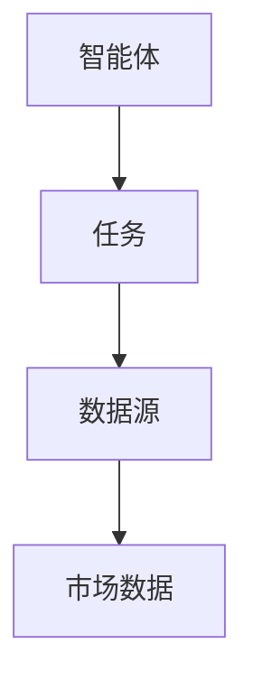
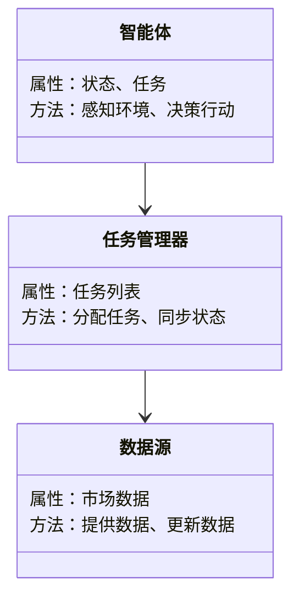
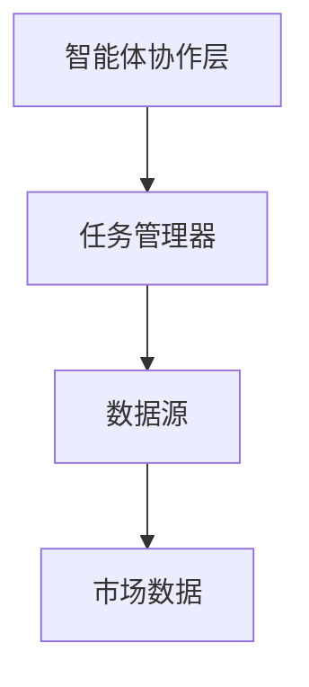
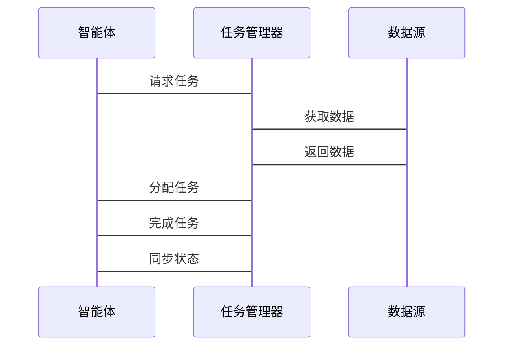

                 


# 智能体协作实现全面的市场流动性分析

---

## 关键词：
智能体协作、市场流动性分析、分布式系统、一致性算法、系统架构

---

## 摘要：
本文详细探讨了智能体协作在市场流动性分析中的应用，从核心概念、算法原理到系统架构，再到项目实战，全面解析了如何通过智能体协作实现对市场流动性的深度分析。通过分析智能体协作的基本原理、一致性算法、系统架构设计以及实际案例，本文为读者提供了从理论到实践的完整指导。

---

## 第1章: 智能体协作与市场流动性分析概述

### 1.1 市场流动性分析的背景与意义
#### 1.1.1 市场流动性分析的基本概念
市场流动性是指资产在市场中快速买卖而不影响价格的能力。流动性分析是金融领域的重要研究方向，其目的是帮助投资者和交易员理解市场的波动性和风险。

#### 1.1.2 智能体协作的优势与必要性
传统市场流动性分析方法依赖中心化系统，存在效率低下、数据延迟等问题。智能体协作通过分布式计算和多智能体协同，能够实时处理海量数据，提高分析效率和准确性。

#### 1.1.3 市场流动性分析的核心目标与应用场景
市场流动性分析的核心目标是预测市场波动、优化交易策略、降低交易风险。应用场景包括高频交易、订单簿分析、市场微观结构研究等。

### 1.2 智能体协作的定义与特点
#### 1.2.1 智能体的定义与核心特征
智能体（Agent）是具有感知环境、自主决策和行动能力的实体。智能体协作是指多个智能体通过分布式计算和信息共享，共同完成复杂任务的过程。

#### 1.2.2 智能体协作的基本原理
智能体协作基于分布式系统和多智能体算法，通过信息交换和任务分配，实现对市场流动性的实时分析和预测。

#### 1.2.3 智能体协作与传统分析方法的对比
传统方法依赖中心化系统，存在单点故障和数据延迟问题。智能体协作通过分布式计算和多智能体协同，能够实现更高效的市场分析。

### 1.3 智能体协作的边界与外延
#### 1.3.1 智能体协作的应用场景
智能体协作适用于高频交易、订单簿分析、市场微观结构研究等领域。

#### 1.3.2 智能体协作的边界条件
智能体协作的边界包括数据源、计算能力、网络延迟等因素。

#### 1.3.3 智能体协作与其他技术的关系
智能体协作与其他技术如分布式系统、区块链、人工智能等密切相关。

---

## 第2章: 智能体协作的核心概念与联系

### 2.1 智能体协作的核心原理
#### 2.1.1 分布式智能体的协作机制
智能体协作基于分布式系统，通过任务分配、信息共享和协调控制实现市场流动性分析。

#### 2.1.2 智能体之间的信息传递与协调
智能体通过消息传递、状态同步和事件驱动等方式实现信息共享和协调。

#### 2.1.3 智能体协作的数学模型与公式
智能体协作的数学模型包括一致性算法、分布式任务分配算法等。

### 2.2 智能体协作的核心要素对比
#### 2.2.1 智能体协作的属性特征对比表格
| 属性 | 传统方法 | 智能体协作 |
|------|----------|------------|
| 数据源 | 单一来源 | 多源分布 |
| 计算能力 | 中心化 | 分布式 |
| 响应时间 | 较高延迟 | 实时响应 |

#### 2.2.2 智能体协作的核心要素ER实体关系图


---

## 第3章: 智能体协作的算法原理

### 3.1 分布式一致性算法
#### 3.1.1 分布式一致性算法的数学模型
一致性算法的目标是确保分布式系统中各节点的数据一致性。常用算法包括Paxos、Raft等。

#### 3.1.2 分布式一致性算法的实现步骤
1. 提议者提出一致性请求
2. 参与者投票确认
3. 记录者记录一致性状态
4. 系统同步一致性状态

#### 3.1.3 分布式一致性算法的代码实现
```python
def一致性算法():
    提议者 = 提出请求
    参与者 = 投票确认
    记录者 = 记录状态
    同步系统 = 同步状态
    return 一致性确认
```

#### 3.1.4 分布式一致性算法的数学表达式
一致性算法的数学模型可以表示为：
$$
一致性状态 = \sum_{i=1}^{n} \text{参与者}_i
$$

---

## 第4章: 智能体协作的系统架构设计

### 4.1 系统功能设计
#### 4.1.1 领域模型设计


#### 4.1.2 系统架构设计


#### 4.1.3 系统接口设计
系统接口包括智能体接口、任务管理器接口、数据源接口等。

#### 4.1.4 系统交互流程


---

## 第5章: 智能体协作的项目实战

### 5.1 环境配置
#### 5.1.1 系统环境
需要配置分布式计算环境，包括多个智能体节点、任务管理器和数据源。

#### 5.1.2 依赖安装
安装必要的分布式计算库和智能体协作框架。

### 5.2 系统核心实现
#### 5.2.1 核心代码实现
```python
class 智能体:
    def 感知环境(self):
        # 获取市场数据
        pass

    def 决策行动(self):
        # 分析市场流动性
        pass

class 任务管理器:
    def 分配任务(self):
        # 分配任务给智能体
        pass

    def 同步状态(self):
        # 同步智能体状态
        pass
```

#### 5.2.2 代码实现解读
详细解读上述代码的实现逻辑和功能。

### 5.3 案例分析
#### 5.3.1 案例背景
以股票市场为例，分析智能体协作如何实现市场流动性分析。

#### 5.3.2 数据分析
通过智能体协作分析股票市场的订单簿数据，预测市场波动。

#### 5.3.3 结果解读
解读分析结果，优化交易策略。

---

## 第6章: 智能体协作的最佳实践

### 6.1 小结
智能体协作在市场流动性分析中的应用具有显著优势，能够实现高效、实时的市场分析。

### 6.2 注意事项
在实际应用中，需要注意数据源的可靠性、算法的高效性以及系统的安全性。

### 6.3 拓展阅读
推荐相关领域的书籍和论文，供读者进一步学习。

---

## 作者：
作者：AI天才研究院/AI Genius Institute  
及 禅与计算机程序设计艺术 /Zen And The Art of Computer Programming

