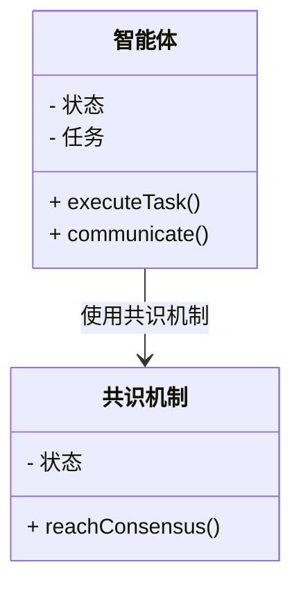

                 


# 智能体协作实现全面的竞争优势分析

> 关键词：智能体协作、竞争优势分析、分布式协作、共识机制、系统架构设计、算法实现

> 摘要：本文深入分析了智能体协作的核心概念、算法原理、系统架构设计以及实际项目实现。通过详细阐述智能体协作的定义、协作机制、算法实现、系统架构设计和实际应用案例，本文为读者提供了一个全面的竞争优势分析框架，帮助读者理解如何通过智能体协作实现系统优化和效率提升。

---

## 第一部分：智能体协作的背景与概念

### 第1章：智能体协作的背景介绍

#### 1.1 智能体协作的定义与问题背景

智能体协作是指多个智能体通过分布式协作机制共同完成任务的过程。智能体是一种能够感知环境、自主决策并采取行动的实体，可以是软件程序、机器人或其他智能系统。智能体协作的核心在于通过通信与协调，实现任务目标的最大化。

在现代信息技术快速发展的背景下，智能体协作的应用场景越来越广泛。例如，在智能制造、智慧城市、分布式计算等领域，智能体协作能够显著提高系统的效率和性能。然而，智能体协作也面临诸多挑战，如通信延迟、任务分配不均、协作冲突等。

#### 1.2 智能体协作的核心概念

智能体协作涉及多个关键概念，包括智能体的定义、协作机制的分类、协作目标的设定等。以下是智能体协作的核心概念对比：

| 概念 | 描述 |
|------|------|
| 智能体 | 具备感知、决策和执行能力的实体 |
| 分布式协作 | 智能体通过分布式网络进行协作 |
| 共识机制 | 确保智能体之间达成一致的规则和协议 |
| 协作目标 | 协作的核心任务和目标 |

---

## 第二部分：智能体协作的核心概念与联系

### 第2章：智能体协作的核心概念原理

#### 2.1 智能体协作的原理分析

智能体协作的原理基于分布式系统和多智能体协同理论。以下是协作过程的主要步骤：

1. **任务分解**：将整体任务分解为多个子任务，分配给不同的智能体。
2. **通信与协调**：智能体之间通过通信协议交换信息，确保任务的一致性。
3. **决策与执行**：每个智能体根据接收到的信息做出决策，并执行相应的动作。
4. **反馈与优化**：根据执行结果进行反馈，优化协作策略。

#### 2.2 智能体协作的核心要素对比

以下是不同协作机制的对比分析：

| 协作机制 | 特点 | 优缺点 |
|----------|------|--------|
| 基于共识的协作 | 需要达成一致 | 通信开销大，但可靠性高 |
| 基于任务分配的协作 | 任务驱动 | 灵活性高，但协调复杂 |

---

## 第三部分：智能体协作的算法原理

### 第3章：智能体协作的算法实现

#### 3.1 分布式协作算法

分布式协作算法是智能体协作的核心算法之一。以下是其实现步骤：

1. **初始化**：每个智能体初始化自己的状态和任务。
2. **通信**：智能体之间通过通信协议交换信息。
3. **决策**：基于通信信息，智能体做出决策。
4. **执行**：执行决策并反馈结果。

#### 3.2 共识机制的实现

共识机制是确保智能体之间达成一致的重要机制。以下是其数学模型：

$$ Consensus = \sum_{i=1}^{n} \frac{1}{n} \cdot v_i $$

其中，$v_i$ 表示第 $i$ 个智能体的值，$n$ 表示智能体的数量。

---

## 第四部分：智能体协作的系统分析与架构设计

### 第4章：智能体协作系统的分析与设计

#### 4.1 系统应用场景介绍

智能体协作系统广泛应用于智能制造、智慧城市等领域。以下是其应用场景的介绍：

- **智能制造**：通过智能体协作优化生产流程。
- **智慧城市**：通过智能体协作实现资源的高效分配。

#### 4.2 系统架构设计

以下是系统架构设计的类图和架构图：



---

## 第五部分：智能体协作的项目实战

### 第5章：智能体协作项目的实施

#### 5.1 项目环境搭建

以下是项目环境搭建的步骤：

1. **安装Python**：选择合适的Python版本。
2. **安装依赖**：使用pip安装所需的库。
3. **配置环境变量**：确保环境变量配置正确。

#### 5.2 项目核心代码实现

以下是核心代码实现的示例：

```python
def executeTask(self):
    # 具体实现
    pass

def communicate(self, other):
    # 通信实现
    pass
```

---

## 第六部分：总结与展望

### 第6章：智能体协作的总结与展望

#### 6.1 本章小结

智能体协作是一种通过分布式协作机制实现任务目标的新兴技术。本文通过详细分析智能体协作的核心概念、算法实现、系统架构设计和实际应用案例，为读者提供了一个全面的竞争优势分析框架。

#### 6.2 未来研究方向

未来的研究方向包括：

1. **更高效的共识机制**：优化共识算法，降低通信开销。
2. **智能体协作的边缘计算**：结合边缘计算，提升协作效率。

---

作者：AI天才研究院/AI Genius Institute & 禅与计算机程序设计艺术 /Zen And The Art of Computer Programming

