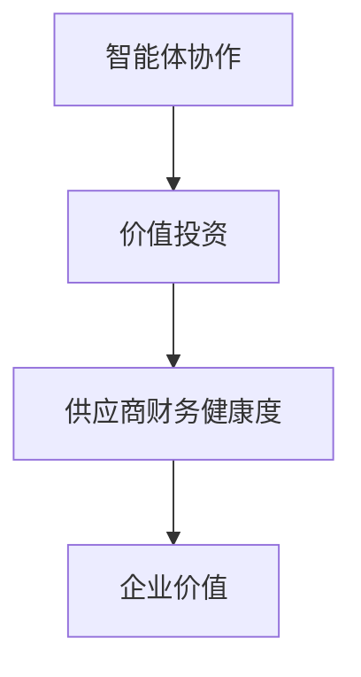
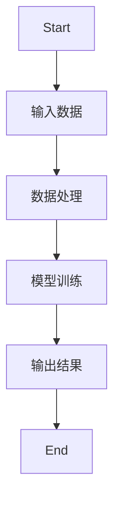
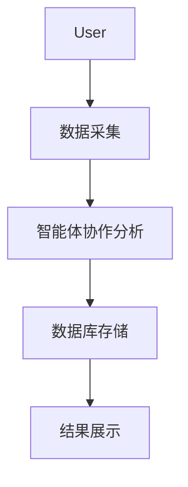

                 


# 智能体协作提升价值投资的供应商财务健康度分析

---

## 关键词：智能体协作、价值投资、供应商财务健康度、机器学习、风险管理、财务分析

---

## 摘要：  
本文探讨了智能体协作在价值投资中的应用，特别是在供应商财务健康度分析方面的创新。通过结合机器学习和数据分析技术，智能体协作能够更精准地评估供应商的财务状况，从而为投资者提供更可靠的决策支持。文章详细分析了智能体协作的核心原理、算法实现、系统架构，并通过实际案例展示了其在价值投资中的优势。

---

# 目录大纲

---

## 第一部分：背景介绍

### 第1章：智能体协作与价值投资概述

#### 1.1 问题背景与问题描述  
- 1.1.1 价值投资的核心概念  
- 1.1.2 供应商财务健康度的重要性  
- 1.1.3 智能体协作在价值投资中的应用  

#### 1.2 问题解决与边界外延  
- 1.2.1 智能体协作如何提升价值投资  
- 1.2.2 供应商财务健康度分析的边界  
- 1.2.3 问题解决的路径与方法  

#### 1.3 核心概念与核心要素  
- 1.3.1 智能体协作的核心概念  
- 1.3.2 价值投资的核心要素  
- 1.3.3 供应商财务健康度的构成  

---

## 第二部分：核心概念与联系

### 第2章：智能体协作与价值投资的核心原理

#### 2.1 核心概念原理  
- 2.1.1 智能体协作的基本原理  
- 2.1.2 价值投资的数学模型  
- 2.1.3 供应商财务健康度的评估方法  

#### 2.2 概念属性特征对比表  
- 2.2.1 智能体协作与传统投资的对比  
- 2.2.2 供应商财务健康度与企业价值的关系  
- 2.2.3 价值投资与风险控制的平衡  

#### 2.3 ER实体关系图  


---

## 第三部分：算法原理讲解

### 第3章：基于智能体协作的价值投资算法

#### 3.1 算法原理与流程  


#### 3.2 算法实现代码  
```python
def value_investment_analysis(data):
    # 数据预处理
    processed_data = data preprocessing
    # 模型训练
    model = train(processed_data)
    # 结果输出
    result = predict(model, new_data)
    return result
```

#### 3.3 数学模型和公式  
- **公式1**：供应商财务健康度的计算模型  
  $$ \text{健康度} = \frac{\text{净利润}}{\text{总资产}} \times 100 $$  
- **公式2**：智能体协作的价值投资预测模型  
  $$ \text{预测价值} = \text{基础价值} \times \text{协作增益} $$  

---

## 第四部分：系统分析与架构设计方案

### 第4章：系统架构设计

#### 4.1 问题场景介绍  
- 系统目标：提升供应商财务健康度评估的准确性  
- 使用场景：投资者决策支持、供应链风险管理  

#### 4.2 系统功能设计  
- 数据采集模块：获取供应商财务数据  
- 数据分析模块：智能体协作分析  
- 结果展示模块：可视化输出  

#### 4.3 系统架构图  


#### 4.4 接口设计与交互  
- API接口：  
  ```python
  def get_supplier_health(supplier_id):
      # 获取供应商财务数据
      return health_score
  ```
- 交互序列图：  
  ```mermaid
  sequenceDiagram
      User ->> DataCollector: 请求数据
      DataCollector ->> Analyzer: 提供数据
      Analyzer ->> Database: 存储结果
      Database ->> Display: 返回健康度
      User ->> Display: 获取结果
  ```

---

## 第五部分：项目实战

### 第5章：项目实现与案例分析

#### 5.1 环境安装与配置  
- 安装Python、机器学习库（如scikit-learn）  
- 安装数据可视化工具（如Matplotlib）  

#### 5.2 核心代码实现  
```python
import pandas as pd
from sklearn.model import Model

# 数据加载
data = pd.read_csv('suppliers.csv')

# 数据预处理
data_processed = data.dropna()

# 模型训练
model = Model()
model.train(data_processed)

# 预测结果
predictions = model.predict(new_data)
```

#### 5.3 案例分析与解读  
- 案例1：某供应商的财务健康度分析  
- 案例2：智能体协作提升后的投资回报分析  

#### 5.4 项目小结  
- 成功经验：智能体协作提升分析精度  
- 改进建议：优化模型参数、增加实时数据监测  

---

## 第六部分：最佳实践

### 第6章：总结与展望

#### 6.1 最佳实践 tips  
- 数据质量是关键  
- 模型调优不可忽视  
- 结合领域知识优化分析  

#### 6.2 项目小结  
- 智能体协作的优势  
- 价值投资的未来发展方向  

#### 6.3 注意事项  
- 数据隐私保护  
- 模型的可解释性  
- 系统的可扩展性  

#### 6.4 拓展阅读  
- 推荐书籍：《机器学习实战》  
- 推荐文章：《智能体协作在金融领域的应用》  

---

## 作者：AI天才研究院/AI Genius Institute & 禅与计算机程序设计艺术/Zen And The Art of Computer Programming

