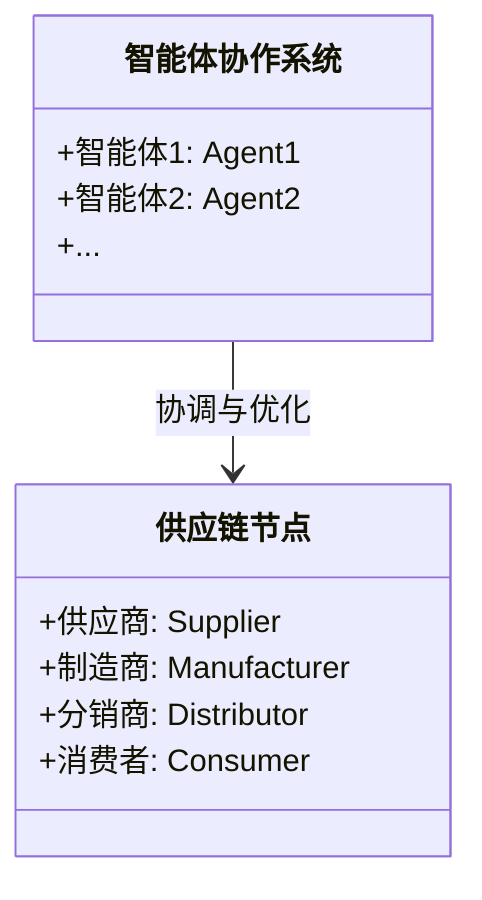
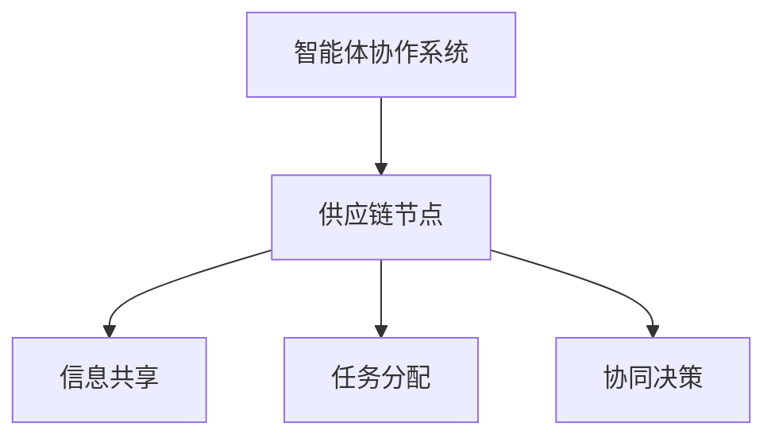
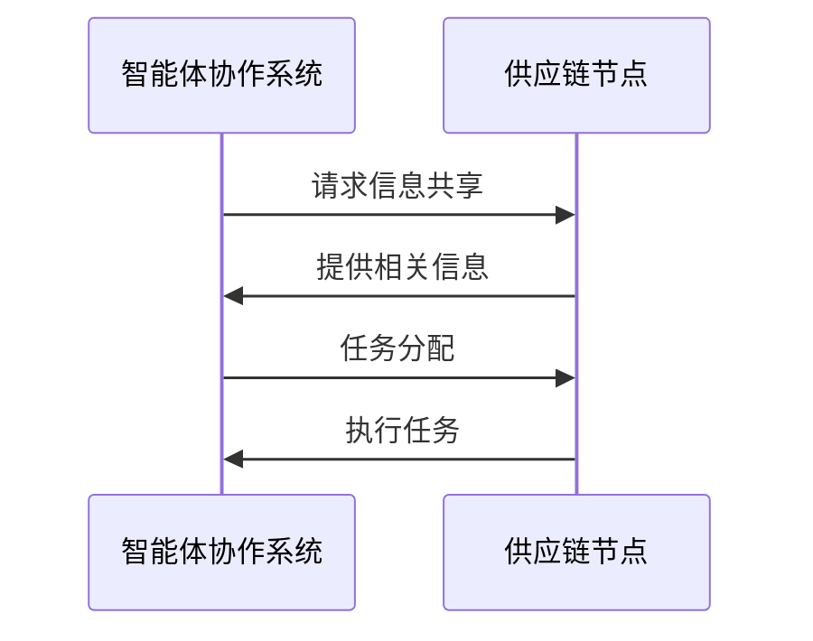

                 


# 智能体协作提升价值投资的供应链弹性评估

> 关键词：智能体协作、供应链弹性、价值投资、算法原理、系统架构、项目实战

> 摘要：本文深入探讨了智能体协作在提升供应链弹性评估中的应用，结合价值投资的视角，分析了智能体协作的核心原理、算法实现、系统架构，并通过实际案例展示了如何通过智能体协作优化供应链弹性，提升投资决策的准确性。文章结构清晰，内容详实，旨在为相关领域的研究者和实践者提供理论和实践指导。

---

## 第一部分：智能体协作与供应链弹性评估基础

### 第1章：智能体协作与供应链弹性概述

#### 1.1 智能体协作的基本概念

##### 1.1.1 智能体的定义与特征
智能体（Agent）是指能够感知环境、自主决策并采取行动的实体。智能体具有以下特征：
- **自主性**：能够在没有外部干预的情况下独立运作。
- **反应性**：能够根据环境变化实时调整行为。
- **社会性**：能够与其他智能体或人类进行交互和协作。
- **学习能力**：能够通过经验改进自身的决策能力。

##### 1.1.2 智能体协作的内涵与外延
智能体协作是指多个智能体通过信息共享、任务分配和协同决策，共同完成复杂任务的过程。其外延包括分布式计算、多智能体系统和分布式人工智能等领域。

##### 1.1.3 智能体协作与供应链的关系
供应链是一个复杂的系统，涉及供应商、制造商、分销商和消费者等多个环节。智能体协作可以通过优化信息流、物流和资金流，提升供应链的效率和弹性。

#### 1.2 供应链弹性评估的核心要素

##### 1.2.1 供应链弹性的定义
供应链弹性是指供应链在面对外部干扰（如疫情、自然灾害、市场波动等）时，能够快速恢复并维持正常运作的能力。

##### 1.2.2 供应链弹性的关键指标
- **响应速度**：供应链对突发事件的反应速度。
- **资源冗余度**：供应链中备用资源的充足性。
- **协作能力**：供应链各环节之间的协同效率。
- **成本控制**：在弹性建设中的成本投入与收益的平衡。

##### 1.2.3 供应链弹性与价值投资的联系
供应链弹性直接影响企业的运营稳定性和盈利能力。通过提升供应链弹性，企业能够更好地应对市场波动，增强投资者信心，从而提升企业的市场价值。

#### 1.3 智能体协作提升供应链弹性的背景

##### 1.3.1 当前供应链管理的挑战
- **复杂性**：全球化背景下，供应链涉及的环节和参与者众多，协调难度大。
- **不确定性**：市场波动、疫情等不可预测因素增加了供应链管理的难度。
- **效率低下**：传统供应链管理中，信息孤岛和决策延迟现象普遍。

##### 1.3.2 智能体协作在供应链中的应用现状
智能体协作技术已在供应链多个环节得到应用，如智能库存管理、智能物流调度和智能需求预测等。

##### 1.3.3 提升供应链弹性的必要性
随着全球经济不确定性的增加，提升供应链弹性已成为企业生存和发展的关键能力。

#### 1.4 本章小结
本章从智能体协作的基本概念出发，分析了供应链弹性评估的核心要素，探讨了智能体协作在提升供应链弹性中的作用和背景。

---

## 第2章：智能体协作的核心概念与联系

### 2.1 智能体协作的原理

#### 2.1.1 分布式智能体协作机制
分布式智能体协作通过去中心化的架构，实现多个智能体之间的信息共享和任务分配。

#### 2.1.2 智能体协作中的通信与协调
智能体之间的通信通过消息传递机制实现，协调则依赖于共识算法和分布式决策模型。

#### 2.1.3 智能体协作的决策模型
基于多智能体的分布式决策模型，通过博弈论和强化学习优化决策过程。

### 2.2 供应链弹性评估的模型

#### 2.2.1 供应链弹性评估的数学模型
供应链弹性评估模型可以表示为：
$$ E = f(I, R, C) $$
其中，$E$ 表示弹性，$I$ 表示干扰因素，$R$ 表示响应能力，$C$ 表示协同能力。

#### 2.2.2 智能体协作对供应链弹性的影响
智能体协作通过优化信息流和资源分配，显著提升供应链的响应速度和资源冗余度。

#### 2.2.3 供应链弹性评估的指标体系
- **信息共享度**：供应链各环节之间的信息透明程度。
- **协同响应度**：供应链对突发事件的协同响应能力。
- **成本效益比**：弹性建设的成本与收益的对比。

### 2.3 智能体协作与供应链弹性的关系

#### 2.3.1 智能体协作如何提升供应链弹性
通过智能体协作，供应链能够实现快速的信息共享和资源调配，增强应对突发事件的能力。

#### 2.3.2 供应链弹性对价值投资的影响
供应链弹性是企业抗风险能力的重要体现，直接影响企业的市场价值和投资者信心。

#### 2.3.3 智能体协作与价值投资的协同效应
智能体协作通过提升供应链弹性，增强企业的盈利能力和抗风险能力，从而提升企业的市场价值。

### 2.4 本章小结
本章分析了智能体协作的核心原理，并探讨了其与供应链弹性的关系，强调了智能体协作在提升供应链弹性中的重要作用。

---

## 第3章：智能体协作提升供应链弹性的算法原理

### 3.1 智能体协作算法概述

#### 3.1.1 基于多智能体的协作算法
多智能体协作算法包括分布式计算、多智能体通信和协同决策等关键步骤。

#### 3.1.2 分布式计算与智能体协作
分布式计算通过将任务分解到多个智能体中，实现并行计算和协同决策。

#### 3.1.3 智能体协作算法的分类
- **基于规则的协作算法**：通过预定义规则实现协作。
- **基于学习的协作算法**：通过机器学习优化协作策略。
- **混合型协作算法**：结合规则和学习的协作算法。

### 3.2 供应链弹性评估的算法实现

#### 3.2.1 供应链弹性评估的数学模型
供应链弹性评估模型可以表示为：
$$ E = \alpha I + \beta R + \gamma C $$
其中，$\alpha$、$\beta$、$\gamma$ 是权重系数，$I$、$R$、$C$ 分别表示干扰、响应和协同能力。

#### 3.2.2 智能体协作算法在供应链弹性评估中的应用
通过智能体协作算法优化供应链的响应速度和协同能力，提升供应链弹性。

#### 3.2.3 算法实现的步骤与流程
1. **初始化**：设置智能体的初始状态和目标。
2. **信息共享**：智能体之间共享相关信息。
3. **任务分配**：根据智能体的能力分配任务。
4. **协同决策**：智能体基于共享信息做出决策。
5. **执行与反馈**：执行决策并根据反馈调整策略。

### 3.3 智能体协作算法的优化与改进

#### 3.3.1 算法优化的目标
提升算法的效率和准确性，降低计算成本。

#### 3.3.2 基于反馈机制的算法改进
通过实时反馈优化智能体的决策策略。

#### 3.3.3 算法优化的数学模型
优化后的算法模型可以表示为：
$$ E_{\text{new}} = E + \delta f $$
其中，$\delta$ 是优化步长，$f$ 是反馈函数。

### 3.4 本章小结
本章详细介绍了智能体协作算法的原理，并探讨了其在供应链弹性评估中的应用和优化方法。

---

## 第4章：智能体协作提升供应链弹性的系统分析与架构设计

### 4.1 项目背景与目标

#### 4.1.1 项目背景
本项目旨在通过智能体协作技术，提升供应链的弹性，优化企业的价值投资。

#### 4.1.2 项目目标
- 实现智能体协作在供应链弹性评估中的应用。
- 提升供应链的响应速度和协同能力。
- 优化企业的市场价值。

### 4.2 系统功能设计

#### 4.2.1 领域模型设计
通过领域模型（类图）展示系统的功能模块和交互关系。



#### 4.2.2 系统架构设计
通过架构图展示系统的模块结构和交互流程。



#### 4.2.3 系统接口设计
系统接口设计包括智能体协作接口和供应链节点接口，确保系统的高效协同。

#### 4.2.4 系统交互流程设计
通过交互流程图展示系统的交互流程。



### 4.3 本章小结
本章通过系统分析与架构设计，展示了智能体协作在供应链弹性评估中的具体实现方式。

---

## 第5章：智能体协作提升供应链弹性的项目实战

### 5.1 环境安装与配置

#### 5.1.1 系统环境要求
- 操作系统：Linux/Windows/MacOS
- 开发工具：Python、Jupyter Notebook、IDE（如PyCharm）
- 库依赖：numpy、pandas、scikit-learn、networkx

#### 5.1.2 智能体协作框架安装
安装必要的库和框架，例如：
```bash
pip install numpy pandas scikit-learn networkx
```

### 5.2 系统核心实现

#### 5.2.1 智能体协作算法实现
实现基于多智能体的协作算法，例如：
```python
class Agent:
    def __init__(self, id):
        self.id = id
        self.state = 'idle'
    
    def collaborate(self, other_agents):
        # 协作逻辑
        pass
```

#### 5.2.2 供应链弹性评估实现
实现供应链弹性评估模型，例如：
```python
def calculate_elasticity(agents):
    elasticity = 0
    for agent in agents:
        elasticity += agent.state
    return elasticity
```

#### 5.2.3 项目核心代码
核心代码实现，包括智能体协作和供应链弹性评估的具体逻辑。

### 5.3 实际案例分析

#### 5.3.1 案例背景介绍
介绍案例的背景和目标。

#### 5.3.2 案例分析与实现
通过具体案例展示智能体协作在供应链弹性评估中的实际应用。

#### 5.3.3 案例结果与分析
分析案例结果，总结智能体协作对供应链弹性提升的效果。

### 5.4 本章小结
本章通过实际案例展示了智能体协作在供应链弹性评估中的具体应用，验证了算法的有效性。

---

## 第6章：智能体协作提升供应链弹性的最佳实践与总结

### 6.1 最佳实践

#### 6.1.1 系统设计中的注意事项
在系统设计中，需注意智能体协作的通信效率和资源分配问题。

#### 6.1.2 项目实施中的经验总结
总结项目实施中的经验和教训，提出改进建议。

#### 6.1.3 未来研究方向
探讨智能体协作在供应链弹性评估中的未来研究方向。

### 6.2 小结

#### 6.2.1 核心内容回顾
回顾文章的核心内容，强调智能体协作在供应链弹性评估中的重要性。

#### 6.2.2 未来展望
展望智能体协作技术在供应链管理中的未来发展。

### 6.3 注意事项

#### 6.3.1 技术实现中的常见问题
总结智能体协作技术实现中的常见问题及解决方案。

#### 6.3.2 项目实施中的风险提示
提示项目实施中的潜在风险和应对策略。

### 6.4 拓展阅读

#### 6.4.1 相关领域书籍推荐
推荐与智能体协作、供应链管理和价值投资相关的书籍和文献。

#### 6.4.2 在线资源与工具推荐
推荐相关的在线资源和工具，帮助读者进一步学习和实践。

### 6.5 本章小结
本章总结了智能体协作在供应链弹性评估中的最佳实践，展望了未来的研究方向，并提供了相关的拓展阅读资料。

---

## 第7章：总结与展望

### 7.1 总结
智能体协作技术在提升供应链弹性评估中的应用，不仅优化了供应链的管理效率，还为企业价值投资提供了有力支持。

### 7.2 展望
未来，随着人工智能和分布式技术的进一步发展，智能体协作将在供应链弹性评估中发挥更大的作用，为企业创造更大的价值。

---

## 作者：AI天才研究院/AI Genius Institute & 禅与计算机程序设计艺术/Zen And The Art of Computer Programming

---

本文通过详细分析智能体协作在供应链弹性评估中的应用，结合实际案例和系统设计，为相关领域的研究者和实践者提供了理论和实践指导。

