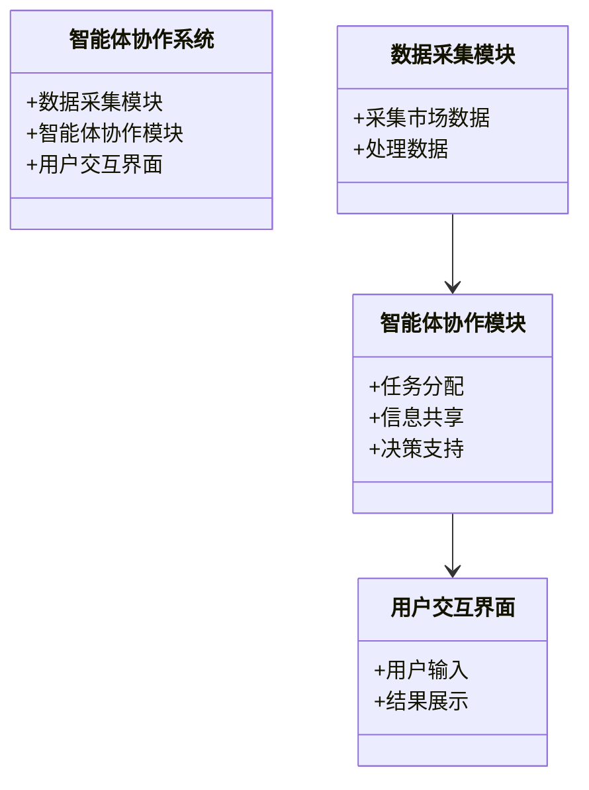
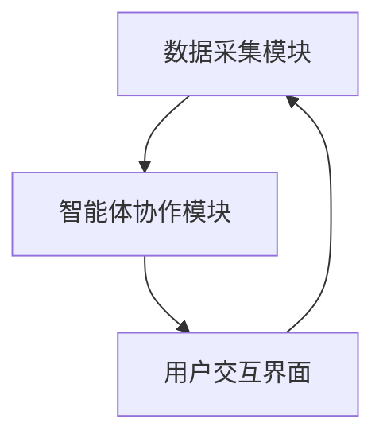

                 


# 智能体协作提升价值投资的行业壁垒分析

> 关键词：智能体协作，价值投资，行业壁垒，算法，系统架构

> 摘要：本文探讨了智能体协作在价值投资中的应用，分析了如何通过智能体协作提升行业壁垒。文章从智能体协作的基本概念、算法原理、系统架构、实际案例等多方面展开，详细阐述了智能体协作在价值投资中的优势和实现方法。

---

## 第1章：智能体协作与价值投资的背景介绍

### 1.1 智能体协作的核心概念

#### 1.1.1 智能体协作的定义
智能体协作是指多个智能体通过协同合作，共同完成复杂任务的过程。智能体可以是软件程序、算法或自动化系统，它们通过信息共享和任务分配，实现目标的最大化。

#### 1.1.2 价值投资的基本原理
价值投资是一种投资策略，强调通过分析企业的内在价值来决定投资决策。核心在于寻找市场价格低于内在价值的股票，长期持有以获得收益。

#### 1.1.3 行业壁垒的定义与分类
行业壁垒是指行业内竞争者之间形成的障碍，限制新进入者。常见的壁垒包括技术壁垒、市场壁垒、资源壁垒等。

### 1.2 智能体协作在价值投资中的应用背景

#### 1.2.1 传统价值投资的局限性
传统价值投资依赖个人经验和主观判断，存在信息不对称、决策偏差等问题，难以应对复杂多变的市场环境。

#### 1.2.2 智能体协作的优势与潜力
智能体协作能够通过数据共享、算法优化和任务分配，提升投资决策的准确性和效率，帮助投资者捕捉更多投资机会。

#### 1.2.3 当前行业壁垒的现状与挑战
当前行业中，技术壁垒日益重要，传统方法难以应对快速变化的市场，智能体协作成为突破壁垒的关键技术。

---

## 第2章：智能体协作的核心概念与联系

### 2.1 智能体协作的原理与机制

#### 2.1.1 多智能体协作的基本原理
智能体协作基于信息共享、任务分配和协同决策，通过协调各自的行为，实现共同目标。

#### 2.1.2 智能体之间的通信与协调
智能体通过通信协议共享信息，利用协调机制（如分布式算法）进行任务分配和状态同步。

#### 2.1.3 协作目标的达成过程
智能体协作的目标是通过协同优化，实现整体收益的最大化，减少个体决策的局限性。

### 2.2 价值投资与智能体协作的关联

#### 2.2.1 价值投资中的信息不对称问题
市场参与者之间存在信息不对称，导致定价偏差。智能体协作能够通过数据共享减少这种不对称。

#### 2.2.2 智能体协作如何解决信息不对称
智能体通过数据挖掘、机器学习等技术，分析市场数据，帮助投资者发现潜在的投资机会。

#### 2.2.3 协作智能体在投资决策中的作用
协作智能体能够快速处理大量数据，提供实时市场分析，辅助投资决策，提升投资效率。

### 2.3 行业壁垒与智能体协作的关系

#### 2.3.1 行业壁垒的形成机制
行业壁垒通常由技术、市场、资源等因素构成，限制新进入者的发展。

#### 2.3.2 智能体协作如何降低壁垒
智能体协作能够优化资源配置，提升竞争力，帮助企业在行业中占据优势。

#### 2.3.3 协作智能体在跨行业中的应用
智能体协作不仅适用于金融领域，还可扩展到其他行业，推动跨行业合作与创新。

### 2.4 核心概念对比分析

#### 2.4.1 智能体协作与传统投资方法的对比
智能体协作具有高效、精准的特点，而传统方法依赖人工分析，效率较低。

#### 2.4.2 不同行业壁垒的特征对比
技术壁垒注重技术创新，市场壁垒依赖市场份额，资源壁垒依赖资源控制。

#### 2.4.3 协作智能体在不同行业中的表现
智能体协作在金融、制造等领域表现出不同的优势，具体取决于行业的特点和需求。

---

## 第3章：智能体协作的算法原理与数学模型

### 3.1 多智能体协作算法概述

#### 3.1.1 多智能体协作的基本算法
多智能体协作算法包括分布式算法、协商算法、一致性算法等，用于实现任务分配和状态同步。

#### 3.1.2 基于强化学习的协作算法
强化学习通过智能体与环境的互动，学习最优策略，实现协作目标。

#### 3.1.3 基于博弈论的协作机制
博弈论中的纳什均衡等理论为智能体协作提供了理论基础，帮助解决协作中的冲突与协调问题。

### 3.2 价值投资中的数学模型

#### 3.2.1 价值评估的基本数学模型
CAPM模型（资本资产定价模型）用于评估资产的预期收益，公式为：
$$ E(r_i) = r_f + β_i (E(r_m) - r_f) $$

#### 3.2.2 投资组合优化的数学公式
马克owitz均值-方差模型用于优化投资组合，目标是最小化风险或最大化收益。

#### 3.2.3 风险评估与收益预测的数学方法
使用时间序列分析（如ARIMA模型）预测市场走势，评估投资风险。

### 3.3 智能体协作的数学模型

#### 3.3.1 协作智能体的通信模型
智能体之间的通信通过消息队列实现，消息格式包括任务分配和状态更新。

#### 3.3.2 协作智能体的任务分配算法
基于任务优先级和资源分配规则，实现任务的动态分配和调整。

#### 3.3.3 协作智能体的决策模型
使用贝叶斯网络进行概率推理，辅助智能体做出最优决策。

---

## 第4章：系统分析与架构设计方案

### 4.1 问题场景介绍

#### 4.1.1 投资决策的复杂性
市场波动、信息繁杂等因素增加了投资决策的难度。

#### 4.1.2 智能体协作的应用需求
需要构建一个高效的协作系统，支持智能体之间的信息共享和任务协作。

### 4.2 项目介绍

#### 4.2.1 项目目标
开发一个基于智能体协作的价值投资系统，提升投资决策的准确性和效率。

#### 4.2.2 项目范围
涵盖数据采集、智能体协作、投资决策支持等功能。

### 4.3 系统功能设计

#### 4.3.1 领域模型
使用Mermaid绘制领域模型类图，展示系统的主要组件及其交互。



### 4.4 系统架构设计

#### 4.4.1 系统架构图
使用Mermaid绘制系统架构图，展示系统的整体结构和模块划分。


### 4.5 系统接口设计

#### 4.5.1 接口描述
智能体协作系统通过API接口实现模块间的通信，例如数据采集模块向协作模块发送数据。

#### 4.5.2 接口交互流程图
使用Mermaid绘制接口交互流程图，展示数据流动和模块协作过程。



---

## 第5章：项目实战

### 5.1 环境安装

#### 5.1.1 安装Python
需要安装Python 3.8或更高版本，建议使用Anaconda环境管理工具。

#### 5.1.2 安装依赖库
安装必要的Python库，如Pandas、NumPy、Scikit-learn、Flask等。

### 5.2 系统核心实现

#### 5.2.1 数据采集模块
使用爬虫技术采集市场数据，清洗并存储。

#### 5.2.2 智能体协作模块
实现任务分配和信息共享功能，例如基于消息队列的通信机制。

#### 5.2.3 用户交互界面
开发一个简单的Web界面，展示投资建议和结果。

### 5.3 代码实现与解读

#### 5.3.1 数据采集模块代码
```python
import requests
import json
from bs4 import BeautifulSoup

def fetch_data(url):
    response = requests.get(url)
    soup = BeautifulSoup(response.text, 'html.parser')
    data = []
    for item in soup.find_all('div', class_='data-item'):
        data.append({
            'price': float(item.find('span', class_='price').text),
            'volume': int(item.find('span', class_='volume').text)
        })
    return data
```

#### 5.3.2 智能体协作模块代码
```python
from queue import Queue

class Agent:
    def __init__(self, name):
        self.name = name
        self.task_queue = Queue()

    def receive_task(self, task):
        self.task_queue.put(task)

    def execute_task(self):
        while not self.task_queue.empty():
            task = self.task_queue.get()
            self.process_task(task)

    def process_task(self, task):
        # 具体任务处理逻辑
        pass
```

#### 5.3.3 用户交互界面代码
```python
from flask import Flask, render_template, request

app = Flask(__name__)

@app.route('/')
def index():
    return render_template('index.html')

@app.route('/analyze', methods=['POST'])
def analyze():
    # 处理用户输入，调用协作模块进行分析
    return 'Analysis Result'
```

### 5.4 实际案例分析

#### 5.4.1 案例背景
假设我们有一个股票投资案例，需要分析某公司的股票价值。

#### 5.4.2 案例实现
通过智能体协作系统，智能体分别负责数据采集、模型训练和结果展示。

#### 5.4.3 结果解读
智能体协作系统能够快速生成分析报告，帮助投资者做出更明智的决策。

### 5.5 项目小结

#### 5.5.1 核心功能实现
完成了数据采集、智能体协作和用户交互的核心功能。

#### 5.5.2 系统性能优化
通过优化算法和架构设计，提升了系统的处理效率和响应速度。

#### 5.5.3 项目经验总结
协作智能体的实现需要模块化设计和高效的通信机制，才能保证系统的稳定运行。

---

## 第6章：总结与展望

### 6.1 核心总结

#### 6.1.1 智能体协作的优势
智能体协作能够显著提升投资决策的效率和准确性，帮助投资者在复杂市场中占据优势。

#### 6.1.2 行业壁垒的突破
通过智能体协作，企业可以降低行业壁垒，提升竞争力，实现更快的发展。

### 6.2 未来展望

#### 6.2.1 技术进步的潜力
随着AI技术的不断进步，智能体协作在价值投资中的应用将更加广泛和深入。

#### 6.2.2 行业发展的趋势
智能化投资将成为主流趋势，智能体协作将在更多领域发挥重要作用。

### 6.3 最佳实践 tips

#### 6.3.1 系统设计建议
建议采用模块化设计，确保系统的可扩展性和可维护性。

#### 6.3.2 算法优化建议
定期优化算法模型，提升协作效率和决策准确率。

#### 6.3.3 安全注意事项
确保数据安全和系统安全，防止信息泄露和网络攻击。

### 6.4 拓展阅读

#### 6.4.1 推荐书籍
《智能体协作与分布式系统》、《价值投资实战指南》

#### 6.4.2 推荐技术博客
推荐关注相关技术博客，获取最新的技术动态和行业资讯。

---

## 作者：AI天才研究院 & 禅与计算机程序设计艺术

