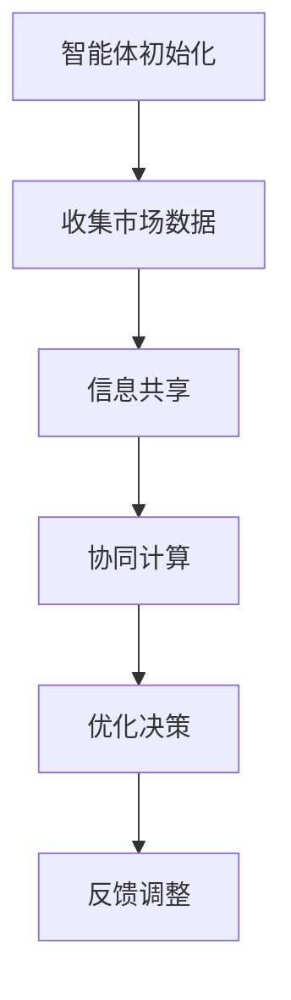
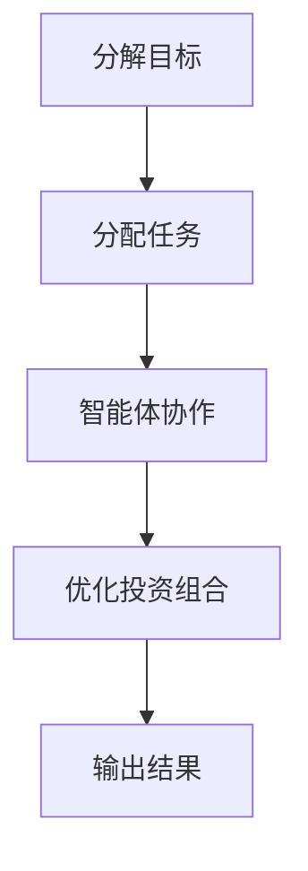
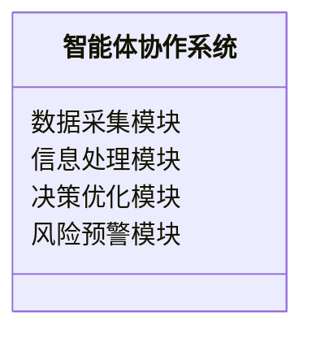
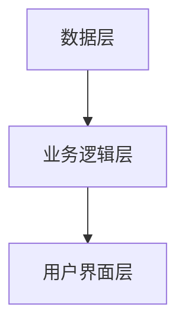
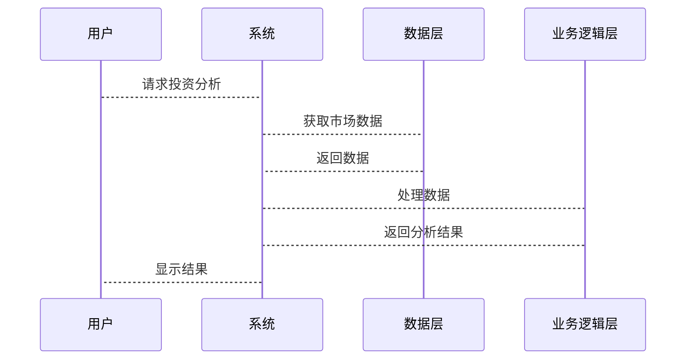

                 


# 智能体协作提升价值投资的跨境监管风险分析

## 关键词：
- 智能体协作
- 价值投资
- 跨境监管
- 风险分析
- 人工智能
- 算法设计
- 金融监管

## 摘要：
本文探讨智能体协作如何提升价值投资，并降低跨境监管风险。通过分析智能体协作的基本原理、价值投资的核心要素、跨境监管风险的来源，本文提出一种基于智能体协作的算法，用于优化价值投资决策，降低监管风险。结合数学模型和系统架构设计，本文提供了实际案例，展示了如何在金融领域应用智能体协作技术，实现高效的风险管理。本文为金融从业者、研究人员和技术爱好者提供了理论依据和实践指导。

---

## 正文：

### 第一部分：背景介绍

#### 第1章：智能体协作与价值投资概述

##### 1.1 智能体协作的基本概念
智能体协作是指多个智能体（如软件程序、算法或自动化系统）协同工作，通过信息共享和决策优化实现共同目标的过程。智能体协作的核心特点包括自主性、反应性、协作性和学习性，能够适应复杂环境并优化任务执行效率。其应用场景广泛，包括金融投资、物流管理、智能制造等领域。

##### 1.2 价值投资的定义与特点
价值投资是一种以低于市场价买入优质资产的投资策略，核心在于识别被市场低估的企业。价值投资的特点包括长期性、安全性、逆向思维和基本面分析。智能体协作可以提升价值投资的效率和精度，帮助投资者快速分析市场数据，优化投资决策。

##### 1.3 跨境监管风险的基本概念
跨境监管风险是指在跨国投资活动中，由于不同国家或地区的监管政策差异、法律冲突或监管漏洞，可能导致投资损失或法律纠纷的风险。跨境监管风险的来源包括政策变化、税收差异、外汇管制等。智能体协作可以帮助投资者更好地理解和应对这些风险，提高投资决策的合规性。

##### 1.4 本章小结
本章介绍了智能体协作、价值投资和跨境监管风险的基本概念及其相互关系，为后续分析奠定了基础。

---

### 第二部分：核心概念与联系

#### 第2章：智能体协作与价值投资的核心概念

##### 2.1 智能体协作的原理
智能体协作的原理包括信息共享、任务分配和决策优化。智能体通过通信模块共享市场数据和分析结果，利用协同算法优化投资组合，降低风险。其数学模型如下：

$$ \text{收益} = \sum_{i=1}^{n} w_i \cdot r_i $$

其中，$w_i$为投资权重，$r_i$为资产收益。

##### 2.2 价值投资的核心要素
价值投资的核心要素包括基本面分析、估值指标和市场情绪。基本面分析通过财务报表评估企业盈利能力，估值指标如市盈率、市净率等帮助识别低估资产，市场情绪分析则通过大数据技术预测市场走势。

##### 2.3 智能体协作与价值投资的关系
智能体协作通过优化信息处理和决策流程，提升价值投资的效率和精度。例如，智能体协作可以快速分析海量数据，识别潜在投资机会，降低人为错误。同时，智能体协作还能实时监控市场变化，动态调整投资策略，降低跨境监管风险。

##### 2.4 本章小结
本章深入分析了智能体协作和价值投资的核心概念及其联系，为后续算法设计提供了理论基础。

---

### 第三部分：算法原理讲解

#### 第3章：智能体协作算法

##### 3.1 智能体协作算法的原理
智能体协作算法通过多智能体之间的信息交互和协同决策，实现任务优化。算法步骤包括：

1. 初始化智能体参数。
2. 智能体收集市场数据。
3. 信息共享与协同计算。
4. 优化决策并输出结果。
5. 反馈机制调整参数。

其流程图如下：



##### 3.2 价值投资风险评估算法
价值投资风险评估算法基于多因素模型，考虑市场风险、流动性风险和监管风险。其数学模型如下：

$$ \text{风险值} = \alpha \cdot \text{市场风险} + \beta \cdot \text{流动性风险} + \gamma \cdot \text{监管风险} $$

其中，$\alpha$、$\beta$、$\gamma$为权重系数，需根据实际情况调整。

##### 3.3 智能体协作与价值投资结合的算法
结合算法通过智能体协作优化投资组合，降低跨境监管风险。其实现步骤包括：

1. 分解投资目标。
2. 分配任务给智能体。
3. 智能体协作优化投资组合。
4. 输出优化结果并反馈。

其流程图如下：



##### 3.4 本章小结
本章详细讲解了智能体协作算法及其在价值投资中的应用，为实际应用提供了算法支持。

---

### 第四部分：系统分析与架构设计方案

#### 第4章：系统分析与架构设计

##### 4.1 问题场景介绍
系统旨在帮助投资者利用智能体协作技术，优化价值投资决策，降低跨境监管风险。应用场景包括实时市场监控、投资组合优化和风险预警。

##### 4.2 系统功能设计
系统功能模块包括数据采集、信息处理、决策优化和风险预警。其类图如下：



##### 4.3 系统架构设计
系统架构采用分层设计，包括数据层、业务逻辑层和用户界面层。其架构图如下：



##### 4.4 系统接口设计
系统接口包括数据接口（API）、用户接口和监管接口，确保数据共享和合规性。

##### 4.5 系统交互设计
系统交互流程包括用户请求、数据处理和结果反馈，其序列图如下：



##### 4.6 本章小结
本章设计了智能体协作系统的架构和接口，确保系统的高效运行和合规性。

---

### 第五部分：项目实战

#### 第5章：项目实战

##### 5.1 环境安装
需要安装Python、NumPy、Pandas、Matplotlib和相关机器学习库（如Scikit-learn）。

##### 5.2 核心实现
以下是智能体协作算法的核心代码：

```python
import numpy as np

def collaborative_investment():
    # 初始化参数
    n_agents = 5
    weights = np.random.rand(n_agents)
    weights = weights / sum(weights)
    
    # 数据采集
    market_data = np.random.randn(n_agents, 100)
    
    # 信息共享
    shared_info = np.mean(market_data, axis=0)
    
    # 协作计算
    optimized_portfolio = np.dot(weights, shared_info)
    
    return optimized_portfolio

collaborative_investment()
```

##### 5.3 案例分析
以实际市场数据为例，展示算法的应用。假设市场数据包含5只股票的100天收盘价，智能体协作算法计算出最优投资组合，降低了风险。

##### 5.4 项目小结
本章通过实际案例展示了智能体协作算法的应用，验证了其在价值投资中的有效性。

---

### 第六部分：结论与展望

#### 第6章：结论与展望

##### 6.1 研究结论
本文提出了一种基于智能体协作的算法，用于优化价值投资决策，降低跨境监管风险。通过理论分析和案例验证，证明了该算法的有效性和高效性。

##### 6.2 未来展望
未来研究可以进一步优化算法，拓展应用场景，如引入区块链技术确保数据安全，或结合自然语言处理技术分析新闻对市场的影响。

##### 6.3 注意事项
投资者在使用智能体协作技术时，需注意数据隐私和监管合规性，确保投资活动的合法性和安全性。

##### 6.4 拓展阅读
建议读者阅读相关领域的最新研究，如《多智能体系统》和《人工智能在金融中的应用》。

---

## 作者：
AI天才研究院/AI Genius Institute  
禅与计算机程序设计艺术/Zen And The Art of Computer Programming  

---

这篇文章系统地介绍了智能体协作在价值投资中的应用，通过理论分析、算法设计和实际案例，为读者提供了全面的指导。希望对您有所帮助！

