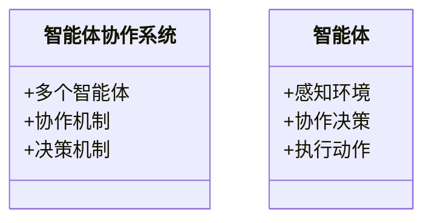
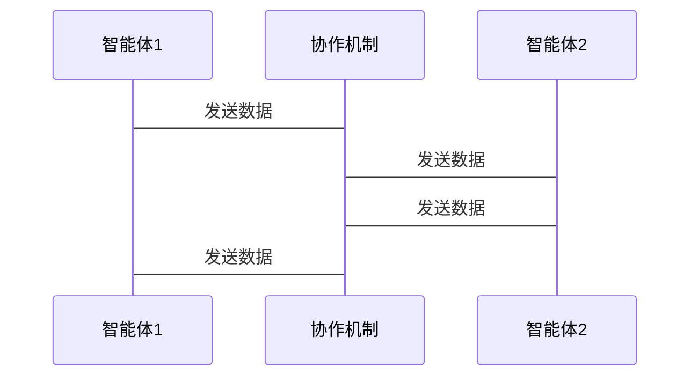

                 


# 智能体协作提高价值投资的公司估值准确性

> 关键词：智能体协作，价值投资，公司估值，多智能体系统，协作算法

> 摘要：本文探讨了如何通过智能体协作提高公司估值的准确性。通过分析智能体协作的核心概念、算法原理、系统架构以及实际案例，展示了智能体协作在价值投资中的潜力和优势。文章结合理论与实践，提出了一个基于智能体协作的公司估值框架，为投资者提供更准确的估值支持。

---

# 第一部分：智能体协作与价值投资背景

## 第1章：智能体协作概述

### 1.1 智能体协作的基本概念

#### 1.1.1 智能体的定义与特征
智能体（Agent）是指能够感知环境并采取行动以实现目标的实体。智能体协作是指多个智能体通过信息共享和协同决策，共同完成复杂任务的过程。智能体协作具有以下特征：
- **自主性**：智能体能够独立决策。
- **社会性**：智能体之间可以相互协作。
- **反应性**：智能体能够根据环境变化调整行为。
- **学习能力**：智能体能够通过经验改进性能。

#### 1.1.2 协作智能体的内涵
协作智能体是一种分布式系统，由多个智能体组成，通过协作完成比单个智能体更复杂的任务。协作智能体的核心在于信息共享和决策协调。

#### 1.1.3 智能体协作的应用场景
智能体协作广泛应用于金融、物流、交通等领域。在金融领域，智能体协作可以用于股票交易、风险评估和公司估值。

### 1.2 价值投资的背景与挑战

#### 1.2.1 价值投资的基本原理
价值投资是一种投资策略，旨在通过分析公司的基本面，找到市场价格低于其内在价值的股票。传统的价值投资依赖于财务报表分析、行业研究和市场趋势分析。

#### 1.2.2 公司估值的传统方法与局限性
传统的公司估值方法包括DCF模型、市盈率法、市净率法等。这些方法依赖于历史数据和假设条件，存在以下局限性：
- **数据偏差**：历史数据可能无法反映未来的实际情况。
- **假设依赖**：估值模型依赖于假设条件，如增长率和折现率。
- **主观性**：估值结果受到分析师主观判断的影响。

#### 1.2.3 提高估值准确性的需求
为了提高估值的准确性，需要引入更先进的技术手段，如人工智能和大数据分析。智能体协作可以通过多智能体的协同工作，提供更全面和准确的估值结果。

### 1.3 智能体协作在价值投资中的作用

#### 1.3.1 智能体协作如何提升估值准确性
智能体协作可以通过以下方式提高估值准确性：
- **信息共享**：多个智能体可以共享数据和信息，减少信息孤岛。
- **协同决策**：通过协作，智能体可以综合考虑多方面的因素，做出更优的决策。
- **自适应性**：智能体协作系统能够根据市场变化动态调整估值模型。

#### 1.3.2 智能体协作的优势与潜力
智能体协作的优势在于：
- **分布式计算**：智能体协作可以利用分布式计算的优势，提高计算效率。
- **多维度分析**：多个智能体可以从不同的角度分析公司，提供更全面的估值结果。
- **动态调整**：智能体协作系统能够根据市场变化动态调整估值模型。

#### 1.3.3 智能体协作的实现路径
实现智能体协作需要以下步骤：
1. **定义目标**：明确智能体协作的目标和任务。
2. **设计协作机制**：设计智能体之间的协作机制，包括信息共享和决策协调。
3. **开发智能体**：开发多个智能体，每个智能体负责不同的任务。
4. **测试与优化**：通过测试和优化，提高智能体协作的效率和准确性。

### 1.4 本章小结
本章介绍了智能体协作的基本概念和价值投资的背景，分析了传统估值方法的局限性，并提出了智能体协作在价值投资中的作用和实现路径。

---

# 第二部分：智能体协作的核心概念与原理

## 第2章：智能体协作的核心概念

### 2.1 智能体协作的理论基础

#### 2.1.1 多智能体系统（MAS）的概念
多智能体系统是由多个智能体组成的分布式系统，智能体之间通过通信和协作完成任务。MAS的核心在于智能体之间的协作与协调。

#### 2.1.2 协作智能体的分类与特点
协作智能体可以分为以下几类：
- **简单协作智能体**：智能体之间通过简单的规则协作。
- **复杂协作智能体**：智能体之间通过复杂的规则和算法协作。
- **自适应协作智能体**：智能体能够根据环境变化自适应调整协作策略。

#### 2.1.3 智能体协作的数学模型
智能体协作的数学模型可以用以下公式表示：
$$ V = \sum_{i=1}^{n} v_i $$
其中，\( V \) 表示总价值，\( v_i \) 表示第 \( i \) 个智能体的贡献。

### 2.2 智能体协作的核心要素

#### 2.2.1 信息共享机制
信息共享机制是智能体协作的基础。智能体之间需要共享数据和信息，以实现协同决策。

#### 2.2.2 协作策略
协作策略是智能体协作的核心。智能体需要制定协作策略，以实现共同目标。

#### 2.2.3 决策机制
决策机制是智能体协作的关键。智能体需要根据共享的信息和协作策略，做出最优决策。

### 2.3 智能体协作与传统估值方法的对比

#### 2.3.1 传统估值方法的局限性
传统估值方法的局限性包括：
- 数据单一性：传统方法依赖于单一的数据源。
- 计算复杂性：传统方法的计算过程复杂，难以实时调整。
- 人为干扰：传统方法受到分析师主观判断的影响。

#### 2.3.2 智能体协作的优势
智能体协作的优势包括：
- 数据全面性：智能体协作可以利用多源数据，提高估值的准确性。
- 计算效率：智能体协作可以通过分布式计算提高计算效率。
- 自适应性：智能体协作系统能够根据市场变化动态调整估值模型。

#### 2.3.3 智能体协作与传统方法的结合
智能体协作可以与传统估值方法相结合，利用智能体协作的优势弥补传统方法的不足。

### 2.4 本章小结
本章分析了智能体协作的核心概念，包括多智能体系统的理论基础、协作智能体的分类与特点，以及智能体协作的优势与潜力。

---

# 第三部分：智能体协作的算法原理与数学模型

## 第3章：智能体协作的算法原理

### 3.1 多智能体协作的基本算法

#### 3.1.1 分布式协作算法
分布式协作算法是一种基于分布式计算的协作算法。智能体之间通过通信协议共享信息，实现协同决策。

#### 3.1.2 集中式协作算法
集中式协作算法是一种基于集中计算的协作算法。智能体将数据发送到中心节点，中心节点进行计算后将结果分发给智能体。

#### 3.1.3 混合式协作算法
混合式协作算法是分布式协作算法和集中式协作算法的结合。智能体之间可以同时进行分布式协作和集中式协作。

### 3.2 基于智能体协作的估值算法

#### 3.2.1 基于强化学习的协作算法
基于强化学习的协作算法是一种智能体协作的算法，智能体通过强化学习不断优化协作策略。

#### 3.2.2 基于博弈论的协作算法
基于博弈论的协作算法是一种智能体协作的算法，智能体通过博弈论模型进行协作决策。

#### 3.2.3 基于分布式计算的协作算法
基于分布式计算的协作算法是一种智能体协作的算法，智能体通过分布式计算实现协作。

### 3.3 算法的数学模型与公式

#### 3.3.1 协作智能体的数学模型
协作智能体的数学模型可以用以下公式表示：
$$ V = \sum_{i=1}^{n} v_i $$
其中，\( V \) 表示总价值，\( v_i \) 表示第 \( i \) 个智能体的贡献。

#### 3.3.2 强化学习算法的数学模型
强化学习算法的数学模型可以用以下公式表示：
$$ Q(s, a) = r + \gamma \max_{a'} Q(s', a') $$
其中，\( Q(s, a) \) 表示状态 \( s \) 下动作 \( a \) 的价值，\( r \) 表示奖励，\( \gamma \) 表示折扣因子，\( Q(s', a') \) 表示下一个状态 \( s' \) 下的动作价值。

### 3.4 本章小结
本章分析了智能体协作的算法原理，包括分布式协作算法、基于强化学习的协作算法和基于博弈论的协作算法，并提出了相应的数学模型和公式。

---

# 第四部分：智能体协作的系统架构与实现

## 第4章：智能体协作的系统架构设计

### 4.1 问题场景介绍
智能体协作系统用于公司估值，系统需要处理大量数据，包括财务数据、市场数据和行业数据。

### 4.2 系统功能设计

#### 4.2.1 领域模型
领域模型可以用 Mermaid 类图表示：



#### 4.2.2 系统架构
系统架构可以用 Mermaid 架构图表示：

```mermaid
container 智能体协作系统 {
    组件 智能体1 {
        +感知环境
        +协作决策
        +执行动作
    }
    组件 智能体2 {
        +感知环境
        +协作决策
        +执行动作
    }
    组件 协作机制 {
        +信息共享
        +决策协调
    }
}
```

### 4.3 系统接口设计
系统接口设计包括智能体之间的通信接口和智能体与外部系统的接口。

### 4.4 系统交互设计

#### 4.4.1 系统交互流程
系统交互流程可以用 Mermaid 序列图表示：



### 4.5 本章小结
本章分析了智能体协作的系统架构设计，包括领域模型、系统架构和系统交互设计。

---

# 第五部分：智能体协作的项目实战

## 第5章：项目实战

### 5.1 项目背景与目标
项目目标是开发一个基于智能体协作的公司估值系统，提高估值的准确性和效率。

### 5.2 项目环境安装

#### 5.2.1 系统环境
- 操作系统：Linux/Windows
- 开发工具：Python、PyCharm
- 依赖库：numpy、pandas、scikit-learn、matplotlib

### 5.2.2 智能体协作框架安装
安装多智能体协作框架，如rapyd-multi-agent。

### 5.3 项目核心实现源代码

#### 5.3.1 智能体类实现
```python
class Agent:
    def __init__(self, id):
        self.id = id
        self.data = []
    
    def perceive_environment(self):
        # 感知环境，获取数据
        pass
    
    def collaborate(self, agents):
        # 协作决策
        pass
    
    def execute_action(self):
        # 执行动作
        pass
```

#### 5.3.2 协作机制实现
```python
class CollaborationMechanism:
    def __init__(self, agents):
        self.agents = agents
    
    def share_data(self):
        # 信息共享
        pass
    
    def coordinate_decision(self):
        # 决策协调
        pass
```

### 5.4 代码实现与应用解读
代码实现包括智能体的感知、协作和执行过程，协作机制的信息共享和决策协调过程。

### 5.5 实际案例分析与详细讲解
以某科技公司为例，详细分析智能体协作在公司估值中的应用。

### 5.6 项目小结
本章通过实际项目展示了智能体协作在公司估值中的应用，验证了智能体协作的有效性和优势。

---

# 第六部分：智能体协作的总结与展望

## 第6章：总结与展望

### 6.1 本章总结
本文探讨了智能体协作在价值投资中的应用，提出了基于智能体协作的公司估值框架，分析了智能体协作的优势和潜力。

### 6.2 未来展望
未来研究方向包括：
- 更复杂的智能体协作算法
- 更高效的智能体协作系统
- 更广泛的应用领域

### 6.3 最佳实践 tips
- 在实际应用中，智能体协作需要结合具体场景进行调整。
- 智能体协作系统的性能依赖于智能体的设计和协作机制的优化。
- 智能体协作系统的安全性需要高度重视。

### 6.4 本章小结
本文总结了智能体协作在价值投资中的应用，并展望了未来的研究方向。

---

# 作者：AI天才研究院/AI Genius Institute & 禅与计算机程序设计艺术 /Zen And The Art of Computer Programming

---

通过以上结构，我们可以看到，智能体协作在价值投资中的应用前景广阔。通过智能体协作，可以提高公司估值的准确性和效率，为投资者提供更有力的支持。

