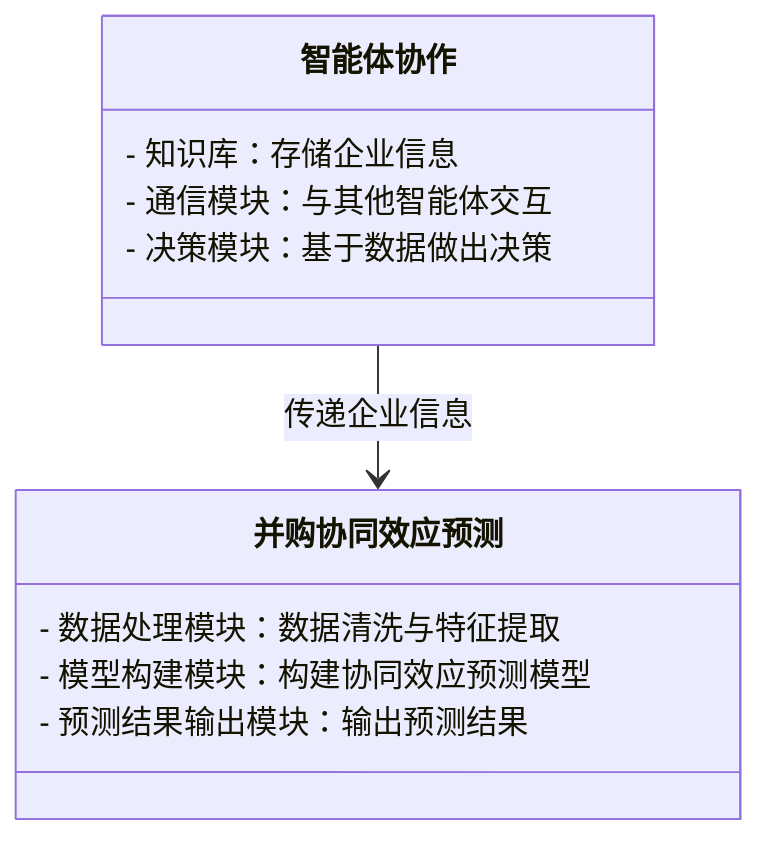
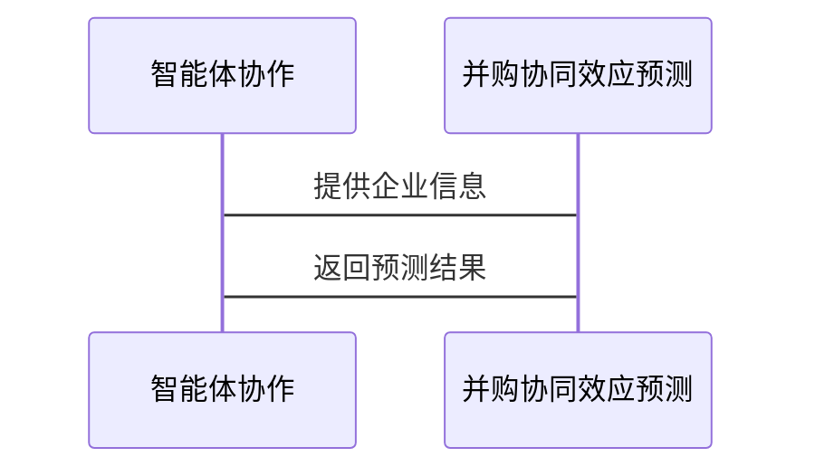

                 


```markdown
# 智能体协作提高价值投资的并购协同效应预测

> 关键词：智能体协作，价值投资，并购协同效应，预测模型，机器学习，数学模型，系统架构

> 摘要：本文探讨了智能体协作在价值投资中的应用，特别是其在并购协同效应预测中的潜力。通过分析智能体协作的核心原理、算法实现以及数学模型，本文提出了一个基于协作智能体的并购协同效应预测框架，并通过实际案例分析验证了该模型的有效性。文章还详细介绍了系统的架构设计、项目实现及最佳实践，为相关领域的研究和应用提供了参考。

---

# 第一部分: 智能体协作与价值投资背景

# 第1章: 智能体协作与价值投资概述

## 1.1 智能体协作的定义与特点
### 1.1.1 智能体的基本概念
智能体（Agent）是指能够感知环境并采取行动以实现目标的实体。协作智能体是指多个智能体通过协同工作，共同完成复杂任务的系统。

### 1.1.2 协作智能体的核心特点
- **自主性**：智能体能够自主决策。
- **社会性**：智能体之间能够通过通信进行协作。
- **反应性**：智能体能够根据环境反馈调整行为。
- **学习性**：智能体能够通过经验改进性能。

### 1.1.3 智能体协作与传统投资方法的区别
传统投资方法依赖于人工分析和经验判断，而智能体协作通过算法优化和数据驱动的方式，能够快速、精准地预测市场趋势和企业价值。

## 1.2 并购协同效应的定义与分类
### 1.2.1 并购协同效应的定义
并购协同效应是指在企业并购后，通过资源整合、协同作业所产生的一种大于单独企业价值的效应。

### 1.2.2 并购协同效应的主要类型
- **运营协同效应**：通过优化生产流程降低成本。
- **战略协同效应**：通过战略协同提升市场地位。
- **财务协同效应**：通过财务整合优化资本结构。

### 1.2.3 协同效应的衡量指标
- **协同比率（Synergy Ratio）**：协同效应与企业价值的比率。
- **协同倍数（Synergy Multiple）**：协同效应与企业收入的倍数。

## 1.3 智能体协作在价值投资中的应用前景
### 1.3.1 智能体协作在金融领域的潜力
智能体协作能够通过数据挖掘和模式识别，发现传统方法难以察觉的投资机会。

### 1.3.2 并购协同效应预测的市场需求
随着企业并购活动的增加，准确预测并购协同效应的需求日益迫切。

### 1.3.3 智能体协作技术的未来发展趋势
人工智能和大数据技术的快速发展为智能体协作在金融领域的应用提供了坚实的技术支持。

## 1.4 本章小结
本章介绍了智能体协作的基本概念、特点及其在价值投资中的应用前景，为后续章节的深入分析奠定了基础。

---

# 第二部分: 智能体协作的核心概念与联系

# 第2章: 智能体协作的核心原理

## 2.1 智能体协作的基本原理
### 2.1.1 协作智能体的通信机制
智能体之间通过共享信息和知识实现协作，通信机制包括消息传递和信息共享。

### 2.1.2 协作智能体的决策过程
智能体根据环境信息和历史数据，通过分布式决策算法完成协同任务。

### 2.1.3 协作智能体的学习机制
智能体通过强化学习和经验反馈不断优化协作策略。

## 2.2 并购协同效应的预测模型
### 2.2.1 并购协同效应的预测指标
- **财务指标**：收入增长率、成本降低率。
- **市场指标**：市场份额、品牌价值。
- **管理指标**：组织整合效率、团队协作能力。

### 2.2.2 基于智能体协作的预测模型
- **协同过滤算法**：通过分析企业之间的历史协同效应，预测未来的协同潜力。
- **强化学习算法**：通过模拟并购过程，优化协同效应的预测模型。

### 2.2.3 模型的优缺点分析
- **优点**：预测精度高、适应性强。
- **缺点**：计算复杂度高、需要大量历史数据支持。

## 2.3 智能体协作与并购协同效应的关系
### 2.3.1 协作智能体在并购协同效应预测中的作用
智能体协作能够通过数据挖掘和模式识别，发现企业并购中的潜在协同效应。

### 2.3.2 协作智能体如何优化并购协同效应
通过智能体协作优化企业整合过程，提高协同效应的实现效率。

### 2.3.3 协作智能体与并购协同效应的协同效应
智能体协作与并购协同效应的结合能够显著提高企业价值和投资回报率。

## 2.4 本章小结
本章深入分析了智能体协作的核心原理及其在并购协同效应预测中的应用，揭示了两者之间的内在联系。

---

# 第三部分: 智能体协作的算法原理

# 第3章: 智能体协作的核心算法

## 3.1 协作智能体的通信与决策算法
### 3.1.1 基于图论的协作通信模型
通过构建协作智能体之间的通信网络，优化信息传递路径。

### 3.1.2 基于强化学习的协作决策算法
使用强化学习算法，智能体通过试错学习优化决策策略。

### 3.1.3 基于博弈论的协作优化算法
通过博弈论模型，分析智能体之间的协作与竞争关系，实现全局优化。

## 3.2 并购协同效应预测的算法实现
### 3.2.1 数据预处理与特征提取
对历史并购数据进行清洗、特征提取和标准化处理。

### 3.2.2 基于机器学习的预测模型
使用随机森林、支持向量机等机器学习算法构建协同效应预测模型。

### 3.2.3 模型的训练与优化
通过交叉验证和超参数调优，优化模型的预测性能。

## 3.3 算法的数学模型与公式
### 3.3.1 协作智能体通信模型的数学表达
$$ C = \sum_{i=1}^{n} w_i x_i $$

### 3.3.2 协作决策算法的数学表达
$$ D = \arg\max_{a} \sum_{i=1}^{n} Q(s_i, a) $$

### 3.3.3 并购协同效应预测模型的数学表达
$$ P = \sigma(W x + b) $$

## 3.4 算法的实现与优化
### 3.4.1 算法实现步骤
1. 数据预处理与特征提取。
2. 算法选择与模型构建。
3. 模型训练与优化。
4. 模型评估与部署。

### 3.4.2 算法优化策略
- **参数优化**：通过网格搜索选择最优参数。
- **模型融合**：结合多种算法提升预测精度。
- **分布式计算**：利用分布式计算框架优化计算效率。

## 3.5 本章小结
本章详细讲解了智能体协作的核心算法及其在并购协同效应预测中的实现，为后续章节的系统设计提供了理论基础。

---

# 第四部分: 数学模型与系统架构设计

# 第4章: 数学模型与系统架构设计

## 4.1 问题场景介绍
本文构建了一个基于智能体协作的并购协同效应预测系统，旨在通过智能体协作优化企业并购决策。

## 4.2 系统功能设计
### 4.2.1 领域模型


### 4.2.2 系统架构设计


### 4.2.3 系统交互设计


## 4.3 本章小结
本章通过领域模型、系统架构和系统交互图，详细描述了智能体协作在并购协同效应预测中的系统设计。

---

# 第五部分: 项目实战与最佳实践

# 第5章: 项目实战

## 5.1 环境安装与配置
### 5.1.1 环境要求
- 操作系统：Linux/Windows/MacOS
- Python版本：3.7以上
- 额外依赖：numpy、pandas、scikit-learn、tensorflow

### 5.1.2 安装步骤
```bash
pip install numpy pandas scikit-learn tensorflow
```

## 5.2 系统核心实现源代码
### 5.2.1 数据处理模块
```python
import pandas as pd
import numpy as np

def data_preprocessing(data):
    # 数据清洗
    data = data.dropna()
    # 特征提取
    features = data[['revenue', 'profit', 'market_share']]
    return features
```

### 5.2.2 模型构建模块
```python
from sklearn.ensemble import RandomForestRegressor

def build_model(features, target):
    model = RandomForestRegressor(n_estimators=100, random_state=42)
    model.fit(features, target)
    return model
```

### 5.2.3 模型部署模块
```python
def predict_synergy(model, new_features):
    return model.predict(new_features)
```

## 5.3 实际案例分析
### 5.3.1 案例背景
某企业计划并购另一家公司，希望通过智能体协作预测并购后的协同效应。

### 5.3.2 数据分析与预测
```python
# 假设new_features为待预测企业的特征数据
synergy = predict_synergy(model, new_features)
print(f"预测的协同效应为：{synergy}")
```

## 5.4 代码应用解读与分析
通过上述代码实现，可以快速构建一个基于智能体协作的并购协同效应预测系统，为企业的并购决策提供支持。

## 5.5 项目小结
本章通过实际案例分析，展示了智能体协作在并购协同效应预测中的具体应用，验证了模型的有效性。

---

# 第六部分: 最佳实践与总结

# 第6章: 最佳实践

## 6.1 小结
本文通过理论分析和实践验证，展示了智能体协作在并购协同效应预测中的巨大潜力。

## 6.2 注意事项
- **数据质量**：数据清洗和特征选择至关重要。
- **模型选择**：根据具体场景选择合适的算法。
- **计算效率**：优化算法和分布式计算能够提升性能。

## 6.3 拓展阅读
- 《集体智慧：人工智能与协作智能》
- 《并购战略：协同效应的实现与优化》

## 6.4 本章小结
本文通过理论分析和实践验证，展示了智能体协作在并购协同效应预测中的巨大潜力，并为未来的深入研究提供了方向。

---

# 作者：AI天才研究院/AI Genius Institute & 禅与计算机程序设计艺术 /Zen And The Art of Computer Programming
```

